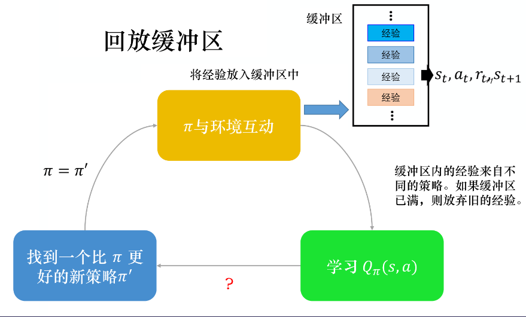

<!--
 * @version:
 * @Author:  StevenJokess（蔡舒起） https://github.com/StevenJokess
 * @Date: 2023-02-23 23:43:10
 * @LastEditors:  StevenJokess（蔡舒起） https://github.com/StevenJokess
 * @LastEditTime: 2023-03-12 21:06:20
 * @Description:
 * @Help me: 如有帮助，请赞助，失业3年了。
 * @TODO:: 伪代码和Code,
 * @Reference:
-->
# DQN算法

## 简介

在第 5 章讲解的 Q-learning 算法中，我们以矩阵的方式建立了一张存储每个状态下所有动作$Q$ 值的表格，即Q表。表格中的每一个动作价值表示在状态下选择动作然后继续遵循某一策略预期能够得到的期望回报。然而，这种用表格存储动作价值的做法只在环境的状态和动作都是离散的，并且空间都比较小的情况下适用，我们之前进行代码实战的几个环境都是如此（如悬崖漫步）。

Q-learning无法处理以下问题：

- 高维度问题：当状态或者动作数量非常大的时候，这种做法就不适用了。例如，当状态是一张 RGB 图像时，假设图像大小是 $210 \times 160 \times 3$，此时一共有 256^{(210 \times 60 \times 3)} 种状态，在计算机中存储这个数量级的值表格是不现实的。或者，围棋的状态（棋局）有 $3^{361}≈ 10170$ 种状态，动作（即落子位置）数量为 $361$。
- 连续空间问题：当状态连续【在自动驾驶中，智能体感知到的环境状态是各种传感器数据，一般都是连续的。】或者动作连续【动作是操作方向盘的方向（−90度∼ 90度）和速度控制（0 ∼ 300公里/小时），也是连续的。】的时候，就有无限个状态动作对，我们更加无法使用这种表格形式来记录各个状态动作对的 $Q$ 值。

对于这种情况，我们需要用函数拟合的方法来估计 $Q$ 值，即将这个复杂的 $Q$ 值表格视作数据，使用一个参数化的函数 $Q_\theta$ 来拟合这些数据。很显然，这种函数拟合的方法存在一定的精度损失，因此被称为近似方法，但由于神经网络的逼近能力，能使得估计较为准确。我们今天要介绍的深度强化学习（即，用强化学习来定义问题和优化目标，用深度学习来解决策略和值函数的建模问题，然后使用误差反向传播算法来优化目标函数。）下的 DQN 算法（Deep Q-Network），也叫深度Q网络，便可以用来解决**连续状态**下**离散动作**的问题。

## CartPolo 环境

以图 7-1 中所示的所示的车杆（CartPole）环境为例，它的状态值就是连续的，动作值是离散的。

图 7-1 CartPole环境示意图

在车杆环境中，有一辆小车，智能体的任务是通过左右移动保持车上的杆竖直，若杆的倾斜度数过大，或者车子离初始位置左右的偏离程度过大，或者坚持时间到达 200 帧，则游戏结束。智能体的状态是一个维数为 4 的向量，每一维都是连续的，其动作是离散的，动作空间大小为 2，详情参见表 7-1 和表 7-2。在游戏中每坚持一帧，智能体能获得分数为 1 的奖励，坚持时间越长，则最后的分数越高，坚持 200 帧即可获得最高的分数。

## DQN

现在我们想在类似车杆的环境中得到动作价值函数 $Q(s, a)$，由于状态每一维度的值都是连续的，无法使用表格记录，因此一个常见的解决方法便是使用**函数拟合**（function approximation）的思想。由于神经网络具有强大的表达能力，因此我们可以用一个神经网络来表示函数 $Q$。若动作是连续（无限）的，神经网络的输入是状态和动作，然后输出一个标量，表示在状态 $s$ 下采取动作 $a$ 能获得的价值。若动作是离散（有限）的，除了可以采取动作连续情况下的做法，我们还可以只将状态输入到神经网络中，使其同时输出每一个动作的值。通常 DQN（以及 Q-learning）只能处理动作离散的情况，因为在函数的更新过程中有这一操作。假设神经网络用来拟合函数的参数是$\omega$ ，即每一个状态下所有可能动作的 $Q$ 值，我们都能表示为$Q_\omega(s, a)$。我们将用于拟合函数函数的神经网络称为**Q 网络**，如图 7-2 所示。

那么 $Q$ 网络的损失函数是什么呢? 我们先来回顾一下 $Q$-learning 的更新规则 (参见 5.5 节) ：

$$
Q(s, a) \leftarrow Q(s, a)+\alpha\left[r+\gamma \max _{a^{\prime} \in \mathcal{A}} Q\left(s^{\prime}, a^{\prime}\right)-Q(s, a)\right]
$$

上述公式用**时序差分** (temporal difference，TD) 学习目标 $r+\gamma \max_{a^{\prime} \in \mathcal{A}} Q\left(s^{\prime}, a^{\prime}\right)$ 来增量式更新 $Q(s, a)$ ，也就是说要使 $Q(s, a)$ 和 TD 目标 $r+\gamma \max_{a^{\prime} \in \mathcal{A}} Q\left(s^{\prime}, a^{\prime}\right)$ 靠近。于是，对于一组数据 $\left\{\left(s_i, a_i, r_i, s_i^{\prime}\right)\right\}$ ，我们可以很自然地将 $Q$ 网络的损失函数构造为均方误差（squared error）的形式[4]:

$$
L=\mathbb{E}\left[\left(\boldsymbol{r}+\gamma \max _{\boldsymbol{a}^{\prime}} \boldsymbol{Q}\left(\boldsymbol{s}^{\prime}, \boldsymbol{a}^{\prime}\right)-Q(s, a)\right)^2\right]
$$

$$
\omega^*=\arg \min _\omega \frac{1}{2 N} \sum_{i=1}^N\left[Q_\omega\left(s_i, a_i\right)-\left(r_i+\gamma \max _{a^{\prime}} Q_\omega\left(s_i^{\prime}, a^{\prime}\right)\right)\right]^2
$$

至此，我们就可以将 Q-learning 扩展到神经网络形式——**深度 Q 网络**（deep Q network，DQN）算法。由于 DQN 是离线策略算法，因此我们在收集数据的时候可以使用一个 $\epsilon$ -贪婪策略来平衡探索与利用，将收集到的数据存储起来，在后续的训练中使用。DQN 中还有两个非常重要的模块——**经验回放**和**目标网络**，它们能够帮助 DQN 取得稳定、出色的性能。

## 经验回放（experience replay）

在一般的有监督学习中，假设训练数据是独立同分布的，我们每次训练神经网络的时候从训练数据中随机采样一个或若干个数据来进行梯度下降，随着学习的不断进行，每一个训练数据会被使用多次。在原来的 Q-learning 算法中，每一个数据只会用来更新一次 $Q$ 值。为了更好地将 Q-learning 和深度神经网络结合，DQN 算法采用了经验回放（experience replay）方法，具体做法为维护一个**回放缓冲区（replay buffer）**，如图 6.12 所示，回放缓冲区又被称为**回放内存（replay memory）**。

将每次从环境中采样得到的四元组数据（状态 $s_t$、动作 $a_t$、奖励 $r_t$、下一状态 $s_{t+1}$ ），存储到**回放缓冲区**中，训练 Q 网络的时候再从回放缓冲区中随机采样若干数据来进行训练。这样每次的四元组数据称为一笔数据。这么做可以起到以下两个作用：

1. 使样本满足独立假设。在 MDP 中交互采样得到的数据本身不满足独立假设，因为这一时刻的状态和上一时刻的状态有关。非独立同分布的数据对训练神经网络有很大的影响，会使神经网络拟合到最近训练的数据上。采用经验回放可以**打破样本之间的相关性**，让其满足独立假设。
1. 提高利用样本的效率。每一个样本可以被使用多次，十分适合深度神经网络的梯度学习。

每一笔数据就是记得说，我们之前在某一个状态 $s_t$ ，采取某一个动作 $a_t$ ，得到了奖励 $r_t$ ，进入状态 $s_{t+1}$ 。我们用 $\pi$ 去与环境交互多次，把收集到的数据放到回放缓冲区里面。

注意回放缓冲区里面的经验可能来自不同的策略，比如数据缓冲区可以存储 5 万笔数据，我们每次用 $\pi$ 与环境交互的时候，可能只交互 10000 次，接下来我们就更新 $\pi$ 了。但是回放缓冲区里面可以放 5 万笔数据，所以 5 万笔数据可能来自不同的策略。回放缓冲区只有在它装满的时候，才会把旧的数据丢掉。所以回放缓冲区里面其实装了很多不同的策略的经验。

如图 6.13 所示，有了回放缓冲区以后，我们怎么训练 Q 模型、怎么估 Q 函数呢？我们会迭代地训练 Q 函数，在每次迭代里面，从回放缓冲区中随机挑一个批量（batch）出来，即与一般的网络训练一样，从训练集里面挑一个批量出来。我们采样该批量出来，里面有一些经验，我们根据这些经验去更新Q函数。这与时序差分学习要有一个目标网络是一样的。我们采样一个批量的数据，得到一些经验，再去更新 Q 函数。

如果某个算法使用了经验回放这个技巧，该算法就变成了一个异策略（off-policy）的算法。因为本来 Q 是要观察 π 的经验的，但实际上存储在回放缓冲区里面的这些经验不是通通来自于 π，有些是过去其他的策略所留下来的经验。因为我们不会用某一个 π 就把整个回放缓冲区装满，拿去测Q函数，π 只是采样一些数据放到回放缓冲区里面，接下来就让 Q 去训练。所以 Q 在采样的时候， 它会采样到过去的一些数据。

这么做有两个好处：

1. 在进行强化学习的时候， 往往最花时间的步骤是与环境交互，训练网络反而是比较快的。因为我们用 GPU 训练其实很快，真正花时间的往往是与环境交互。用回放缓冲区可以减少与环境交互的次数，因为在做训练的时候，经验不需要通通来自于某一个策略。一些过去的策略所得到的经验可以放在回放缓冲区里面被使用很多次，被反复的再利用，这样可以比较高效地采样经验。
2. 在训练网络的时候，其实我们希望一个批量里面的数据越多样（diverse）越好。如果批量里面的数据都是同样性质的，我们训练下去，训练结果是容易不好的。如果批量里面都是一样的数据，训练的时候，性能会比较差。我们希望批量里的数据越多样越好。如果回放缓冲区里面的经验通通来自于不同的策略，我们采样到的一个批量里面的数据会是比较多样的。[6]

Q：我们观察 $\pi$ 的值，发现里面混杂了一些不是 $\pi$ 的经验，这有没有关系？

A：没关系。这并不是因为过去的策略与现在的策略很像，就算过去的策略与现在的策略不是很像，也是没有关系的。主要的原因是我们并不是去采样一个轨迹，我们只采样了一笔经验，所以与是不是异策略这件事是没有关系的。就算是异策略，就算是这些经验不是来自于 $\pi$ ，我们还是可以用这些经验来估测 $Q_\pi(s,a)$。

## 目标网络

DQN 算法最终更新的目标是让$Q_\omega(s, a)$逼近$r+\gamma \max _{a^{\prime}} Q_\omega\left(s^{\prime}, a^{\prime}\right).$

由于 TD 误差目标本身就包含神经网络的输出，因此在更新网络参数的同时目标也在不断地改变，这非常容易造成*神经网络训练的不稳定性*。为了解决这一问题，DQN 便使用了目标网络（target network）的思想：既然训练过程中 Q 网络的不断更新会导致目标不断发生改变，不如暂时先将 TD 目标中的 Q 网络固定住。

为了实现这一思想，我们需要利用两套 Q 网络，一个是Q网络，而再复制一个和原来Q网络结构一样的Target Q网络，用于计算Q目标值。[5]

(1) 原来的训练网络 $Q_\omega(s, a)$ ，用于计算原来的损失函数 $\frac{1}{2}\left[Q_\omega(s, a)-\left(r+\gamma \max _{a^{\prime}} Q_{\omega^{-}}\left(s^{\prime}, a^{\prime}\right)\right)\right]^2$ 中的 $Q_\omega(s, a)$ 项，并且使用正常梯度下降方法来进行更新。

(2) 目标网络 $Q_{\omega^{-}}(s, a)$ ，用于计算原先损失函数 $\frac{1}{2}\left[Q_\omega(s, a)-\left(r+\gamma \max _{a^{\prime}} Q_{\omega^{-}}\left(s^{\prime}, a^{\prime}\right)\right)\right]^2$ 中的 $\left(r+\gamma \max _{a^{\prime}} Q_{\omega^{-}}\left(s^{\prime}, a^{\prime}\right)\right)$ 项，其中 $\omega^{-}$ 表示目标网络中的参数。如果两套网络的参数随时保持一致，则仍 为原先不够稳定的算法。为了让更新目标更稳定，目标网络并不会每一步都更 新。具体而言，目标网络使用训练网络的一套较旧的参数，训练网络 $Q_\omega(s, a)$ 在 训练中的每一步都会更新，而目标网络的参数每隔 $C$ 步才会与训练网络同步一 次，即 $\omega^{-} \leftarrow \omega$ 。这样做使得目标网络相对于训练网络更加稳定。

综上所述，DQN 算法的具体流程如下：

- 用随机的网络参数 $\omega$ 初始化网络 $Q_\omega(s, a)$
- 复制相同的参数 $\omega^{-} \leftarrow \omega$ 来初始化目标网络 $Q_{\omega^{\prime}}$
- 初始化经验回放池 $R$
- for 序列 $e=1 \rightarrow E$ do
  - 获取环境初始状态 $s_1$
  - for 时间步 $t=1 \rightarrow T$ do
    - 根据当前网络 $Q_\omega(s, a)$ 以 $\epsilon$-贪婪策略选择动作 $a_t$
    - 执行动作 $a_t$ ，获得回报 $r_t$ ，环境状态变为 $s_{t+1}$
    - 将 $\left(s_t, a_t, r_t, s_{t+1}\right)$ 存储进回放池 $R$ 中
    - 若 $R$ 中数据足够，从 $R$ 中采样 $N$ 个数据 $$\left\{\left(s_i, a_i, r_i, s_{i+1}\right)\right\}_{i=1, \ldots, N}$$
    - 对每个数据，用目标网络计算 $$ y_i=r_i+\gamma \max _a Q_{\omega^{-}}\left(s_{i+1}, a\right)$$
    - 最小化目标损失 $L=\frac{1}{N} \sum_i\left(y_i-Q_\omega\left(s_i, a_i\right)\right)^2$ ，以此更 新当前网络 $Q_\omega$
    - 更新目标网络
  - **end for**
- **end for**

## DQN 代码实践

接下来，我们就正式进入 DQN 算法的代码实践环节。我们采用的测试环境是 CartPole-v0，其状态空间相对简单，只有 4 个变量，因此网络结构的设计也相对简单：采用一层 128 个神经元的全连接并以 ReLU 作为激活函数。当遇到更复杂的诸如以图像作为输入的环境时，我们可以考虑采用深度卷积神经网络。

从 DQN 算法开始，我们将会用到`rl_utils`库，它包含一些专门为本书准备的函数，如绘制移动平均曲线、计算优势函数等，不同的算法可以一起使用这些函数。为了能够调用`rl_utils`库，请从本书的[GitHub 仓库](https://github.com/boyu-ai/Hands-on-RL/blob/main/rl_utils.py) 下载`rl_utils.py`文件。

首先定义经验回放池的类，主要包括加入数据、采样数据两大函数。

然后定义一个只有一层隐藏层的 Q 网络。

有了这些基本组件之后，接来下开始实现 DQN 算法。

一切准备就绪，开始训练并查看结果。我们之后会将这一训练过程包装进`rl_utils`库中，方便之后要学习的算法的代码实现。

## 以图像为输入的 DQN 算法

在本书前面章节所述的强化学习环境中，我们都使用非图像的状态作为输入（例如车杆环境中车的坐标、速度），但是在一些视频游戏中，智能体并不能直接获取这些状态信息，而只能直接获取屏幕中的图像。要让智能体和人一样玩游戏，我们需要让智能体学会以图像作为状态时的决策。我们可以利用 7.4 节的 DQN 算法，将卷积层加入其网络结构以提取图像特征，最终实现以图像为输入的强化学习。以图像为输入的 DQN 算法的代码与 7.4 节的代码的不同之处主要在于 Q 网络的结构和数据输入。DQN 网络通常会将最近的几帧图像一起作为输入，从而感知环境的动态性。接下来我们实现以图像为输入的 DQN 算法，但由于代码需要运行较长的时间，我们在此便不展示训练结果。

## 问题

- 深度强化学习可能是采样非常低效的(sample inefficient)
- 如果你仅仅关心最终的性能，那么很多问题都能够通过其他方法更好地解决
- 奖励函数的设计是困难的
- 即使给定了较好的奖励函数，也很难跳出局部最优
- 最终的结果也可能是不稳定的和难以复现的

## 小结

本章讲解了 DQN 算法，其主要思想是用一个神经网络来表示最优策略的函数，然后利用 Q-learning 的思想进行参数更新。为了保证训练的稳定性和高效性，DQN 算法引入了经验回放和目标网络两大模块，使得算法在实际应用时能够取得更好的效果。在 2013 年的 NIPS 深度学习研讨会上，DeepMind 公司的研究团队发表了 DQN 论文，首次展示了这一直接通过卷积神经网络接受像素输入来玩转各种雅达利（Atari）游戏的强化学习算法，由此拉开了深度强化学习的序幕。DQN 是深度强化学习的基础，掌握了该算法才算是真正进入了深度强化学习领域，本书中还有更多的深度强化学习算法等待读者探索。

## DQN变体

DQN算法演化出众多变体, 如：

- 使用不同网络评估策略和估计价值函数的Double DQN算法
- 差异化不同经验重放频率的优先经验重放(prioritized experience replay)算法
- 采用竞争网络结构分别估计状态价值函数和相关优势函数、再结合两者共同估计动作价值函数的Dueling DQN算法
- 添加网络参数噪声以提升探索度的NoisyNet算法
- 拓展到分布式价值函数的Distributional DQN (C51)算法
- 综合以上各种算法的Rainbow DQN[2]

需要指出的是, DQN及其各变体算法(后文简称DQN算法)虽然在以电子游戏为代表的离散动作空间问题上取得了优异的表现, 甚至在一些游戏上以压倒性优势战胜人类玩家, 但针对实际生产、生活中大量存在的**连续动作空间**问题, 如机械手臂控制、车辆驾驶等, 面向离散动作空间的DQN算法**无法应对**. 同时, 相比SARSA等同步策略算法, 虽然异步策略的DQN算法已经具有较高的样本效率, 但正如图2所示, 即使DQN系列中最先进的Rainbow DQN算法, 在面对简单的Atari游戏时, 仍然需要学习约1500万帧图像(样本)、持续训练1天时间才能达到人类玩家的水平, 而人类只需几个小时就能掌握同一游戏. 因此, DQN算法的采样效率问题仍然不可忽视。

[2]: http://www.c-s-a.org.cn/html/2020/12/7701.html#outline_anchor_19
[3]: https://aistudio.baidu.com/aistudio/projectdetail/54249
[4]: https://www.youtube.com/watch?v=QDzM8r3WgBw&list=PLrAXtmErZgOeiKm4sgNOknGvNjby9efdf
[5]: https://ai.baidu.com/forum/topic/show/960520
[6]: https://datawhalechina.github.io/easy-rl/#/chapter6/chapter6?id=_61-%e7%8a%b6%e6%80%81%e4%bb%b7%e5%80%bc%e5%87%bd%e6%95%b0
