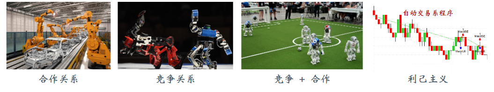

# 多智能体系统

之前章节的设定都是单智能体系统(Single-Agent System，缩写SAS)。本章和后面三章介绍多智能体系统(Multi-Agent System，缩写MAS) 和多智能体强化学习(Multi-Agent Reinforcement Learning，缩写MARL)。本章讲解多智能体系统的基本概念，帮助大家理解MAS 与SAS 的区别。第14.1 节讲解MAS 的四种常见设定。第14.2 节定义MAS 的专业术语，将之前所学的观测、动作、奖励、策略、价值等概念推广到MAS。第14.3 节介绍几种常用的实验环境，用于对比MARL 方法的优劣。

## 多智能体系统的设定

多智能体系统与单智能体系统的区别： 多智能体系统 (Multi-Agent System，缩写 MAS) 中包含m 个智能体，智能体共享环境，智能体之间会相互影响。智能体之间是如何相互影响的呢？一个智能体的动作会改变环境状态，从而影响其余所有智能体。举个例子，股市中的每个自动交易程序就可以看做一个智能体。尽管智能体（自动交易程序）之间不会交流，它们依然会相互影响：一个交易程序的决策会影响股价，从而对其它自动交易程序有利或有害。

注意，MAS 与上一章的并行强化学习是不同的概念。上一章用m 个节点并行计算，每个节点有独立的环境，每个环境中有一个智能体。虽然m 个节点上一共有m 个智能体，但是智能体之间完全独立，不会相互影响。而本章MAS 只有一个环境，环境中有m个相互影响的智能体。并行强化学习的设定是 m 个单智能体系统 (Single-Agent System，
缩写 SAS) 的并集，可以视作 MAS 的一种特例。举个例子，环境中有 m 个机器人，这属于MAS 的设定。假如把每个机器人隔绝在一个密闭的房间中，机器人之间不会通信，那么MAS 就变成了多个SAS 的并集。
多智能体强化学习(Multi-Agent Reinforcement Learning，缩写MARL) 是指让多个智能体处于相同的环境中，每个智能体独立与环境交互，利用环境反馈的奖励改进自己的策略，以获得更高的回报（即累计奖励）。在多智能体系统中，一个智能体的策略不能简单依赖于自身的观测、动作，还需要考虑到其他智能体的观测、动作。因此，MARL 比 单智能体强化学习(Single-Agent Reinforcement Learning，缩写SARL) 更困难。

## 常见设定

多智能体系统有四种常见设定：合作关系(Fully Cooperative)、竞争关系(Fully Com-
petitive)、合作竞争的混合(Mixed Cooperative & Competitive)、利己主义(Self-Interested)。
图14.1 举例说明了四种常见设定。接下来具体讲解这些设定

多智能体系统有四种常见设定：合作关系(Fully Cooperative)、竞争关系(Fully Competitive)、合作竞争的混合(Mixed Cooperative & Competitive)、利己主义(Self-Interested)。
图14.1 举例说明了四种常见设定。接下来具体讲解这些设定。

第一种设定是完全合作关系：智能体的利益一致, 获得的奖励相同, 有共同的目标。 比如图 14.1 中, 多个工业机器人协同装配汽车。他们的目标是相同的, 都希望把汽车装好。假设 共有 $m$ 个智能体, 它们在 $t$ 时刻获得的奖励分别是 $R_t^1, R_t^2, \cdots, R_t^m$ 。（用上标表示智能体，用下标表示时刻。在完全合作关系中, 它们的奖励是相同的：

$$
R_t^1=R_t^2=\cdots=R_t^m, \quad \forall t
$$

第二种设定是完全竞争关系：一方的收益是另一方的损失。比如图 14.1 中的两个格斗机器人, 它们的利益是冲突的, 一方的胜利就是另一方的失败。在完全竞争的设定下, 双方的奖励是负相关的，对于所有的 $t$，有$R_t^1 \propto-R_t^2$ 。如果是零和博弈, 双方的获得的奖励总和等于 $0: R_t^1=-R_t^2$ 。

第三种设定是合作竞争的混合。智能体分成多个群组；组内的智能体是合作关系，它们的奖励相同；组间是竞争关系，两组的奖励是负相关的。比如图14.1 中的足球机器人：两组是竞争关系，一方的进球是另一方的损失；而组内是合作关系，队友的利益是一致的。

第四种设定是利己主义。系统内有多个智能体；一个智能体的动作会改变环境状态，从而让别的智能体受益或者受损。利己主义的意思是**智能体只想最大化自身的累计奖励，而不在乎他人收益或者受损。**比如图14.1 中的股票自动交易程序可以看做是一个智能体；环境（股市）中有多个智能体。这些智能体的目标都是最大化自身的收益，因此可以看做利己主义。智能体之间会相互影响：一个智能体的决策会影响股价，从而影响其他自动交易程序的收益。智能体之间有潜在而又未知的竞争与合作关系：一个智能体的决策可能会帮助其他智能体获利，也可能导致其他智能体受损。设计自动交易程序的时候，不应当把它看做孤立的系统，而应当考虑到其他自动交易程序的行为。

不同设定下学出的策略会有所不同。在合作的设定下，每个智能体的决策要考虑到队友的策略，要与队友做到尽量好的配合，而不是个人英雄主义；这个道理在足球、电子竞技中是显然的。在竞争的设定下，智能体要考虑到对手的策略，相应调整自身策略；比如在象棋游戏中，如果你很熟悉对手的套路，并相应调整自己的策略，那么你的胜算会更大。在利己主义的设定下，一个智能体的决策无需考虑其他智能体的利益，尽管一个智能体的动作可能会在客观上帮助或者妨害其他智能体。

[1]: https://www.math.pku.edu.cn/teachers/zhzhang/drl_v1.pdf
