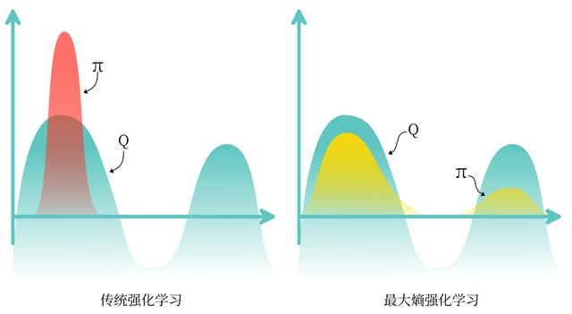

<!--
 * @version:
 * @Author:  StevenJokess（蔡舒起） https://github.com/StevenJokess
 * @Date: 2023-02-23 20:58:18
 * @LastEditors:  StevenJokess（蔡舒起） https://github.com/StevenJokess
 * @LastEditTime: 2023-03-16 22:52:26
 * @Description:
 * @Help me: 如有帮助，请赞助，失业3年了。
 * @TODO::
 * @Reference:
-->
# SAC算法

## 简介

之前的章节提到过在线策略算法的采样效率比较低，我们通常更倾向于使用离线策略算法。然而，虽然 DDPG 是离线策略算法，但是它的训练非常不稳定，收敛性较差，对超参数比较敏感，也难以适应不同的复杂环境。2018 年，一个更加稳定的离线策略算法 —— 软演员评论员算法 Soft Actor-Critic（SAC）被提出。SAC 的前身是 *Soft Q-learning*，它们都属于最大熵强化学习的范畴。Soft Q-learning 不存在一个显式的策略函数，而是使用一个函数的波尔兹曼分布，在连续空间下求解非常麻烦。于是 SAC 提出使用一个 Actor 表示策略函数，从而解决这个问题。目前，在无模型的强化学习算法中，SAC 是一个非常高效的算法，它学习一个随机性策略，并利用熵正则化和一些其它技巧来稳定学习，在不少标准环境中取得了领先的成绩，如在 benchmarks 上获得比 DDPG 更高的分数。[1]

## 最大熵强化学习

### 熵

**熵** (entropy) 表示对一个随机变量的随机程度的度量。具体而言，如果 $X$ 是一 个随机变量，且它的概率密度函数为 $p$ ，那么它的熵 $H$ 就被定义为

$$
H(X)=\mathbb{E}_{x \sim p}[-\log p(x)]
$$

在强化学习中，我们可以使用 $H(\pi(\cdot \mid s))$ 来表示策略 $\pi$ 在状态 $s$ 下的*随机程度*。

### 思想

**最大熵强化学习** (maximum entropy RL) 的思想就是除了要最大化累积奖励，还要使得*策略更加随机*。如此，强化学习的目标中就加入了一项**熵的正则项**，定义为

$$
\pi^*=\arg \max _\pi \mathbb{E}_\pi\left[\sum_t r\left(s_t, a_t\right)+\alpha H\left(\pi\left(\cdot \mid s_t\right)\right)\right]
$$

其中， $\alpha$ 是一个正则化的系数，用来控制熵的重要程度。

熵正则化增加了强化学习算法的探索程度， $\alpha$ 越大，*探索性*就越强，有助于加速后续的策略学习，并减少策略陷入较差的局部最优的可能性。传统强化学习和最大熵强化学习的区别如图 14-1 所示。

## Soft Q-learning 或 Soft策略迭代

在最大熵强化学习框架中，由于目标函数发生了变化，其他的一些定义也有相应的变化。

动作价值函数的贝尔曼等式，又叫做Soft 贝尔曼方程：

$$
Q\left(s_t, a_t\right)=r\left(s_t, a_t\right)+\gamma \mathbb{E}_{s_{t+1}}\left[V\left(s_{t+1}\right)\right]
$$

状态价值函数的贝尔曼等式：

$$
V\left(s_t\right)=\mathbb{E}_{a_t \sim \pi}\left[Q\left(s_t, a_t\right)-\alpha \log \pi\left(a_t \mid s_t\right)\right]=\mathbb{E}_{a_t \sim \pi}\left[Q\left(s_t, a_t\right)\right]+\alpha H\left(\pi\left(\cdot \mid s_t\right)\right)
$$

于是，根据该 Soft 贝尔曼方程，在有限的状态和动作空间情况下，Soft 策略评估可以收敛到策略 $\pi$ 的 Soft $Q$ 函数。然后，根据如下 Soft 策略提升公式可以改进策略:

$$
\pi_{\text {new }}=\arg \min _{\pi^{\prime}} D_{K L}\left(\pi^{\prime}(\cdot \mid s), \frac{\exp \left(\frac{1}{\alpha} Q^{\pi_{\text {old }}}(s, \cdot)\right)}{Z^{\pi_{\text {old }}}(s, \cdot)}\right)
$$

重复交替使用 Soft 策略评估和 Soft 策略提升，最终策略可以收敛到最大熵强化学习目标中的最优策略。但该 Soft 策略迭代方法只适用于**表格型** (tabular) 设置的情况，即状态空间和动作空间是有限的情况。在连续空间下，我们需要通过参数化函数 $Q$ 和策略 $\pi$ 来近似这样的迭代。

## SAC

在 $S A C$ 算法中，我们为两个动作价值函数 $Q$ (参数分别为 $\omega_1$ 和 $\omega_2$ ) 和 一个策略函数 $\pi$ (参数为 $\theta$ ) 建模。

### Q 网络

基于 Double DQN 的思想， SAC 使用两个 $Q$ 网络，但每次用 $Q$ 网络时会挑选一个 **$Q$ 值小** 的网络，从而缓解 $Q$ 值过高估计的问题，即$\min _{j=1,2} Q_{\omega_j^{-}}\left(s_{t+1}, a_{t+1}\right)$

任意一个函数 $Q$ 的损失函数为:

$$
\begin{aligned}
L_Q(\omega) & =\mathbb{E}_{\left(s_t, a_t, r_t, s_{t+1}\right) \sim R}\left[\frac{1}{2}\left(Q_\omega\left(s_t, a_t\right)-\left(r_t+\gamma V_{\omega^{-}}\left(s_{t+1}\right)\right)\right)^2\right] \\
& =\mathbb{E}_{\left(s_t, a_t, r_t, s_{t+1}\right) \sim R, a_{t+1} \sim \pi_\theta\left(\cdot \mid s_{t+1}\right)}\left[\frac{1}{2}\left(Q_\omega\left(s_t, a_t\right)-\left(r_t+\gamma\left(\min _{j=1,2} Q_{\omega_j^{-}}\left(s_{t+1}, a_{t+1}\right)-\alpha \log \pi\left(a_{t+1} \mid s_{t+1}\right)\right)\right)\right)^2\right]
\end{aligned}
$$

其中， $R$ 是策略过去收集的数据，因为 $\mathrm{SAC}$ 是一种离线策略算法。为了让训练更加稳定，这里使用了目标 $Q$ 网络 $Q_{\omega^{-}}$，同样是两个目标 $Q$ 网络，与两个 $Q$ 网络一一对应。

SAC 中目标 $Q$ 网络的更新方式与 DDPG 中的更新方式一样。

### 策略 $\pi$的损失函数

策略 $\pi$ 的损失函数由 $\mathrm{KL}$ 散度得到，化简后为:

$$
L_\pi(\theta)=\mathbb{E}_{s_t \sim R, a_t \sim \pi_\theta}\left[\alpha \log \left(\pi_\theta\left(a_t \mid s_t\right)\right)-Q_\omega\left(s_t, a_t\right)\right]
$$

可以理解为最大化函数 $V$ ，因为有 $V\left(s_t\right)=\mathbb{E}_{a_t \sim \pi}\left[Q\left(s_t, a_t\right)-\alpha \log \pi\left(a_t \mid s_t\right)\right]$

#### 重参数化技巧

对连续动作空间的环境，SAC 算法的策略输出高斯分布的*均值和标准差*。

由于根据高斯分布来采样动作的过程是不可导的。因此，我们需要用到**重参数化技巧** (reparameterization trick) 。

重参数化的做法是先从一个单位高斯分布 $\mathcal{N}$ 采样，再把采样值*乘以标准差后加上均值*。这样就可以认为是从策略高斯分布采样，并且这样对于策略函数是可导的。

#### 重写策略 $\pi$ 的损失函数

我们使用函数 $f_θ()$ 将动作 $a_t$ 表示为一个噪声随机变量 $\epsilon_t$ 和状态 $s_t$ 的函数，即 $a_t=f_\theta\left(\epsilon_t ; s_t\right)$

考虑到两个函数 $Q$ ，重写策略 $\pi$ 的损失函数:

$$
L_\pi(\theta)=\mathbb{E}_{s_t \sim R, \epsilon_t \sim \mathcal{N}}\left[\alpha \log \left(\pi_\theta\left(f_\theta\left(\epsilon_t ; s_t\right) \mid s_t\right)\right)-\min _{j=1,2} Q_{\omega_j}\left(s_t, f_\theta\left(\epsilon_t ; s_t\right)\right)\right]
$$

#### 自动调整熵正则项

在 SAC 算法中，如何选择熵正则项的系数非常重要。在不同的状态下需要不同大小的熵：在最优动作不确定的某个状态下，熵的取值应该大一点；而在某个最优动作比较确定的状态下，熵的取值可以小一点。为了*自动调整熵正则项*，SAC 将强化学习的目标改写为一个带约束的优化问题：

$$
\max _\pi \mathbb{E}_\pi\left[\sum_t r\left(s_t, a_t\right)\right] \quad \text { s.t. } \quad \mathbb{E}_{\left(s_t, a_t\right) \sim \rho_\pi}\left[-\log \left(\pi_t\left(a_t \mid s_t\right)\right)\right] \geq \mathcal{H}_0
$$

也就是最大化期望回报，同时约束熵的均值大于 $\mathcal{H}_0$ 。通过一些数学技巧化简后，得到 $\alpha$ 的损失函数：

$$
L(\alpha)=\mathbb{E}_{s_t \sim R, a_t \sim \pi\left(\cdot \mid s_t\right)}\left[-\alpha \log \pi\left(a_t \mid s_t\right)-\alpha \mathcal{H}_0\right]
$$

- 当策略的熵低于目标值 $\mathcal{H}_0$ 时，训练目标 $L(\alpha)$ 会使 $\alpha$ 的值增大，进而在上述最小化损失函数 $L_\pi(\theta)$ 的过程中增加了策略熵对应项的重要性，即关注**增加策略的熵**，以促进更多的探索[2]；
- 当策略的熵高于目标值 $\mathcal{H}_0$ 时，训练目标 $L(\alpha)$ 会使 $\alpha$ 的值减小，进而使得策略训练时*更专注于价值提升*。

## 伪代码

- 用随机的网络参数 $\omega_1, \omega_2$ 和 $\theta$ 分别初始化 Critic 网络 $Q_{\omega_1}(s, a), Q_{\omega_2}(s, a)$ 和 Actor 网络 $Q_{\theta}(s, a)$
- 复制相同的参数 $\omega_1^{-} \leftarrow \omega_1 ， \omega_2^{-} \leftarrow \omega_2$ ，分别初始化目标网络 $Q_{\omega_1^{-}}$和 $Q_{\omega_1^{-}}$ ，初始化经验回放池 $R$
- **for** 序列 $e=1 \rightarrow E$ **do**
  - 获取环境初始状态 $s_1$
  - **for** 时间步 $t=1 \rightarrow T$ **do**
    - 根据当前策略选择动作 $a_t=\pi_\theta\left(s_t\right)$
    - 执行动作 $a_t$ ，获得奖励 $r_t$ ，环境状态变为 $s_{t+1}$
    - 将 $\left(s_t, a_t, r_t, s_{t+1}\right)$ 存入回放池 $R$
    - for 训练轮数 $k=1 \rightarrow K$ do
       - 从 $R$ 中采样 $N$ 个元组 $\left\{\left(s_i, a_i, r_i, s_{i+1}\right)\right\}_{i=1, \ldots, N}$
       - 对每个元组，用目标网络计算 $y_i=r_i+\gamma \min _{j=1,2} Q_{\omega_j^{-}}\left(s_{i+1}, a_{i+1}\right)-\alpha \log \pi_\theta\left(a_{i+1} \mid s_{i+1}\right)$ ，其中 $a_{i+1} \sim \pi_\theta\left(\cdot \mid s_{i+1}\right)$
      - 对两个 Critic 网络都进行如下更新: 对 $j=1,2$ ，最小化损失函数 $L=\frac{1}{N} \sum_{i=1}^N\left(y_i-Q_{\omega_j}\left(s_i, a_i\right)\right)^2$
      - 用重参数化技巧采样动作 $\tilde{a}_i$ ，然后用以下损失函数更新当前 Actor 网络：$
L_\pi(\theta)=\frac{1}{N} \sum_{i=1}^N\left(\alpha \log \pi_\theta\left(\tilde{a}_i \mid s_i\right)-\min _{j=1,2} Q_{\omega_j}\left(s_i, \tilde{a}_i\right)\right)$
      - 用以下损失函数更新熵正则项的系数 $\alpha$，$L(\alpha)=\mathbb{E}_{s_t \sim R, a_t \sim \pi\left(\cdot \mid s_t\right)}\left[-\alpha \log \pi\left(a_t \mid s_t\right)-\alpha \mathcal{H}_0\right]$
      - 更新目标网络： $\omega_1^{-} \leftarrow \tau \omega_1+(1-\tau) \omega_1^{-}, \omega_2^{-} \leftarrow \tau \omega_2+(1-\tau) \omega_2^{-}$
    - **end for**
  - **end for**
- **end for**

## SAC代码实践

我们来看一下 SAC 的代码实现，首先在倒立摆环境下进行实验，然后再尝试将 SAC 应用到与离散动作交互的车杆环境。

首先我们导入需要用到的库。

接下来定义策略网络和价值网络。由于处理的是与连续动作交互的环境，策略网络输出一个高斯分布的均值和标准差来表示动作分布；而价值网络的输入是状态和动作的拼接向量，输出一个实数来表示动作价值。

然后我们来看一下 SAC 算法的主要代码。如 14.4 节所述，SAC 使用两个 Critic 网络和来使 Actor 的训练更稳定，而这两个 Critic 网络各 $Q_{\omega_1}$ 和 $Q_{\omega_2}$在训练时则各自需要一个目标价值网络。因此，SAC 算法一共用到 5 个网络，分别是一个策略网络、两个价值网络和两个目标价值网络。

接下来我们就在倒立摆环境上尝试一下 SAC 算法吧！

可以发现，SAC 在倒立摆环境中的表现非常出色。SAC 算法原本是针对连续动作交互的环境提出的，那一个比较自然的问题便是：SAC 能否处理与离散动作交互的环境呢？答案是肯定的，但是我们要做一些相应的修改。首先，策略网络和价值网络的网络结构将发生如下改变：

- 策略网络的输出修改为在离散动作空间上的 softmax 分布；
- 价值网络直接接收状态和离散动作空间的分布作为输入。

该策略网络输出一个离散的动作分布，所以在价值网络的学习过程中，不需要再对下一个动作 $a_{t+1}$ 进行采样，而是直接通过概率计算来得到下一个状态的价值。同理，在 $\alpha$ 的损失函数计算中，也不需要再对动作进行采样。

code

可以发现，SAC 在离散动作环境车杆下具有完美的收敛性能，并且其策略回报的曲线十分稳定，这体现出 SAC 可以在离散动作环境下平衡探索与利用的优秀性质。

## 小结

本章首先讲解了什么是最大熵强化学习，并通过控制策略所采取动作的熵来调整探索与利用的平衡，可以帮助读者加深对探索与利用的关系的理解；然后讲解了 SAC 算法，剖析了它背后的原理以及具体的流程，最后在连续的倒立摆环境以及离散的车杆环境中进行了 SAC 算法的代码实践。 由于有扎实的理论基础和优秀的实验性能，SAC 算法已经成为炙手可热的深度强化学习算法，很多新的研究基于 SAC 算法，第 17 章将要介绍的基于模型的强化学习算法 MBPO 和第 18 章将要介绍的离线强化学习算法 CQL 就是以 SAC 作为基本模块构建的。

[1]: https://hrl.boyuai.com/chapter/2/sac%E7%AE%97%E6%B3%95
[2]: https://chat.openai.com/chat
TODO：
https://zhuanlan.zhihu.com/p/557418338#6%E3%80%81SAC-%E7%A6%BB%E6%95%A3
