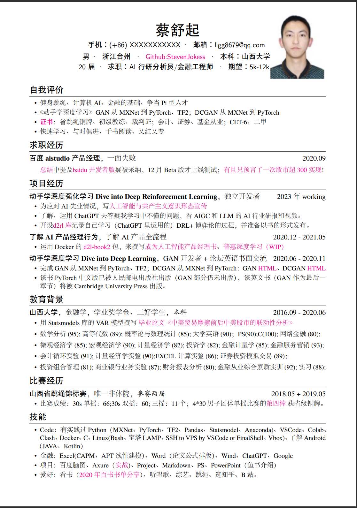

<!--
 * @version:
 * @Author:  StevenJokess（蔡舒起） https://github.com/StevenJokess
 * @Date: 2023-06-02 22:02:24
 * @LastEditors:  StevenJokess（蔡舒起） https://github.com/StevenJokess
 * @LastEditTime: 2023-09-09 23:21:56
 * @Description:
 * @Help me: make friends by a867907127@gmail.com and help me get some “foreign” things or service I need in life; 如有帮助，请资助，失业3年了。
 * @TODO::
 * @Reference:
-->

# 前折页

作者（蔡舒起）介绍：

毕业即失业，在家鬼混3年的要饭人士罢了。自任山河大学的三院院（体育学院、经济与管理学院和人工智能学院）附属精神病院的院长。

作者的联系方式：

- 邮箱: 867907127@qq.com
- 知乎: 
- QQ群：171097552
- 个人网站: https://stevenjokess.github.io/2bPM/

## 简历 PDF 和 要饭码

要饭码：

  <embed src="../img/蔡舒起_简历_no_phone.pdf" type="application/pdf" width="850" height="600">
    
如果浏览器不支持PDF，则下载PDF来查看:
      <a href="../img/蔡舒起_简历_no_phone.pdf">下载PDF
      </a>
          

  </embed>

> 参考网页
> [1]: <https://gohom.win/2015/06/07/EmbedHtmlPDF/>
> [2]: <https://www.itcoder.tech/posts/display-pdf-image-in-markdown/>
