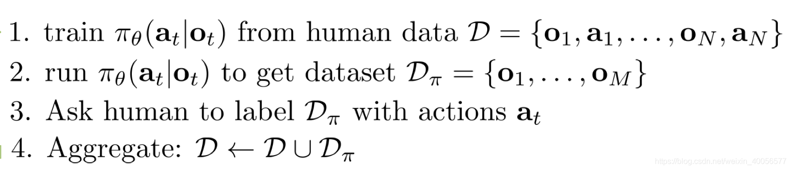

<!--
 * @version:
 * @Author:  StevenJokess（蔡舒起） https://github.com/StevenJokess
 * @Date: 2023-09-09 21:48:55
 * @LastEditors:  StevenJokess（蔡舒起） https://github.com/StevenJokess
 * @LastEditTime: 2023-09-14 22:19:55
 * @Description:
 * @Help me: make friends by a867907127@gmail.com and help me get some “foreign” things or service I need in life; 如有帮助，请资助，失业3年了。
 * @TODO::
 * @Reference:
-->
# DAgger

严格的讲，就是学习时和实际操作时的 $o_t$ 的分布不同，实际操作时的 $o_t$ 的情况由于存在偏差而会比学习时的要糟糕许多。因此我们希望 $p_{\text {data }}\left(o_t\right)=p_{\pi_\theta}\left(o_t\right)$ ，这也就是DAgger算法（Dataset Aggregation）。

## 伪代码

最麻烦就是第三步了，要人工标记，何况有些情况下如机械臂关节角度还难以人工进行。其次，每次收集完新的数据，还需要重新训练一个policy。尽管如此，在可用的前提下，DAgger是最简单有效提升policy性能的方法。

假设最重要的数据足够好，其次便是policy这个模型的问题，如何使模型能准确捕捉专家数据的同时不过拟合（overfit）？

## 总结

总而言之，直接用人类数据做监督学习，来让机器模仿学习会遇到训练数据和实际操作时的分布不匹配的问题，因此不可行。

但是用一些方法能让模仿学习学的不错：

- 和学习任务相关的技巧（如汽车自动驾驶时在两边装摄像头）
- 生成训练数据的分布，然后大量采样，使实际分布稳定（需要另外的学习算法）
- 直接从 $p_{\pi_{\theta}}(o_t)$ 采样学习数据（DAgger）

但即使用了一些方法，模仿学习始终有这些问题：

- 需要人类提供的大量数据（尤其是深度学习，然而常常没有多人类数据）
- 人类对一些任务也做的不太好，对于一些复杂任务，人类能做出的动作有限（比如操作无人直升机）
- 我们希望机器能自动学习，即能不断地在错误中自我完善，而不需要人类的指导。

