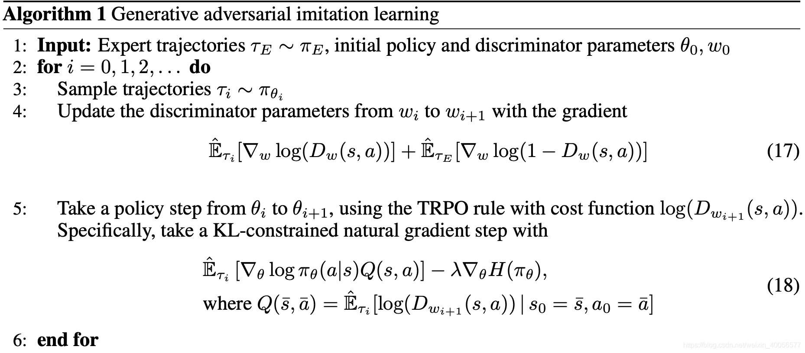

<!--
 * @version:
 * @Author:  StevenJokess（蔡舒起） https://github.com/StevenJokess
 * @Date: 2023-04-16 21:41:00
 * @LastEditors:  StevenJokess（蔡舒起） https://github.com/StevenJokess
 * @LastEditTime: 2023-10-02 22:35:50
 * @Description:
 * @Help me: make friends by a867907127@gmail.com and help me get some “foreign” things or service I need in life; 如有帮助，请资助，失业3年了。
 * @TODO::
 * @Reference:
-->

# 生成对抗模仿学习

## 背景介绍

如何在Deep RL中利用专家数据？Behavioral Cloning与Inverse RL两种方式。

1. Behavioral Cloning直接从专家数据上进行监督学习，会出现supervised learning中常见的covariate shift的问题，导致利用policy时出现compounding error。
2. Inverse RL需要从专家数据中recover 一个cost function（等价reward function），直觉上是得到一个专家的intent，然后基于该cost function学习RL的optimal behavior去迭代cost function，计算花销非常大，而且每次RL Inner Loop不一定能学到当前cost function下的optimal behavior，同样导致compounding error。

GAIL的Contribution：利用GAN去拟合expert demonstration中的state与action的distribution。不同于IRL中通过一个cost/reward signal学习policy，也不同于传统的behavioral cloning要求的large datasets以及covariate shifts，GAIL对专家数据用GAN做了数据增广。与Behavioral Cloning比较起来，可以生成更多数据，与IRL比较起来，避免了RL作为Inner Loop的计算花销以及通过reward signal习得optimal behavior 这种导致Compounding error的做法。[3]

## 基础知识

- Inverse RL：
$$
\begin{aligned}
& \max _{\mathrm{c} \in \mathrm{C}}\left(\min _{\pi \in \Pi} \mathrm{E}_\pi[\mathrm{c}(\mathrm{s}, \mathrm{a})]-\mathrm{H}(\pi)\right)-\mathrm{E}_{\pi_{\mathrm{E}}}[\mathrm{c}(\mathrm{s}, \mathrm{a})] \\
& \min _{\mathrm{r} \in \mathrm{R}}\left(\max _{\pi \in \Pi} \mathrm{E}_\pi[\mathrm{r}(\mathrm{s}, \mathrm{a})]+\mathrm{H}(\pi)\right)-\mathrm{E}_{\pi_{\mathrm{E}}}[\mathrm{r}(\mathrm{s}, \mathrm{a})]
\end{aligned}
$$

其中 $\pi_{\mathrm{E}}$ 为专家策略， $\pi$ 为迭代中的策略。

这两个目标是一致的，只是第一个用cost function，第二个用reward function的形式表达。

用reward角度解释一下这个Objective:

1. 寻找一个策略 $\pi$ ，使在当前 $r(s, a)$ 下的cumulative reward最大且使policy的entropy尽可能大。即 $\max _{\pi \in \Pi} \mathrm{E}_\pi[\mathrm{r}(\mathrm{s}, \mathrm{a})]+\mathrm{H}(\pi)=\mathrm{RL}(\mathrm{r})$
2. 固定 $\max _{\pi \in \Pi} \mathrm{E}_\pi[\mathrm{r}(\mathrm{s}, \mathrm{a})]+\mathrm{H}(\pi)$ 中的策略，寻找一个 $\mathrm{r}(\mathrm{s}, \mathrm{a})$ 使得专家数据的objective更大，刚才习得的policy objective更小，意味着寻找一个reward在专家行为中获得的奖励比其他policy都要大

因此Inverse RL求得是一个reward function/cost function。

- Apprenticeship learning
$$
\min _\pi \max _{\mathrm{c} \in \mathrm{C}} \mathrm{E}_\pi[\mathrm{c}(\mathrm{s}, \mathrm{a})]-\mathrm{E}_{\pi_{\mathrm{E}}}[\mathrm{c}(\mathrm{s}, \mathrm{a})]
$$

学徒学习的过程与Inverse RL十分类似，只是它的目标为一个专家policy而不是inverse RL中的cost function。此处有细微的不同:

1. 如果得到的是一个专家的policy，那这个policy很难generalize，非常取决于expert demonstration的数据量以及质量，难以获得超越expert的性能。
2. 但如果是得到一个表示专家intent的reward signal/cost function，将其作为信号，利用RL进行学习的话，会得到一定的灵活性，能获得超越expert的性能，但计算开销比较大。

# 理论分析的思路

## 度量定义

1. 占用度量（Occupancy Measure）

$$
\mathrm{p}_\pi(\mathrm{s}, \mathrm{a})=\pi(\mathrm{a} \mid \mathrm{s}) \sum_{\mathrm{t}=0}^{\infty} \gamma^{\mathrm{t}} \mathrm{P}\left(\mathrm{s}_{\mathrm{t}}=\mathrm{s} \mid \pi\right)
$$

用来衡量policy的(state, action)分布。当前状态 $\mathrm{s}$ 与动作 $\mathrm{a}$ 的联合概率 $=$ 给定状态 $\mathrm{s}$ 选择动作 $\mathrm{a}$ 的概率 $\times$ 将来回到当前状态 $\mathrm{s}$ 的可能概率。 因此，目标与有效的占用度量可表示为:

$$
\begin{gathered}
\mathrm{E}_\pi[\mathrm{c}(\mathrm{s}, \mathrm{a})]=\sum_{\mathrm{s}, \mathrm{a}} \mathrm{p}_\pi(\mathrm{s}, \mathrm{a}) \mathrm{c}(\mathrm{s}, \mathrm{a}) \\
\mathrm{D}=\left\{\mathrm{p}: \mathrm{p} \geq 0 \quad \text { and } \quad \sum_{\mathrm{a}} \mathrm{p}(\mathrm{s}, \mathrm{a})=\mathrm{p}_0(\mathrm{~s})+\gamma \sum_{\mathrm{s}^{\prime}, \mathrm{a}} \mathrm{P}\left(\mathrm{s} \mid \mathrm{s}^{\prime}, \mathrm{a}\right) \mathrm{p}\left(\mathrm{s}^{\prime}, \mathrm{a}\right)\right\}
\end{gathered}
$$

2. 策略占用度量（Policy Occupancy Measure）

$$
\pi_{\mathrm{p}}(\mathrm{a} \mid \mathrm{s})=\mathrm{p}_\pi(\mathrm{s}, \mathrm{a}) / \sum_{\mathrm{a}^{\prime}} \mathrm{p}\left(\mathrm{s}, \mathrm{a}^{\prime}\right)
$$

因此定义了一个policy的occupancy Measure。

## 主要逻辑

下面是论文的关键逻辑:

- IRL得到的是一个cost function，如果提供的expert demonstration比较少质量差，那得到的cost function很容易过拟合，因此IRL原问题定义为:

$$
\operatorname{IRL}_\psi\left(\pi_{\mathrm{E}}\right)=\underset{\mathrm{c} \in \mathrm{C}}{\arg \max }-\psi(\mathrm{c})+\left(\min _{\pi \in \Pi} \mathrm{E}_\pi[\mathrm{c}(\mathrm{s}, \mathrm{a})]-\mathrm{H}(\pi)\right)-\mathrm{E}_{\pi_{\mathrm{E}}}[\mathrm{c}(\mathrm{s}, \mathrm{a})]
$$

其中 $\psi$ 为对cost function进行regularised的函数

- 对IRL复原出来的cost function丢进RL中得到一个expert policy，有
$$
\mathrm{RL} \circ \operatorname{IRL}_\psi\left(\pi_{\mathrm{E}}\right)=\underset{\pi \in \Pi}{\arg \min } \psi^*\left(\mathrm{p}_\pi-\mathrm{p}_{\pi_{\mathrm{E}}}\right)-\mathrm{H}(\pi)
$$

$\mathrm{p}_{\pi_\mathrm{E}}$ 最小。

- 如果 $\psi$ 是一个constant function， $\tilde{\mathrm{c}} \in \operatorname{IRL}_\psi\left(\pi_{\mathrm{E}}\right) ， \tilde{\pi} \in \mathrm{RL}(\tilde{\mathrm{c}})$ ，则有 $\mathrm{p}_{\tilde{\pi}}=\mathrm{p}_{\pi_{\mathrm{E}}}$ 。

总结: 整个过程其实就是在说明， $R L \circ I R L$ 这个过程得到的policy，就是在拟合专家数据中的占用度量。

因此问题变为:

$$
\min _\pi \mathrm{d}_\psi\left(\mathrm{p}_\pi, \mathrm{p}_{\mathrm{E}}\right)-\mathrm{H}(\pi)
$$

选择一个策略 $\pi$ 使得其Occupancy Measure与专家数据的Occupancy Measure尽可能接近，加一个entropy term，希望policy在training过程中尽可能地探索。

所以选择 $\mathrm{d}_\psi$ 的不同形式，就可以导出不同的imitation learning的algorithms，其中 $\mathrm{d}_\psi$ 选择为下面的公式

$$
\psi_{\mathrm{GA}}(c) \triangleq\left\{\begin{array}{ll}
\mathbb{E}_{\pi_E}[g(c(s, a))] & \text { if } c<0 \\
+\infty & \text { otherwise }
\end{array} \text { where } g(x)= \begin{cases}-x-\log \left(1-e^x\right) & \text { if } x<0 \\
+\infty & \text { otherwise }\end{cases}\right.
$$

则有:

$$
\begin{aligned}
\min _\pi \psi_{\mathrm{GA}}^*\left(\mathrm{p}_\pi-\mathrm{p}_{\pi_{\mathrm{E}}}\right) & =\min _\pi \max _{\mathrm{D} \in(0,1)^{\mathrm{S} \times \mathrm{A}}} \mathrm{E}_\pi[\log \mathrm{D}(\mathrm{s}, \mathrm{a})]+\mathrm{E}_{\pi_\mathrm{E}}[\log (1-\mathrm{D}(\mathrm{s}, \mathrm{a}))] \\
& =\min _\pi \mathrm{D}_{\mathrm{JS}}\left(\mathrm{p}_\pi, \mathrm{p}_{\pi_{\mathrm{E}}}\right)
\end{aligned}
$$

其中 $G$ 为Policy Network， $D$ 为Discriminator Network，其用于判别数据分布是由生成器 $G$ (即生成对抗模仿学习中的 $\pi$ ) 还是 真实数据分布 (即生成对抗学习中的 $\pi_E$ ) 产生。

更新G时不再是Maximum Likelihood，而是采用TRPO Rule。

- 生成对抗模仿学习 (GAIL)[2]

$$
\min _\pi \max _D \mathbb{E}_{(s, a) \sim \pi_E}[\log D(s, a)]+\mathbb{E}_{(s, a) \sim \pi}[\log (1-D(s, a))]-\lambda H(\pi)
$$

> 对比，原生成对抗网络 (GAN)
> $$
> \min _G \max _D \mathbb{E}_{x \in p_{\text {data }}(x)}[\log D(x)]+\mathbb{E}_{z \sim p_z(z)}[\log (1-D(G(z)))]
> $$
>

## 实验

1. 环境介绍

2. Expert Demonstration的来源
利用TRPO在环境上跑一个expert policy，然后从expert policy sample一些trajectories作为expert data进行学习。

## 总结

NIPS 2016的文章比较久远，但是一篇十分经典、承上启下的文章。
改进的地方非常多，如Policy Network的更新可以采用不同的Update Rule以及各种tricks来降低variance，以及提高Policy Update过程中的Sample Efficiency，至于判别器也可以通过其他方式进行改进。

一句话总结：通过引入GAN来拟合专家数据的(s,a)分布，从而获得对Policy Update的Guidance。
启发：这种Guidance可以从其他形式获得。

## 测验与习题

1. 什么是生成对抗模仿学习？它和生成对抗网络有何联系？

[1]: https://papers.nips.cc/paper_files/paper/2016/hash/cc7e2b878868cbae992d1fb743995d8f-Abstract.html
[2]: https://boyuai.oss-cn-shanghai.aliyuncs.com/disk/%E5%8A%A8%E6%89%8B%E5%AD%A6%E7%B3%BB%E5%88%97/%E5%8A%A8%E6%89%8B%E5%AD%A6%E5%BC%BA%E5%8C%96%E5%AD%A6%E4%B9%A0/%E8%AF%BE%E4%BB%B6pdf/10-%E6%A8%A1%E4%BB%BF%E5%AD%A6%E4%B9%A0.pdf
[3]: https://blog.csdn.net/weixin_40056577/article/details/106452740
