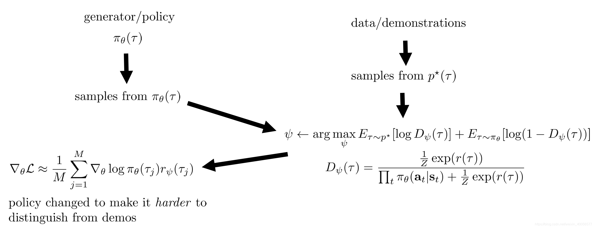

# GAIRL

[A Connection Between Generative Adversarial Networks, Inverse Reinforcement Learning, and Energy-Based Models](https://arxiv.org/pdf/1611.03852.pdf)

在GAN中的最优判别器形式为

$$
\mathrm{D}^*(\mathrm{x})=\frac{\mathrm{p}^*(\mathrm{x})}{\mathrm{p}_\theta(\mathrm{x})+\mathrm{p}^*(\mathrm{x})}
$$

在上述IRL的推导中，本来在参数 $\psi$ 更新过程就嵌套了一个MERL，然后这样太麻烦，就拿出MERL的Objective跑几个Policy Gradient Step。

$$
\begin{aligned}
\mathrm{D}_\psi(\tau) & =\frac{\mathrm{p}(\tau) \frac{1}{\mathrm{Z}} \exp (\mathrm{r}(\tau))}{\mathrm{p}_\theta(\tau)+\mathrm{p}(\tau) \frac{1}{\mathrm{Z}} \exp (\mathrm{r}(\tau))} \\
& =\frac{\mathrm{p}(\tau) \frac{1}{\mathrm{Z}} \exp (\mathrm{r}(\tau))}{\mathrm{p}(\tau) \prod_{\mathrm{t}} \pi_\theta\left(\mathrm{a}_{\mathrm{t}} \mid \mathrm{s}_{\mathrm{t}}\right)+\mathrm{p}(\tau) \frac{1}{\mathrm{Z}} \exp (\mathrm{r}(\tau))} \\
& =\frac{\frac{1}{\mathrm{Z}} \exp (\mathrm{r}(\tau))}{\prod_{\mathrm{t}} \pi_\theta\left(\mathrm{a}_{\mathrm{t}} \mid \mathrm{s}_{\mathrm{t}}\right)+\frac{1}{\mathrm{Z}} \exp (\mathrm{r}(\tau))}
\end{aligned}
$$

GAIRL算法流程变为:

