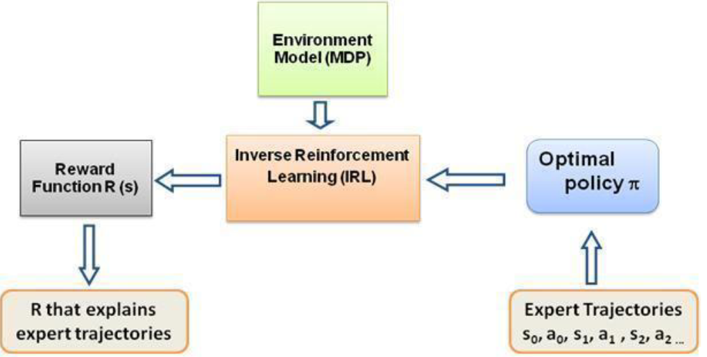
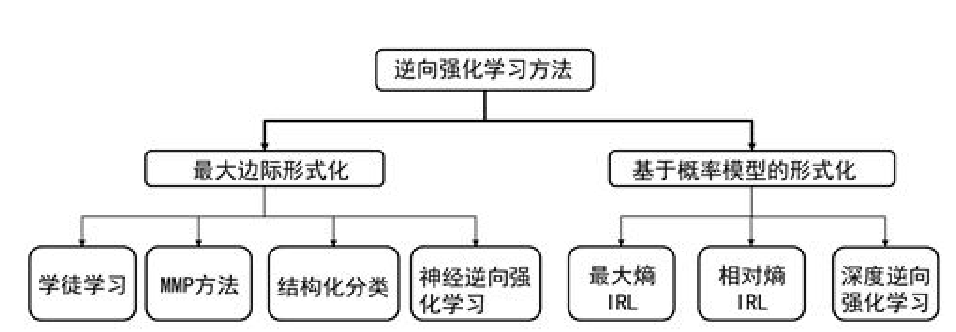

<!--
 * @version:
 * @Author:  StevenJokess（蔡舒起） https://github.com/StevenJokess
 * @Date: 2023-04-16 21:13:06
 * @LastEditors:  StevenJokess（蔡舒起） https://github.com/StevenJokess
 * @LastEditTime: 2023-10-26 01:12:10
 * @Description:
 *
 * @Help me: make friends by a867907127@gmail.com and help me get some “foreign” things or service I need in life; 如有帮助，请赞助，失业3年了。
 * @TODO::
 * @Reference:
-->
# 逆强化学习

## 简介

之前的强化学习算法中，奖励大多是人为制定或者是环境给出。然而，在很多复杂的任务中，奖励很难指定。例如，以聊天机器人为例，聊的好不好很难定义奖励。还有环境在 agent 终止行为之前 [奖励稀疏的问题](../chapter_sparse_reward_problem/sparse_reward_intro.md)。此外，人为设计奖励函数具有很大的主观性，很难制定合适的奖励函数。

在很多实际任务中存在一些专家完成任务的序列被认为获取了比较高的累积奖励。人类专家在完成复杂任务时,可能未考虑奖励函数。但是,这并不是说人类专家在完成任务时就没有奖励函数。从某种程度上来讲，人类专家在完成具体任务时有潜在的奖励函数。Ng 等人提出，专家在完成某项任务时,其决策往往是最优或接近最优的，可以假设，当所有的策略所产生的累积奖励期望都不比专家策略所产生的累积奖励期望大时,所对应的奖励函数就是根据示例学到的奖励函数。

# IRL

逆向强化学习（inverse reinforcement learning）的方法，它允许机器通过观察人类的选择来更多地了解人类的偏好。[2]

## 分类

如果将最开始逆强化学习的思想用数学的形式表示出来，那么这个问题可以归结为最大边际化问题。如上图所示，这是逆强化学习最早的思想。根据这个思想发展起来的算法包括：学徒学习（Apprenticeship learning）,MMP 方法（Maximum Margin Planning）,结构化分类（SCIRL）和神经逆向强化学习（NIRL）。

最大边际形式化的最大缺点是很多时候不存在单独的回报函数使得专家示例行为既是最优的又比其他任何行为好很多，或者有很多不同的回报函数会导致相同的专家策略，也就是说这种方法无法解决歧义的问题。

基于概率模型的方法可以解决歧义性的问题。研究者们利用概率模型又发展出了很多逆向强化学习算法，如最大熵逆向强化学习、相对熵逆向强化学习、最大熵深度逆向强化学习，基于策略最优的逆向强化学习等等。

## 习题测验

1. 什么是模仿学习？模仿学习一般应用于什么样的任务？能举一个模仿学习的应用例子吗？

[1]: http://www.icdai.org/ibbb/2019/ID-0004.pdf
[2]: https://www.ncsti.gov.cn/kcfw/kchzhsh/2021yjqyrdzs/yjqyrdzs2021_xgxx/202203/P020220323629836767560.pdf

TODO: http://www.aas.net.cn/cn/article/doi/10.16383/j.aas.c230081?viewType=HTML
