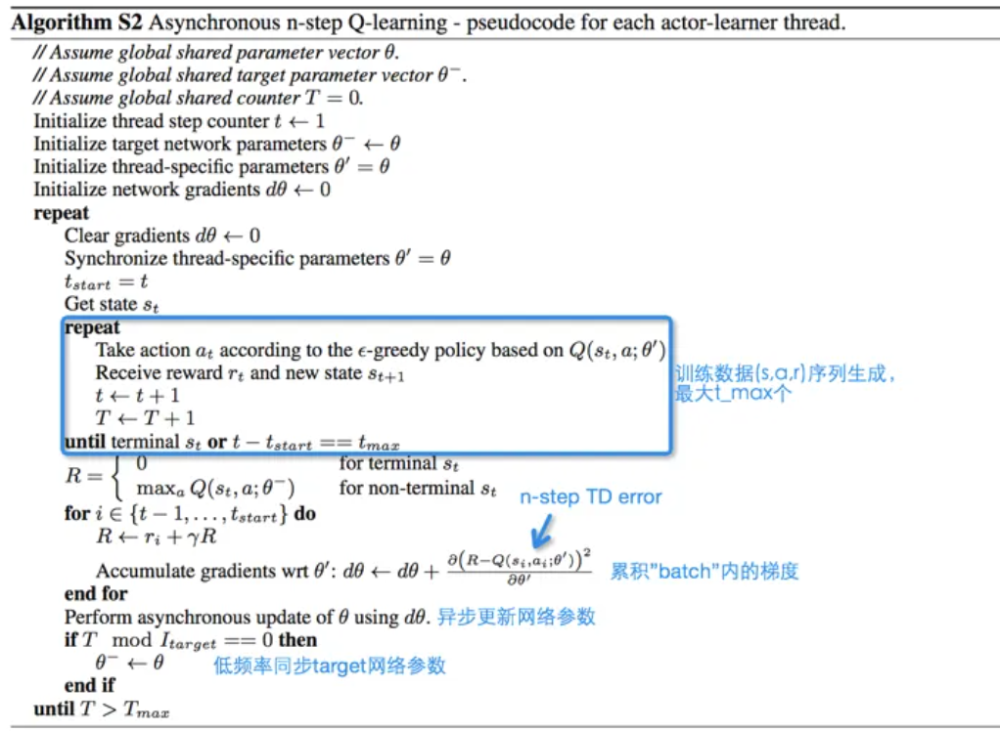

<!--
 * @version:
 * @Author:  StevenJokess（蔡舒起） https://github.com/StevenJokess
 * @Date: 2023-04-29 01:01:56
 * @LastEditors:  StevenJokess（蔡舒起） https://github.com/StevenJokess
 * @LastEditTime: 2023-09-12 20:54:53
 * @Description:
 * @Help me: make friends by a867907127@gmail.com and help me get some “foreign” things or service I need in life; 如有帮助，请赞助，失业3年了。
 * @TODO::
 * @Reference:
-->

# A3C 算法

Policy Gradient(PG)算法的最大问题在于On-Policy所带来的样本效率(sample efficiency)问题。具体而言，

$$
\begin{aligned}
\nabla_\theta \eta\left(\pi_\theta\right) & =\nabla_\theta E_{\tau \sim p\left(\pi_\theta\right)}[R(\tau)] \\
& =\nabla_\theta \sum_{\tau \sim p\left(\pi_\theta\right)} \log p_\theta(\tau) R(\tau)
\end{aligned}
$$

由于样本是从 $p\left(\pi_\theta\right)$ 中采样的，因此在PG进行更新后 $\left(\theta \rightarrow \theta^{\prime}\right)$ ，正确的采样分布已经变成 了 $p\left(\pi_{\theta^{\prime}}\right)$ ，故原来的样本都必须全部被丟弃，然后重新采样样本并更新。可以发现，**每个样本只能用于一次策略更新**，这显然是效率低下的。

A3C算法就是为了解决上述问题。但事实上，A3C算法本质上是逃避了这个问题，即“大力出奇迹”。既然PG的样本效率低，那么**同时并行用很多个Agent去采样**不就可以了（蚌）。但为了保证On-Policy，并行采样的Agent必须保持同步，而这显然限制了采样效率。A3C算法直接忽略了这一点，即**采样异步采样算法**，并定期同步所有Agent的权重，其潜在的假设就是只要**同步频率得当**，那么不同Agent间的步调不会相差太远。[4]

但A3C实际上没有解决On-Policy样本效率低的问题。

## A3C的引入

Actor-Critic算法的代码，其实很难收敛，无论怎么调参，最后的CartPole都很难稳定在200分，这是Actor-Critic算法的问题。但是我们还是有办法去有优化这个难以收敛的问题的。

回忆下之前的DQN算法，为了方便收敛使用了经验回放的技巧。那么我们的Actor-Critic是不是也可以使用经验回放的技巧呢？当然可以！不过A3C更进一步，还克服了一些经验回放的问题。经验回放有什么问题呢？ 回放池经验数据相关性太强，用于训练的时候效果很可能不佳。举个例子，我们学习下棋，总是和同一个人下，期望能提高棋艺。这当然没有问题，但是到一定程度就再难提高了，此时最好的方法是**另寻高手切磋**。

A3C的思路也是如此，它利用多线程的方法，同时在多个线程里面分别和环境进行交互学习，每个线程都把学习的成果汇总起来，整理保存在一个公共的地方。并且，**定期从公共的地方把大家的齐心学习的成果拿回来，指导自己和环境后面的学习交互**。通过这种方法，A3C避免了经验回放相关性过强的问题，同时做到了异步并发的学习模型。

A3C是 Asynchronous Advantage Actor Critic的简称

首先是异步，A3C在采样过程和训练过程都是异步的，首先是采样，由于A3C需要从采样的数据来不断进行策略更新，计算梯度需要依赖当前的策略模型，得到序列，因此这就是一个on-policy的算法，为了加快采样速度，A3C使用了异步采样的方法。

A3C异步更新是每个work单独计算其损失梯度后上传到全局网络，然后全局网络再根据这个梯度更新，然后再用新的参数更新这个work。

后来A3C被认为异步其实完全没有必要，尽管加快了速度，但这么做确实会损失性能，与其这样不如取消异步，于是就有了非异步的A2C。[2]

## A3C介绍

异步优势行动-批判者（Asynchronous Advantage Actor-Critic，A3C）是由DeepMind研究人员于2016年提出的可以在多个计算设备上并行更新网络的学习算法。相比于之前的单节点强化学习系统，A3C通过创建一组工作者（Worker），并将每个工作者分配到不同的计算设备上且为他们各自创建可以交互的环境来实现并行采样和模型更新，同时用一个主（Master）节点维护这些行动者（Actor）和批判者（Critic）网络的更新。行动者是策略网络，批判者是价值网络，分别对应强化学习中的策略和价值函数。通过这样的设计，整个算法的各个工作者可以实时将所采集到样本计算出的梯度回传到主节点，来更新主节点的模型参数，并在主节点模型更新后即时下发到各个工作者进行模型更新。每个工作者可以单独在一个 GPU 上进行运算，从而整个算法可以在一个 GPU 集群上并行更新模型，算法结构如所示。研究表明，分布式强化学习训练除加速模型学习之外，由于其更新梯度是由多个计算节点各自对环境采样计算得到的，还有利于稳定学习表现。

评论家学习值函数，同时有多个演员并行训练并且不时与全局参数同步。A3C旨在用于并行训练，是 on-policy 的方法。

在A3C算法中，有多个并行的环境，每个环境中都有一个智能体执行各自的动作和并计算累计的参数梯度。在一定步数后进行累计，利用累计的参数梯度去更新所有智能体共享的全局参数。

> 使用了多线程的方式，一个主线程负责更新Actor和Critic的参数，多个辅线程负责分别和环境交互，得到梯度更新值，汇总更新主线程的参数。而所有的辅线程会定期从主线程更新网络参数。这些辅线程起到了类似DQN中经验回放的作用，但是效果更好。[5]

不同环境中的智能体可以使用不同的探索策略，会导致经验样本之间的相关性较小，可以提高学习效率。

A3C可根据critic所采用的算法进行同步/异步训练, 能适用于同步策略、异步策略。

使用在线Critic整合策略梯度, 降低训练样本的相关性, 在保证稳定性和无偏估计的前提下, 提升了采样效率和训练速度.[3]

A3C (Asynchronous advantage actor-critic) 算法[38]. 该算法包括一个全局执行器–评价器网络和多个对应于每个线程的执行器–评价器网络. 两种网络结构相同, 均为双输出的神经网络结构, 网络的一个输出表示状态值函数. 全局策略和值函数分别表示 为 $\pi(s \mid \theta)$ 和 $V(s \mid \phi)$, 每个线程的策略和值函数分别 表示为 $\pi\left(s \mid \theta^{\prime}\right)$ 和 $V\left(s \mid \phi^{\prime}\right)$, 其中 $\theta, \theta^{\prime}, \phi$ 和 $\phi^{\prime}$ 为网络的参数. 每执行 步或者达到某个终止状态时进行一次网络更新, 首先计算每个线程的值函数梯度和策略梯度, 然后将它们分别相加, 对全局的网络参数
进行更新, 随后再复制给每个线程的网络.

## 与DDPG的异同

### 相同点

- Advantage Actor-Critic: 和DDPG架构类似，actor网络的梯度[5]

$$
\nabla_{\theta^{\prime}} \log \bar{\pi}\left(a_t \mid \dot{s} ; \theta^{\prime}\right) A\left(s_t, \dot{a_t} ; \theta, \theta_v\right)
$$

### 不同点

与DDPG不同的是A3C利用的是max(Advantage)而非max $(Q)$ ，其中A(s_\{t $\}$, a_ $\{t\} ;$ itheta， Itheta \{ $\{v\})$ 是利用n-steps TD error进行更新的，即:
$$
\sum_{i=0}^{k-1} \gamma^i r_{t+i}+\gamma^k V\left(s_{t+k} ; \theta_v\right)-V\left(s_t ; \theta_v\right)
$$

Estimate state-value function
$$
V(s, \mathbf{v}) \approx \mathbb{E}\left[r_{t+1}+\gamma r_{t+2}+\ldots \mid s\right]
$$
- Q-value estimated by an $n$-step sample
$$
q_t=r_{t+1}+\gamma r_{t+2} \ldots+\gamma^{n-1} r_{t+n}+\gamma^n V\left(s_{t+n}, \mathbf{v}\right)
$$
- Actor is updated towards target
$$
\frac{\partial I_u}{\partial \mathbf{u}}=\frac{\partial \log \pi\left(a_t \mid s_t, \mathbf{u}\right)}{\partial \mathbf{u}}\left(q_t-V\left(s_t, \mathbf{v}\right)\right)
$$
- Critic is updated to minimise MSE w.r.t. target
$$
I_v=\left(q_t-V\left(s_t, \mathbf{v}\right)\right)^2
$$

## 算法大纲：

n-step Q-learning A3C算法训练过程：

- 定义全局参数 $\theta$ 和 $w$ 以及特定线程参数 $\theta^{\prime}$ 和 $w^{\prime}$ 。
- 初始化时间步 $t=1$ 。
- 当 $T<=T_{\max}$ :
- 重置梯度: $d \theta=0$ 并且 $d w=0$ 。
- 将特定于线程的参数与全局参数同步: $\theta^{\prime}=\theta$ 以及 $w^{\prime}=w$ 。
- 令 $t_{s t a r t}=t$ 并且随机采样一个初始状态 $s_t$ 。
- 当 $\left(s_{t} !=\right.$ 终止状态 $)$ 并 $t-t_{\text {start }}<=t_{\max }$ :
- 根据当前线程的策略选择当前执行的动作 $a_t \sim \pi_{\theta^{\prime}}\left(a_t \mid s_t\right)$ ，执行动作后接 收回报 $r_t$ 然后转移到下一个状态 $s_{t+1}$ 。
- 更新 $t$ 以及 $T: t=t+1$ 并且 $T=T+1$ 。
- 初始化保存累积回报估计值的变量
- 对于 $i=t_1, \ldots, t_{\text {start }}$ :
$-r \leftarrow \gamma r+r_i ;$ 这里 $r$ 是 $G_i$ 的蒙特卡洛估计。
- 累积关于参数 $\theta^{\prime}$ 的梯度: $d \theta \leftarrow d \theta+\nabla \theta^{\prime} \log \pi \theta^{\prime}\left(a_i \mid s_i\right)\left(r-V w^{\prime}\left(s_i\right)\right)$;
- 累积关于参数 $w^{\prime}$ 的梯度:
$d w \leftarrow d w+2\left(r-V w^{\prime}\left(s_i\right)\right) \nabla w^{\prime}\left(r-V w^{\prime}\left(s_i\right)\right)$.
- 分别使用 $d \theta$ 以及 $d w$ 异步更新 日以及 $w$ 。

## 优势函数?

$A(s, a)=Q(s, a)-V(s)$ 是为了解决基于价值方法具有高变异性。 它代表着与该状态下采取的平均行动相比所取得的进步。

- 如果 $A(s, a)>0$ : 梯度被推向了该方向
- 如果 $A(s, a)<0$ : (我们的action比该状态下的平均值还差) 梯度被推向了反方

但是这样就需要两套价值函数，所以可以使用**时序差分方法**做估计：

- TD(0)：$A(s, a)=r+\gamma V\left(s^{\prime}\right)-V(s)$ 。
- TD(n)：$\sum_{i=0}^{k-1} \gamma^i r_{t+i}+\gamma^k V\left(s_{t+k} ; \theta_v\right)-V\left(s_t ; \theta_v\right)$

## 改进：GA3C

为了更好地利用GPU的计算资源从而提高整体计算效率，A3C进一步优化提升为GA3C.与A3C不同，GA3C中的Actor并没有模型参数，整个架构中只有一个模型，保存在Learner中。当Actor需要采样时，将状态放入预测队列，Learner的采样线程将队列中的所有状态拿出来进行一次采样），将得到的结果返回给相应的Actors。Actor收到对应的动作之后，在环境中进行step，并得到对应的reward信号。Actor收集到一定的样本之后，会将这些样本放入训练队列，Learner的训练线程使用这些样本进行模型更新。下图展示了A3C和GA3C架构的差别：

采用这个架构之后，随着模型变得越来越复杂，GA3C带来的加速比也变得越来越大。[3]

[1]: https://raw.githubusercontent.com/openmlsys/openmlsys-zh/main/chapter_reinforcement_learning/distributed_node_rl.md
[2]: https://zhuanlan.zhihu.com/p/478990678
[3]: https://blog.csdn.net/crazy_girl_me/article/details/123263603
[4]: https://www.zhihu.com/column/c_1664539238795296768
[5]: https://zhuanlan.zhihu.com/p/25239682
