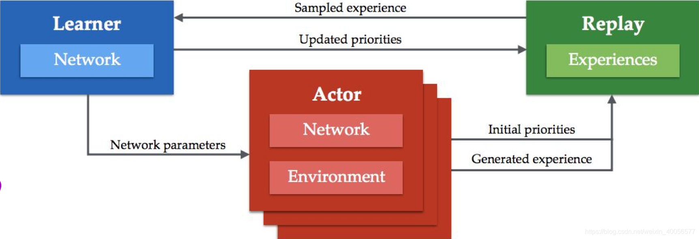

<!--
 * @version:
 * @Author:  StevenJokess（蔡舒起） https://github.com/StevenJokess
 * @Date: 2023-06-04 00:25:19
 * @LastEditors:  StevenJokess（蔡舒起） https://github.com/StevenJokess
 * @LastEditTime: 2023-09-14 22:32:15
 * @Description:
 * @Help me: make friends by a867907127@gmail.com and help me get some “foreign” things or service I need in life; 如有帮助，请赞助，失业3年了。
 * @TODO::
 * @Reference:
-->
# APE-X

只使用一个learner和一个Replay buffer，但是分布式的使用了多个Actor来生成数据，paper中实验使用了360个Actor（一个Actor一个CPU）。DeepMind产生专门做这个的想法主要是从Rainbow的研究中发现：Prioritization was found to be the most important ingredient contributing to the agent’s performance.

Replay的优先级对于性能影响是最大的，而之前的Prioritised Replay Buffer只用单一Actor来采集数据，效率偏低。那么这篇文章中，加上分布式，并且让每一个Actor都不完全一样，用\(\varepsilon -greedy\)采样时的\(\varepsilon \)不一样。这样可以更好的做explore，并且更全面的寻找优先级最高的replay来训练。

比以前方法大得多得多的Replay Buffer，毕竟同时用几百个actor来采集数据，充分挖掘了计算资源。这个本身可以大幅度加快训练速度。
通过不同的Actor得到不同优先级Priority的Replay，如上面所说，大幅度提升explore的能力，防止过拟合。这是为什么Ape-X效果提升的最主要原因。

整个算法也就是训练架构上发生改变，算法实质并没有变化。同时，由于使用Replay Buffer是Off-Policy独有，因此，这篇paper就在DQN和DDPG上进行改变验证。

如上图，

DQN、GORILA有Replay Buffer是off-line的，而A3C与IMPALA去掉了Replay Buffer是on-line的，而Ape-X又引入了Replay Buffer，此处称为Replay Experiences。

由图中可以看到，Ape-X重用了A3C的架构，只不过多了一个Replay Experiences，还有一个Priority Experience Replay。
IMPALA中多个Learner实际上也是为了增加Diversity，探索更大的状态空间，倒不如还是维持一个Replay Buffer，用$(s,a,r,s')$ 样本来冲淡一下轨迹的correlation，而且off-policy对样本利用率更高，因此Ape-X还是引回Replay Buffer的模块。

而且对Experience的Bellman Error来确定一个样本的重要性，实际上与TD Error差不多，虽然为每一个样本计算Bellman Error耗内存与计算资源，但效果好呀，知道哪些样本更重要一点。下面是目前为止分布式RL系统的性能对比图。[2]

多个actor，每个有自己的环境，并且可以产生experience，并将其写入一个共享的experience replay memory，并且能计算initial priorities
一个learner，从memory中sample，然后更新memory中的experience的priorities，并更新网络参数
每个actor的网络定期地从learner获取最新的网络参数

5.2 Actor的算法

procedure \(ACTOR(B, T)\) // 在environment instance中运行agent，并存储experiences
\(\theta_0\leftarrow LEARNER.PARAMETERS()\) // remote call以获取最新的网络参数
\(s_0\leftarrow ENVIRONMENT.INITIALIZE() \) // 从环境中获取初始状态
for t = 1 to T do
\(a_{t-1}\leftarrow \pi \theta _{t-1}(s_{t-1})\) // 使用当前policy选择一个动作
\(r_t,\gamma_t,s_t\leftarrow ENVIRONMENT.STEP(a_{t-1})\) // 在环境中执行这个动作
\(LOCALBUFFER.ADD((s_{t-1},a_{t-1},r_t,\gamma_t))\) // 将data放入local buffer中
if \(LOCALBUFFER.SIZE() \gt B\) then // 在一个后台线程中，定期地send data to replay
\(\tau \leftarrow LOCALBUFFER.GET(B)\) // 获取buffered data(例如，batch of multi-step transitions)
\(p \leftarrow COMPUTEPRIORITIES(\tau)\) // 计算experience的优先级（例如，绝对TD error）
\(REPLAY.ADD(\tau,p)\) // remote call以将experience加入replay memory中
endif
\(PERIODICALLY(\theta_t\leftarrow LEARNER.PARAMETERS())\) // 获取最新的网络参数
endfor
end procedure
5.3 Learner的算法
procedure \(LEARNER(T)\) // 使用从memory中sampled的batches来更新网络
\(\theta_0\leftarrow INITIALIZENETWORK()\)
for t = 1 to T do // 更新参数T次
\(id,\tau \leftarrow REPLAY.SAMPLE()\) // 在后台线程中sample一个 prioritized batch的transitions
\(l_t \leftarrow COMPUTELOSS(\tau;\theta_t)\) // Apply learning rule，例如double Q-learning或者DDPG
\(\theta_{t+1}\leftarrow UPDATEPARAMETERS(l_t;\theta_t)\)
\(p \leftarrow COMPUTEPRIORITIES()\) // 计算experience的优先级（例如，绝对TD error）【和Actor一样】
\(REPLAY.SETPRIORITY(id,p)\) // remote call以更新优先级
\(PERIODICALLY(REPLAY.REMOVETOFIT())\) // 从replay memory中删掉旧的experience
endfor
end procedure

Recurrent Replay Distributed DQN[1]

R2D2：两个R是Actor，Learner；两个D是Distributed DQN

[1]: https://deepreinforcementlearningbook.org/assets/pdfs/%E6%B7%B1%E5%BA%A6%E5%BC%BA%E5%8C%96%E5%AD%A6%E4%B9%A0(%E4%B8%AD%E6%96%87%E7%89%88-%E5%BD%A9%E8%89%B2%E5%8E%8B%E7%BC%A9).pdf
[2]: https://blog.csdn.net/weixin_40056577/article/details/104980197
[3]: https://blog.csdn.net/weixin_40056577/article/details/104980197

[1]: https://daiwk.github.io/posts/rl-distributed-rl.html#2-a3c
