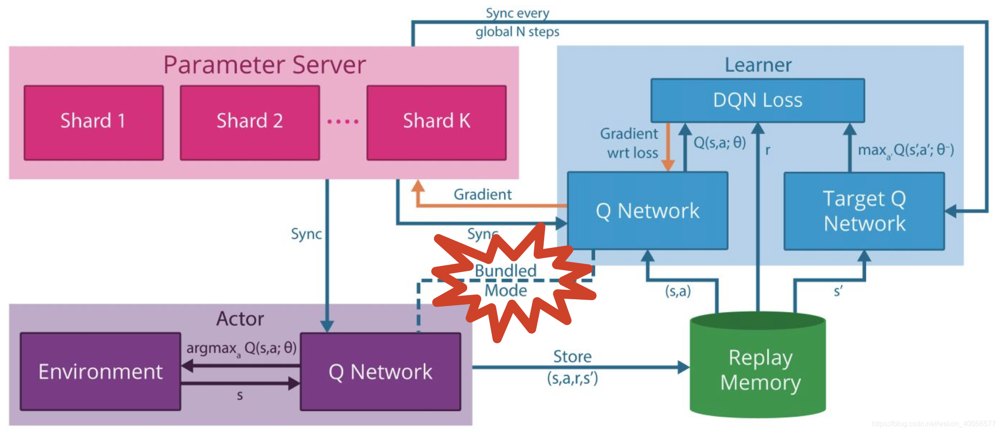

<!--
 * @version:
 * @Author:  StevenJokess（蔡舒起） https://github.com/StevenJokess
 * @Date: 2023-09-14 21:28:04
 * @LastEditors:  StevenJokess（蔡舒起） https://github.com/StevenJokess
 * @LastEditTime: 2023-09-14 21:28:24
 * @Description:
 * @Help me: make friends by a867907127@gmail.com and help me get some “foreign” things or service I need in life; 如有帮助，请资助，失业3年了。
 * @TODO::
 * @Reference:
-->
# GORILA

GORILA这里比DQN多了一个Parameter Sever，其它改了下名称，稍微说一下：

GORILA的四要素：Parameter Server、Learner、Actor、Replay Memory

1. Actor：Policy（此处为Q-Network）与环境交互，同样涉及探索与利用，而此处多了一个Bundled Mode即Actor的Policy与Learner中实时更新的Q-Network是捆绑的
1. Learner：Double Q-Network的结构、Loss与Gradient的计算
1. Replay Memory：在Actor与Learner之间接收样本与提供样本的样本池
1. Parameter Server：存储Q-Network中参数的Gradient变化，好处是可以让Q-Network进行回滚，并且可以通过多个Gradient（即历史信息）来使训练过程更加稳定。

[1]: https://blog.csdn.net/weixin_40056577/article/details/104980197
