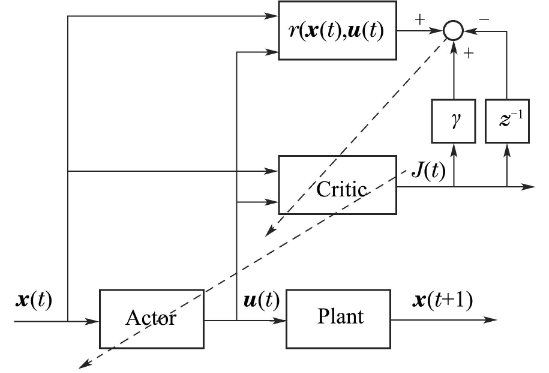

<!--
 * @version:
 * @Author:  StevenJokess（蔡舒起） https://github.com/StevenJokess
 * @Date: 2023-10-13 03:54:46
 * @LastEditors:  StevenJokess（蔡舒起） https://github.com/StevenJokess
 * @LastEditTime: 2023-10-13 04:02:40
 * @Description:
 * @Help me: make friends by a867907127@gmail.com and help me get some “foreign” things or service I need in life; 如有帮助，请资助，失业3年了。
 * @TODO::
 * @Reference:
-->
# 自适应动态规划(adaptive dynamic programming）

自适应动态规划(adaptive dynamic programming,ADP) 由Werbos[10]于20 世纪70 年代提出, 在Bertse-kas[13]、Lewis[15]、Liu[33]、Zhang[34]等学者的努力下日益发展成熟. 自适应动态规划是一种针对连续状态空间的最优控制方法. 对于比较复杂的问题, 它们的
状态空间和动作空间往往是连续的, 规模较大. 由于维度爆炸的缘故, 不能采用传统的查表法来得到性能函数, 此时需要使用函数逼近器, 例如线性函数逼近器和神经网络逼近器等工具来逼近性能函数. 自适应动态规划通过构建动作网络(actor) 和评价网络(critic)两个网络来处理复杂的强化学习问题. 在状态x(t)时, 动作网络用于选择动作u(t), 评价网络输出值函数对动作网络的动作进行评价, 并对动作网络进行调整, 最终通过被控系统(plant) 输出下一时刻状态x(t + 1). 其结构如图2所示.

近年来, 自适应动态规划在基础理论和工业领域应用等方面取得了很多研究成果. 离散时间非线性系统[33,35]和连续状态系统[36–37]的最优控制是自适应动态规划的强项. Jiang等将鲁棒控制和自适应动态规划结合, 将自适应动态规划的应用扩展到了不确定非线性系统[38]. Wu等提出了在线同步策略更新算法, 通过借助神经网络, 成功求解了非线性H∞控制问题中的HJI方程[39]. Zhao等结合自适应动态规划和经验回放技术解决了模型未知的非零和博弈问题，并证明了系统稳定性[40]. 在工业领域的应用有机器人[41–42]、游戏[43]和汽车自适应巡航控制[44]等. Wu等对自适应动态规划在机器人领域的应用做了综述[41]. Zhao等成功将自适应动态规划应用到五子棋游戏中, 并达到
了和商用五子棋算法相媲美的境地[43].

[1]: https://cdn.jsdelivr.net/gh/it-ebooks-0/it-ebooks-2018-08to10/%E6%B7%B1%E5%BA%A6%E5%BC%BA%E5%8C%96%E5%AD%A6%E4%B9%A0%E7%BB%BC%E8%BF%B0%EF%BC%9A%E5%85%BC%E8%AE%BA%E8%AE%A1%E7%AE%97%E6%9C%BA%E5%9B%B4%E6%A3%8B%E7%9A%84%E5%8F%91%E5%B1%95.pdf
