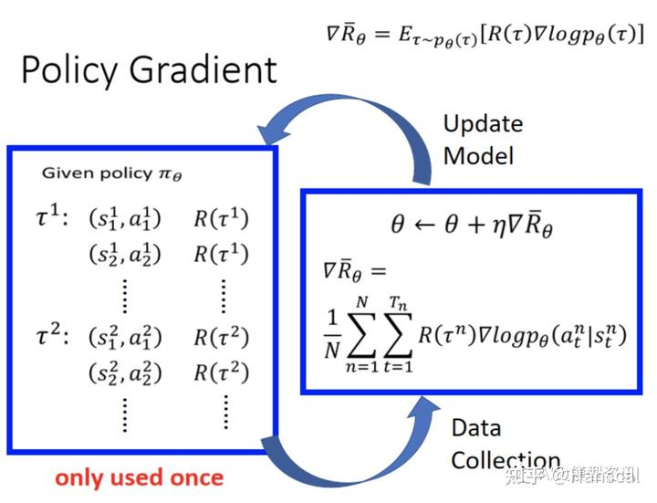
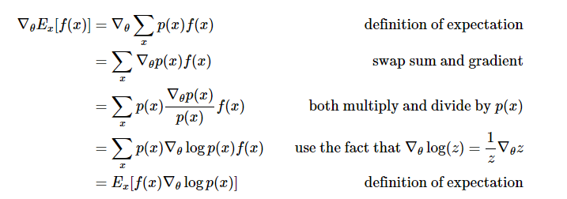

<!--
 * @version:
 * @Author:  StevenJokess（蔡舒起） https://github.com/StevenJokess
 * @Date: 2023-02-24 00:06:24
 * @LastEditors:  StevenJokess（蔡舒起） https://github.com/StevenJokess
 * @LastEditTime: 2023-11-01 21:48:59
 * @Description:
 * @Help me: 如有帮助，请资助，失业3年了。
 * @TODO::
 * @Reference:https://hrl.boyuai.com/chapter/2/%E7%AD%96%E7%95%A5%E6%A2%AF%E5%BA%A6%E7%AE%97%E6%B3%95
-->
# 策略梯度算法

## 简介

本书之前介绍的 Q-learning、DQN 及 DQN 改进算法都是**基于价值**（value-based）的方法，其中 Q-learning 是处理有限状态的算法，而 DQN 可以用来解决连续状态的问题。在强化学习中，除了基于值函数的方法，还有一支非常经典的方法，那就是**基于策略**（policy-based）的方法。

两者作对比：

- 基于值函数的方法主要是学习值函数，然后根据值函数导出一个策略，学习过程中并不存在一个显式的策略；
- 基于策略的方法则是**直接显式地学习一个目标策略**。

策略梯度是基于策略的方法的基础，本章从策略梯度算法说起。

## 策略梯度（Policy gradient）

### 组成部分

策略梯度方法有三个基本组成部分：演员 (Actor)、环境和奖励函数，如下图所示，演员可以采取各种可能的动作与环境交互，在交互的过程中环境会依据当前环境状 态和演员的动作给出相应的奖励 (Reward)，并修改自身状态。演员的目的就在于调整策略 (Policy)，即根据环境信息决定采取什么动作以最大化奖励。​​

### 策略参数化以便优化

基于策略的方法首先需要将策略参数化。假设目标策略是一个随机性策略，并且处处可微，其中是对应的参数。我们可以用一个线性模型或者神经网络模型来为这样一个策略函数建模，输入某个状态，然后输出一个动作的概率分布。

### 设立目标——最大化期望回报的最优策略

我们的目标是要寻找一个最优策略，即用该策略能最大化在环境中的期望回报。我们将策略学习的目标函数定义为

$$
J(\theta)=\mathbb{E}_{s_0}\left[V^{\pi_\theta}\left(s_0\right)\right]
$$

其中， $s_0$ 表示初始状态。现在有了目标函数，我们将目标函数对策略 $\theta$ 求导，得到导数后，就可以用梯度上升方法来最大化这个目标函数，从而得到最优策略。

我第 3 章讲解过策略 $\pi$ 下的状态访问分布，在此用 $\nu^\pi$ 表示。然后我们对目标函数求梯度，可以得到如下式子，更详细的推导过程将在 $9.6$ 节给出。

$$
\begin{aligned}
\nabla_\theta J(\theta) & \propto \sum_{s \in S} \nu^{\pi_\theta}(s) \sum_{a \in A} Q^{\pi_\theta}(s, a) \nabla_\theta \pi_\theta(a \mid s) \\
& =\sum_{s \in S} \nu^{\pi_\theta}(s) \sum_{a \in A} \pi_\theta(a \mid s) Q^{\pi_\theta}(s, a) \frac{\nabla_\theta \pi_\theta(a \mid s)}{\pi_\theta(a \mid s)} \quad  \text{(乘以 $\frac{\pi_\theta(a \mid s)}{\pi_\theta(a \mid s)}$, 并重排序[4])} \\
& =\mathbb{E}_{\pi_\theta}\left[Q^{\pi_\theta}(s, a) \nabla_\theta \ln \pi_\theta(a \mid s)\right] \quad  \text{$\left(\frac{d}{d x} \ln f(x)=\frac{f^{\prime}(x)}{f(x)}\right)$} \\
& = \frac{1}{N} \sum_{n=1}^N Q^{\pi_\theta}(s^n, a^n) \nabla_\theta \ln \pi_\theta\left(a^n \mid s^n\right) \quad  \text{（N是采样轨迹 $\tau$  （trajectory samples）的数量）[5],第n个轨迹 $\tau^n$ 的状态-动作为 $(s^n, a^n)$} \\
& = \frac{1}{N} \sum_{n=1}^N \sum_{t=1}^{T_n} Q^{\pi_\theta}(s^n_t, a^n_t) \nabla \ln \pi_\theta\left(a_t^n \mid s_t^n\right)
\end{aligned}
$$

这个梯度可以用来更新策略，且按回合（episode）更新。[2]需要注意的是，因为上式中期望的下标是  $\pi_\theta$ ，所以策略梯度算法为**在线策略**（on-policy）算法，即必须使用当前策略 $\pi_\theta$ 采样得到的数据来计算梯度。直观理解一下策略梯度这个公式，可以发现在每一个状态下，梯度的修改是*让策略更多地去采样到带来较高 $Q$ 值的动作更少地去采样到带来较低 $Q$ 值的动作*，可以说是不断试错的公式化，如图 9-1 所示。

在计算策略梯度的公式中，我们需要用到 $Q^{\pi_\theta}(s, a)$ ，可以用多种方式对它进行估计。

接下来要介绍的 REINFORCE 算法便是采用了**蒙特卡洛方法**来估计 $Q^{\pi_\theta}(s, a)$ ，

对于一个有限步数的环境来说， REINFORCE 算法中的策略梯度为：

$\nabla_\theta J(\theta)=\mathbb{E}_{\pi_\theta}\left[\sum_{t=0}^{T-1}\left(\sum_{t^{\prime}=t}^T \gamma^{t^{\prime}-t} r_{t^{\prime}+1}\right) \nabla_\theta \log \pi_\theta\left(a_t \mid s_t\right)\right]$

其中，$T-1$ 是和环境交互的最大步数。例如，在车杆环境下，$T-1 = 200$。

## REINFORCE

REINFORCE 算法的具体算法流程如下：

- 随机初始化策略参数 $\theta$
  - for 序列 $e=1 \rightarrow E$ do :
    - 用当前策略 $\pi_\theta$ 采样轨迹 $\left\{s_1, a_1, r_2, s_2, a_2, r_3, \ldots s_{T-1}, a_{T-1}, r_T\right\}$
    - 计算当前轨迹每个时刻 $t$ 往后到 $T-1$ 的回报 $\sum_{t^{\prime}=t}^T \gamma^{t^{\prime}-t} r_{t^{\prime}}$ ，记为 $\psi_t$
    - 对 $\theta$ 进行更新， $\theta=\theta+\alpha \sum_t^T \psi_t \nabla_\theta \log \pi_\theta\left(a_t \mid s_t\right)$
- end for

这便是 REINFORCE 算法的全部流程了。接下来让我们来用代码来实现它，看看效果如何吧！

## REINFORCE 代码实践

我们在车杆环境中进行 REINFORCE 算法的实验。

首先定义策略网络PolicyNet，其输入是某个状态，输出则是该状态下的动作概率分布，这里采用在离散动作空间上的softmax()函数来实现一个可学习的多项分布（multinomial distribution）。

再定义我们的 REINFORCE 算法。在函数`take_action()`函数中，我们通过动作概率分布对离散的动作进行采样。在更新过程中，我们按照算法将损失函数写为策略回报的负数，即，对求导后就可以通过梯度下降来更新策略。

定义好策略，我们就可以开始实验了，看看 REINFORCE 算法在车杆环境上表现如何吧！

在 CartPole-v0 环境中，满分就是 200 分，我们发现 REINFORCE 算法效果很好，可以达到 200 分。接下来我们绘制训练过程中每一条轨迹的回报变化图。由于回报抖动比较大，往往会进行平滑处理。

可以看到，随着收集到的轨迹越来越多，REINFORCE 算法有效地学习到了最优策略。不过，相比于前面的 DQN 算法，REINFORCE 算法使用了更多的序列，这是因为 REINFORCE 算法是一个在线策略算法，之前收集到的轨迹数据*不会被再次利用。*此外，REINFORCE 算法的性能也有一定程度的波动，这主要是因为每条采样轨迹的回报值波动比较大，这也是 REINFORCE 算法主要的不足。

可以用DP部分观测的MDP[3]

## PG的改进技巧

### PG的实现技巧1：添加基线（baseline）

REINFORCE算法使用了MC方法，因而具有了一个明显的缺点，那就是**方差太大**（后面的 R_{k} 从t时刻到n时刻都是随机变量，随机变量维度高，导致的方差大[12]）。

基线（baseline）则是一种可以减小其方差的办法。具体做法就是为动作价值函数找到一个基线与之对比。

$$
\nabla J(\theta)\propto\sum_s \mu(s)\sum_a (q_\pi(s,a)-b(s))\nabla\pi(a|s,\theta)
$$

只要基线与动作无关(即与 $\theta$ 无关)，便可以保证上式成立,因为减的项为零。

$$
\sum_a b(s)\nabla\pi(a|s,\theta)=b(s)\nabla\sum_a \pi(a|s,\theta)=b(s)\nabla1 = 0
$$

合理的 $b(s)$ 可以有效的减小使用MC方法估计的梯度的方差。

到这里，相信大家都可以看出 $q_\pi(s,a)-b(s)$ 这一项实际上就是优势（advantage）的雏形了。

Advantage怎么计算：

早先的时候，有人把样本中的平均收益作为baseline使用，这样也能起到一定的效果。然而对于马尔可夫过程来说，baseline应该根据状态变化的，对于所有动作价值都大的状态baseline应该较大，反之亦然。

一个自然能想到baseline便是状态价值函数 v(s) ，实际上在A2C,A3C等算法中，正是使用了q_\pi(s,a)-v(s)作为advantage，也取得了很好的效果。（顺带一提Dueling DQN中的也是专门有一个网络输出来估计这个advantage）。

然而，伯克利的大神们结合了 TD(\lambda) 的思想，提出了估计更加平滑，方差更为可控的advantage:GAE(General Advantage Estimation) .

### PG的实现技巧2：用折扣因子$\gamma$，来异质化奖励

异质化奖励， $R_{\theta}^{target} = \sum_{i=1}^N\sum_{t=1}^T (G_t^i -b) log p_{\theta}(a_t^i|s_t^i) $，其中 $G_t-b$ 可以设置为 $G_t-b = Q(s_t,a_t)-V(s_t) = A(s_t,a_t)$ ，并用评论员网络拟合 $A(s_t,a_t)$ 。

## 优缺点：

缺点：

- 只有在能够对序列采样的回合制（episodic）环境下使用。[8]
- 对步长大小的选择非常敏感：
  - 当迭代步长太小，则收敛缓慢，学习效率慢。因为样本利用率低，由于每次更新需要根据一个策略采集一条完整的轨迹（即,由于蒙特卡洛的特性，只有到终止状态的序列，才能被采样），并计算这条轨迹上的回报，而且每次更新后就要将这些样本扔掉，重新采样，再实现更新。[7] 后面会介绍用重要性采样来改良。
  - 当迭代步长太小，则难以收敛，性能差。由于利用策略梯度法计算的结果方差会很大。学习困难，由于 agent 在一个序列中会采取很多动作，我们很难说哪个动作对最后结果是有用的。
- 采样效率低，PG 采用蒙特卡洛采样方式，每次基于当前的策略对环境采样一个 episode 数据，然后基于这些数据更新一次策略，这个过程中数据仅仅被利用了一次就扔掉了，相比于 DQN 等离线学习算法，PG 这种更新方式是对数据的极大浪费。具体来说，PG 算法只有一个 agent，他与环境互动，然后学习更新， 这个过程中的policy 都是同一个。因此，当我们更新参数之后，之前计算的基于策略 $\pi_{\theta}$ 的概率分布会发生变化，目标网络的回报 $R_{\theta}^{target} =E_{\tau\sim \pi_{\theta}}[R(\tau) logp_{\theta}(\tau)]$ 也改变了。之前采样出来的数据就都作废而不能用了，换句话说，过程中的数据都只能用一次，需要重新去采样。这就造成了 policy gradient 会花很多时间在采样数据上，因为所有的数据都只能更新一次，更新一次之后就要重新采样。因为 $R_{\theta}^{target} =E_{\tau\sim \pi_{\theta}}[R(\tau) logp_{\theta}(\tau)]$，[9]

## 小结：

REINFORCE 算法是策略梯度乃至强化学习的典型代表，智能体根据当前策略直接和环境交互，通过采样得到的轨迹数据直接计算出策略参数的梯度，进而更新当前策略，使其向最大化策略期望回报的目标靠近。这种学习方式是典型的从交互中学习，并且其优化的目标（即策略期望回报）正是最终所使用策略的性能，这比基于价值的强化学习算法的优化目标（一般是时序差分误差的最小化）要更加直接。 REINFORCE 算法理论上是能保证局部最优的，它实际上是借助蒙特卡洛方法采样轨迹来估计动作价值，这种做法的一大优点是可以得到无偏的梯度。但是，正是因为使用了蒙特卡洛方法，REINFORCE 算法的梯度估计的方差很大，可能会造成一定程度上的不稳定，这也是第 10 章将介绍的 Actor-Critic 算法要解决的问题。

## 问题测验

## 附录：问题答案

## 附录：策略梯度定理的证明

TODO: 强化学习中“策略梯度定理”的规范表达、推导与讨论 - Beaman的文章 - 知乎
https://zhuanlan.zhihu.com/p/490373525

策略梯度定理是强化学习中的重要理论。

本节我们来证明

$$
\nabla_\theta J(\theta) \propto \sum_{s \in S} \nu^{\pi_\theta}(s) \sum_{a \in A} Q^{\pi_\theta}(s, a) \nabla_\theta \pi_\theta(a \mid s) 。
$$

先从状态价值函数的推导开始：

$$
\begin{aligned}
\nabla_\theta V^{\pi_\theta}(s) & =\nabla_\theta\left(\sum_{a \in A} \pi_\theta(a \mid s) Q^{\pi_\theta}(s, a)\right) \\
& =\sum_{a \in A}\left(\nabla_\theta \pi_\theta(a \mid s) Q^{\pi_\theta}(s, a)+\pi_\theta(a \mid s) \nabla_\theta Q^{\pi_\theta}(s, a) \right) \\
& =\sum_{a \in A}\left(\nabla_\theta \pi_\theta(a \mid s) Q^{\pi_\theta}(s, a)+\pi_\theta(a \mid s) \nabla_\theta \sum_{s^{\prime}, r} p\left(s^{\prime}, r \mid s, a\right)\left(r+\gamma V^{\pi_\theta}\left(s^{\prime}\right)\right)\right) \\
& =\sum_{a \in A}\left(\nabla_\theta \pi_\theta(a \mid s) Q^{\pi_\theta}(s, a)+\gamma \pi_\theta(a \mid s) \sum_{s^{\prime}, r} p\left(s^{\prime}, r \mid s, a\right) \nabla_\theta V^{\pi_\theta}\left(s^{\prime}\right)\right) \\
& =\sum_{a \in A}\left(\nabla_\theta \pi_\theta(a \mid s) Q^{\pi_\theta}(s, a)+\gamma \pi_\theta(a \mid s) \sum_{s^{\prime}} p\left(s^{\prime} \mid s, a\right) \nabla_\theta V^{\pi_\theta}\left(s^{\prime}\right)\right)
\end{aligned}
$$

为了简化表示，我们让 $\phi(s)=\sum_{a \in A} \nabla_\theta \pi_\theta(a \mid s) Q^{\pi_\theta}(s, a)$ （+号前面的部分）。

定义 $d^{\pi_\theta}(s \rightarrow x, k)$ 为策略 $\pi$ 从状态 $s$ 出发 $k$ 步后到达状态 $x$ 的概率，例如： $d^{\pi_\theta}\left(s^{\prime} \rightarrow s^{\prime \prime}, 1\right) = \sum_a \pi_\theta(a \mid s) P\left(s^{\prime} \mid s, a\right)$。

我们继续推导:

$$
\begin{aligned}
\nabla_\theta V^{\pi_\theta}(s) & =\phi(s)+\gamma \sum_a  \left(\pi_\theta(a \mid s) \sum_{s^{\prime}} P\left(s^{\prime} \mid s, a\right) \nabla_\theta V^{\pi_\theta}\left(s^{\prime}\right) \right) \\
& =\phi(s)+\gamma \sum_a \left(\sum_{s^{\prime}} \pi_\theta(a \mid s) P\left(s^{\prime} \mid s, a\right)  \nabla_\theta V^{\pi_\theta}\left(s^{\prime}\right) \right)\\
& =\phi(s)+\gamma \sum_a \left(\sum_{s^{\prime}} \pi_\theta(a \mid s) P\left(s^{\prime} \mid s, a\right) \right) \nabla_\theta V^{\pi_\theta}\left(s^{\prime}\right) \\
& =\phi(s)+\gamma \sum_{s^{\prime}} \left(\sum_a \pi_\theta(a \mid s) P\left(s^{\prime} \mid s, a\right) \right) \nabla_\theta V^{\pi_\theta}\left(s^{\prime}\right) \\
& =\phi(s)+\gamma \sum_{s^{\prime}} d^{\pi_\theta}\left(s \rightarrow s^{\prime}, 1\right) \nabla_\theta V^{\pi_\theta}\left(s^{\prime}\right) \\
& =\phi(s)+\gamma \sum_{s^{\prime}} d^{\pi_\theta}\left(s \rightarrow s^{\prime}, 1\right)\left[\phi\left(s^{\prime}\right)+\gamma \sum_{s^{\prime \prime}} d^{\pi_\theta}\left(s^{\prime} \rightarrow s^{\prime \prime}, 1\right) \nabla_\theta V^{\pi_\theta}\left(s^{\prime \prime}\right)\right] \\
& =\phi(s)+\gamma \sum_{s^{\prime}} d^{\pi_\theta}\left(s \rightarrow s^{\prime}, 1\right) \phi\left(s^{\prime}\right)+\gamma^2 \sum_{s^{\prime \prime}} d^{\pi_\theta}\left(s \rightarrow s^{\prime \prime}, 2\right) \nabla_\theta V^{\pi_\theta}\left(s^{\prime \prime}\right) \\
& =\phi(s)+\gamma \sum_{s^{\prime}} d^{\pi_\theta}\left(s \rightarrow s^{\prime}, 1\right) \phi\left(s^{\prime}\right)+\gamma^2 \sum_{s^{\prime \prime}} d^{\pi_\theta}\left(s \rightarrow s^{\prime \prime}, 2\right) \phi\left(s^{\prime \prime}\right)+\gamma^3 \sum_{s^{\prime \prime \prime}} d^{\pi_\theta}\left(s \rightarrow s^{\prime \prime \prime}, 3\right) \nabla_\theta V^{\pi_\theta}\left(s^{\prime \prime \prime}\right) \\
& =\cdots \\
& =\sum_{x \in S} \sum_{k=0}^{\infty} \gamma^k d^{\pi_\theta}(s \rightarrow x, k) \phi(x)
\end{aligned}
$$

定义 $\eta(s)=\mathbb{E}_{s_0}\left[\sum_{k=0}^{\infty} \gamma^k d^{\pi_\theta}\left(s_0 \rightarrow s, k\right)\right]$。我的解释：累加中，从起始状态 $s_0$ 出不同的步数到达状态 $s$ 的概率，再乘以不同步数的折扣因子。累加的目的是为了计算起始状态出发，所有到达状态 $s$ 的可能，其所需的平均步数。再期望，即表示起始状态出发，所有到达状态 $s$ 的可能，其所需的平均步数的期望值。这个量通常用于评估在一个MDP中从状态 $s_0$ 到达另一个状态 $s$ 的难易程度。

至此，回到目标函数：

$$
\begin{aligned}
\nabla_\theta J(\theta) & =\nabla_\theta \mathbb{E}_{s_0}\left[V^{\pi_\theta}\left(s_0\right)\right] \\
& =\sum_s \mathbb{E}_{s_0}\left[\sum_{k=0}^{\infty} \gamma^k d^{\pi_\theta}\left(s_0 \rightarrow s, k\right)\right] \phi(s) \\
& =\sum_s \eta(s) \phi(s) \\
& =\left(\sum_s \eta(s)\right) \sum_s \frac{\eta(s)}{\sum_s \eta(s)} \phi(s) \\
& \propto \sum_s \frac{\eta(s)}{\sum_s \eta(s)} \phi(s) \\
& =\sum_s \nu^{\pi_\theta}(s) \sum_a Q^{\pi_\theta}(s, a) \nabla_\theta \pi_\theta(a \mid s)
\end{aligned}
$$

其中 $\nu^\pi$ 表示状态访问分布。

> 第三章介绍的：$\nu^\pi(s)=(1-\gamma) \sum_{t=0}^{\infty} \gamma^t P_t^\pi(s)$。
> 其中， $P_t^\pi(s)$ 表示采取策略使得智能体在 t 时刻状态为 s 的概率。$1-\gamma$ 是用来使得概率加和为 1 的归一化因子。状态访问概率**表示一个策略和 MDP 交互会访问到的状态的分布。**

证明完毕!

？？？

![数学推导[5]](../../img/PG_math.png)

假设 $\eta(s)$ 是在状态s下的某种计数，例如在训练过程中该状态被访问的次数。那么，$\sum_s \eta(s)$ 表示所有状态的计数之和。因此， $\frac{\eta(s)}{\sum_s \eta(s)}$  可以解释为状态s被访问的概率，即状态s在所有状态中的比例。

另一方面，$\nu^{\pi_\theta}(s)$ 表示在状态s中根据策略 $pi_\theta$ 采取行动的状态s的价值函数。

因此，如果我们将这两个概率定义为相等，即 $\frac{\eta(s)}{\sum_s \eta(s)} = \nu^{\pi_\theta}(s)$，那么我们可以认为该策略下状态s的访问次数与在该状态下采取任何行动的概率成比例。这是一个常见的假设，被称为“状态的重要性采样权重”。

https://hrl.boyuai.com/chapter/2/%E7%AD%96%E7%95%A5%E6%A2%AF%E5%BA%A6%E7%AE%97%E6%B3%95#96-%E6%89%A9%E5%B1%95%E9%98%85%E8%AF%BB%EF%BC%9A%E7%AD%96%E7%95%A5%E6%A2%AF%E5%BA%A6%E8%AF%81%E6%98%8E

[1]: https://hrl.boyuai.com/chapter/2/%E7%AD%96%E7%95%A5%E6%A2%AF%E5%BA%A6%E7%AE%97%E6%B3%95
[2]: https://www.cnblogs.com/kailugaji/p/16140474.html
[3]: http://rail.eecs.berkeley.edu/deeprlcourse/static/slides/lec-5.pdf
[4]: https://fanpu.io/blog/2022/deriving-the-policy-gradient-update/
[5]: https://www.bilibili.com/video/BV18M411c7uL/?spm_id_from=pageDriver&vd_source=bca0a3605754a98491958094024e5fe3
[6]: https://zhuanlan.zhihu.com/p/271000523
[7]: https://weread.qq.com/web/reader/62332d007190b92f62371aek81232fb025f812b4ba28a23
[8]: http://www.icdai.org/ibbb/2019/ID-0004.pdf
[9]: https://zhuanlan.zhihu.com/p/631505020#Chapter3%EF%BC%9A%E8%A1%A8%E6%A0%BC%E5%9E%8B%E6%96%B9%E6%B3%95

TODO: 看不懂证明。。
[10]: https://lilianweng.github.io/posts/2018-02-19-rl-overview/#policy-gradient-theorem
[11]: https://zhuanlan.zhihu.com/p/343943792
[12]: https://zhuanlan.zhihu.com/p/437626120

---

Or analytically,
$$
\mathcal{J}(\theta)=\mathbb{E}_{\pi \theta}[r]=\sum_{s \in \mathcal{S}} d_{\pi \theta}(s) \sum_{a \in \mathcal{A}} \pi(a \mid s ; \theta) R(s, a)
$$
Actually we have nice theoretical support for (replacing $d($.$) with d_\pi($.$) ):$
事实上，我们有很好的理论支持（用 $d_\pi($.$) 替换 d($.$) ) :$
$$
\mathcal{J}(\theta)=\sum_{s \in \mathcal{S}} d_{\pi \theta}(s) \sum_{a \in \mathcal{A}} \pi(a \mid s ; \theta) Q_\pi(s, a) \propto \sum_{s \in \mathcal{S}} d(s) \sum_{a \in \mathcal{A}} \pi(a \mid s ; \theta) Q_\pi(s, a)
$$

Check Sec 13.1 in Sutton \& Barto (2017) for why this is the case.
查看萨顿\& Barto（2017）的第13.1节，了解为什么会出现这种情况。
Then,

$$
\begin{aligned}
\mathcal{J}(\theta) & =\sum_{s \in \mathcal{S}} d(s) \sum_{a \in \mathcal{A}} \pi(a \mid s ; \theta) Q_\pi(s, a) \\
\nabla \mathcal{J}(\theta) & =\sum_{s \in \mathcal{S}} d(s) \sum_{a \in \mathcal{A}} \nabla \pi(a \mid s ; \theta) Q_\pi(s, a) \\
& =\sum_{s \in \mathcal{S}} d(s) \sum_{a \in \mathcal{A}} \pi(a \mid s ; \theta) \frac{\nabla \pi(a \mid s ; \theta)}{\pi(a \mid s ; \theta)} Q_\pi(s, a) \\
& =\sum_{s \in \mathcal{S}} d(s) \sum_{a \in \mathcal{A}} \pi(a \mid s ; \theta) \nabla \ln \pi(a \mid s ; \theta) Q_\pi(s, a) \\
& =\mathbb{E}_{\pi \theta}\left[\nabla \ln \pi(a \mid s ; \theta) Q_\pi(s, a)\right]
\end{aligned}
$$
This result is named "Policy Gradient Theorem" which lays the theoretical foundation for various policy gradient algorithms:

这个结果被命名为“策略梯度定理"，为各种策略梯度算法奠定了理论基础:

$$
\nabla \mathcal{J}(\theta)=\mathbb{E}_{\pi \theta}\left[\nabla \ln \pi(a \mid s, \theta) Q_\pi(s, a)\right]
$$

---

## 附录：

Policy Gradient Theorem有以下两种形式（代码实现常用形式2）：

$$
\nabla_{\theta} J(\theta)= \underset{\substack{s_{t} \sim \operatorname{Pr}\left(s_{0} \rightarrow s_{t}, t, \pi\right) \\ a_{t} \sim \pi\left(a_{t} \mid s_{t}\right)}}{E}\left[\sum_{t=0}^{\infty}\gamma^{t} q_{\pi}\left(s_{t}, a_{t}\right) \nabla \ln \pi\left(a_{t} \mid s_{t}\right)\right]\\ \tag{形式1}
$$

$$
\nabla_{\theta} J(\theta)\propto\underset{\substack{s \sim D^{\pi} \\ a \sim \pi(a \mid s)}}{E}\left[q_{\pi_{\theta}}(s, a) \nabla_{\theta} \ln \pi_{\theta}(a \mid s)\right]\tag{形式2}
$$

现对这两种形式进行推导。首先，定义强化学习的优化目标：

$$
J(\theta) \doteq v_{\pi_{\theta}}\left(s_{0}\right)\\
$$

其中， v_{\pi_\theta} 是 \pi_\theta 的真实价值函数。注意，后文求梯度都是对 \theta 进行，所涉及的策略都由 \theta 确定，为了推导的简洁性，将 \nabla_{\theta}、v_{\pi_\theta}、q_{\pi_\theta} 分别简写为 \nabla、v_{\pi}、q_{\pi} 。

对目标函数求梯度有：

$$
\begin{aligned}
&\nabla_{\theta}J(\theta)=\nabla_{\theta} v_{\pi_{\theta}}\left(s_{0}\right) =\nabla\left[\sum_{a_{0}} \pi\left(a_{0} \mid s_{0}\right) q_{\pi}\left(s_{0}, a_{0}\right)\right] \\
&=\sum_{a_{0}}\left[\nabla \pi\left(a_{0} \mid s_{0}\right) q_{\pi}\left(s_{0}, a_{0}\right)+\pi\left(a_{0} \mid s_{0}\right) \nabla q_{\pi}\left(s_{0}, a_{0}\right)\right] \\
&=\sum_{a_{0}}\left[\nabla \pi\left(a_{0} \mid s_{0}\right) q_{\pi}\left(s_{0}, a_{0}\right)+\pi\left(a_{0} \mid s_{0}\right) \nabla \sum_{s_{1}, r_{1}} p\left(s_{1}, r_{1} \mid s_{0}, a_{0}\right)\left(r_{1}+\gamma v\left(s_{1}\right)\right)\right] \\
&=\sum_{a_{0}} \nabla \pi\left(a_{0} \mid s_{0}\right) q_{\pi}\left(s_{0}, a_{0}\right)+\sum_{a_{0}} \pi\left(a_{0} \mid s_{0}\right) \sum_{s_{1}} p\left(s_{1} \mid s_{0}, a_{0}\right) \cdot \gamma \nabla v\left(s_{1}\right) \\
& \ \ \ \ \ \ \ \ \ \ \ \ \ \ \ \#再将\nabla v(s_{1})展开 \\
&=\sum_{a_{0}} \nabla \pi\left(a_{0} \mid s_{0}\right) q_{\pi}\left(s_{0}, a_{0}\right)\\ & \ \ \ \ \ +\sum_{a_{0}} \pi\left(a_{0} \mid s_{0}\right) \sum_{s_{1}} p\left(s_{1} \mid s_{0}, a_{0}\right) \cdot \gamma \sum_{a_{1}} \nabla \pi\left(a_{1} \mid s_{1}\right) q_{\pi}\left(s_{1}, a_{1}\right) \\
& \ \ \ \ \ +\sum_{a_{0}} \pi\left(a_{0} \mid s_{0}\right) \sum_{s_{1}} p\left(s_{1} \mid s_{0}, a_{0}\right) \cdot \gamma \sum_{a_{1}} \pi\left(a_{1} \mid s_{1}\right) \sum_{s_{2}} p\left(s_{2} \mid s_{1}, a_{1}\right) \gamma \nabla v\left(s_{2}\right) \\
&=\sum_{a_{0}} \nabla \pi\left(a_{0} \mid s_{0}\right) q_{\pi}\left(s_{0}, a_{0}\right) \\
& \ \ \ \ \ +\sum_{a_{0}} \pi\left(a_{0} \mid s_{0}\right) \sum_{s_{1}} p\left(s_{1} \mid s_{0}, a_{0}\right) \cdot \gamma \sum_{a_{1}} \nabla \pi\left(a_{1} \mid s_{1}\right) q_{\pi}\left(s_{1}, a_{1}\right)+\cdots \\
&=\sum_{s_{0}} \operatorname{Pr}\left(s_{0} \rightarrow s_{0}, 0, \pi\right) \sum_{a_{0}} \nabla \pi\left(a_{0} \mid s_{0}\right) \gamma^{0} q_{\pi}\left(s_{0}, a_{0}\right)\\
& \ \ \ \ \ +\sum_{s_{1}} \operatorname{Pr}\left(s_{0} \rightarrow s_{1}, 1, \pi\right) \sum_{a_{1}} \nabla \pi\left(a_{1} \mid s_{1}\right) \gamma^{1} q_{\pi}\left(s_{1}, a_{1}\right)+\cdots \\ &=\sum_{s_{0}} \operatorname{Pr}\left(s_{0} \rightarrow s_{0}, 0, \pi\right) \sum_{a_{0}} \pi\left(a_{0} \mid s_{0}\right)\left[\gamma^{0} q_{\pi}\left(s_{0}, a_{0}\right) \nabla \ln \pi\left(a_{0} \mid s_{0}\right)\right]+\\
&\ \ \ \ \ \sum_{s_{1}} \operatorname{Pr}\left(s_{0} \rightarrow s_{1}, 1, \pi\right) \sum_{a_{1}} \pi\left(a_{1} \mid s_{1}\right)\left[\gamma^{1} q_{\pi}\left(s_{1}, a_{1}\right) \nabla \ln \pi\left(a_{1} \mid s_{1}\right)\right]+\cdots \\
&=\sum_{t=0}^{\infty} \sum_{s_{t}} \operatorname{Pr}\left(s_{0} \rightarrow s_{t}, t, \pi\right) \sum_{a_{t}} \pi\left(a_{t} \mid s_{t}\right)\left[\gamma^{t} q_{\pi}\left(s_{t}, a_{t}\right) \nabla \ln \pi\left(a_{t} \mid s_{t}\right)\right] \\
\end{aligned}
$$

上面推导过程中，
- $p\left(s_{1}, r_{1} \mid s_{0}, a_{0}\right)$ 是环境转移概率；
- $\operatorname{Pr}\left(s_{0} \rightarrow x, t, \pi\right)$ 表示从状态 s_0 出发，在策略 $\pi$ 的作用下经过 t 步到达状态 x 的概率，如 $$\operatorname{Pr}\left(s_{0} \rightarrow s_{0}, 0, \pi\right)=1, \ \ \ \ \operatorname{Pr}\left(s_{0} \rightarrow s_{1}, 1, \pi\right)=\sum_{a_0}{\pi(a_0|s_0)p(s_1|s_0,a_0)}$$
- 同时，我们用到了 $\nabla \pi\left(a\mid s\right)=\pi\left(a\mid s\right) \nabla \ln \pi\left(a\mid s\right)$ 这一恒等变换；
- 在第4行到第5行那里，我们对 \nabla v(s_1) 进行了如同第1行到第4行对 \nabla v(s_0) 的展开；
- 在第5行到第6行那里，我们对后续的所有 \nabla v(s) 进行了展开，用 ... 表示。
至此，我们得到了Policy Gradient Theorem的基本形式:

\nabla_{\theta} J(\theta)=\sum_{t=0}^{\infty} \sum_{s_{t}} \operatorname{Pr}\left(s_{0} \rightarrow s_{t}, t, \pi\right) \sum_{a_{t}} \pi\left(a_{t} \mid s_{t}\right)\left[\gamma^{t} q_{\pi}\left(s_{t}, a_{t}\right) \nabla \ln \pi\left(a_{t} \mid s_{t}\right)\right] \\

对该基本形式进行不同的处理，会得到Policy Gradient Theorem不同的最终形式，下文将给出两种最终形式的证明。

形式1的证明：
显而易见， \sum_{a_{t}} \pi\left(a_{t} \mid s_{t}\right)=1 。此外，我们还发现 \sum_{s_{t}} \operatorname{Pr}\left(s_{0} \rightarrow s_{t}, t, \pi\right)=1 ，由于篇幅原因，我们在这里不做理论证明，但给出图1以帮助大家理解。

图1
由于概率求和等于1，基本形式可以写成期望的形式：

\begin{aligned} \nabla_{\theta} J(\theta)&=\sum_{t=0}^{\infty} \sum_{s_{t}} \operatorname{Pr}\left(s_{0} \rightarrow s_{t}, t, \pi\right) \sum_{a_{t}} \pi\left(a_{t} \mid s_{t}\right)\left[\gamma^{t} q_{\pi}\left(s_{t}, a_{t}\right) \nabla \ln \pi\left(a_{t} \mid s_{t}\right)\right] \\ &=\sum_{t=0}^{\infty} \underset{\substack{s_{t} \sim \operatorname{Pr}\left(s_{0} \rightarrow s_{t}, t, \pi\right) \\ a_{t} \sim \pi\left(a_{t} \mid s_{t}\right)}}{E}\left[\gamma^{t} q_{\pi}\left(s_{t}, a_{t}\right) \nabla \ln \pi\left(a_{t} \mid s_{t}\right)\right]\\ &= \underset{\substack{s_{t} \sim \operatorname{Pr}\left(s_{0} \rightarrow s_{t}, t, \pi\right) \\ a_{t} \sim \pi\left(a_{t} \mid s_{t}\right)}}{E}\left[\sum_{t=0}^{\infty}\gamma^{t} q_{\pi}\left(s_{t}, a_{t}\right) \nabla \ln \pi\left(a_{t} \mid s_{t}\right)\right]\\ \end{aligned}

以上，Policy Gradient Theorem形式1证毕。

形式2的证明：

依然从基本形式出发，不过这次我们先对 t 个时刻求和，再写成期望的形式。

\begin{aligned} \nabla_{\theta} J(\theta)&=\sum_{t=0}^{\infty} \sum_{s_{t}} \operatorname{Pr}\left(s_{0} \rightarrow s_{t}, t, \pi\right) \sum_{a_{t}} \pi\left(a_{t} \mid s_{t}\right)\left[\gamma^{t} q_{\pi}\left(s_{t}, a_{t}\right) \nabla \ln \pi\left(a_{t} \mid s_{t}\right)\right] \\ &=\sum_{t=0}^{\infty} \sum_{s_{t}} \gamma^{t} \operatorname{Pr}\left(s_{0} \rightarrow s_{t}, t, \pi\right) \sum_{a_{t}} \pi\left(a_{t} \mid s_{t}\right)\left[q_{\pi}\left(s_{t}, a_{t}\right) \nabla \ln \pi\left(a_{t} \mid s_{t}\right)\right] \\ &=\sum_{x \in \mathcal{S}} \sum_{t=0}^{\infty} \gamma^{t} \operatorname{Pr}\left(s_{0} \rightarrow x, t, \pi\right) \sum_{a} \pi(a \mid x)\left[q_{\pi}\left(x, a\right) \nabla \ln \pi(a \mid x)\right] \\ &=\sum_{x \in \mathcal{S}} d^{\pi}(x) \sum_{a} \pi(a \mid x)\left[q_{\pi}\left(x, a\right) \nabla \ln \pi(a \mid x)\right] \end{aligned}

其中 \mathcal{S} 是从 s_0 出发通过策略 \pi 能到达的所有状态的集合。 d^{\pi}(x)=\sum_{t=0}^{\infty} \gamma^{t} \operatorname{Pr}\left(s_{0} \rightarrow x, t, \pi\right) 是折扣状态分布(discounted state distribution)。严格意义来讲，它并不是一个“标准分布”，因为对它求和不等于一： \sum_{x \in \mathcal{S}} d^{\pi}(x)=\sum_{x \in \mathcal{S}} \sum_{t=0}^{\infty} \gamma^{t} \operatorname{Pr}\left(s_{0} \rightarrow x, t, \pi\right)=\sum_{t=0}^{\infty} \gamma^{t} \sum_{s_{t}} \operatorname{Pr}\left(s_{0} \rightarrow s_{t}, t, \pi\right)=\sum_{t=0}^{\infty} \gamma^{t} =\frac{1}{1-\gamma}

因此，如果想将上面的形式写成期望的形式，还需将 d^{\pi}(x) 归一化为标准分布 D^{\pi}(x) ，即

\begin{aligned} \nabla_{\theta} J(\theta)&=\sum_{x \in \mathcal{S}} d^{\pi}(x) \sum_{a_{t}} \pi(a_{t} \mid x)\left[q_{\pi}\left(x, a_{t}\right) \nabla \ln \pi(a_{t} \mid x)\right]\\ &=\frac{1}{1-\gamma} \sum_{x \in \mathcal{S}}(1-\gamma) d^{\pi}(x) \sum_{a} \pi(a \mid x)\left[q_{\pi}\left(x, a\right) \nabla \ln \pi(a \mid x)\right]\\ &=\frac{1}{1-\gamma} \sum_{x \in \mathcal{S}} D^{\pi}(x) \sum_{a} \pi(a \mid x)\left[q_{\pi}\left(x, a\right) \nabla \ln \pi(a \mid x)\right]\\ &=\frac{1}{1-\gamma} \underset{\substack{x \sim D^{\pi} \\ a \sim \pi(a \mid x)}}{E}\left[q_{\pi}\left(x, a\right) \nabla \ln \pi(a \mid x)\right]\\ &\propto \underset{\substack{s \sim D^{\pi} \\ a \sim \pi(a \mid s)}}{E}\left[q_{\pi}\left(s, a\right) \nabla \ln \pi(a \mid s)\right] \end{aligned}

以上，Policy Gradient Theorem形式2证毕。

可以看到， \nabla_{\theta} J(\theta) 与 \underset{\substack{s \sim D^{\pi} \\ a \sim \pi(a \mid s)}}{E}\left[q_{\pi}\left(s, a\right) \nabla \ln \pi(a \mid s)\right] 并非严格等式关系，而是成正比关系。实际编程时，我们往往将比例系数忽略，因为我们往往更关心梯度的方向，而非梯度的大小。另一个角度，忽略比例系数的影响实际上可以通过调节学习率抵消。

3.两种形式的讨论
可以看到，Policy Gradient Theorem出现两种形式的根本原因是得到其基本形式后处理方法不同。形式1是先写成期望的形式，再对 t 个时刻求和；形式2是先对 t 个时刻求和，再写成期望的形式。两种形式的最大区别是状态的概率分布不同。

形式1中，
状态 s_t 服从从状态 s_0 出发，在策略 \pi 的作用下经过 t 步能到达的所有状态的分布。每个时刻的状态都服从各自的分布，即 s_{t} \sim \operatorname{Pr}\left(s_{0} \rightarrow s_{t}, t, \pi\right) ，也许图2可以给你更直观的感受。

图2：从状态 S0 出发，在策略π的作用下经过 1步能到达的所有状态为{S1A,S1B,S1C}，他们的分布如蓝色柱状图所示
形式2中，
若 0<\gamma<1 ，D^{\pi}(s) 好像并没有什么明确的实际物理意义（如果您知道，欢迎留言区讨论）。

但 \gamma=1 时，D^{\pi}(s) 为轨迹中状态 s 在每个时刻出现的平均概率，证明如下：

此时， d^{\pi}(s)=\sum_{t=0}^{\infty} 1^t\cdot\operatorname{Pr}\left(s_{0} \rightarrow s, t, \pi\right)=\sum_{t=0}^{\infty} \operatorname{Pr}\left(s_{0} \rightarrow s, t, \pi\right) ，其意义为状态 s 在从 s_0 出发由 \pi 生成的轨迹中出现次数的期望，结合表1可以更好的理解。

表1
此时，D^{\pi}(s)=\frac{d^{\pi}(s)}{\sum_{s \in \mathcal{S}} d^{\pi}(s)}=\frac{d^{\pi}(s)}{T}=\frac{一条轨迹中状态s的出现次数的期望}{轨迹平均长度}=轨迹中状态 s 在每个时刻出现的平均概率

至此，我们已经完成了两种策略梯度形式的证明，并对两者的区别进行了探讨。下面，我将再给出一个小的例子来帮助大家更直观的感受这两种形式的区别。
该例中，状态空间 \mathcal{S}=\left\{ S_A,S_B,S_C \right\} ，平均回合长度 T=3 ， \gamma = 1 ，s_0=S_A ，状态分布表如下

为了表述简洁，令 \nabla F(s)=\sum_{a}{\pi(a|s)q_\pi(s,a)\nabla \ln \pi(a|s)}

用形式1计算策略梯度：

\begin{aligned} \nabla_{\theta} J(\theta) &=\underset{s_{t}, a_{t} \sim \tau_{\pi}}{E}\left[\sum_{t=0}^{2} \gamma^{t} q_{\pi}\left(s_{t}, a_{t}\right) \nabla \ln \pi\left(a_{t} \mid s_{t}\right)\right] \\ &=\sum_{t=0}^{2} \underset{s_{t}, a_{t} \sim \tau_{\pi}}{E}\left[\gamma^{t} q_{\pi}\left(s_{t}, a_{t}\right) \nabla \ln \pi\left(a_{t} \mid s_{t}\right)\right]\\ &=\sum_{t=0}^{2} \sum_{s_{t}} \operatorname{Pr}\left(s_{0} \rightarrow s_{t}, t, \pi\right) \sum_{a_{t}} \pi\left(a_{t} \mid s_{t}\right) q_{\pi}\left(s_{t}, a_{t}\right) \nabla \ln \pi\left(a_{t} \mid s_{t}\right) \\ &=1 \cdot \nabla F\left(S_{A}\right)+0 \cdot \nabla F\left(S_{B}\right)+0 \cdot \nabla F\left(S_{C}\right)+ \\ &\ \ \ \ \ 0.1 \nabla F\left(S_{A}\right)+0.7 \nabla F\left(S_{B}\right)+0.2 \nabla F\left(S_{C}\right)+ \\ &\ \ \ \ \ 0.4 \nabla F\left(S_{A}\right)+0.2 \nabla F\left(S_{B}\right)+0.4 \nabla F\left(S_{C}\right) \\ &=1.5 \nabla F\left(S_{A}\right)+0.9 \nabla F\left(S_{B}\right)+0.6 \nabla F\left(S_{C}\right) \end{aligned}

用形式2计算策略梯度（ \gamma=1 时，归一化系数为 T 而非 \frac{1}{1-\gamma} ）：

\begin{aligned} \nabla_{\theta} J(\theta) &=T\times \underset{\substack{s \sim D^{\pi} \\ a \sim \pi(a \mid s)}}{E}\left[q_{\pi}\left(s, a\right) \nabla \ln \pi(a \mid s)\right]\\ &=T \cdot \sum_{s \in \mathcal{S}} D^{\pi}(s) \sum_{a} \pi(a \mid s) q_{\pi}(s, a) \nabla \ln \pi(a \mid s) \\ &=3 \cdot\left[D^{\pi}\left(S_{A}\right) \cdot \nabla F\left(S_{A}\right)+D^{\pi}\left(S_{B}\right) \cdot \nabla F\left(S_{B}\right)+D^{\pi}\left(S_{C}\right) \cdot \nabla F\left(S_{C}\right)\right] \\ &=3 \cdot\left[0.5 \nabla F\left(S_{A}\right)+0.3 \nabla F\left(S_{B}\right)+0.2 \nabla F\left(S_{C}\right)\right] \\ &=1.5 \nabla F\left(S_{A}\right)+0.9 \nabla F\left(S_{B}\right)+0.6 \nabla F\left(S_{C}\right) \end{aligned}

可以看到，两种形式虽然在计算过程中有所区别，但都殊途同归地得到了同样的结果！

4.代码实现
理论归理论，那到底咋编程呢？

实际上，我们一般选择形式2进行代码实现。具体的，每次我们使用策略 \pi 与环境互动，得到n个样本 (S_{i},A_{i}) 。并且，我们定义策略的损失函数为：

Loss(\theta) = -\frac{1}{n}\sum_{i=1}^{n}[ q(S_i,A_i) \ln\pi_\theta(A_i|S_i)]\\

其中， $q(S_i,A_i)$ 可以通过Monte Carlo方法获得，也可以用Critic网络估计。前面的负号是因为在机器学习中我们一般是极小化损失函数。对损失函数求导，并结合大数定理有

$$
\begin{aligned}
\nabla Loss(\theta)
&= -\frac{1}{n}\sum_{i=1}^{n}[ q(S_i,A_i) \nabla\ln\pi_\theta(A_i|S_i)]\\
&= \sum_{s}D^\pi(s) \sum_{a}\pi(a|s)[q(s,a) \nabla\ln\pi_\theta(a|s) ] \ \ \ \ \ \ \ \ \ \ \ \ (当n足够大时)\\
&= \underset{\substack{s \sim D^{\pi} \\ a \sim \pi(a \mid s)}}{E}\left[ q\left(s, a\right) \nabla \ln \pi(a \mid s)\right]
\end{aligned}
$$

注：前面我们提到，当 \gamma=1 时， D^\pi(s) 为轨迹中状态 s 在每个时刻出现的平均概率，此时用大数定理对其进行估计是没有问题的。但当 0<\gamma<1 时，我们需要的是“归一化后的折扣状态分布”，而大数定理估计的实际上还是“归一化的状态分布”，严格意义上讲此时的loss函数是不够准确的，会对策略梯度的估计引入偏差，这在George【4】的论文中也有提到：

5.总结
本文对策略梯度定理（Policy Gradient Theorem）的两种形式进行了归纳、推导与证明，并对两者的关系进行了探讨，最后对其代码实现进行了解释，希望能够帮助大家更加清晰地理解该定理。

最后，我们用大白话形象地说明一下策略梯度定理：当轨迹中某个状态-动作对 (S,A) 是令人满意的，即 q(S,A)>0 ，那我们就增加 \pi_\theta(S,A) 的概率，反之亦然。

选自https://zhuanlan.zhihu.com/p/491647161

[1]: https://zhuanlan.zhihu.com/p/491647161#5.%E6%80%BB%E7%BB%93
