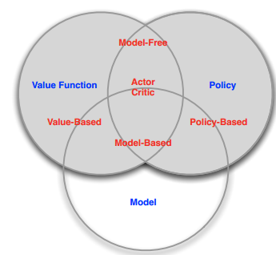
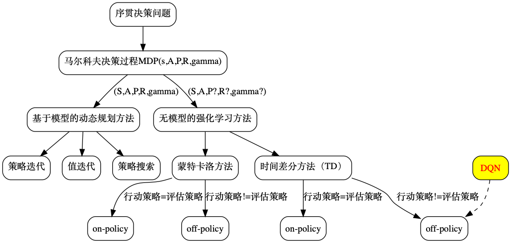
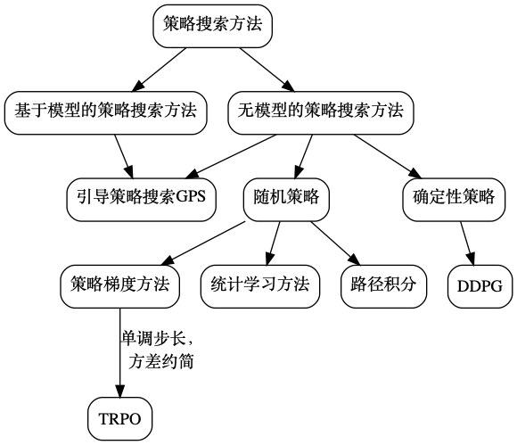
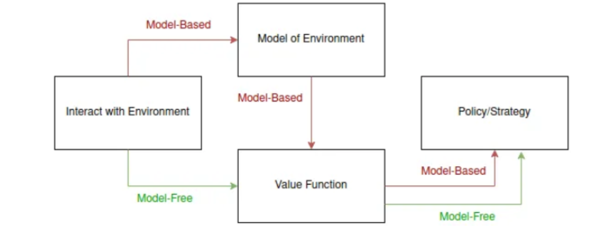
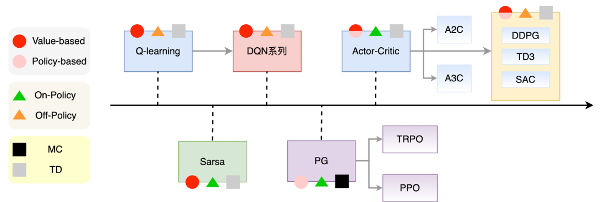
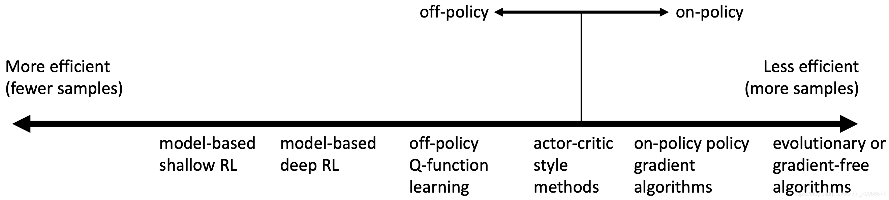

<!--
 * @version:
 * @Author:  StevenJokess（蔡舒起） https://github.com/StevenJokess
 * @Date: 2023-09-14 04:02:05
 * @LastEditors:  StevenJokess（蔡舒起） https://github.com/StevenJokess
 * @LastEditTime: 2023-10-23 02:23:34
 * @Description:
 * @Help me: make friends by a867907127@gmail.com and help me get some “foreign” things or service I need in life; 如有帮助，请资助，失业3年了。
 * @TODO::
 * @Reference:
-->
# RL算法

## 强化学习的基础算法的简介

### 据学习目标[1]或优化方法分类（Categorizing RL agents）：

- 不基于模型，即免模型学习（model-free）方法：该方法放弃了对环境的建模（不去直接估计状态的转移，也没的到环境的具体转移变量[12]），直接与真实环境进行交互，所以其通常需要较多的数据或者采样工作来优化策略，这也使其对于真实环境具有更好的泛化性能[2]；由于这种方式更加容易实现，也容易在真实场景下调整到很好的状态。所以免模型学习方法更受欢迎，得到更加广泛的开发和测试。
  1. **基于价值函数**（value-based）：该方法是智能体通过学习价值函数（value function）（如状态值函数或动作值函数 value function or action-value function）来隐式地构建最优策略，即选择具有最大值的动作。包括，采取回合更新的蒙特卡洛方法（MC）、采取单步或多步更新的时间差分方法（TD）{使用表格学习的 Q-learning、Sarsa算法以及一系列基于Q-learning的算法（具体见off-policy）}。此时我们在训练 $Q_\theta$ 以满足自洽方程，间接地优化智能体的表现，即训练的是一个主要完成任务的Actor。 优点：Value-based算法因为其更能有效地重用历史，所以样本利用率高、价值函数估值方差小, 不易陷入局部最优；缺点：此类算法只能解决离散动作空间问题, 容易出现过拟合, 且可处理问题的复杂度受限. 同时, 由于动作选取对价值函数的变化十分敏感, value-based算法收敛性质较差。[3]
     1. 在线控制 或 **同策学习**（on-policy）是指直接对策略进行建模和优化的方法，其目标是找到一个能够最大化期望累积奖励的最优策略。要优化的策略网络（更新参数时使用的策略）恰也是行动策略（生成样本的策略），即学习者与决策者统一。包括Sarsa，Sarsa（λ）[4]。on-policy方法更加稳定但收敛速度较慢。例如，SARAS是基于当前的策略直接执行一次动作选择，然后用动作和对应的状态更新当前的策略，因此生成样本的策略和学习时的策略相同，所以SARAS算法为on-policy算法。该算法会遭遇探索-利用窘境，仅利用目前已知的最优选择，可能学不到最优解，不能收敛到局部最优，而加入探索又降低了学习效率。ϵ - 贪心算法是这种矛盾下的折衷，其优点是直接了当、速度快，缺点是不一定能够找到最优策略。[5]
     2. 离线控制 或 **异策学习**（off-policy）则是指在训练过程中使用一个不同于当前策略的策略进行采样和更新，也就是说，智能体在执行动作时可以采用任意策略生成的动作进行训练。常见的off-policy方法包括Q-learning，Deep-Q-Network，Deep Deterministic Policy Gradient (DDPG)等方法。通过之前的历史（可是自己的也可以是别人的）进行学习，要优化的策略网络（更新参数时使用的策略）与行动策略（生成样本的策略）不同，即学习者和决策者不需要相同。[6]而off-policy方法则更容易出现不稳定性但收敛速度较快。包括Q-Learning ， Deep Q Network。例如，Q-learning在计算下一状态的预期奖励时使用了最大化操作，直接选择最优动作，而当前策略并不一定能选择到最优的动作，因此这里生成样本的策略和学习时的策略不同，所以Q-learning为off-policy算法。[6]
  2. **基于策略**（policy-based）：该方法是跨越价值函数, 直接搜索最佳策略，故也叫策略搜索方法，它直接对policy进行建模和学习。[22]包括无梯度方法(Gradient-Free)、策略梯度方法Policy Gradient及其衍生的 REINFORCE算法、带基准线的REINFORCE算法。此时我们直接再优化你想要的奖励[24]，即训练的是不完成任务的一个Critic。优点：相比value-based算法, policy-based算法能够处理离散/连续空间问题, 并且具有更好的收敛性；policy-based方法轨迹方差较大、样本利用率低, 容易陷入局部最优的困境。
     1. Gradient-Free：能够较好地处理低维度问题。[22]Cross-Entropy Method的DQN演化而成的QT-Opt、Evolution Strategy的SAMUEL.
     2. Gradient-Based：基于策略梯度算法仍然是目前应用最多的一类强化学习算法, 尤其是在处理复杂问题时效果更佳, 如AlphaGo 在围棋游戏中的惊人表现。算法在Hopper问题的效果对比，Policy Gradient、VPG（如REINFORCE）、TRPO/PPO、ACKTR。SAC=TD3＞DDPG=TRPO=DPG＞VRG。[22]
  3. **基于执行者/评论者**（actor-critic）：该方法是智能体结合了值函数和策略的思想。它包含一个演员/执行者（actor）网络和一个评委/评论者（critic）网络，执行者网络用于生成动作，而评论者网络用于估计值函数。![在Actor-Critic 基础上扩展的 DDPN (Deep Deterministic Policy Gradient)、A3C (Asynchronous Advantage Actor-Critic)、DPPO (Distributed Proximal Policy Optimization)。优点：actor-critic算法多是off-policy，能够通过经验重放(experience replay)解决采样效率的问题；缺点：策略更新与价值评估相互耦合, 导致算法的稳定性不足, 尤其对超参数极其敏感。Actor-critic算法的调参难度很大, 算法也难于复现, 当推广至应用领域时, 算法的鲁棒性也是最受关注的核心问题之一。[15] 
- **基于模型** （model-based）或 基于效用（utility-based）[31] ：该“模型”特指环境，即环境的动力学模型。[21]该类智能体尝试学习环境的动态模型，即预测从给定状态和动作转移到下一个状态的概率。然后，智能体可以使用学习到的环境模型来提前（look-ahead）规划决策。（model + policy and/or + value function）但缺点是如果模型跟真实世界不一致，那么限制其泛化性能，即在实际使用场景下会表现的不好。预测从给定状态和动作转移到下一个状态的概率: $$\mathbf{P}_{s}^{a}=P\left[S_{t+1}=s^{\prime} \mid S_{t}=s, A_{t}=a\right], \mathbf{R}$$ 环境模型一般可以从数学上抽象为状态转移函数 P (transition function) 和奖励函数 R (reward function)。 在学习R和P之后，所有环境元素都已知，理想情况下，智能体可以不与真实环境进行交互，而只在模拟的环境中，通过RL算法（值迭代、策略迭代等规划方法）最大化累积折扣奖励，得到最优策略。[16]包括：动态规划算法（策略迭代算法、值迭代算法），Dyna-Q，已给定的模型（Given the Model） MCTS（AlphaGo/**AlphaZero**），学习这模型（Learn the Model） I2A 和 World Model。其优点是可以大幅度提升采样效率；有最大的缺点就是智能体往往不能获得环境的真实模型。如果智能体想在一个场景下使用模型，那它必须完全从经验中学习，这会带来很多挑战。最大的挑战就是，智能体探索出来的模型和真实模型之间存在误差，而这种误差会导致智能体在学习到的模型中表现很好，但在真实的环境中表现得不好（甚至很差）。基于模型的学习从根本上讲是非常困难的，即使你愿意花费大量的时间和计算力，最终的结果也可能达不到预期的效果。[11] 
- 更多相关：模仿学习智能体（imitation learning agent）：该类智能体不是直接学习环境奖励，而是尝试模仿人类或其他专家的决策。模仿学习可以提供一种简单而有效的方式，使智能体学习到正确的行为。

> 在这个项目中选取了能够呈现强化学习近些年发展历程的核心算法。目前，在可靠性 (stability)和 采样效率 (sample efficiency)这两个因素上表现最优的策略学习算法是 PPO 和 SAC。从这些算法的设计和实际应用中，可以看出可靠性和采样效率两者的权衡。[11]

![RL 算法的总览（Youtube）[18]](../../img/RL_algs_overview_u2b.png)

## 其他分类方法

### 按更新方式分类

回合更新 Monte-Carlo update & 单步更新 Temporal-Difference update

- 典型的 Monte-Carlo update 方法： Policy Gradient
- 典型的Temporal-Difference update 方法：Q-Learning \ Sarsa \ 升级版 Policy Gradient

### 按行为策略与目标策略是否一致分类

在线学习 on-policy & 离线学习 off-policy

- 典型的 on-policy 方法：Sarsa \ Policy Gradient
- 典型的 off-policy 方法：Q-Learning \ Deep Q-learning \ 升级版 Policy Gradient[9]

### 更多前沿算法的分类

- 根据策略更新方法:基于值函数的强化学习,基于直接策略搜索的强化学习,ES方法和GA方法。
- 根据回报函数是否已知分为:正向强化学习和逆向强化学习
- 根据任务大小和多少分为:分层强化学习、元强化学习、多智能体强化学习、迁移学习等[17]

## RL算法的两个重要的评价指标

评价指标：

- 算法收敛后的策略在初始状态下的期望回报
- 样本复杂度，即算法达到收敛结果需要在真实环境中采样的样本数量。

## 用评价指标去评价RL算法

- 环境模型可能并不准确，不能完全代替真实环境，因此基于模型的强化学习算法收敛后其策略的期望回报可能不如无模型的强化学习算法。
- 基于模型的强化学习算法由于具有一个环境模型，智能体可以额外和环境模型进行交互，对真实环境中样本的需求量往往就会减少，因此通常会比无模型的强化学习算法具有更低的样本复杂度。[8]

## 对于算法的考量

样本利用效率（Sample Efficiency）：

算法稳定性与易用性（Stability and ease of use）

1. 算法收敛吗？如果收敛，收敛到哪个点？
1. 该算法每次都收敛吗？会不会换个随机种子就不收敛了？（呜呜呜

该算法是on-policy还是off-policy的？还是两者都可以？

算法的参数：

1. 算法适用的state 与 action 是连续(continuous)还是离散的(discrete)？
1. 算法的轨迹(trajectory)是有限长(Episodic)还是无限长的(infinite horizon)？
1. 算法得到的策略policy是确定的(deterministic)还是随机的(stochastic)？

实际问题的考量：

1. 实际问题中，policy表示起来容易吗？方便吗？
1. 实际问题中，transition model表示起来容易吗？方便吗？

## 算法的性能指标

强化学习任务各种各样，每个算法都有自己的适用范围。有些强化学习算法对于某些任务性能好，而对于另外一些任务根本就不适用。比如回合更新算法，它可能在某些回合制的任务上表现还行，但是它根本就不适用于连续性任务。所以这个指标和选取的任务直接有关。

如果我们要解决某个特定的任务，那么我们最应该关注在这个特定任务下的性能。对于纯粹的学术研究而言，也常常选用一些学界通用的基准任务，比如Gym库里的各种任务。如果某个算法是针对某些特定的任务特别有效，那么就常常定制出一些特定的任务来体现这个算法的优势。所以有句话说：“一千篇声称自己达到最优性能(State-Of-The-Art，SOTA)的论文实际上达到的是一千种不同的最优性能。”一般而言，我们会看长期奖励及长期奖励在训练过程中的收敛状况，最常见的是给出长期奖励和学习曲线。学习曲线不是一个定量的东西，但是它可以进一步定量化。

另外，对于不同类型的强化学习的任务，特别是在线学习任务、离线学习任务、多任务等，每个类型也可能会有自己独特的性能指标。按通常情况下的重要性排序，我们会关注下列指标。

按通常情况下的重要性排序，我们会关注下列指标。

- 长期奖励：这个指标是指将强化学习应用到目标任务或基准任务时，可以得到的长期奖励。它的定义有回报、平均奖励等。16.1节比较了几种不同的定义。我们希望这个值的期望越大越好。对这个值的其他统计量往往也有要求，比如在均值相同的条件下会希望它的方差越小越好。
- 最优性和收敛性：在理论上，特别关注强化学习算法是否能在给定的任务上收敛到最优解。能收敛到最优解自然是好的。
- 样本复杂度(sample complexity)：智能体和环境交互往往非常耗费资源，收集样本往往代价高昂。利用尽可能少的样本完成学习非常有价值。值得一提的是，还有一些算法可以利用环境的数学描述或已有的一些历史样本来提高样本的利用率，这样的算法可能会大大降低样本复杂度。甚至有些算法（比如模型价值迭代）仅仅靠模型就能得到最优策略，这种情况下不需要样本，严格来说它就不算强化学习算法。对于离线强化学习算法，它仅仅使用历史样本就可以完成学习，并不需要与环境交互，这样的算法可以认为其“在线的”样本复杂度为0。但是，离线强化学习算法往往只能获得有限的历史样本，所以“离线的”样本复杂度就非常关键。其中，样本复杂度越小越好。
- 遗憾(regret)：这个指标指在训练过程中每个回合的遗憾之和，其中每个回合的遗憾定义为实际获得的回合奖励和收敛后得到的回合奖励的差。遗憾越小越好。在线的任务会关注这个指标。有些算法从0开始训练，关注的遗憾可能是从一开始训练就开始统计了。有些任务可能是先在一个环境下预训练，然后换一个环境再进行训练，并且只关注切换环境后的遗憾。比如，预训练的环境可以是仿真环境，而真正要用的环境是现实生活中的环境，而在现实环境中的失败代价比较大，所以主要关注现实环境中的遗憾值。再例如，预训练的环境可以是研发人员实验室里的可控环境，而真正要用的环境是在客户办公室里的演示，所以需要在客户办公室里训练的遗憾值比较小。
- 并行扩展性(scalability)：有些强化学习算法可以利用多个副本加快学习。我们遇到的强化学习任务往往比较复杂，如果能并行加速学习是很有帮助的。
- 收敛速度、训练时间与时间复杂度(time complexity)：在理论上，特别关注强化学习算法收敛速度是什么。如果用复杂度的记号来表示，则可以表示为时间复杂度。收敛速度越快越好，时间复杂度越小越好。
- 占用空间和空间复杂度(space complexity)：占用空间显然越小越好。有些应用场景比较关注用来存储和回放历史样本占用的空间，另外一些应用场景更在乎需要放置在GPU等特定计算硬件上的存储空间。[13]

## 问题测验

1. 你了解有模型和免模型吗？两者具体有什么区别呢？

## 附录：问题答案

1. 我认为两者的区别主要在于是否需要对真实的环境进行建模，免模型方法不需要对环境进行建模，直接与真实环境进行交互即可，所以其通常需要较多的数据或者采样工作来优化策略，这也使其对于真实环境具有更好的泛化性能；而有模型方法需要对环境进行建模，同时在真实环境与虚拟环境中进行学习，如果建模的环境与真实环境的差异较大，那么会限制其泛化性能。现在通常使用有模型方法进行模型的构建工作。[14]

[1]: https://imzhanghao.com/2022/02/10/reinforcement-learning/#%E7%AE%97%E6%B3%95%E5%88%86%E7%B1%BB
[2]: https://www.cnblogs.com/kailugaji/p/16140474.html
[3]: http://www.c-s-a.org.cn/html/2020/12/7701.html#outline_anchor_19
[4]: https://baike.baidu.com/item/%E9%A9%AC%E5%B0%94%E5%8F%AF%E5%A4%AB%E9%93%BE/6171383?fromModule=search-result_lemma-recommend
[5]: https://www.cnblogs.com/kailugaji/p/16140474.html
[6]: https://anesck.github.io/M-D-R_learning_notes/RLTPI/notes_html/1.chapter_one.html
[7]: https://www.cnblogs.com/kailugaji/p/16140474.html
[8]: https://zhuanlan.zhihu.com/p/594985695
[9]: https://zhuanlan.zhihu.com/p/586978752
[10]: https://blog.csdn.net/weixin_40056577/article/details/104109073
[11]: https://spinningup.qiwihui.com/zh_CN/latest/spinningup/rl_intro.html
[12]: https://blog.csdn.net/weixin_46438285/article/details/125045312
[13]: https://weread.qq.com/web/reader/85532b40813ab82d4g017246k65132ca01b6512bd43d90e3
[14]: https://mdnice.com/writing/44f662bc5fb84a9ca36e160ae89b4194
[15]: https://blog.csdn.net/Hansry/article/details/80808097
[16]: https://opendilab.github.io/DI-engine/02_algo/model_based_rl_zh.html
[17]: https://blog.csdn.net/u012692537/article/details/79405339
[18]: https://www.youtube.com/watch?v=i7q8bISGwMQ
[22]: http://www.c-s-a.org.cn/html/2020/12/7701.html#outline_anchor_19

