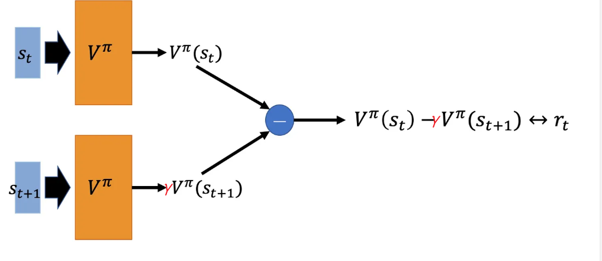

<!--
 * @version:
 * @Author:  StevenJokess（蔡舒起） https://github.com/StevenJokess
 * @Date: 2023-02-26 03:32:44
 * @LastEditors:  StevenJokess（蔡舒起） https://github.com/StevenJokess
 * @LastEditTime: 2023-10-24 01:04:24
 * @Description:
 * @Help me: 如有帮助，请赞助，失业3年了。
 * @TODO::
 * @Reference:
-->
# 时序差分算法

## 简介

之前介绍的动态规划算法要求马尔可夫决策过程是已知的，即要求与智能体交互的环境是完全已知的（例如迷宫或者给定规则的网格世界）。在此条件下，智能体其实并不需要和环境真正交互来采样数据，直接用动态规划算法就可以解出最优价值或策略。这就好比对于有监督学习任务，如果直接显式给出了数据的分布公式，那么也可以通过在期望层面上直接最小化模型的泛化误差来更新模型参数，并不需要采样任何数据点。

但这在大部分场景下并不现实，机器学习的主要方法都是在数据分布未知的情况下针对具体的数据点来对模型做出更新的。对于大部分强化学习现实场景（例如电子游戏或者一些复杂物理环境），其马尔可夫决策过程的状态转移概率是无法写出来的，也就无法直接进行动态规划。在这种情况下，智能体只能和环境进行交互，通过采样到的数据来学习，这类学习方法统称为**无模型的强化学习**（model-free reinforcement learning）。

不同于动态规划算法，无模型的强化学习算法不需要事先知道环境的奖励函数和状态转移函数，而是直接使用和环境交互的过程中采样到的数据来学习，这使得它可以被应用到一些简单的实际场景中。而蒙特卡洛只能用于回合制任务。我们希望算法能不局限于回合制任务，也能用于连续的任务。[10]本章将要讲解无模型的强化学习中的两大经典算法：SARSA 和 Q-learning，它们都是基于时序差分（temporal difference，TD）的强化学习算法。同时，本章还会引入一组概念：在线策略学习和离线策略学习。通常来说，在线策略学习要求使用在当前策略下采样得到的样本进行学习，一旦策略被更新，当前的样本就被放弃了，就好像在水龙头下用自来水洗手；而离线策略学习使用经验回放池将之前采样得到的样本收集起来再次利用，就好像使用脸盆接水后洗手。因此，离线策略学习往往能够更好地利用历史数据，并具有更小的样本复杂度（算法达到收敛结果需要在环境中采样的样本数量），这使其被更广泛地应用。

## 时序差分方法 TD

时序差分（Temporal-Difference，TD）是一种用来估计一个策略的价值函数的方法，它结合了蒙特卡洛（Monte carlo）和动态规划算法（DP）的思想。

## TD与MC的相似处与不同

时序差分方法和蒙特卡洛的相似之处在于可以从样本数据中学习，不需要事先知道环境；和动态规划的相似之处在于根据贝尔曼方程的思想，利用后续的状态（successor state[14]）的价值估计，来更新当前状态的价值估计，是通过预测去更新而无需等到整个决策完成[4]。

自举（Bootstrapping）是个重要思想，在TD算法中智能体在每次完成动作后收到动作的奖励，这种奖励是它离自己的目标是更近与否而估计的。这些宇哥的奖励影响了它未来的行动。

其次，TD算法的「收敛性在理论上也是有保证」的。在Sutton的书中也提到：“如果步长参数是一个足够小的常数，对于任何策略 $\pi$, TD(0)中对状态值的估计的「均值」能够收敛到 $v_{\pi}$。如果该参数能够同时满足以下两个条件，$\sum_{n=1}^{\infty}\alpha_n(a) = \infty\\\sum_{n=1}^{\infty}\alpha^2_n(a) < \infty\\$，则该值能够依概率1收敛。”[8]

> 由多巴胺释放得到的启示：
>
> 多巴胺是一种让人感到兴奋和愉悦的神经递质，由大脑分泌。
> 当我们获得超过期望的回报或者奖励时，大脑会释放大量多巴胺，让我们感到兴奋和愉悦。
> 巴普洛夫的狗实验，摇铃分泌口水。随着检测技术的提高，科学家发现多巴胺的释放并非来源于奖励本身，而是来自于对奖励的预期。
> 当现实的回报高于预期时，会促成多巴胺的释放，让人觉得生活美好。相反的，如果现实的回报总是不及预期，多巴胺的分泌量会降低，人们也会慢慢觉得生活一成不变，缺乏乐趣。
> 平衡预期与回报之间的差距正是时间差分学习（Temporal Difference Learning）的目标：根据现实回报和预期的差值来调整价值函数的值，这与大脑分泌多巴胺的机制异曲同工。
> 多巴胺的释放是由奖励预测误差所驱动的，即如果获得的奖励与预期的奖励相符，则多巴胺不会释放。[15]

注意下面讨论都是估计状态价值函数 $V^\pi(s)$，而估计动作价值函数 $Q^\pi(s, a)$不讨论，但也类似，可参考[22]。

### TD(0) 或 一步TD

#### 蒙特卡洛方法的启示与不足

回顾一下蒙特卡洛方法对价值函数的**增量更新方式**：

$V\left(S_t\right) \leftarrow V\left(S_t\right)+\frac{1}{N\left(S_t\right)}\left(G\left(S_t\right)-V\left(S_t\right)\right)$

通常，对于海量样本的分布式迭代， $N\left(S_t\right)$ 无法准确计算，所以我们将原来的 $\frac{1}{N(s)}$ 替换成了 $\alpha$ ，表示对价值估计**更新的步长，在实际使用时类似于学习率。**。而依据倒数函数 $\frac{1}{N\left(S_t\right)}$ 的曲线，得 $\alpha$ 的取值范围在 $[0,1]$，即：

$$
V\left(s_t\right) \leftarrow V\left(s_t\right)+\alpha\left[G_t-V\left(s_t\right)\right] 其中，α∈[0,1]
$$

我们可以将 $\alpha$ 取为一个常数，此时更新方式不再像蒙特卡洛方法那样严格地取期望。

蒙特卡洛方法的不足是，**必须要等整个序列结束之后**才能计算得到这一次的回报 $G_t$ ，而时序差分方法只需要**当前步结束**即可进行更新的计算。

#### TD(0)方法

TD(0)方法会利用到时序差分公式，如下：

$V^\pi\left(s_t\right)=r_t+ \gamma * V^\pi\left(s_{t+1}\right)$

可见，TD（0）用当前获得的奖励加上下一个状态的价值估计的折现，具体来说是， $r_t+\gamma V\left(s_{t+1}\right)$，来作为在当前状态获得的回报。因该方法只考虑下一个状态，故又称为单步TD。

TD（0）更新公式为：

$$
V\left(s_t\right) \leftarrow V\left(s_t\right)+\alpha\left[r_t+\gamma V\left(s_{t+1}\right)-V\left(s_t\right)\right]  其中，α∈[0,1]
$$

其中 $r_t+\gamma V\left(s_{t+1}\right)-V\left(s_t\right)$ 通常被称为**时序差分 (temporal difference，TD) 误差 (error)**，用符号$\delta_t$表示。因为TD误差取决于下一个状态和下一个奖励，所以直到一个时间步骤之后它才真正可用，也就是说 $\delta_t$ 在时刻 $t+1$ 才能获取。

时序差分算法将其与步长（学习率） $\alpha$ 的乘积作为状态价值的**更新**量 。其中，用TD目标值 $r_t+\gamma V\left(s_{t+1}\right)$ 来代替 $G_t$ 的过程称为**引导**或**自举**（bootstrapping）[6]，而可以的原因是:

$$
\begin{aligned}
V_\pi(s) & =\mathbb{E}_\pi\left[G_t \mid S_t=s\right] \\
& =\mathbb{E}_\pi\left[\sum_{k=0}^{\infty} \gamma^k R_{t+k} \mid S_t=s\right] \\
& =\mathbb{E}_\pi\left[R_t+\gamma \sum_{k=0}^{\infty} \gamma^k R_{t+k+1} \mid S_t=s\right] \\
& =\mathbb{E}_\pi\left[R_t+\gamma V_\pi\left(S_{t+1}\right) \mid S_t=s\right]
\end{aligned}
$$

因此蒙特卡洛方法将上式**第一行**作为更新的目标，而时序差分算法将上式**最后一行**作为更新的目标。于是，在用策略和环境交互时，每采样一步，我们就可以用时序差分算法来更新状态价值估计。时序差分算法用到了 $V\left(s_{t+1}\right)$ 的估计值，可以证明它最终收敛到策略的价值函数，我们在此不对此进行展开说明。

对于非回合制任务，我们可以自行将某些时段抽出来当作多个回合，也可以不划分回合当作只有一个回合进行更新。

> 如果整幕中 $\mathrm{V}$ 不改变，则有:
> $$\begin{aligned}
G_t-V\left(S_t\right) & =R_{t+1}+\gamma G_{t+1}-V\left(S_t\right)+\gamma V\left(S_{t+1}\right)-\gamma V\left(S_{t+1}\right) \\
& =\delta_t+\gamma\left(G_{t+1}-V\left(S_{t+1}\right)\right) \\
& =\delta_t+\gamma \delta_{t+1}+\gamma^2\left(G_{t+2}-V\left(S_{t+2}\right)\right) \\
& =\delta_t+\gamma \delta_{t+1}+\gamma^2 \delta_{t+2}+\cdots+\gamma^{T-t-1} \delta_{T-1}+\gamma^{T-t}\left(G_T-V\left(S_T\right)\right) \\
& =\delta_t+\gamma \delta_{t+1}+\gamma^2 \delta_{t+2}+\cdots+\gamma^{T-t-1} \delta_{T-1}+\gamma^{T-t}(0-0) \\
& =\sum_{k=t}^{T-1} \gamma^{k-t} \delta_k .
\end{aligned}$$
>
> 只有当步长较小时，它才成立。（？为啥，有啥用）
> 

#### 用动作价值函数表示的TD(0)：

不同于DP算法，对于无法获知环境模型的情况，单靠状态价值函数就不足以确定一个策略，我们必须通过显式地确定每个动作的价值函数来确实一个策略，动作价值函数的迭代同上：

$$
Q\left(S_t, A_t\right) \leftarrow Q\left(S_t, A_t\right)+\alpha\left(G\left(S_t\right)-Q\left(S_t, A_t\right)\right)
$$

> 类比车时：
>![举例：原来要整个路径[13]](../../img/TD_eg0.png)
>
>

##### 而用动作价值函数表示的TD(0)的伪算法：[13]

1. Observe state $S_t=s_t$ and action $A_t=a_t$.
2. Predict the value: $q_t=Q\left(s_t, a_t ; \mathbf{w}_t\right)$.
3. Differentiate the value network: $\mathbf{d}_t=\left.\frac{\partial Q\left(s_t, a_t ; \mathbf{w}\right)}{\partial \mathbf{w}}\right|_{\mathbf{w}=\mathbf{w}_t}$.
4. Environment provides new state $s_{t+1}$ and reward $r_t$.
5. Compute TD target: $y_t=r_t+\gamma \cdot \max _a Q\left(s_{t+1}, a ; \mathbf{w}_t\right)$.

### n-step TD

n-step TD就是不只往前看一步了，而是将当前状态及其后n-1个状态的奖励和价值信息考虑在内。

比如，TD（2）是2-step，即往前多看两步，此时某个状态的价值函数变成：

$$G_{t}^{(2)}=R_{t}+\gamma R_{t+1}+\gamma^{2} V\left(S_{t+2}\right) $$

那TD（n）是n-step，即往前多看n步，此时某个状态的价值函数变成：

$G_t^{(n)} = R_{t}+\gamma R_{t+1}+\cdots+\gamma^{n-1} R_{t+n-1}+\gamma^n V\left(S_{t+n}\right)
= \sum_{k=0}^{n-1} \gamma^k R_{t+k}+\gamma^n V\left(S_{t+n}\right)$

_TD(n).png)

### 动态规划（DP）、蒙特卡洛（MC）和时序差分（TD）的异同点：

#### 从采样（Sampling）经历和自举（Bootstrapping）角度：

- 动态规划没有采样，是基于模型的planning方法。因为它是根据完整的模型（每一层状态转移到下一层的状态[22]），最主要的特点是转移概率已知，因此可根据贝尔曼方程来进行状态更新。这其实相当于开了“上帝视角”，通常不适用于实际问题。它是**广度**期望更新的并且采用了自举法（bootstrapping）。[24]
- 蒙特卡洛需要采样，是model-free方法。它从”经验“中学习价值函数和最优策略。“经验”是指多幕采样数据，而且还必须是完整经历（初始状态一直到最终状态[22]的序列），只适用于回合。其主要思想是通过大量的采样来逼近状态的真实价值，因为我们用样本回报代替了实际的期望回报。该方法的起始点是任意选取的，一直到终止状态才进行一次更新，因此当动作序列很长时或者出现循环，该方法便不适用。它是**深度**采样更新，它没有使用自举法。
- 时序差分结合了蒙特卡洛采样法和动态规划自举法。[17]时序差分需要采样去更新，但不需MC那样的完全的采样的深度。[24]即，该方法不像MC需要在一幕完全结束（序列终止）后再更新，这种更新方式叫在线学习（online learning）；具体来说是，沿途的收益 $R_{t+1}$ 和下一状态的预估状态价值的折现 $\gamma * V(S_{t+1})$ 之和，来预估收获，再更新预估价值（即只在当前状态到下一状态[22]）。它是不完全采样更新，用了自举法。
  - 所谓自举（bootstrapping），是指通过采样得到期望值，以期望值作为估计值 $V\left(S_{t+1}\right)$ ，以代替真实值 $v\left(S_{t+1}\right)$。[9]
  - 其更适用于实际情况，往往效果比MC更好（数学上并无严格证明）。[7]
  - TD控制有Sarsa、期望Sarsa和Q学习。[24]
  - 
- 蒙特卡洛和时序差分会收敛到不同的结果。蒙特卡洛法总是找出最小化训练集上均方误差的估计，而时序差分法总是找出完全符合马尔科夫过程模型的最大似然估计参数。并且在一些任务上验证了TD比MC收敛更快。
- .png)
-

#### 从马尔可夫性质的前提假设角度：

- 动态规划没要求马尔可夫性质的前提假设，在不是马尔可夫的环境下更加有效。
- 蒙特卡洛没要求马尔可夫性质的前提假设，在不是马尔可夫的环境下更加有效。
- 时序差分要求马尔可夫性质的前提假设，在马尔可夫环境下有更高的学习效率。
- 但三者都可求解马尔科夫链决策过程（MDP）。求解MDP可以直接求解Bellman方程，但是通常Bellman方程难以列出且计算复杂度高。[24]

#### 偏差与方差角度：

| 方法 | 偏差 | 方差 |
| ---- | ---- | ---- |
| DP   | 无偏 | 无方差|
| MC   | 无偏 | 方差较大|
| TD   | 有偏 | 方差较小|

- DP 无偏、无方差
- MC 无偏、方差大：因为智能体的序列长，奖励比较多，所以当我们把N步的奖励加起来时，对应的方差就会比较大。
- TD（0）有偏、方差小：TD（0）只对当前一步做值函数的更新，虽然这样估计的值函数**更不准**，但是方差会更小。
- TD（N）平衡：为了解决估计的值函数的偏差过大与方差大的问题，我们可以通过调整N值，在方差与不精确的Q值之间取得一个平衡。这里介绍的参数N是超参数，需要微调参数 N，例如是要多采样3步、还是多采样5步。

### Policy Evalution&Policy Improvment

- Policy Evaluation时，套TD的Q公式就行了。
- Policy Improvment时，TD常见的on-policy是SARSA，常见的off-policy是Q-learning。

下面将分别介绍SARSA 算法和Q-learning算法。

## SARSA 算法

既然我们可以用时序差分方法来估计价值函数，那一个很自然的问题是，我们能否用类似策略迭代的方法来进行强化学习。策略评估已经可以通过时序差分算法实现，那么在不知道奖励函数和状态转移函数的情况下该怎么进行策略提升呢？答案是可以直接用时序差分算法来估计动作价值函数 $Q$ ：

$$
Q\left(s, a\right) \leftarrow Q\left(s, a\right)+\alpha\left(G_{t}-Q\left(s, a\right)\right) 其中，α∈[0,1]
$$

然而这个简单的算法存在两个需要进一步考虑的问题。第一，如果要用时序差分算法来准确地估计策略的状态价值函数，我们需要用极大量的样本来进行更新。但实际上我们可以忽略这一点，直接用一些样本来评估策略，然后就可以更新策略了。我们可以这么做的原因是策略提升可以在策略评估未完全进行的情况进行，回顾一下，价值迭代（参见 4.4 节）就是这样，这其实是广义策略迭代（generalized policy iteration）的思想。第二，如果在策略提升中一直根据贪婪算法得到一个确定性策略，可能会导致某些状态动作对以至于无法对其动作价值进行估计，进而无法保证策略提升后的策略比之前的好。我们在第 2 章中对此有详细讨论。简单常用的解决方案是不再一味使用贪婪算法，而是采用一个 $\epsilon$ -贪婪策略：有 $1 - \epsilon$ 的概率采用动作价值最大的那个动作，另外有的概率从动作空间中随机采取一个动作，其公式表示为：

$$
\pi(a \mid s)= \begin{cases}\epsilon /|\mathcal{A}|+1-\epsilon & \text { 如果 } a=\arg \max _{a^{\prime}} Q\left(s, a^{\prime}\right) \\ \epsilon /|\mathcal{A}| & \text { 其他动作 }\end{cases}
$$

现在，我们就可以得到一个实际的基于时序差分方法的强化学习算法。这个算法被称为 SARSA，SARSA 指的是 「S」tate-「A」ction-「R」eward-「S」tate-「A」ction，因为它的动作价值更新用到了当前状态 $S_t$ 、当前动作 $A_t$ 、获得的奖励 $R_t$ 、下一个状态 $S_{t+1}$ 和下一个动作 $A_{t+1}$，将这些首字母拼接后就得到了算法名称。

SARSA 的具体算法如下：

- 初始化 $Q(s, a)$
- for 序列 $e=1 \rightarrow E$ do:
  - 初始化状态 $S_0$
  - 用 $\epsilon$-greedy 策略根据 $Q$ 选择当前状态 $S_0$ 下的动作 $A_0$
- for 时间步 $t=0 \rightarrow T$ do:
  - 得到环境反馈的 $R_{t+1}, S_{t+1}$
  - 用 $\epsilon$-greedy 策略根据 $Q$ 选择当前状态 $S_{t+1}$ 下的动作 $A_{t+1}$
  - 用公式去更新动作价值函数 $Q(S_t, A_t)$ ：$Q(S_t, A_t) \leftarrow Q(S_t, A_t)+\alpha\left[R_t+\gamma Q\left(S_{t+1}, A_{t+1}\right)-Q(S_t, A_t)\right]$
  - $S_{t} \leftarrow S_{t+1}, A_t \leftarrow A_{t+1}$
  - end for
- end for

其更新公式为:

$Q(S_t, A_t) \leftarrow Q(S_t, A_t)+\alpha\left[R_t+\gamma Q\left(S_{t+1}, A_{t+1}\right)-Q(S_t, A_t)\right]$

注意到：SARSA必须执行两次动作得到 $\left(s, a, r, s^{\prime}, a^{\prime}\right)$ 才可以更新一次。

Policy Improvment时使用的是on-policy，其原因是：而且 $a^{\prime}$ 是在特定策略 $\pi$ 的指导下执行的动作，因此估计出来的 $Q(s, a)$ 是在该策略 $\pi$ 之下的 $Q$ 值，样本生成用的 $\pi$ 和估计的 $\pi$ 是同一个，因此是on policy。[2]

SARSA算法的收敛性取决于策略对Q的依赖性？[19]

### *代码*：

我们仍然在悬崖漫步（Cliff Walking）环境下尝试 SARSA 算法。首先来看一下悬崖漫步环境的代码，这份环境代码和第 4 章中的不一样，因为此时环境不需要提供奖励函数和状态转移函数，而需要提供一个和智能体进行交互的函数`step()`，该函数将智能体的动作作为输入，输出奖励和下一个状态给智能体。

接下来我们就在悬崖漫步环境中运行 SARSA 算法，一起来看看结果吧！

code

我们发现，随着训练的进行，SARSA 算法获得的回报越来越高。在进行 500 条序列的学习后，可以获得 −20 左右的回报，此时已经非常接近最优策略了。然后我们看一下 SARSA 算法得到的策略在各个状态下会使智能体采取什么样的动作。

code

可以发现 SARSA 算法会采取比较远离悬崖的策略来抵达目标。

### 期望 SARSA 算法（Expected SARSA）

期望 SARSA 算法与普通的 SARSA 算法的区别就是，它不使用基于动作价值的时序差分目标，而是使用基于动作价值的**期望**的时序差分目标，即在更新Q值时考虑了在下一状态中采取所有可能动作的平均值，而不仅仅是在下一状态中采取某一个特定动作时的Q值。

利用 Bellman 方程，这样的目标又可以写为[12]：

$$
\begin{aligned}
Q\left(S_t, A_t\right) & \leftarrow Q\left(S_t, A_t\right)+\alpha\left[R_{t+1}+\gamma \mathbb{E}_\pi\left[Q\left(S_{t+1}, A_{t+1}\right) \mid S_{t+1}\right]-Q\left(S_t, A_t\right)\right] \\
& \leftarrow Q\left(S_t, A_t\right)+\alpha\left[R_{t+1}+\gamma \sum_a \pi\left(a \mid S_{t+1}\right) Q\left(S_{t+1}, a\right)-Q\left(S_t, A_t\right)\right]
\end{aligned}
$$

### 多步 SARSA 算法

蒙特卡洛方法利用当前状态之后每一步的奖励而不使用任何价值估计，时序差分算法只利用一步奖励和下一个状态的价值估计。那它们之间的区别是什么呢？总的来说，蒙特卡洛方法是无偏（unbiased）的，但是具有比较大的方差，因为每一步的状态转移都有不确定性，而每一步状态采取的动作所得到的不一样的奖励最终都会加起来，这会极大影响最终的价值估计；时序差分算法具有非常小的方差，因为只关注了一步状态转移，用到了一步的奖励，但是它是有偏的，因为用到了下一个状态的价值估计而不是其真实的价值。那有没有什么方法可以结合二者的优势呢？答案是多步时序差分！多步时序差分的意思是使用步的奖励，然后使用之后状态的价值估计。用公式表示，将

$$
G_t=R_t+\gamma Q\left(S_{t+1}, A_{t+1}\right)
$$

替换成

$$
G_t=R_t+\gamma R_{t+1}+\cdots+\gamma^n Q\left(S_{t+n}, A_{t+n}\right)
$$

于是，相应的存在一种多步SARSA算法，它是把之前SARSA算法中的值函数的更新公式

$$
Q\left(S_t, A_t\right) \leftarrow Q\left(S_t, A_t\right)+\alpha\left[R_t+\gamma Q\left(S_{t+1}, A_{t+1}\right)-Q\left(S_t, A_t\right)\right]
$$

替换成
$$
Q\left(S_t, A_t\right) \leftarrow Q\left(S_t, A_t\right)+\alpha\left[R_t+\gamma R_{t+1}+\cdots+\gamma^n Q\left(S_{t+n}, A_{t+n}\right)-Q\left(S_t, A_t\right)\right] .
$$

### 伪代码：

#### Python代码：

我们接下来实现一下多步SARSA算法。我们在SARSA代码的基础上进行修改，引入多步时序差分计算。

code

因为需要计算动作价值的求和，所以它有着更大的计算量，但是这样的期望运算减小了 SARSA 算法中出现的个别不恰当决策，这样可以避免在更新后期极个别不当决策对最终效果带来不好的影响，因此它通常需要更大的学习率。

---

## Q-learning 算法

### 构建Q表（Q-Table）

Q-Table是一个矩阵，其中每个元素对应于一个状态-动作二元组。因此，Q-Table将是一个mxn的矩阵，其中m是可能状态的数量，n是可能动作的数量。Q表的Q值必须有一个初始值，一般来说，Q-Table所有初始化值都设置为零。

为了简化，假设环境Env将是一个具有4种可能状态(a,b,c,d)的房间，如下图所示。同时，不妨假设代理agent将能够执行4个可能的动作：向上、向下、向左和向右。

考虑到上述代理agent和环境Env，Q-Table将是一个4x4的矩阵，其中4行对应于4种可能的状态States，4列对应于4个可能的动作Actions。如下所示，所有值都已初始化为零。

### 训练过程

Q-Learning的训练过程是Q表的Q值逐渐调整的过程，其核心是根据已经知道的Q值，当前选择的行动 $a$ 作用于环境获得的回报 $R$ 和下一轮 $S_{t+1}$ 对应可以获得的最大利益Q，总共三个量进行加权求和算出新的Q值，来更新Q表:

$$
\begin{aligned}
Q\left(S_t, A_t\right) &= Q\left(S_t, A_t\right)+\alpha\left[R_{t+1}+\gamma \max _{a'} Q\left(S_{t+1}, a'\right)-Q\left(S_t, A_t\right)\right] \\
&= (1-\alpha) Q\left(S_t, A_t\right)+\alpha\left[R_{t+1}+\gamma \max _a Q\left(S_{t+1}, a\right)\right]
\end{aligned}
$$

其中 $R_{t+1}=R(s_t, a_t, s_{t+1})$[21]，$Q\left(S_{t+1}, a\right)$ 是在 $t+1$ 时刻的状态和采取的行动（并不是实际行动，所以公式采用了所有可能采取行动的 $\mathrm{Q}$ 的最大值) 对应的 $\mathrm{Q}$ 值， $Q\left(S_t, A_t\right)$ 是当前时刻的状态和实际采取的形同对应的 $\mathrm{Q}$ 值。折扣因子 $\gamma$ 的取值范围是 $[0,1]$ ，其本质是一个衰减值，如果gamma更接近0，agent趋向于只 考虑瞬时奖励值，反之如果更接近1，则agent为延迟奖励赋予更大的权重，更侧重于延迟奖励；奖 励值 $R_{t+1}$ 为 $\mathrm{t}+1$ 时刻得到的奖励值。 $\alpha$ 为是学习率。

这里动作价值 $\mathrm{Q}$ 函数的目标就是逼近最优的 $q * ，q *=R_{t+1}+\gamma \max _a Q\left(S_{t+1}, a\right)$ ，并且轨迹的行 动策略与最终的 $q *$ 是无关的。后面中括号的加和式表示的是 $q *$ 的贝尔曼最优方程近似形式。

其是off-policy的，由于我们只关心哪个动作使得下一个时刻更新的Q，即$Q\left(S_{t+1}, a\right)$ 取得最大值，而实际到底采取了哪个动作(行为策略)，Q-learning并不关心，故采用的是待评估策略产生的下一个状态动作二元组的Q价值。[7]这表明优化策略并没有用到行为策略的数据，所以说它是off-policy的。[2]与SARSA相比，异策略Q学习需要更短的训练时间，跳出局部最优解的概率更大。然而，如果智能体根据Q值的概率模型而不是贪婪选择对动作进行采样，则采用异策略技术的Q值估计误差将增大。[3]

- 训练开始时，随机 Q 表，初始化状态
- 值得注意的是，只有最后一步得到奖励时（假如我们只有终点一个奖励），这个奖励才真的是现实的奖励，否则还是用 Q 表估计的。
- 这里 Q 表的更新只与未来的状态和动作有关，在最开始，应该除了真正有奖励的最后一步，其余步骤的更新都是不确定的（因为现实也是用 Q 表估计的，只有最后一步现实才是现实），但第一次迭代之后最后一步的价值更新是确定的（在宝藏边上还是知道怎么走向宝藏），且与 LSTM 那种时间序列不同，它不是从最后一个时间步往前 BPTT，而是更新了一个状态的转移价值（取哪个动作好），这个状态可能出现在每一次迭代的多个时间步上（或者说和时间步无关），接下来与该状态相邻的状态更新时，用 Q 表估计的现实就会准确一些，慢慢的整个算法达到收敛。

### 收敛性（Convergence）

- 学习的动作值函数Q直接近似最优​,这极大地简化了算法的分析，并使早期的收敛证明成为可能。[13]
  - 如果每个状态动作对（s,a）都无限次出现在数据集 D 中，Q 将收敛于 Q*。
- 需要足够的探索
  - 对状态动作组合进行足够的探索，以便实现学习
- 流行的方法：ε-贪心、Softmax、给探索以奖励、乐观的初始化等等。

- Q will converge to Q* if every (s,a)appears infinitely often in D
- Requires sufficient exploration
  - Exploration of under-represented state-actions to enable learning
- Popular rules:e-greedy,softmax,exploration bonus,optimistic initialization,...[18]

### 伪代码（Pseudocode）

带探索的Q-learning的伪代码：

- Input: $\epsilon,\left\{\alpha_t\right\}$
- Initialize $Q \leftarrow 0$ for all $(s, a)$
- Observe first state $s_1$
- For $t=1,2,3, \ldots$
  - take a option:
    - 1. $\epsilon-greedy$ policy: $$\pi_e(a \mid s) = \begin{cases}\mathrm{argmax}_{a'} \hat{Q}(s, a') & \textrm{with prob. } 1-\epsilon \\ \textrm{uniform}(\mathcal{A}) & \textrm{with prob. } \epsilon,\end{cases}$$
    - 2. softmax exploration policy:  $$\pi_e(a \mid s) = \frac{e^{\hat{Q}(s, a)/T}}{\sum_{a'} e^{\hat{Q}(s, a')/T}};$$
  - Take action $a_t$, observe reward $r_t$ and next-state $s_{t+1}$
  - Update: $Q\left(s_t, a_t\right) \leftarrow Q\left(s_t, a_t\right)+\alpha_t\left(r_t+\gamma \max _a Q\left(s_{t+1}, a\right)-Q\left(s_t, a_t\right)\right)$

Note: once $Q \approx Q^*$ is learned, $\pi(s)=\arg \max _a Q(s, a)$ is close to $\pi^*$[18]

### 代码

TODO:

需要注意的是，打印出来的回报是行为策略在环境中交互得到的，而不是 Q-learning 算法在学习的目标策略的真实回报。我们把目标策略的行为打印出来后，发现其更偏向于走在悬崖边上，这与 SARSA 算法得到的比较保守的策略相比是更优的。 但是仔细观察 SARSA 和 Q-learning 在训练过程中的回报曲线图，我们可以发现，在一个序列中 SARSA 获得的期望回报是高于 Q-learning 的。这是因为在训练过程中智能体采取基于当前函数的 $\epsilon$ -贪婪策略来平衡探索与利用，Q-learning 算法由于沿着悬崖边走，会以一定概率探索“掉入悬崖”这一动作，而 SARSA 相对保守的路线使智能体几乎不可能掉入悬崖。

### 优点和缺点及后续的改进

Q-learning具有以下优点：

1. 所需的参数少；
2. 不需要环境的模型；
3. 不局限于episode task；
4. 可以采用离线的实现方式；
5. 可以保证收敛到 $Q_\pi$；[26]
6. 评价策略比较容易，使用数据量相对较少，特别是用 experience replay的时候[27]

Q-learning具有以下缺点：

1. 只考虑动作最大估值，导致过大估计（最大化偏差问题）：考虑这样一个MDP过程，，B状态可能会得到一个均值为-0.1，方差为1的奖励，而开始阶段Q-learning，一开始可能会从B处得到正向奖励，由于贪婪，导致后面更倾向于选left（很像网络博彩，前期给你点甜头），所以可以看到Q-learning算法一开始更倾向于选择left，后面才能趋于正确的策略。也就是开始阶段Q-learning算法产生了过估计。
2. 难以应对复杂性环境：由于需要一个Q table，可以模拟行动空间离散且较小的场景，但情况一旦复杂，Q table会很大，查找和存储都需要消耗大量的时间和空间。更无法处理连续的行动空间和状态空间。之后，改进的DQN能处理连续的状态空间。
  > -  只能解决有限大小的状态和动作，当状态数为n，动作数为m时。（Only for finite-sized problems with $n$ states and $m$ actions（
  > - 状态转移概率 $P\left(s^{\prime} \mid s, a\right)$ 的空间复杂度为 $O(n^2*m)$  而 $R(s, a)$ 和 $Q(s, a)$ 的空间复杂度为 $O(n m)$（Needs $O\left(n^2 m\right)$ entries for $P\left(s^{\prime} \mid s, a\right)$, and $O(n m)$ for $R(s, a)$ and $Q(s, a)$
  > - 这使得很难应用到复杂问题（Do no scale well to large problems）[18]
1. 难以应对时序关联的环境[16]：智能体的决策只依赖当前环境的状态，所以如果状态之间存在时序关联那么学习的效果就不佳。[25]后续的改进，如DRQN。
2. 难以学习随机策略：策略是通过从Q函数最大化回报，确定地计算出来的，所以无法学习随机策略。

### 代码中，对终幕的处理技巧

通常在真实的问题中，当智能体到达终幕时，轨迹结束。这样的终幕的动作-状态价值函数为零，因为智能体在该状态不采取任何进一步的动作。我们应该利用指示符变量来消除 $Q\left(S_{t+1}, A_{t+1}\right)$，来处理这样的状态：

SARSA: $Q(S_t, A_t) \leftarrow Q(S_t, A_t)+\alpha\left[R_t+\gamma(1 - \mathbb{1}_{s_{t+1}^i \textrm{ is terminal}} ) Q\left(S_{t+1}, A_{t+1}\right)-Q(S_t, A_t)\right]$

Q-Learning: $Q(S_t, A_t) \leftarrow Q(S_t, A_t)+\alpha\left[R_t+\gamma(1 - \mathbb{1}_{s_{t+1}^i \textrm{ is terminal}} ) \max _{a'} Q\left(S_{t+1}, a'\right)-Q(S_t, A_t)\right]$

其中 $\mathbb{1}_{S_{t+1} \textrm{is terminal}}$ 是指示符变量，如果 $S_{t+1}$ 是终幕的状态，则该指示符变量为1，否则为0。

### SARSA与Q-learning的关系与比较

- 我不认可：SARSA可算是Q-learning的*改进* 这句话（出自「神经网络与深度学习」的第 342 页）我不认可 (可参考SARSA 「on-line q-learning using connectionist systems」的 abstract 部分)，
- SARSA和Q-learning的区别是SARSA采取的是策略所选择的动作，而Q-learning是取最高Q值的动作。[5]

- Q-learning算法更有可能得到最优策略：SARSA算法与Q-learning算法选择了两种不同的路线，Q-learning的探索更全面，而且向着**贪婪**方向更新，因此找出了最短路径，而SARSA则更保守。
- SARSA的回报收敛相对早，Q-learning更难收敛：从两黄框可见，由于Q-learning需要进行随即动作的探索，回报波动很大，偶尔会掉落到悬崖中，因此如果没训练好的Q-learning，其回报可能要相比保守的SARSA差。[17] 

### TD、SARSA、Q-learning

时序差分(Temporal difference,TD)学习算法、Sarsa学习算法以及Q学习(Q-learning)算法都属于基于表格值的经典强化学习算法

其中,TD算法为预测型算法,用于策略评估,即其学习对象为V函数;Sarsa学习和Q学习算法为控制型算法,用于求解最优策略,即学习对象为Q函数.这三种经典算法的值函数更新公式可以统一为

$$
f\left(\omega_t\right) \leftarrow f\left(\omega_t\right)+\alpha \delta
$$

其中

$$
\delta \leftarrow\left(r_t+\gamma f\left(\omega_t^{\prime}\right)\right)-f\left(\omega_t\right)
$$

$\alpha \in(0,1)$ 为学习率, $f: \Omega \rightarrow \mathbf{R}$ 为值函数, $\omega \in \Omega$ 为更新点, $\omega^{\prime} \in \Omega$ 为后继. 若值函数f为状态值函数 $V$, 则 $\Omega=S$; 若值函数f为状态动作对值函数 $\mathrm{Q}$,则 $\Omega=S \times A$. 给 $f, \omega, \omega^{\prime}$ 赋上具体内容时,如表 1 所列, 以上更新公式就对应了具体的算法. 以 $\mathrm{Q}$ 学习为例, 当 $f$ 为 $Q$ 函数, $\omega$ 为状态动作, $\omega^{\prime}$ 为贪心策略时, 就得到了的 $Q$ 学习方法.[23]

| 算法 | $f$ | $\omega_t$ | $\omega^{\prime}$ |
| :---: | :---: | :---: | :---: |
| TD | $V$ | $s_t$ | $s_{t+1}$ |
| Sarsa | $Q$ | $\left(s_t, a_t\right)$ | $\left(s_{t+1}, a_{t+1}\right)$ |
| Q学习 | $Q$ | $\left(s_t, a_t\right)$ | $\left(s_{t+1}, \arg \mathop {\max}\limits_{a' in A } \mathrm{Q}\left(s_{t+1}, a^{\prime}\right)\right)$ |

### 解决过估计的Double Q-learning

Q-learning 使用 $\max_a Q(S_{t+1},a)$ 来更新动作价值，会导致最大化偏差（maximization bias），主要会在一些中间状态出问题，需要大量的数据才能纠正。

出现这个问题的一个主要原因是使用了相同的样本来确定最大化动作并估计其值，用相同的值来选择和评价一个动作，这使得其更偏向于选择过分评估值（ overestimated values），导致次优的估计值。

[Double Q-learning论文](https://proceedings.neurips.cc/paper/3964-double-q-learning.pdf) ，提出使用两个独立的动作价值函数，可以解决这个过估计的问题:

- 假设有两个Q函数 $Q_1(a)$ 和 $Q_2(a)$，每个Q函数使用另一个Q函数中的值来更新下一个状态的值。
- Q函数 $Q_2$ ，对这个 $Q_1$ 选出的含婪动作进行估计 $Q_2\left(A^*\right)=Q_2\left(\operatorname{argmax}_a Q_1(a)\right)$ 。由于 $Q_2$在相同问题上进行了更新，**但**使用了不同的经验样本集，因此这可以被视为该动作值的一个无偏估计。
- 再将两个Q函数的作用颠倒过来，重复这个过程，以产生第二个无偏估计值 $Q_1\left(\operatorname{argmax}_a Q_2(a)\right)$。

Sutton的伪代码：

原论文的伪代码：

Double Q-learning 加倍了内存开销，但是却没有增加额外的计算开销。

相同的双重估值器思路，之后也被用到DQN -> Double DQN 上。

## 基于梯度策略的优化时的相关技巧

1. 增加基线(Add a baseline)：为了防止所有奖励都为正，从而导致每一个状态和动作的变换，都会使得每一个变换的概率上升，我们把奖励减去一项b，称b为基线。当减去b以后，就可以让奖励 $R(\tau^{n} < b)$ 这一项， 有正有负。 如果得到的总奖励 $R(\tau^{n}$ 大于 b 的话，就让它的概率上升。TODO:？"如果这个总奖励小于b，就算它是正的，正的很小也是不好的，就要让这一项的概率下降。"如果 $R(\tau^{n} < b)$ ，就要让采取这个动作的奖励下降，这样也符合常理。但是使用基线会让本来奖励很大的“动作”的奖励变小，降低更新速率。
1. 指派合适的分数(Assign suitable credit)：首先，原始权重是整个回合的总奖励。现在改成从某个时间点 $t$ 开始，假设这个动作是在时间点 $t$ 被执行的，那么从时间点 $t$，一直到游戏结束所有奖励的总和，才真的代表这个动作是好的还是不好的；接下来我们再进一步，把未来的奖励打一个折扣，这里我们称由此得到的奖励的和为Discounted Return(折扣回报) 。
1. 综合以上两种技巧，我们将其统称为优势函数，用 $A$ 来代表优势函数。优势函数取决于状态和动作，即我们需计算的是在某一个状态 $s$ 采取某一个动作 $a$ 的时候，优势函数有多大。[2]

## 小结（Conclusion）

本章介绍了无模型的强化学习中的一种非常重要的算法——时序差分算法。时序差分算法的核心思想是用对未来动作选择的价值估计来更新对当前动作选择的价值估计，这是强化学习中的核心思想之一。本章重点讨论了 SARSA 和 Q-learning 这两个最具有代表性的时序差分算法。当环境是有限状态集合和有限动作集合时，这两个算法非常好用，可以根据任务是否允许在线策略学习来决定使用哪一个算法。 值得注意的是，尽管离线策略学习可以让智能体基于经验回放池中的样本来学习，但需要保证智能体在学习的过程中可以不断和环境进行交互，将采样得到的最新的经验样本加入经验回放池中，*从而使经验回放池中有一定数量的样本和当前智能体策略对应的数据分布保持很近的距离*。如果不允许智能体在学习过程中和环境进行持续交互，而是完全基于一个给定的样本集来直接训练一个策略，这样的学习范式被称为**离线强化学习**（offline reinforcement learning），第 18 章将会介绍离线强化学习的相关知识。

## 参考（Reference）

[1]: https://hrl.boyuai.com/chapter/1/%E6%97%B6%E5%BA%8F%E5%B7%AE%E5%88%86%E7%AE%97%E6%B3%95
[2]: https://www.cnblogs.com/kailugaji/p/16140474.html
[3]: https://www.cnblogs.com/kailugaji/p/15354491.html#_lab2_0_7
[4]: http://www.icdai.org/ibbb/2019/ID-0004.pdf
[5]: https://www.youtube.com/watch?v=fhBw3j_O9LE
[6]: https://zhuanlan.zhihu.com/p/487754856?utm_campaign=&utm_medium=social&utm_oi=772887009306906624&utm_psn=1616864739354681344&utm_source=qq
[7]: https://blog.51cto.com/u_15762365/5711481
[8]: https://zhuanlan.zhihu.com/p/262019592#3.3%20SARSA(\lambda)%E5%AE%9E%E7%8E%B0
[9]: https://www.bilibili.com/video/BV1UT411a7d6?p=35&vd_source=bca0a3605754a98491958094024e5fe3
[10]: https://www.cnblogs.com/jinxulin/p/5116332.html
[11]: https://datawhalechina.github.io/easy-rl/#/chapter5/chapter5
[12]: https://chengfeng96.com/blog/2020/02/16/%E5%BC%BA%E5%8C%96%E5%AD%A6%E4%B9%A0%E7%AC%94%E8%AE%B0%EF%BC%88%E5%9B%9B%EF%BC%89-%E6%97%B6%E5%BA%8F%E5%B7%AE%E5%88%86%E5%AD%A6%E4%B9%A0/#%E6%9C%9F%E6%9C%9B-SARSA-%E7%AE%97%E6%B3%95expected-SARSA
[13]: https://www.bilibili.com/video/BV1Y24y1q7CX?p=3&vd_source=bca0a3605754a98491958094024e5fe3
[14]: https://zhuanlan.zhihu.com/p/56907086
[15]: http://pg.jrj.com.cn/acc/Res/CN_RES/INDUS/2023/2/9/27c20431-8ed3-4562-83b5-5c82706f28a5.pdf
[16]: https://paddlepedia.readthedocs.io/en/latest/tutorials/reinforcement_learning/Q-learning.html#id1
[17]: https://zhuanlan.zhihu.com/p/478375035
[18]: https://www.bilibili.com/video/BV1q4411X7A4
[19]: https://zhuanlan.zhihu.com/p/472610846
[20]: https://proceedings.neurips.cc/paper/3964-double-q-learning.pdf
[21]: http://preview.d2l.ai/d2l-en/master/chapter_reinforcement-learning/qlearning.html#an-optimization-problem-underlying-q-learning
[22]: https://zhuanlan.zhihu.com/p/655449487
[23]: http://www.aas.net.cn/cn/article/doi/10.16383/j.aas.2016.y000003?viewType=HTML
[24]: http://rlchina.org/topic/190
[25]: https://blog.csdn.net/sinat_39620217/article/details/131004772?utm_source=bbs_include
[26]: https://www.ofweek.com/ai/2018-06/ART-201717-11001-30241385.html
[27]: https://www.zhihu.com/question/280077512
