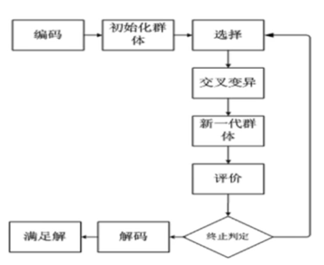

<!--
 * @version:
 * @Author:  StevenJokess（蔡舒起） https://github.com/StevenJokess
 * @Date: 2023-05-26 22:47:02
 * @LastEditors:  StevenJokess（蔡舒起） https://github.com/StevenJokess
 * @LastEditTime: 2023-06-17 23:33:18
 * @Description:
 * @Help me: make friends by a867907127@gmail.com and help me get some “foreign” things or service I need in life; 如有帮助，请赞助，失业3年了。
 * @TODO::
 * @Reference:
-->
# 进化算法

## 概述

进化算法 (Evolutionary Algorithms) 包括遗传算法 (Genetic Algorithms)、进化规划 (Evolutionary Programming)、进化策略 (Evolution Strategies) 及遗传编程 (Genetic Programming)。它们都是借鉴生物界中进化与遗传的机理, 用于解决复杂的工程技术问题。

## 生物界中进化与遗传的机理

地球上的生物, 都是经过长期进化而形成的。根据达尔文的自然选择学说, 地球上的生物具有很强的繁殖能力。在繁殖过程中, 大多数生物通过遗传, 使物种保持相似的后代; 部分生物由于变异, 后代具有明显 差别, 甚至形成新物种。正是由于生物的不断繁殖后代, 生物数目大量增加, 而自然界中生物赖以生存的 资源却是有限的。因此, 为了生存, 生物就需要竞争。生物在生存竞争中, 根据对环境的适应能力, 适者 生存, 不适者消亡。自然界中的生物, 就是根据这种优胜劣汰的原则, 不断地进行进化。进化算法就是借 角生物进化的规律, 通过繁殖竞争再繁殖再竞争, 实现优胜劣汰, 一步一步地逼近问题的最优解。

生物的主要遗传方式是复制。遗传过程中，父代的遗传物质DNA分子被复制到子代，以此传递遗传信息。 生物在遗传过程中还会发生变异。变异方式有3种: 基因重组、基因突变和染色体变异。

- 基因重组是控制物种性状的基因发生重新组合。
- 基因突变是指基因分子结构的改变。
- 染色体变异是指染色体在结构上或数目上的变化。[1]

## 进化算法（EA）

进化算法中，仿效生物的遗传方式，主要采用复制（选择）、交换（交叉/重组）、突变（变异）这3种遗传操作，衍生下一代的个体。

进化算法都是从一组随机生成的初始个体出发，经过选择、交叉、变异等操作，并根据适应度大小进行个体的优胜劣汰，提高新一代群体的质量，再经过多次反复迭代，逐步逼近最优解。从数学角度讲，进化算法实质上是一种搜索寻优的方法进化算法和传统的搜索寻优方法有很大的不同，它不要求所研究的问题是连续、可导的，但是却可以很快地得出所要求的最优解。进化算法的基本流程如下：

进化算法的搜索方式特点如下:

1. 有指导搜索。进化算法的搜索策略, 既不是盲目搜索, 也不是穷举搜索, 指导进化算法执行搜索的依据是适应度, 也就是它的目标函数。在适应度的驱动下, 进化算法逐步逼近目标值。
2. 自适应搜索。进化算法在搜索过程中, 借助选择、交叉、变异等进化操作, 体现 “适者生存” 的自然选择规律, 无需添加任何额外的作用, 就能使群体的品质不断得到改进。
3. 并行式搜索。进化算法每一代运算都是针对一组个体同时进行, 而不是只对单个个体。因此, 进化算法是一种多点齐头并进的并行算法。
4. 全局最优解。进化算法由于采用多点并行搜索, 而且每次迭代借助交叉和变异产生新个体, 不断扩大搜索范围, 因此进化算法容易搜索出全局最优解而不是局部最优解。
5. 黑箱式结构。从某种意义讲, 进化算法只研究输人与输出的关系, 并不深究造成这种关系的原因, 因此便于处理因果关系不明确的问题。
6. 通用性强。传统的优化算法, 需要将所解决的问题用数学式子表达, 而且要求该数学函数的一阶异或二阶导数存在。进化算法, 只用某种编码方式表达问题, 然后根据适应度区分个体优劣, 其余的化操作都是统一的。虽然如此, 进化算法的编码问题以及合适的进化操作算子的选择是需要针对具体问题进化分析, 有时难以构造与选择。

## 遗传算法（GA）

遗传算法(Genetic Algorithms,简称GA)是由密歇根大学的约翰.亨利·霍兰德(John HenryHolland)和他的同事于二十世纪六十年代在对细胞自动机(cellular automata)进行研究时率先提出。在二十世纪八十年代中期之前，对于遗传算法的研究还仅仅限于理论方面，直到在匹兹堡召开了第一届世界遗传算法大会。随着计算机计算能力的发展和实际应用需求的增多，遗传算法逐渐进入实际应用阶段。1989年，纽约时报作者约翰.马科夫(John Markoff)写了一篇文章描述第一个商业用途的遗传算法一进化者(Evolver)。之后，越来越多种类的遗传算法出现并被用于许多领域中，财富杂志500强企业中大多数都用它进行时间表安排、数据分析、未来趋势预测、预算、以及解决很多其他组合优化问题。

在遗传算法里，优化问题的解被称为个体(individual),它表示为一个参数列表，叫做染色体(chromosome)或者基因串。染色体一般被表达为简单的数字串，不过也有其他的表示方法适用，这一过程称为编码(encode)。一开始，算法随机生成一定数量的个体，有时候操作者也可以对这个随机产生过程进行干预，播下已经部分优化的种子。在每一代中，每一个个体都被评价，并通过计算适应度函数得到一个适应度数值。种群(population)中的个体被按照适应度(fitness)排序，适应度高的在前面。

下一步是产生下一代个体并组成种群。这个过程是通过选择(select)、交叉(crossover)、变异(mutation)完成的。选择是根据新个体的适应度进行的，适应度越高，被选择的机会越高，而适应度低的，被选择的机会就低。初始的数据可以通过这样的选择过程组成一个相对优化的群体。之后，被选择的个体进行交叉，一般的遗传算法都有一个交叉概率，每两个个体通过交叉产生两个新个体，代替原来的“老”个体，而不交叉的个体则保持不变。

### 遗传算法的基本原理

在遗传算法里，优化问题的解被称为个体(individual),它表示为一个参数列表，叫做染色体(chromosome)或者基因串。染色体一般被表达为简单的数字串，不过也有其他的表示方法适用，这一过程称为编码(encode)。一开始，算法随机生成一定数量的个体，有时候操作者也可以对这个随机产生过程进行干预，播下已经部分优化的种子。在每一代中，每一个个体都被评价，并通过计算适应度函数得到一个适应度数值。种群(population)中的个体被按照适应度(fitness)排序，适应度高的在前面。

下一步是产生下一代个体并组成种群。这个过程是通过选择(select)、交叉(crossover)变异(mutation)完成的。选择是根据新个体的适应度进行的，适应度越高，被选择的机会越高，而适应度低的，被选择的机会就低。初始的数据可以通过这样的选择过程组成一个相对优化的群体。之后，被选择的个体进行交叉，一般的遗传算法都有一个交叉概率，每两个个体通过交叉产生两个新个体，代替原来的“老”个体，而不交叉的个体则保持不变。

再下一步是变异，通过变异产生新的“子”个体。一般遗传算法都有一个固定的变异常数，通常是01或更小，这代表变异发生的概率。根据这个概率，新个体的染色体随机的突变，通常就是改变染色体的一个位(0变到1，或者1变到0)。

经过这一系列的过程（选择、交叉和变异），产生的新一代个体不同于初始的一代，并一代一代向增加整体适应度的方向发展，因为最好的个体总是更多的被选择去产生下一代，而适应度低的个体逐渐被淘汰掉。这样的过程不断的重复，直到终止条件满足为止。

基本遗传算法的流程如下所述：

TODO:

## GA 和 ES 之间的关系

### 1. 相同点

GA(遗传算法)和ES(进化规划)都是从随机产生的初始可行解出发，经过进化择优，逐渐逼近最优解。其次是两者都是渐进式搜索寻优，经过多次的反复迭代，不断扩展搜索范围，最终找出全局最优解。两种进化算法都采用群体的概念。同时驱动多个搜索点，体现并行算法的特点。此外，两种算法在自适应搜索、有指导的搜索、全局式寻优以及黑箱结构等方面，都很相似。

### 2. 差别点

表达方式上的差别：

- 进化策略采用十进制的实型数表达问题，便于处理连续的优化计算类课题。进化策略源于函数优化处理，它是一种类似于爬山问-题的优化方法。
- 遗传算法常采用二进制编码表达问题，更适宜处理离散型问题。遗传算法起源于自适应搜索，强调全方位探查。

算子的差别：

- 进化策略的重组算子，不仅可以复制父代个体的部分信息，而且还可以通过中值计算产生新的信息。变异是进化策略和遗传算法都采用的算子名称，然而实际应用上有明显差别。进化策略的变异是在旧个体基础上添加一个正态分布的随机数，从而产生新个体。此外，变异是进化策略的主要进化手段，每个新个体都经历变异。
- 在遗传算法中，仅仅某些个体的个别位发生变异，它不及复制、交叉那样重要。

选择是进化策略和遗传算法差别最明显的一种操作：

- 进化策略从 $\lambda$ 个新个体或从 $\lambda+\mu$ 个个体中挑选中 $\mu$ 个体组成新群体，而且挑选方法是确定型的。
- 遗传算法的选择体现在复制中，它从旧群体中择优插人新群体，而且挑选方法是随机的轮盘法，优良个体入选概率高。

执行顺序的差别：

- 进化策略的进化顺序是先执行重组，随之为变异，最后才是选择。进化策略的重组和变异都是针对同一旧个体依次进行。
- 遗传算法最先执行选择及复制，其次为交叉，最后是变异。遗传算法的交叉和变异不一定会发生在同一旧个体上。

### 3. 相互借鉴

进化策略和遗传算法作为进化算法的两个分支，是独立出现及平行发展，在长期实践中它们又相互借鉴，不断完善。在问题的表达方式上，遗传算法已从原来的二进制编码扩展为用十进制实数表达问题，并相应改变变异等算子。在算子方面，最早的进化策略只有变异算子，然后才添加重组算子。

对于变异算子，遗传算法不如进化策略那样重视，通常变异概率P的取值都很小，近年来不少人提高变异概率。遗传算法的交叉算子也有向进化策略的重组算子靠拢的迹象。在参数的自适应调整方面，进化策略的这一特征也开始渗透到遗传算法中。例如，遗传算法中的群体规模、变异概率己不再是常数，它们可随时间而变化。

进化规划和进化策略分别在美国和德国单独出现，随后又各自平行发展。这两种进化算法既有差别，又有相似之处。进化规划和进化策略的差别主要表现在：进化规划没有重组算子，只依靠变异产生新个体。进化策略采用重组和变异两种手段产生新个体。关于重组和变异的作用一直存在争论，有人强调变异的作用，有人重视重组，还有人主张兼容二者。随着两者的不断发展，进化策略与进化规划的差异逐渐不明显。

https://zhuanlan.zhihu.com/p/189010215s

应用于证券投资：http://59.252.42.34:6251/Qw/Paper/168437#anchorList

[1]: https://www.bilibili.com/video/BV1iN411o7N1/
[2]: https://www.bilibili.com/video/BV1kK4y1R7rv/
[3]: https://easyai.tech/ai-definition/genetic-algorithm/

