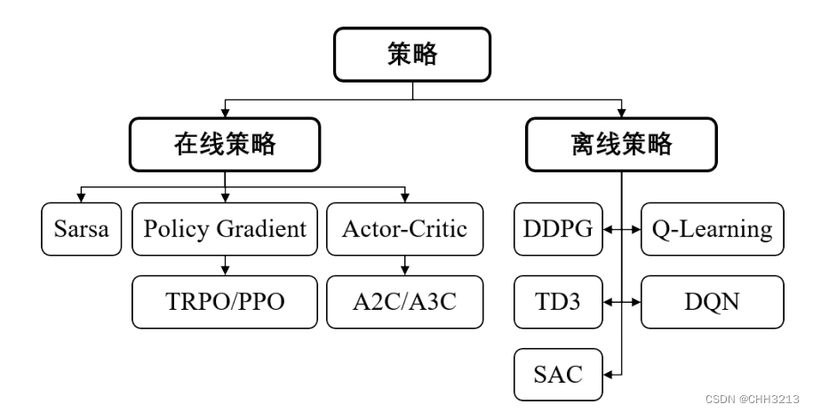

# 离策略专题

本章节主要介绍异策略的定义、作用，重要性采样，以及异策略蒙特卡洛和蒙特卡洛梯度下降算法。

## 行为策略和目标策略

定义：

- 行为策略（behavior policy）：采样数据的策略为行为策略（behavior policy），通常是随机策略，去采取非最优行动，生成探索性的样本，以保证探索到最优行动
- 目标策略（target policy）：称用这些数据来更新的策略为目标策略（target policy），即待优化的，通常是确定性策略。[1]

## 算法机制的分类：同策略和异策略

- 同策略（on-policy），又叫在轨策略，表示行为策略和目标策略是同一个策略；例如，Sarsa，其计算时序差分的价值目标的数据来自当前的策略。
- 异策略（off-policy），又叫离线策略，表示行为策略和目标策略并非同一个策略（off表达行为策略【偏离】目标策略的意思）。例如，Q-learning，其计算时序差分的价值目标的数据不来自当前的策略。

## RL算法的分类

## 同策略和异策略各自的优缺点

同策略（on-policy）：

- 优点：更加直接，快，但是不一定最优（optimal）。
- 缺点：不使用旧的数据，这样就会导致其样本效率（sample efficiency）较低。

异策略（off-policy）：

- 优点：更加通用和健壮，因为其数据来源多样随机，可以覆盖的行为范围广。
- 缺点：收敛慢。[6]

## 蒙特卡洛控制的假设难满足，需要异策略

蒙特卡洛控制问题，基本思想是广义策略迭代（GPI），同时维护一个近似的策略和近似的价值函数，价值函数会不断迭代使其更加精确地近似对应当前策略的真实价值函数，而当前的策略也会根据当前的价值函数不断调优。两个过程相互影响，他们互相为对方确定一个变化的优化目标，并最终都趋向最优解。

蒙特卡洛控制为了让智能体持续不断地选择所有可能的动作，提出两种方案，分别是同轨策略和离轨策略。同轨策略中，用于生成采样数据的策略和待优化的策略是相同的；而在离轨策略中则是不同的。

首先回顾一种同轨策略——贪心策略，在绝大多数时候贪心地选择最大价值的动作，但同时以一个比较小的概率 随机选择一个动作。即对所有的非最大价值的动作，都有 $\frac{\epsilon}{|A(s)|}$ 的概率被 选中，那么对于最大价值的动作，以 $1-\epsilon+\frac{\epsilon}{|A(s)|}$ 概率被选中。

为解决MC保证有充分的探索，即确保找到能最优动作，一个简单的方法就是使用探索性开头（exploring starts），让每个回合（episode）从不同的状态开始，从而**使得所有状态都能探索到。**当然这个假设有时候不切实际，故，我们引入异策略机制。

## 异策略（off-policy）的问题

异策略（off-policy）是有偏差的，因为目标策略的评估需要期望回报，但是我们只有行动策略的回报，这样计算出来的价值函数是不准确的，所以就需要重要度采样来弥补，几乎所有的离轨策略都采用了重要度采样。下面具体介绍重要度采样。

## 重要性采样（Importance Sampling）

目标策略和行动策略同轨迹下的相对概率，就是重要性采样。

### 离散变量的重要性采样：

$$
\rho_{t: T-1}=\frac{\prod_{k=t}^{t-1} \pi\left(A_k \mid S_k\right) p\left(S_{k+1} \mid S_k, A_k\right)}{\prod_{k=t}^{t-1} b\left(A_k \mid S_k\right) p\left(S_{k+1} \mid S_k, A_k\right)}=\prod_{k=t}^{t-1} \frac{\pi\left(A_k \mid S_k\right)}{b\left(A_k \mid S_k\right)}
$$

那么在目标策略的评估中，价值函数的计算就可以利用行动策略的回报与重要度采样之积，求得:

$$
v_\pi=\mathbb{E}\left(\rho_{t: T-1} G_t \mid S_t=s\right)
$$

### Off-policy MC 伪代码

- Off-policy MC control, for estimating $\pi \approx \pi_*$
- Initialize, for all $s \in \mathcal{S}, a \in \mathcal{A}(s)$ :

  - $Q(s, a) \leftarrow \text { arbitrary } $
  - $C(s, a) \leftarrow 0 $
  - $\pi(s) \leftarrow \argmax _a Q\left(S_t, a\right) $ (with ties broken consistently)
- Repeat forever:
  - $b \leftarrow \text { any soft policy }$
  - Generate an episode using  b:
    - $\quad S_0, A_0, R_1, \ldots, S_{T-1}, A_{T-1}, R_T, S_T $
  - $G \leftarrow 0$
  - $W \leftarrow 1$
  - $\text { For } t=T-1, T-2, \ldots \text { down to } 0:$
    - $\quad G \leftarrow \gamma G+R_{t+1}$
    - $C\left(S_t, A_t\right) \leftarrow C\left(S_t, A_t\right)+W$
    - $Q\left(S_t, A_t\right) \leftarrow Q\left(S_t, A_t\right)+\frac{W}{C\left(S_t, A_t\right)}\left[G-Q\left(S_t, A_t\right)\right] $
    - $\pi\left(S_t\right) \leftarrow \operatorname{argmax} \max _a   Q\left(S_t, a\right) $(with ties broken consistently)
    - $\quad \text { If } A_t \neq \pi\left(S_t\right) \text { then   exit For loop }$
    - $\quad W \leftarrow W \frac{1}{b\left(A_t \mid S_t\right)}$

### 连续变量的重要性采样：

考虑一个场景，假如正在尝试计算函数 $f(x)$ 的期望值，其中 $x \sim p(x)$ 服从某种分布。则对 $E(f(x))$ 有以下估计:

$$
E_{x \sim p}[f(x)]=\int f(x) p(x) d x \approx \frac{1}{n} \sum_i f\left(x_i\right)
$$

蒙特卡洛抽样方法是简单地从分布 $p(x)$ 中抽出 $x$ ，然后取所有样本的平均值来得到期望值的估 计。那么问题来了，如果 $p(x)$ 非常难取样怎么办? 是否能够根据一些已知的、容易抽样的分布来 估计期望值？

答案是肯定的。公式的一个简单转换就可以做到

$$
E_{x \sim p}[f(x)]=\int f(x) p(x) d x=\int f(x) \frac{p(x)}{q(x)} q(x) d x=E_{x \sim q}\left[f(x) \frac{p(x)}{q(x)}\right]
$$

其中 $x$ 从分布 $q(x)$ 中采样， $q(x)$ 不应为 0。通过这种方式，估计期望能够从另一个分布 $q(x)$ 中 采样， $p(x) / q(x)$ 是称为采样率或采样权重，它作为校正权重以抵消来自不同分布的概率采样。

该公式称为普通重要性采样（ordinary importance sampling）。

### 重要性采样的缺陷

虽然重要性采样保证了期望的一致，但是这里来计算一下方差是否一致

方差的计算：

$$
\operatorname{Var}[X]=E\left[X^2\right]-(E[X])^2
$$

分别计算方差：

$$
\begin{gathered}
\operatorname{Var}_{x \sim p}[f(x)]=E_{x \sim p}\left[f(x)^2\right]-\left(E_{x \sim p}[f(x)]\right)^2 \\
\operatorname{Var}_{x \sim q}\left[f(x) \frac{p(x)}{q(x)}\right]=E_{x \sim q}\left[\left(f(x) \frac{p(x)}{q(x)}\right)^2\right]-\left(E_{x \sim q}\left[f(x) \frac{p(x)}{q(x)}\right]\right)^2 \\
=E_{x \sim p}\left[f(x)^2 \frac{p(x)}{q(x)}\right]-\left(E_{x \sim p}[f(x)]\right)^2
\end{gathered}
$$

可以发现两者虽然期望相等但方差并不一致，甚至方差有可能无穷大（unbound）。为了解决普通重要性采样的方差无穷大问题，我们会经常使用另一种【加权重要性采样（weighted importance sampling）】

### 加权重要性采样

令公式（1）中 $\rho(x_i^`)=\frac{p(x_i^`)}{q(x_i^`)}$ ，期望公式改为：

$\hat E[f]=\frac{\sum^m_{i=1}[\rho(x_i^`)f(x_i^`)]}{\sum^m_{i=1}\rho(x_i^`)}$

## 蒙特卡洛的异策略形式

我们令执行策略评估时的策略为 $\mu (a_t|s_t)$ ，目标策略，也就是执行策略提升时候的策略为 $\pi(a_t|s_t)$ ，对于一条给定的轨迹 $[s_0,a_0,r_0,s_1,a_1,r_1,...,s_T]$ ，使用策略 $\pi$ 和策略 $\mu$ 产生该轨迹的概率分别是

P^{\pi}=\prod_{t=0}^{T-1}\pi(a_t|s_t)p(s_{t+1}|s_t,a_t)\tag{3}

P^{\mu}=\prod_{t=0}^{T-1}\mu(a_t|s_t)p(s_{t+1}|s_t,a_t)\tag{4}

由公式（3）（4）可得

\begin{align} \rho(T)&=\frac{\prod_{t=0}^{T-1}\pi(a_t|s_t)p(s_{t+1}|s_t,a_t)}{\prod_{t=0}^{T-1}\mu(a_t|s_t)p(s_{t+1}|s_t,a_t)}\\ &=\frac{\prod_{t=0}^{T-1}\pi(a_t|s_t)}{\prod_{t=0}^{T-1}\mu(a_t|s_t)} \end{align}\tag{5}

可以看到，状态转移概率被消掉了

于是，我们对Q函数期望的估计更新为下面的形式

由公式1的普通重要性采样得：

\begin{align} \bar q_N(s,a) = \frac{1}{N}\sum^N_{i=1}\rho_iq_i(s,a) \end{align}\tag{6}

或者，由公式2的加权重要性采样得：

\begin{align} \bar q_N(s,a) = \frac{\sum^N_{i=1}[\rho_iq_i(s,a)]}{\sum^N_{i=1}\rho_i} \end{align}\tag{7}

由于加权的重要性采样应用更广泛，下面推导重要性采样公式的递增形式：

加权重要性采样的递增形式（Incremental Implementation Of Weighted Importance Sampling)
令C_N= \sum^N_{i=1}\rho_i=C_{N-1}+\rho_N\\

$$
\begin{align} q_N(s,a) &= \frac{\sum^N_{i=1}[\rho_iq_i(s,a)]}{C_N}\\ &=\frac{\sum^{N-1}_{i=1}\rho_i}{C_N}\frac{\sum_i^{N-1}[\rho_iq_i(s.a)]+\rho_Nq_N(s,a)}{\sum^{N-1}_{i=1}\rho_i}\\ &=\frac{C_N-\rho_N}{C_N}q_{N-1}(s,a) + \frac{\rho_Nq_N(s,a)}{C_N}\\ &=q_{N-1}(s,a)+\frac{\rho_N}{C_N}[q_N(s,a)-q_{N-1}(s,a)] \end{align}\tag{8}
$$

并且注意，由公式（5）， $\rho_N = \rho_{N-1}\frac{\pi(a_N|s_N)}{\mu(a_N|s_N)}$ ，也是一种递归的表达。

以下这里不太理解

要注意的是，由于我们的策略是确定性策略，也就是 $\pi(a_t|s_t)$ 对于 $a_t=\pi(a_t|s_t)$ 始终为1。于是上式 $\rho$ 的迭代形式简化为：

$\rho_N = \rho_{N-1}\frac{1}{\mu(a_N|s_N)}$

## 异策略蒙特卡洛（递增形式）算法（every visit）

- 初始化:
  - $Q(s, a) \leftarrow$ arbitrary
  - $C(s, a) \leftarrow 0$
  - $\mu(a \mid s) \leftarrow$ an arbitrary soft behavior policy
  - $\pi(a \mid s) \leftarrow$ an arbitrary target policy
- for $\min [1,2,3, \ldots], \mathrm{m}$ 是总的迭代次数
  - 与环境交互获取状态-动作序列: $\left[s_0, a_0, r_0, \ldots, s_T, a_T, r_T, s_{T+1}\right]$
  - $G(S, A) \leftarrow 0$
  - $\rho \leftarrow 1$
  - for $t=T, T-1, \ldots, 0$ :
    - $g\left(s_t, a_t\right)=\gamma g\left(s_t, a_t\right)+r_t$
    - $C\left(s_t, a_t\right) \leftarrow C\left(s_t, a_t\right)+\rho$
    - $q\left(s_t, a_t\right) \leftarrow q\left(s_t, a_t\right)+\frac{\rho}{C\left(s_t, a_t\right)}\left[g\left(s_t, a_t\right)-q\left(s_t, a_t\right)\right]$ 对应公式 (8)
    - $\rho \leftarrow \rho \frac{1}{\mu\left(a_t \mid s_t\right)}$
    - $\pi\left(s_t\right) \leftarrow \operatorname{argmax}_a q\left(s_t, a_t\right)$ ，由于序列已经采样好，所以策略在for循环内更新更 在for循环外再加一层for更新策略没有区别

code:https://github.com/CHH3213/chhRL/blob/master/02-chh_MonteCarlo/MC_OffPolicy.py

## Off-policy MC的总结

- 同轨策略（On-policy）：在蒙特卡罗方法中，如果采样策略是 $π^ϵ(s)$ ，不断改进策略也是 $π^ϵ(s)$而不是目标策略 $π^ϵ(s)$。这种采样与改进策略相同（即都是 $π^ϵ(s)$）的强化学习方法叫做同策略（on policy）方法。
- 异轨策略（Off-policy）：如果采样策略是 $π^ϵ(s)$，而优化目标是策略π，可以通过重要性采样，引入重要性权重来实现对目标策略$π$ 的优化。这种采样与改进分别使用不同策略的强化学习方法叫做异策略（off policy）方法。[2]

## off-policy 梯度下降

我们使用重要性采样将 on-policy 调整为 off-policy

$$
\nabla \bar{R}_\theta=E_{\tau \sim p_{\theta^{\prime}}(\tau)}\left[\frac{p_\theta(\tau)}{p_{\theta^{\prime}}(\tau)} R(\tau) \nabla \log p_\theta(\tau)\right]
$$

- 从 $\theta^{\prime}$ 采样得到数据集
- 使用该 数据集多次训练 $\theta$

梯度更新过程：

$$
\begin{aligned}
& =E_{\left(s_t, a_t\right) \sim \pi_\theta}\left[A^\theta\left(s_t, a_t\right) \nabla \log p_\theta\left(a_t^n \mid s_t^n\right)\right] \\
& =E_{\left(s_t, a_t\right) \sim \pi_{\theta^{\prime}}}\left[\frac{p_\theta\left(s_t, a_t\right)}{p_{\theta^{\prime}}\left(s_t, a_t\right)} A^{\theta^{\prime}}\left(s_t, a_t\right) \nabla \log p_\theta\left(a_t^n \mid s_t^n\right)\right] \\
& =E_{\left(s_t, a_t\right) \sim \pi_{\theta^{\prime}}}\left[\frac{p_\theta\left(a_t \mid s_t\right)}{p_{\theta^{\prime}}\left(a_t \mid s_t\right)} \frac{p_\theta\left(s_t\right)}{p_{\theta^{\prime}}\left(s_t\right)} A^{\theta^{\prime}}\left(s_t, a_t\right) \nabla \log p_\theta\left(a_t^n \mid s_t^n\right)\right] \\
& =E_{\left(s_t, a_t\right) \sim \pi_{\theta^{\prime}}}\left[\frac{p_\theta\left(a_t \mid s_t\right)}{p_{\theta^{\prime}}\left(a_t \mid s_t\right)} A^{\theta^{\prime}}\left(s_t, a_t\right) \nabla \log p_\theta\left(a_t^n \mid s_t^n\right)\right]
\end{aligned}
$$

- 其中 $A^\theta\left(s_t, a_t\right)$ 指的是 advantage 函数，其计算方式为加上衰减机制后的奖励值并减去基线。
- 由于 $\frac{p_\theta\left(s_t\right)}{p_{\theta^{\prime}}\left(s_t\right)}$ 的值难以计算，将其设置为 1 ，约去，简化计算

### 目标函数

由于 $\nabla f(x)=f(x) \nabla \log f(x)$ 再结合不定积分，目标函数可以表示为：

$$
J^{\theta^{\prime}}(\theta)=E_{\left(s_t, a_t\right) \sim \pi_{\theta^{\prime}}}\left[\frac{p_\theta\left(a_t \mid s_t\right)}{p_{\theta^{\prime}}\left(a_t \mid s_t\right)} A^{\theta^{\prime}}\left(s_t, a_t\right)\right]
$$

### off-policy 可代替的前提

重要性采样解决了采样效率的问题，但也可能会引入新问题。

我们再来看下重要性采样的公式：$E_{x\sim p}[f(x)]=E_{x\sim q}[f(x)\frac{p(x)}{q(x)}]$，虽然它们期望是相等的，但它们的方差如何呢？根据方差计算公式 ${Var} [X]=E[X^2]-(E[X])^2$，分别计算出 $f(x)$ 和 $f(x)\frac{p(x)}{q(x)}$ 的方差：

可以看到 2 个方差的第一项是不同的，$\operatorname{Var}_{x \sim q}\left[f(x) \frac{p(x)}{q(x)}\right]d$ 的第一项多乘了 $\frac{p(x)}{q(x)}$ ，如果 $\frac{p(x)}{q(x)} $ 差距很大，$p_{\theta}\left(a_{t} | s_{t}\right)$ 的方差就会很大。

也就是说如果 $p_{\theta}\left(a_{t} | s_{t}\right)$ 与 $p_{\theta'}\left(a_{t} | s_{t}\right)$  相差太大，即这两个分布相差太多，重要性采样的结果就会不好。也就是说通过有限次的采样，如果 $p(x)$ 和 $q(x)$ 的差距过大，我们是无法保证这个期望的等式在采样数据上一定成立。[5]

那如何避免 “ $p_\theta$ 和 $p_{\theta^{\prime}}$ 差太多”? 后面将利用信任区域策略优化 TRPO 和 近端优化策略 PPO [4]

## 为什么TRPO，PPO是on-policy的呢？

TRPO的objective中包含了重要性采样来补偿training data distribution 和真实的policy state distribution 之间的差距，也就是
$$
\begin{gathered}
J(\theta)=\sum_{s \in S} \rho_{\pi_{\theta_{\text {old }}}}(s) \sum_{a \in A} \pi_{\theta_{\text {old }}}(a \mid s) \frac{\pi_\theta(a \mid s)}{\pi_{\theta_{\text {old }}}(a \mid s)} A_{\pi_{\theta \text { old }}}(s, a) \\
=\mathbb{E}_{s \sim \rho_{\pi_\theta}, a \sim \pi_{\theta_{\text {old }}}}\left[\frac{\pi_\theta(a \mid s)}{\pi_{\theta_{\text {old }}}(a \mid s)} A_{\pi_{\theta_{\text {old }}}}(s, a)\right]
\end{gathered}
$$

TRPO希望maximize这个objective J( $($ theta) 同时满足一个trust region constraint $\mathbb{E}_{s \sim \rho_{\pi_{\theta_{\text {old }}}}}\left[D_{\mathrm{KL}}\left(\pi_{\theta_{\text {old }}}(\cdot \mid s) \| \pi_\theta(\cdot \mid s)\right)\right] \leq \delta$ 来保证old和updated policy不会差太多。

而PPO通过改进objective为surrogate objective

$$
J(\theta)=\mathbb{E}_{s, a \sim \pi_{\theta_{\text {old }}}}\left[\min \left(r(\theta) A_{\pi_{\theta_{\text {old }}}}(s, a), \operatorname{clip}(r(\theta), 1-\epsilon, 1+\epsilon) A_{\pi_{\theta_{\text {old }}}}(s, a)\right)\right]
$$

，使得PPO可以使用一阶优化方法求解 (TRPO需要使用二阶优化方法)。

那么，问题来了，TRPO，PPO看起来都是根据old policy的分布来做importance sampling。但是，off-policy的算法可以使用任意的策略的数据来更新当前的策略，TRPO却是使用 $\theta_k$ 采样的数据来更新 $\theta_k$ 到 $\theta_{k+1}$ ，符合on-policy的定义，只不过更新中优化的目标函数 (surrogate objective function) 中有未知的action分布 (与需要优化求解的策略 $\theta$有关)，使用了 $\theta_k$ 采集的数据和importance sampling系数来估计和表示。
off-policy算法的策略更新是带importance sampling系数的策略梯度上升，而TRPO的每步更新则是一个优化问题，这个优化问题TRPO论文采用的方法是泰勒展开目标函数和约束，然后根据拉格朗日对偶和线性搜索得到。PPO是用的多步的梯度上升来优化clip的目标函数，了解了TRPO就知道PPO也是使用 $\theta_k$ 采样的数据来更新 $\theta_k$ 到 $\theta_{k+1}$ ，属于on-policy的算法，但由于使用了多步的梯度上升进行优化，看起来更像off-policy策略更新了，但其实优化过程中的 $\theta$ 只是优化过程的中间产物，并没有用于采样新的trajectory。

$\mathrm{PPO}$ 是计算 $V(s)$ 的，是 $Q(s, a)$ 关于策略的积分，所以策略一变 $V$ 马上就会改变，因此用旧策略产生的数据来更新 $V$ 是计算不出新策略的 $V$ 的。PPO的解决方案是通过旧策略采样来估算新策略的 $V$ 值，本质还是在计算当前策略的 $V$ 。当新旧策略相差不大时，两者的交集占新策略的很大一部分 (想象两个隔得很近的高斯分布的交集)，可以通过旧策略乘以概率的比例来估计新策略的 $V$ 值。当新旧策略相差很大时，两者的交集只是新策略的一个角落 (想象两个隔得很远的高斯分布的交集)，旧策略的采样的只能有效估计新策略的一个角落，因此无法正常估计新策略的 $V$ 值。虽然采样的策略是旧策略，但是通过概率比值已经等效为新策略在采样，可以理解为采样的策略和更新的策略都是新策略，所以ppo是on-policy 的。

总结来说，PPO是通过旧策略采样来估算新策略的 $V$ 值，本质还是在计算当前策略采样得到的 $V$ ，所以采样的策略和更新的策略是同一个策略，所以它是on-policy。[7]

[1]: https://zhuanlan.zhihu.com/p/360265418
[2]: https://zhuanlan.zhihu.com/p/594578726
[3]: https://zhuanlan.zhihu.com/p/614049308
[4]: https://windmissing.github.io/DeepLearningNotes/RL/Policy4.html
[5]: https://my.oschina.net/u/4939618/blog/10097837
[6]: https://www.zhihu.com/column/c_1319989673767755776
[7]: https://zhuanlan.zhihu.com/p/420254841
