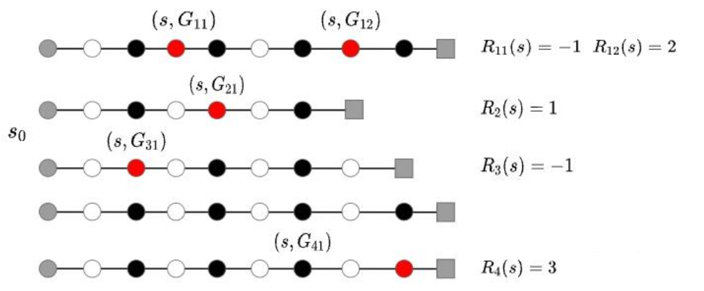

# 以价值函数为训练手段的强化学习

## 表格型方法 （Tabular Methods）[7]

用Q函数(也就是状态- 动作价值函数)来判断在什么动作下能够拿到最大奖励。这个奖励是个总体的奖励，是后面状态的累加和。要清楚的意识到，奖励的本质也是价值。

从Q函数的定义中知道，它就是在某一个状态下执行某一个动作的价值。设想如果我们能够记录下来所有的Q函数值，也就是知道了一个状态下执行每一个动作的价值有多少。那不是可以选取最高价值的动作了吗？这不就是最优策略！把所有的状态对应所有的动作的价值都记录下，就会形成一张表格，这就是Q表格。也是本篇主要的研究对象。当然最开始生成的Q表格因为与环境交互少，效果不一定好。所以Q表格内容也是在不断优化更新的。Q表格中纵轴是状态，横轴是动作。[6]

## 蒙特卡洛方法

**蒙特卡洛方法（Monte-Carlo methods）**也被称为**统计模拟方法**，是一种基于概率统计中大数定律[5]的数值计算方法。运用蒙特卡洛方法时，我们通常使用重复随机抽样，然后运用概率统计方法来从抽样结果中归纳出我们想求的目标的数值估计。它和下一节动态规划的区别是，它不需要掌握MDP具体细节，也可以不知道状态转移概率和奖励。是直接从智能体与环境的交互的*完整*轨迹来进行学习。

> 一个简单的例子是用蒙特卡洛方法来计算圆的面积。大家可去网站[2]进行观看。
>
> 在正方形内部随机产生若干个点，细数落在圆中点的个数，圆的面积与正方形面积之比就等于圆中点的个数与正方形中点的个数之比。如果我们随机产生的点的个数越多，计算得到圆的面积就越接近于真实的圆的面积：
>
> $$
> \frac{\text { 圆的面积 }}{\text { 正方形的面积 }}=\frac{\text { 圆中点的个数 }}{\text { 正方形中点的个数 }}
> $$

我们现在介绍如何用蒙特卡洛方法来估计一个策略在一个马尔可夫决策过程中的状态价值函数。回忆一下，一个状态的价值是它的期望回报，那么一个很直观的想法就是用策略在 MDP 上采样很多条序列，计算从这个状态出发的回报
，是利用**经验平均**代替随机变量的期望[11]，

> 何为经验：是指利用该策略做很多次试验，产生很多幕数据。

具体公式如下：

$$
V^\pi(s)=\mathbb{E}_\pi\left[G_t \mid S_t=s\right] \approx \frac{1}{N} \sum_{i=1}^N G_t^{(i)}
$$

另外注意: 当一幕结束进行更新时， $G_t$ 是反向进行计算的，即最后一状态的奖励为 $R_t$ ，倒数第二奖励为 $y R_{t-1} \cdots$

在一次序列中，可能没有出现过这个状态，可能只出现过一次这个状态，也可能出现过很多次这个状态。我们下面介绍的蒙特卡洛价值估计方法，是**每访蒙特卡洛法**，它会在该状态每一次出现时计算它的回报。还有一种选择，叫**初访蒙特卡洛法**[5]，是一条序列只计算一次回报，也就是这条序列第一次出现该状态时计算后面的累积奖励，而后面再次出现该状态时，该状态就被忽略了。

## 每访（every visit）蒙特卡洛法

假设我们现在用策略从状态开始采样序列，据此来计算状态价值。我们为每一个状态维护一个计数器和总回报，计算状态价值的具体过程如下所示。

### (1) 探索性初始化：

无模型的方法充分评估策略值函数的前提是每个状态都能被访问到。探索性初始化是指每个状态都有一定的几率作为初始状态。

$ s \in S, a \in A(s), Q(s, a) \leftarrow  arbitrary, $

$ \pi(s) \leftarrow arbitrary, \operatorname{Returns} (s, a) \leftarrow emptylist $

### (2) 使用策略采样若干条序列：

$$
s_0^{(i)} \stackrel{a_0^{(i)}}{\longrightarrow} r_0^{(i)}, s_1^{(i)} \stackrel{a_1^{(i)}}{\longrightarrow} r_1^{(i)}, s_2^{(i)} \stackrel{a_2^{(i)}}{\longrightarrow} \cdots \stackrel{a_{T-1}^{(i)}}{\longrightarrow} r_{T-1}^{(i)}, s_T^{(i)}
$$

### (3) 对所有序列中的每一个状态进行策略评估，即计算其平均价值：

- 以状态 $s$ （已红色标注）为例，上图中5条episode，其中4条有状态 $s$ ，那么在计算 $s$ 的价值时，就只以这4条episode中的 $G(s)$ 来计算状态 $s$ 的平均价值。
- 每访(every visit)是使用所有访问到的状态 $s$ 的回报，那么 $v(s)$ 为： $
v(s)=\frac{G_{11}+G_{12}+G_{21}+\ldots}{N(s)}$ ，其中 $N(s)$ 表示状态 $s$ 出现的次数。
  > -而首访(first visit)是只使用每条episode中第一次访问到的状态 $s$ 的回报，上例中的 $v(s)$ 计算为: $v(s)=\frac{G_{11}+G_{21}+\ldots}{N(s)}$
- 更新状态 $s$ 的计数器 $N(s) \leftarrow N(s) + 1$；
- 状态 $s$ 的回报的平均值的计算，方法有两种：
  1. 先更新状态 $s$ 的总回报 $M(s) \leftarrow M(s) + (G-V(s))$；然后，每一个状态的价值可被估计为回报的平均值 $V(s)=M(s) / N(s)$。
  2. 用之前展示过的增量式更新（或累进更新）的方法，去计算状态 $s$ 的期望回报 $V(s) \leftarrow V(s)+\frac{1}{N(s)}(G(s)-V(s))$。
- 然后，根据大数定律，当 $N(s) \rightarrow \infty$ ，有 $V(s) \rightarrow V^\pi(s)$ 。

## 代码

我们接着之前的MDP代码继续。

接下来我们用代码定义一个采样函数。采样函数需要遵守状态转移矩阵和相应的策略，每次将`(s,a,r,s_next)`元组放入序列中，直到到达终止序列。然后我们通过该函数，用随机策略在图 3-4 的 MDP 中随机采样几条序列。

code

可以看到用蒙特卡洛方法估计得到的状态价值和我们用 MRP 解析解得到的状态价值是很接近的。这得益于我们采样了比较多的序列，感兴趣的读者可以尝试修改采样次数，然后观察蒙特卡洛方法的结果。

21点游戏示例：[10]

## 占用度量

3.4 节提到，不同策略的价值函数是不一样的。这是因为对于同一个 MDP，不同策略会访问到的状态的概率分布是不同的。想象一下，图 3-4 的 MDP 中现在有一个策略，它的动作执行会使得智能体尽快到达终止状态 $s_5$ ，于是当智能体处于状态 $s_3$ 时，不会采取“前往 $s_4$”的动作，而只会以 1 的概率采取“前往”的动作，所以智能体也不会获得在状态下采取“前往 $s_5$ ”可以得到的很大的奖励 10。可想而知，根据贝尔曼方程，这个策略在状态的概率 $s_3$ 会比较小，究其原因是因为它没法到达状态 $s_4$。因此我们需要理解不同策略会使智能体访问到不同概率分布的状态这个事实，这会影响到策略的价值函数。

首先我们定义 MDP 的初始状态分布为 $\nu_0(s)$ ，在有些资料中，初始状态分布会被定义进 MDP 的组成元素中。

我们用 $P_t^\pi(s)$ 表示采取策略 $\pi$ 使得智能体在 $t$ 时刻状态为 $s$ 的概率，所以我们有 $P_0^\pi(s)=\nu_0(s)$ ，然后就可以定义一个策略的**状态访问概率分布** (state visitation distribution)：

$$
\nu^\pi(s)=(1-\gamma) \sum_{t=0}^{\infty} \gamma^t P_t^\pi(s)
$$

其中， $1-\gamma$ 是用来使得概率加和为 1 的**归一化因子**。**状态访问概率**表示一个策略和 MDP 交互会访问到的状态的分布。需要注意的是，理论上在计算该分布时需要交互到无穷步之后，但实际上智能体和 MDP 的交互在一个序列中是有限的。不过我们仍然可以用以上公式来表达状态访问概率的思想。

状态访问概率分布有如下性质：

$$
\nu^\pi\left(s^{\prime}\right)=(1-\gamma) \nu_0\left(s^{\prime}\right)+\gamma \int P\left(s^{\prime} \mid s, a\right) \pi(a \mid s) \nu^\pi(s) d s d a
$$

此外，我们还可以定义策略的**占用度量** (occupancy measure)：

$$
\rho^\pi(s, a)=(1-\gamma) \sum_{t=0}^{\infty} \gamma^t P_t^\pi(s) \pi(a \mid s)
$$

它表示动作状态对 $(s, a)$ 被访问到的概率。二者之间存在如下关系：

$$
\rho^\pi(s, a)=\nu^\pi(s) \pi(a \mid s)
$$

进一步得出如下两个定理。

**定理 1**：智能体分别以策略 $\pi_1$ 和 $\pi_2$ 和同一个 MDP 交互得到的占用度量 $\rho^{\pi_1}$ 和 $\rho^{\pi_2}$ 满足

$$
\rho^{\pi_1}=\rho^{\pi_2} \Longleftrightarrow \pi_1=\pi_2
$$

**定理 2**: 给定一合法占用度量 $\rho$ ，可生成该占用度量的唯一策略是

$$
\pi_\rho=\frac{\rho(s, a)}{\sum_{a^{\prime}} \rho\left(s, a^{\prime}\right)}
$$

注意：以上提到的“合法”占用度量是指存在一个策略使智能体与 MDP 交互产生的状态动作对被访问到的概率。

> 由于奖励建立在状态 - 动作对之上，一个策略对应的价值其实就是一个占用度量下对应的奖励的期望，因此寻找最优策略对应着寻找最优的价值函数，而这个价值函数对应的就是最优的占用度量。[5]
>
### 估计占用度量的代码

接下来我们编写代码来近似估计占用度量。这里我们采用近似估计，即设置一个较大的采样轨迹长度的最大值，然后采样很多次，用状态动作对出现的频率估计实际概率。

code

通过以上结果可以发现，不同策略对于同一个状态动作对的**占用度量**是不一样的。

### 策略改进

利用学到的值函数进行策略改进

TODO:

### MC 的优缺点

优点：

1. 不需对模型有了解，不需要知道状态转移概率。
2. MC估计是无偏。(因为没有估计量都是测量的量)

> 蒙特卡洛抽样：
> 假设一组随机变量 $x$,它的均值为 $\mu$，方差为 $\sigma$,即 $$
> E\left(X_i\right)=\mu \quad D\left(X_i\right)=\sigma^2=E(X-E(x))^2
> $$
> 样本均值： $\frac{1}{n} \sum_{i=1}^n x_i$
> 样本均值的期望：$$ E(a)=\frac{1}{n} E\left(\sum_{i=1}^n x_i\right)=\frac{1}{n} \sum_{i=1}^n E\left(x_i\right)=\frac{1}{n} \sum_{i=1}^n \mu=\mu$$
> 即样本均值的期望等于该组随机变量的均值。

缺点：

1. 每一次游戏，都需要先从头走到尾，再进行回溯更新；而其实对于相对复杂的问题，往往在限定的步数内无法探索到最终奖励；以及对于轨迹无终止的情况就不适用。[6]
2. 由于MC是通过采样的方式估计值函数，难点在保证充分的探索。  为解决MC保证有充分的探索，一个简单的方法就是使用exploring starts，让每个episode从不同的状态开始，从而使得所有状态都能探索到。当然这个假设有时候不切实际，因此我们引入离策略机制。让行为策略是一个随机策略以保证探索，而待优化的目标策略是确定性策略。具体可见 [异策略MC](../chapter_off-policy/off-policy_MC.md)

[1]: http://www.icdai.org/ibbb/2019/ID-0004.pdf
[2]: https://what-is-pi.onlyahuman.repl.co/
[3]: https://zhuanlan.zhihu.com/p/437626120#3.3%20GAE
[4]: https://zhuanlan.zhihu.com/p/475800586
[5]: https://www.cnblogs.com/kailugaji/p/16140474.html
[6]: https://www.guyuehome.com/43784
[7]: https://blog.51cto.com/u_15279775/2937884
