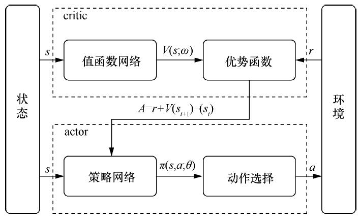
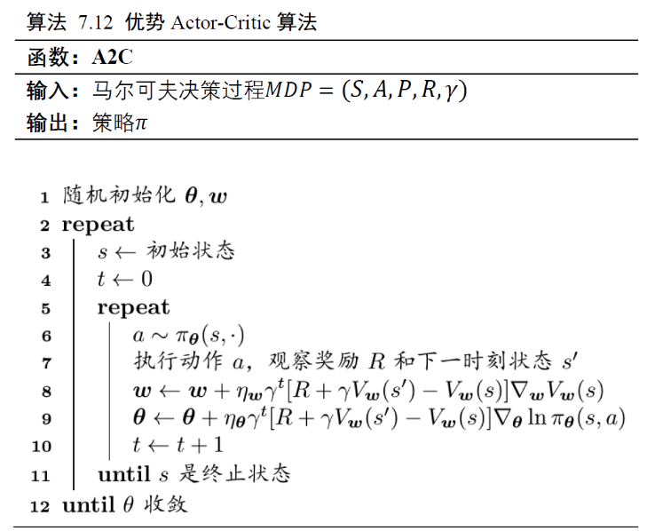

<!--
 * @version:
 * @Author:  StevenJokess（蔡舒起） https://github.com/StevenJokess
 * @Date: 2023-02-26 02:11:01
 * @LastEditors:  StevenJokess（蔡舒起） https://github.com/StevenJokess
 * @LastEditTime: 2023-06-01 01:46:36
 * @Description:
 * @Help me: 如有帮助，请赞助，失业3年了。
 * @TODO::
 * @Reference:
-->
# AC演化

- 如果去掉 Asynchronous，只有 Advantage Actor-Critic，就叫做 A2C。
- 如果加了 Asynchronous，变成Asynchronous Advantage Actor-Critic，就变成 A3C。[6]

## A2C 算法






```py
from collections import namedtuple
import torch
import torch.nn.functional as F

a2c_data = namedtuple('a2c_data', ['logit', 'action', 'value', 'adv', 'return_', 'weight'])
a2c_loss = namedtuple('a2c_loss', ['policy_loss', 'value_loss', 'entropy_loss'])


def a2c_error(data: namedtuple) -> namedtuple:
    """
    **概述**:
        Advantage Actor-Critic (A2C) 算法的 PyTorch 版实现。 <link https://arxiv.org/pdf/1602.01783.pdf link>
    """
    # 对数据 data 进行解包:  $$<\pi(a|s), a, V(s), A^{\pi}(s, a), G_t, w>$$
    logit, action, value, adv, return_, weight = data
    # 准备默认的权重（weight）。
    if weight is None:
        weight = torch.ones_like(value)
    # 根据 logit 构建策略分布，然后得到对应动作的概率的对数值。
    dist = torch.distributions.categorical.Categorical(logits=logit)
    logp = dist.log_prob(action)
    # 策略的损失函数: $$- \frac 1 N \sum_{n=1}^{N} log(\pi(a^n|s^n)) A^{\pi}(s^n, a^n)$$
    policy_loss = -(logp * adv * weight).mean()
    # 值函数的损失函数: $$\frac 1 N \sum_{n=1}^{N} (G_t^n - V(s^n))^2$$
    value_loss = (F.mse_loss(return_, value, reduction='none') * weight).mean()
    # 熵 bonus：$$\frac 1 N \sum_{n=1}^{N} \sum_{a^n}\pi(a^n|s^n) log(\pi(a^n|s^n))$$
    # 注意：最终的损失函数是 ``policy_loss + value_weight * value_loss - entropy_weight * entropy_loss`` .
    entropy_loss = (dist.entropy() * weight).mean()
    # Return the concrete loss items.
    # 返回最终的各项损失函数：包含策略损失，值损失和熵损失。
    return a2c_loss(policy_loss, value_loss, entropy_loss)
```

```py
# delimiter
def test_a2c():
    """
    **概述**:
        A2C 算法的测试函数，包括前向和反向传播测试
    """
    # 设置相关参数：batch size=4, action=32
    B, N = 4, 32
    # 从随机分布中生成测试数据： logit, action, value, adv, return_.
    logit = torch.randn(B, N).requires_grad_(True)
    action = torch.randint(0, N, size=(B, ))
    value = torch.randn(B).requires_grad_(True)
    adv = torch.rand(B)
    return_ = torch.randn(B) * 2
    data = a2c_data(logit, action, value, adv, return_, None)
    # 计算 A2C error
    loss = a2c_error(data)
    # 测试 loss 是否是可微分的，是否能正确产生梯度
    assert logit.grad is None
    assert value.grad is None
    total_loss = sum(loss)
    total_loss.backward()
    assert isinstance(logit.grad, torch.Tensor)
    assert isinstance(value.grad, torch.Tensor)
```

```py
test_a2c()
```

##

[2]: https://www.cnblogs.com/kailugaji/p/16140474.html
[3]: http://www.c-s-a.org.cn/html/2020/12/7701.html#outline_anchor_19
[4]: https://aistudio.baidu.com/aistudio/projectdetail/54249
[5]: https://paddlepedia.readthedocs.io/en/latest/tutorials/reinforcement_learning/Actor-Critic.html#id5
[6]: https://paddlepedia.readthedocs.io/en/latest/tutorials/reinforcement_learning/Actor-Critic.html#id5
[7]: https://github.com/opendilab/PPOxFamily/blob/main/chapter1_overview/a2c_zh.py

TODO:https://cloud.tencent.com/developer/article/1398764
