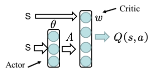

<!--
 * @version:
 * @Author:  StevenJokess（蔡舒起） https://github.com/StevenJokess
 * @Date: 2023-02-24 01:38:27
 * @LastEditors:  StevenJokess（蔡舒起） https://github.com/StevenJokess
 * @LastEditTime: 2023-09-12 22:18:53
 * @Description:
 * @Help me: 如有帮助，请赞助，失业3年了。
 * @TODO::
 * @Reference:
-->
# Actor-Critic 算法

## 简介

本书之前的章节讲解了基于值函数的方法（DQN）和基于策略的方法（REINFORCE），其中基于值函数的方法只学习一个价值函数，而基于策略的方法（REINFORCE）只学习一个策略函数，虽然获得了优势（连续动作），但也带来了劣势（每执行一步之后，没得值以用来估计即时奖励，只能进行回合更新）[4]

那么，一个很自然的问题是，有没有什么方法**既学习价值函数，又学习策略函数**呢？答案就是 Actor-Critic。Actor-Critic 是囊括一系列算法的整体架构，目前很多高效的前沿算法都属于 Actor-Critic 算法，本章接下来将会介绍一种最简单的 Actor-Critic 算法。需要明确的是，Actor-Critic 算法本质上是基于策略的算法，因为这一系列算法的目标都是优化一个带参数的策略，只是会额外学习价值函数，从而帮助策略函数更好地学习。下面都默认是同策。

## Actor-Critic

### 回顾REINFORCE

回顾一下，在 REINFORCE 算法中，目标函数的梯度中有一项轨迹回报，用于指导策略的更新。REINFORCE 算法用蒙特卡洛方法来估计，能不能考虑拟合一个值函数来指导策略进行学习呢？这正是 Actor-Critic 算法所做的。

在策略梯度中，可以把梯度 $g$  写成下面这个更加一般的形式：

$$
\nabla_\theta J\left(\pi_\theta\right)=\mathbb{E}\left[\sum_{t=0}^T \psi_t \nabla_\theta \log \pi_\theta\left(a_t \mid s_t\right)\right]=
$$

其中， $\psi_t$ 可以有很多种形式：

1. $\sum_{t^{\prime}=1}^T \gamma^{t^{\prime}} r_{t^{\prime}}$ : 轨迹的总回报；（$r_1$是一开始的回报）
2. $\sum_{t^{\prime}=t}^T \gamma^{t^{\prime}-t} r_{t^{\prime}}$ : 动作 $a_t$ 之后的回报；
3. $\sum_{t^{\prime}=t}^T \gamma^{t^{\prime}-t} r_{t^{\prime}}-b\left(s_t\right)$ : 基准线版本的改进；
4. $Q^{\pi_\theta}\left(s_t, a_t\right)$ : 动作价值函数；
5. $A^{\pi_\theta}\left(s_t, a_t\right)$ : 优势函数；
6. $r_{t+1}+\gamma V^{\pi_\theta}\left(s_{t+1}\right)-V^{\pi_\theta}\left(s_t\right)$ : 时序差分残差。

9.5 节提到 REINFORCE 通过蒙特卡洛采样的方法对策略梯度的估计是无偏的，但是*方差非常大*。我们可以用形式(3)引入基线函数（baseline function）来减小方差。此外，我们也可以采用 Actor-Critic 算法估计一个动作价值函数，代替蒙特卡洛采样得到的回报，这便是**形式(4)**。

> 异策略随机策略梯度：采样策略为 $\beta$.
> $$\nabla_\theta J_\beta\left(\pi_\theta\right)=E_{s \sim \rho^\beta, a \sim \beta}\left[\frac{\pi_\theta(a \mid s)}{\beta_\theta(a \mid s)} \nabla_\theta \log \pi_\theta(a \mid s) Q^\pi(s, a)\right]$$[2]

这个时候，我们可以把状态价值函数作为基线，从函数减去这个函数则得到了函数，我们称之为优势函数（advantage function），这便是形式(5)。更进一步，我们可以利用等式得到形式(6)。

**本章将着重介绍形式(6)**，即通过**时序差分残差**来指导策略梯度进行学习。事实上，用值或者值本质上也是用奖励来进行指导，但是用神经网络进行估计的方法可以减小方差、提高鲁棒性。除此之外，REINFORCE 算法基于蒙特卡洛采样，只能在序列结束后进行更新，这同时也要求任务具有有限的步数，而 Actor-Critic 算法则可以在每一步之后都进行更新，并且不对任务的步数做限制，所以相对来说计算更复杂，需要更多的超参数。[3]

### Actor-Critic 的组成

我们将 Actor-Critic 分为两个部分：Actor（策略网络）和 Critic（价值网络），如图 10-1 所示。

- Actor 要做的是与环境交互，并在 Critic 价值函数的指导下，用**策略梯度**的原则，学习一个更好的**策略**。
- Critic 要做的是通过 Actor 与环境交互收集的数据学习一个**价值函数**，这个价值函数会用于判断在当前状态什么动作是好的，什么动作不是好的，进而帮助 Actor 进行策略更新。

### 那 Critic 如何更新呢？

我们将 Critic 价值网络表示为 $V_\omega$ ，参数为 $\omega$ 。于是，我们可以采取时序差分残差的学习方式，对于单个数据定义如下价值函数的损失函数:

$$
\mathcal{L}(\omega)=\frac{1}{2}\left(r_{t+1}+\gamma V_\omega\left(s_{t+1}\right)-V_\omega\left(s_t\right)\right)^2
$$

与 DQN 中一样，我们采取类似于目标网络的方法，将上式中 $r+\gamma V_\omega\left(s_{t+1}\right)$ 作 为时序差分目标，不会产生梯度来更新价值函数。因此，价值函数的梯度为:

$$
\nabla_\omega \mathcal{L}(\omega)=-\left(r_{t+1}+\gamma V_\omega\left(s_{t+1}\right)-V_\omega\left(s_t\right)\right) \nabla_\omega V_\omega\left(s_t\right)
$$

然后使用梯度下降方法来更新 Critic 价值网络参数即可。

### Actor-Critic 伪代码

- 初始化策略网络参数 $\theta$ ，价值网络参数 $\omega$
  - for 序列 $e=1 \rightarrow E$ do:
    - 用当前策略 $\pi_\theta$ 采样轨迹 $\left\{s_1, a_1, r_2, s_2, a_2, r_3, \ldots\right\}$
    - 为每一步数据计算: $\delta_t=r_{t+1}+\gamma V_\omega\left(s_{t+1}\right)-V_\omega\left(s_t\right)$
    - 更新价值参数 $w=w+\alpha_\omega \sum_t \delta_t \nabla_\omega V_\omega\left(s_t\right)$
    - 更新策略参数 $\theta=\theta+\alpha_\theta \sum_t \delta_t \nabla_\theta \log \pi_\theta\left(a_t \mid s_t\right)$
- end for

以上就是 Actor-Critic 算法的流程，接下来让我们来用代码实现它，看看效果如何吧！

## Actor-Critic 代码实践

我们仍然在车杆环境上进行 Actor-Critic 算法的实验。

code

首先定义策略网络PolicyNet（与 REINFORCE 算法一样）。

code

定义好 Actor 和 Critic，我们就可以开始实验了，看看 Actor-Critic 在车杆环境上表现如何吧！

code

在 CartPole-v0 环境中，满分就是 200 分。和 REINFORCE 相似，接下来我们绘制训练过程中每一条轨迹的回报变化图以及其经过平滑处理的版本。

code

根据实验结果我们可以发现，Actor-Critic 算法很快便能收敛到最优策略，并且训练过程非常稳定，抖动情况相比 REINFORCE 算法有了明显的改进，这说明价值函数的**引入减小了方差**。

## 优缺点：

- **优点**：可以进行单步更新，不需要跑完一个episode再更新网络参数，相较于传统的PG更新更快。传统PG对价值的估计虽然是无偏的，但方差较大，AC方法牺牲了一点偏差，但能够有效降低方差；
- **缺点**：Actor的行为取决于 Critic 的Value，但是因为 Critic本身就很难收敛和actor一起更新的话就更难收敛了。（为了解决收敛问题， Deepmind 提出了 Actor Critic 升级版 Deep Deterministic Policy Gradient，后者融合了 DQN 的一些 trick，使用了双Actor神经网络和双Critic神经网络的方法[6]， 解决了收敛难的问题）。

## 与基于价值的模型(Critic only)的对比

- 只基于价值的模型(Critic only)，只会对整个序列完成后才给reward和更新，对中间好的action损失较多，
- 基于价值和策略的模型就不会(例如Actor-critic)，从Loss函数就能看出来。策略损失通常基于动作概率和优势函数的梯度，而价值损失通常基于TD误差（时间差分误差）。

## 可能的改进

1. 两个网络的前半部分可以共享
1. 输出larger entropy，即更不确定的action，更鼓励探索。即，SAC。[7]

## 总结

本章讲解了 Actor-Critic 算法，它是基于值函数的方法和基于策略的方法的叠加。价值模块 Critic 在策略模块 Actor 采样的数据中学习分辨什么是好的动作，什么不是好的动作，进而指导 Actor 进行策略更新。随着 Actor 的训练的进行，其与环境交互所产生的数据分布也发生改变，这需要 Critic 尽快适应新的数据分布并给出好的判别。

Actor-Critic 算法非常实用，后续章节中的 TRPO、PPO、DDPG、SAC 等深度强化学习算法都是在 Actor-Critic 框架下进行发展的。深入了解 Actor-Critic 算法对读懂目前深度强化学习的研究热点大有裨益。

## 附录：形式（3）介绍

形式（3）：

$$
\nabla_\theta J\left(\pi_\theta\right)=\frac{1}{N} \sum_{n=1}^N \sum_{t=1}^{T_n}\left(\sum_{t^{\prime}=t}^{T_n} \gamma^{t^{\prime}-t} r_{t^{\prime}}^n-b\right) \nabla \log \pi_\theta\left(a_t^n \mid s_t^n\right)
$$

式中$\sum_{t^{\prime}=t}^{T_n} \gamma^{t^{\prime}-t} r_{t^{\prime}}^n$ 代表回报 $G$ ，可方差较大，想替换为期望（期望能使方差降低？）

而动作价值函数的公式 $Q^\pi(s, a)=E_\pi\left[G_t \mid s_t=s, a_t=a\right]$ 就是给定了某个状态且策略采取了某个动作之后，所获得的回报 $G$ 的期望。所以这里可以使用动作价值函数替换掉 $\sum_{t^{\prime}=t}^{T_n} \gamma^{t^{\prime}-t} r_{t^{\prime}}^n$ 。

然后在形式（3）公式中，还有减去 $b$ 这么一个操作，在之前的讨论中 $b$ 一般是 $\sum_{t^{\prime}=t}^{T_n} \gamma^{t^{\prime}-t} r_{t^{\prime}}^n$ 的期望，这样能够保证减去 $b$ 之后有正有负，现在替换成动作价值函数 $Q^\pi(s, a)$ 之后，这里的 $b$ 就最好是 $Q^\pi(s, a)$ 的期望。

由状态价值函数与动作价值函数的转换公式 $V^\pi(s)=\sum_{a \in A} \pi(a \mid s) Q^\pi(s, a)=E_{a \in A}\left[Q^\pi(s, a)\right]$ ，可以看出状态价值函数 $V^\pi(s)$ 就可以看作是动作价值函数的期望，所以这里的 $b$ 就采取状态价值函数。[8]

替换完之后的梯度公式如下：

$$
\nabla_\theta J\left(\pi_\theta\right)=\frac{1}{N} \sum_{n=1}^N \sum_{t=1}^{T_n}\left[Q^\pi\left(s_t^n, a_t^n\right)-V^\pi\left(s_t^n\right)\right] \nabla \log p_\theta\left(a_t^n \mid s_t^n\right)
$$

[1]: https://hrl.boyuai.com/chapter/2/actor-critic%E7%AE%97%E6%B3%95/#101-%E7%AE%80%E4%BB%8B
[2]: https://zhuanlan.zhihu.com/p/26441204
[3]: https://chat.openai.com/chat
[4]: https://thinkwee.top/2019/09/23/easyrl/#more
[5]: https://zhuanlan.zhihu.com/p/556399318
[6]: https://paddlepedia.readthedocs.io/en/latest/tutorials/reinforcement_learning/Actor-Critic.html#id5
[7]: https://blog.csdn.net/greyduan/article/details/104945705
[8]: https://zhuanlan.zhihu.com/p/655562566
