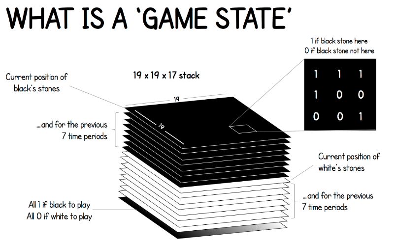
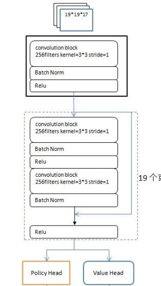
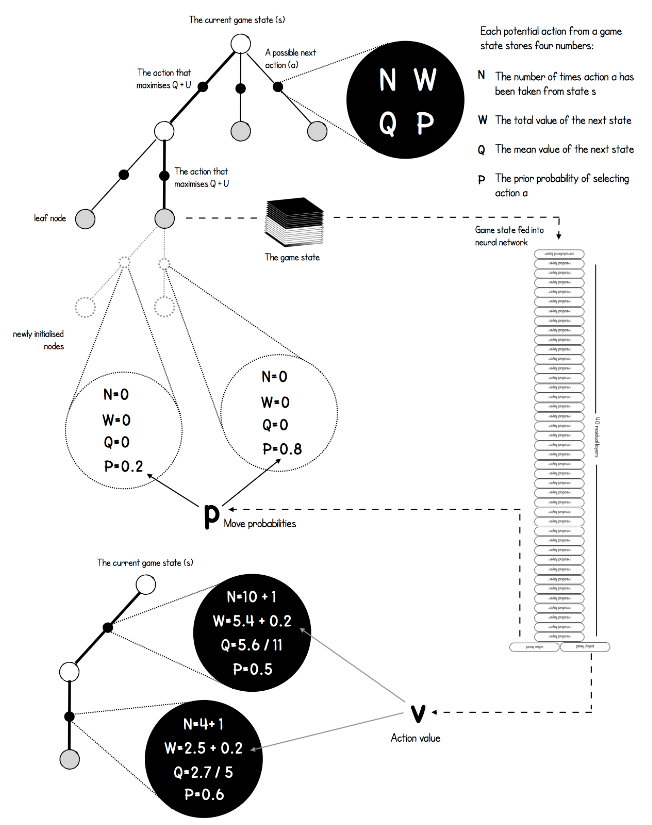
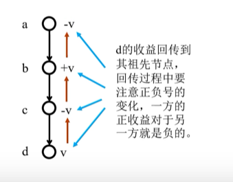
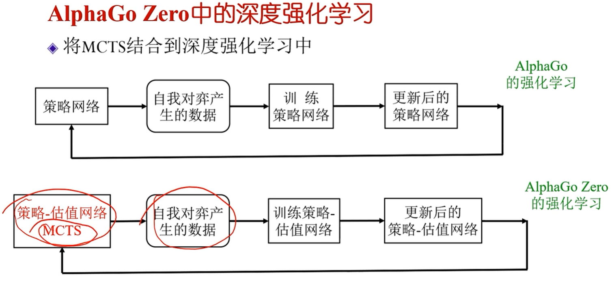
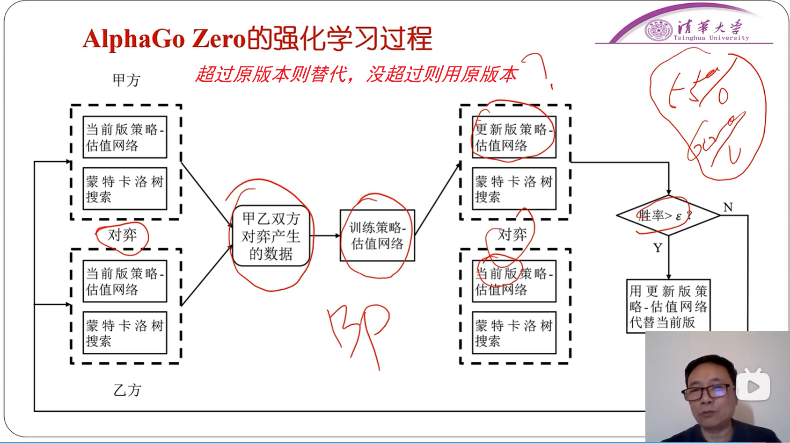

<!--
 * @version:
 * @Author:  StevenJokess（蔡舒起） https://github.com/StevenJokess
 * @Date: 2023-03-22 00:05:23
 * @LastEditors:  StevenJokess（蔡舒起） https://github.com/StevenJokess
 * @LastEditTime: 2023-05-31 23:53:10
 * @Description:
 * @Help me: 如有帮助，请赞助，失业3年了。
 * @TODO::
 * @Reference:
-->
# AlphaGo Zero

## 简介

AlphaGo的团队于2017年10月19日在《自然》杂志上发表了一篇文章[10]，介绍了AlphaGo Zero，这是一个没有用到人类数据（即完全不需要人类棋谱）的版本，通过自我对弈完成棋力提高，比以前任何击败人类的版本都要强大。通过跟自己对战，AlphaGo Zero经过3天的学习，以100:0的成绩超越了AlphaGo Lee的实力，21天后达到了AlphaGo Master的水平，并在40天内超过了所有之前的版本。[9]

## 模型

主要使用了两个模型，第一个就是我们之前介绍MCTS树结构，另一个是一个神经网络。策略网络（输出各个落子动作对应的获胜概率p）和价值网络（输出获胜或者失败的评估[-1,1]）整合到单个残差神经神经网络中（即走棋和估值网络合并为一个网络：$(p,v)=f(s)$ [3]），

策略网络更新去跟上MCTS的动作。[2]：AlphaGo Zero的**行棋**主要是由MCTS指导完成的，但是在MCTS搜索的过程中，由于有一些不在树中的状态需要仿真，做局面评估，因此需要一个简单的策略来帮助MCTS评估改进策略，这个策略改进部分由前面提到的神经网络完成。

这两部分的关系如下图所示：

## 训练过程简介

在讨论AlphaGo Zero的MCTS如何搜索，神经网络如何训练等细节之前，我们先看看AlphaGo Zero的训练过程是什么样的。

AlphaGo Zero训练过程主要分为三个阶段：自我对战学习阶段，训练神经网络阶段和评估网络阶段。

### 自我对战学习阶段

自我对战学习阶段，主要是AlphaGo Zero自我对弈，产生大量棋局样本的过程，由于AlphaGo Zero并不使用围棋大师的棋局来学习，因此需要自我对弈得到训练数据用于后续神经网络的训练。在自我对战学习阶段，每一步的落子是由MCTS搜索来完成的。在MCTS搜索的过程中，遇到不在树中的状态，则使用神经网络的结果来更新MCTS树结构上保存的内容。在每一次迭代过程中，在每个棋局当前状态s下，每一次移动使用1600次MCTS搜索模拟。最终MCTS给出最优的落子策略π,这个策略π和神经网络的输出p是不一样的。当每一局对战结束后，我们可以得到最终的胜负奖励z,1或者-1. 这样我们可以得到非常多的样本(s,π,z)，这些数据可以训练神经网络阶段。

### 训练神经网络阶段

在训练神经网络阶段，我们使用自我对战学习阶段得到的样本集合(s,π,z),训练我们神经网络的模型参数。训练的目的是对于每个输入s, 神经网络输出的p,v和我们训练样本中的π,z差距尽可能的少。这个损失函数L其实是很简单的：

$L=(z-v)^2-\pi^T \log (p)+c\|\theta\|^2$

损失函数由三部分组成，第一部分是均方误差损失函数，用于评估神经网络预测的胜负结果和真实结果之间的差异。第二部分是交叉熵损失函数，用于评估神经网络的输出策略和我们MCTS输出的策略的差异。第三部分是L2正则化项。

通过训练神经网络，我们可以优化神经网络的参数θ,用于后续指导我们的MCTS搜索过程。

当神经网络训练完毕后，我们就进行了评估阶段，这个阶段主要用于确认神经网络的参数是否得到了优化，这个过程中，自我对战的双方各自使用自己的神经网络指导MCTS搜索，并对战若干局，检验AlphaGo Zero在新神经网络参数下棋力是否得到了提高。除了神经网络的参数不同，这个过程和第一阶段的自我对战学习阶段过程是类似的。

## AlphaGo Zero的神经网络结构

在第二节我们已经讨论了AlphaGo Zero的主要训练过程，但是还有两块没有讲清楚，一是AlphaGo Zero的MCTS搜索过程是怎么样的，二是AlphaGo Zero的神经网络的结构具体是什么样的。这一节我们来看看AlphaGo Zero的神经网络的细节。

首先我们看看AlphaGo Zero的输入，当前的棋局状态。

由于围棋是19x19的361个点组成的棋局，每个点的状态有二种：

- 如果当前是黑方行棋，则当前有黑棋的点取值1，有白棋或者没有棋子的位置取值为0，（即记录黑棋位置）
- 反过来，如果当前是白方行棋，则当前有白棋的点取值1，有黑棋或者没有棋子的位置取值为0。（即记录白棋位置）

同时，为了提供更多的信息，输入的棋局状态不光只有当前的棋局状态，包括了黑棋白棋各自前8步对应的棋局状态。

除了这16个棋局状态，还有一个单独的棋局状态用于标识当前行棋方，如果是当前黑棋行棋，则棋局状态上标全1，白棋则棋局状态上标全0。如下图所示：

所以总共有17（=16+1）个通道作为输入。[10]最终神经网络的输入是一个19x19x17的张量。里面包含黑棋和白棋的最近8步行棋状态和当前行棋方的信息。

接着我们看看神经网络的输出，神经网络的输出包括策略部分和价值部分。对于策略部分，它预测当前各个行棋点落子的概率。由于围棋有361个落子点，加上还可以Pass一手（放弃行为），因此一共有362（=19*19+1）个策略端概率输出。对于价值端，输出就简单了，就是当前局面胜负的评估值，在[-1,1]之间。

看完了神经网络的输入和输出，我们再看看神经网络的结构，主要是用CNN组成的深度残差网络。如下图所示：

注：

1. 每个批量完成之后，对卷积层的输出做一次均值为0、方差为1的归一化，防止数据漂移。
2. “19个残差模块（20版本）或39个残差模块（40版本）”。
3. 具体策略网络和估值网络： .png)

在19x19x17的张量做了一个基本的卷积后，使用了19层或者39层的深度残差网络，这个是ResNet的经典结构。理论上这里也可以使用DenseNet等其他流行的网络结构。神经网络的损失函数部分我们在第二节已经将了。整个神经网络就是为了当MCTS遇到没有见过的局面时，提供的当前状态下的局面评估和落子概率参考。这部分信息会被MCTS后续综合利用。

## AlphaGo Zero的MCTS搜索

现在我们来再看看AlphaGo Zero的MCTS搜索过程，之前已经介绍了MCTS的基本原理和4个主要的搜索阶段: 选择，扩展，仿真和回溯。

>AlphaGo Zero相对于AlphaGo来说，其MCTS算法更为简单，因为它没有包括完整游戏的rollouts，所以不需要rollout策略。AlphaGo Zero的每一次MCTS迭代都会在当前搜索树的叶节点处结束模拟，而不是在完整游戏模拟的终止位置结束。[8]

和上一篇的内容相比，这里MCTS的不同主要体现在树结构上保存的信息不同，进而UCT的计算公式也稍有不同。最后MCTS搜索完毕后，AlphaGo Zero也有自己选择真正落子点的策略。

在上一篇里，我们的MCTS上保存的数据很简单，就是下的总盘数和贏的总盘数。在AlphaGo Zero这里，我们保存的信息会多一些。主要包括下面的 4 部分:

- $N(s, a)$ :记录边的访问次数
- $W(s, a)$ ：合计行动价值
- $Q(s, a):$ 平均行动价值，$Q\left(s,a\right)=\frac{\sum_{i=1}^n v_i\left(s,a\right)}{n}$，其中: $(s,a)$ 为 $\mathrm{s}$ 棋局下在 $a$ 处落子的动作的情况。
- $P(s, a)$ : 选择该条边的先验概率
其中 $s$ 为当前棋局状态， $a$ 为某一落子选择对应的树分支。

有了MCTS上的数据结构，我们看看AlphaGo Zero的MCTS搜索的4个阶段流程：

### 首先是选择过程

在MCTS内部，出现过的局面，我们会使用UCT选择子分支。子分支的UCT原理和上一节一样。但是具体的公式稍有不同，如下：

探索项：$U(s, a)=c_{p u c t} P(s, a) \frac{\sqrt{\sum_b N(s, b)}}{1+N(s, a)}$

其中：$N()$为模拟次数、$P(s,a)$为策略网络在a出下棋的概率、c为加权系数。

$a_t=\underset{a}{\arg \max }\left(Q\left(s_t, a\right)+U\left(s_t, a\right)\right)$

我们会优先选择Q+U最大的子分支（而非信心上限$I_j$）作为搜索分支，一直走到棋局结束，或者走到了没有到终局MCTS的叶子节点$s_l$，该节点被选中。$c_{puct}$ 是决定探索程度的一个系数，上一篇已讲过。

### 第二步，扩展阶段

如果到了没有到终局的MCTS叶子节点，那么我们就需要进入MCTS的第二步，扩展阶段，以及后续的第三步仿真阶段。我们这里一起讲。对于叶子节点 状态 $s$ ，会利用神经网络对叶子节点做预测，得到当前叶子节点的各个可能的子节点位置 $s_L$ 落子的概率 $p$ 和对应的价值 $v$, 对于这些可能的新节点我们在MCTS中创 建出来，初始化其分支上保存的信息为：

$$
\left\{N\left(s_L, a\right)=0, W\left(s_L, a\right)=0, Q\left(s_L, a\right)=0, P\left(s_L, a\right)=P_a\right\}
$$

这个过程如下图所示：

### 第三步，模拟过程（仿真）

- 在MCTT舍弃了模拟过程，
- 而用估值网络输出取代模拟过程：$v_i(s_l) = value(s_l)$
- 规定了总的模拟次数

### 第四步，回传过程

---

这样扩展后，之前的叶子节点 $s$ ，现在就是内部节点了。做完了扩展和仿真后，我们需要进行回溯，将新叶子节点分支的信息回溯累加到祖先节点分支上 去。这个回溯的逻辑也是很简单的，从每个叶子节点 $L$ 依次向根节点回溯，并依次更新上层分支数据结构如下:

$$
\begin{aligned}
N\left(s_t, a_t\right) & =N\left(s_t, a_t\right)+1 \\
W\left(s_t, a_t\right) & =W\left(s_t, a_t\right)+v \\
Q\left(s_t, a_t\right) & =\frac{W\left(s_t, a_t\right)}{N\left(s_t, a_t\right)}
\end{aligned}
$$

这个MCTS搜索过程在一次真正行棋前，一般会进行约1600次搜索，每次搜索都会进行上述4个阶段。

这上干次MCTS搜索完毕后，AlphaGo Zero就可以在MCTS的根节点 $s$ 基于以下公式选择行棋的MCTS分支了:

$$
\pi(a \mid s)=\frac{N(s, a)^{1 / \tau}}{\sum_b N(s, b)^{1 / \tau}}
$$

其中， $\tau$ 为温度参数，控制探索的程度， $\tau$ 越大，不同走法间差异变小，探索比例增大，反之，则更多选择当前最优操作。每一次完整的自我对恋的前 30 步，参数 $\tau=1$ ，这是早期鼓励探索的设置。游戏剩下的步数，该参数将逐渐降低至 0 。如果是比赛，则直接为 0 .

---

.. then select a move

After 1,600 simulations, the move can either be chosen:

**Deterministically** (for competitive play)

Choose the action from the current state with greatest $\mathrm{N}$

**Stochastically** (for exploratory play)

Choose the action from the current state from the distribution

$$
\pi \sim N^{1 / \tau}
$$

where $\tau$ is a temperature parameter, controlling exploration

同时在随后的时间步中，这个MCTS搜索树将会继续使用，对应于实际所采取的行为的子节点将变成根节点，该子节点下的子树的统计数据将会被保留，而这颗树的其余部分将会丢弃 。

以上就是AlphaGo Zero MCTS搜索的过程。

### 引入多样性

- 防止走向错误的方向, 人为引入噪声 a 对策略网络的输出增加噪声
- 狄利克雷分布
  - 通过参数可以产生一些符合一定条件的概率分布 a 控制参数:
  - $\mathrm{n}:$ 概率分布向量的长度
  - $\alpha:$ 分布浓度
  - 当 $\alpha$ 比较小时, 产生的概率分布多数为 0 , 少数比较大
- 落子概率: $\lambda p_a+(1-\lambda) p_d$
  - $p_a$ ：策略网络输出
  - $p_d$ : 狄利克雷分布采样

### 探索的合理性

引入噪声会引起还良反应”吗？不会，MCTS的纠错能力。

---

$$
\boldsymbol{\theta}_{\text {new }} \leftarrow \boldsymbol{\theta}_{\text {now }}-\beta \cdot \frac{1}{n} \sum_{t=1}^n \nabla_{\boldsymbol{\theta}} H\left(\boldsymbol{p}_t, \pi\left(\cdot \mid s_t \boldsymbol{\theta}_{\text {now }}\right)\right) .
$$

此处的 $\beta$ 是学习率。

更新价值网络：训练价值网络的方法与 AlphaGo 2016版本基本一样, 都是让 $v\left(s_t ; \boldsymbol{w}\right)$ 拟合回报 $u_t$ 。定义回归问题：

$$
\min _{\boldsymbol{w}} \frac{1}{2 n} \sum_{t=1}^n\left[v\left(s_t ; \boldsymbol{w}\right)-u_t\right]^2
$$

设价值网络 $v$ 当前参数是 $\boldsymbol{w}_{\text {now }}$ 。用价值网络做预测: $\widehat{v}_t=v\left(s_t ; \boldsymbol{w}_{\text {now }}\right), \forall t=1, \cdots, n$ 。做 一次梯度下降更新 $w$ :

$$
\boldsymbol{w}_{\text {new }} \leftarrow \boldsymbol{w}_{\text {now }}-\alpha \cdot \frac{1}{n} \sum_{t=1}^n\left(\widehat{v}_t-u_t\right) \cdot \nabla_{\boldsymbol{w}} v\left(s_t ; \boldsymbol{w}_{\text {now }}\right) .
$$

训练流程：随机初始化策略网络参数 $\theta$ 和价值网络参数 $w$ 。然后让 MCTS 自我溥 恋, 玩很多局游戏; 每完成一局游戏, 更新一次 $\theta$ 和 $w$ 。训练的具体流程就是重复下面三个步骤直到收敛：

1. 让 MCTS 自我博弈, 完成一局游戏, 收集到 $n$ 个三元组: $\left(s_1, \boldsymbol{p}_1, u_1\right), \cdots,\left(s_n, \boldsymbol{p}_n, u_n\right)$ 。
2. 按照公式 (18.2) 做一次梯度下降, 更新策略网络参数 $\boldsymbol{\theta}$ 。
3. 按照公式 (18.3) 做一次梯度下降, 更新价值网络参数 $w$ 。

其中[10]：

- 估值网络的损失函数: $L_1=(z-v)^2$； 其中: 获胜时 $z$ 为 1 , 失败时为 $-1, v$ 为估值网络的输出。
- 策略网络的损失函数: $L_2=-\pi_1 \log \left(p_1\right)-\pi_2 \log \left(p_2\right)-\cdots-\pi_{162} \log \left(p_{162}\right)$；其中: $\pi_i$ 为MCTS给出的每个落子点的概率 (含放弃) $p_2$ 为策略网络输出的每个落子点的概率 (含放弃)
- 总损失函数: $L=L_1+L_2+\|\theta\|_2^2$
- 如何获得$\pi_i$：
  - 选中次数转化为概率，选中a,b,c的次数分别为7,20,13
  - π(a)=7/(7+20+13)=0.175
  - π(b)=20/(7+20+13)=0.513
  - π(c)=13/(7+20+13)=0.325
  - 对选择次数进行优化

.png)

## 训练时长与成绩

DeepMind 团队在超过 490 万次的向我对局上训练 Alph Go Zero 花了接近 3 天的时间 每个对局中的每一步走子的选择都需要 MCTS 1600 次迭代，每一步走子需要花费 0.4s 左右的时间 网络参数的更新超过了 70 万个批量块，每个批量块由 2048 个棋盘局面组成。[8]

DeepMind 团队还比较了用 16 万盘对局里的包含接近 3000 万个局面位置的数据集有监督地训练和 AlphaGo Zero 网络相同的独立的神经网络他们发现开始有监督方法训练出来的策略性能确实要比 AlphaGo Zero 的好。但一天后，就被逐渐超过。该现象说明 AlphaGo Zero找到了不同于人类棋手下棋的策略，确实发现了新的定式。

AlphaGo Zero 算法的最后测试版本使用了更大的人工神经网络以及超过 2900 个自我对局的数据来训练，权重初始化仍然是随机的，训练共花费了大约 40天。AlphaGo Zero与AlphaGo Master比赛100场成绩是 89:11。

## 总结

AlphaGo Zero巧妙了使用MCTS搜索树和神经网络一起，通过MCTS搜索树优化神经网络参数，反过来又通过优化的神经网络指导MCTS搜索。两者一主一辅，非常优雅的解决了这类状态完全可见，信息充分的棋类问题。

当然这类强化学习算法只对特定的这类完全状态可见，信息充分的问题有效，遇到信息不对称的强化学习问题，比如星际，魔兽之类的对战游戏问题，这个算法就不那么有效了。要推广AlphaGo Zero的算法到大多数普通强化学习问题还是很难的。因此后续强化学习算法应该还有很多发展的空间。[7]

相关开源程序：[5]

## PUCT

PUCT则是对UCT的改进，主要用于棋类游戏中。PUCT通过考虑位置信息，对UCT进行了扩展，引入了一个额外的参数来调整UCB公式中的探索项。具体而言，PUCT将UCB公式中的探索项扩展为两部分，一部分是全局探索项，另一部分是局部探索项，用于考虑当前节点所在的棋盘位置。这样可以使得PUCT在搜索过程中更加注重对棋盘中关键位置的探索，从而提高搜索的效果。

因此，PUCT可以看作是对UCT的一种改进，通过引入位置信息，使得搜索算法更加针对特定的棋类游戏进行优化，从而在搜索过程中更加有效地选择和扩展节点。

[1]: https://www.math.pku.edu.cn/teachers/zhzhang/drl_v1.pdf 18.3.2
[2]: https://www.bilibili.com/video/BV1qx411j7Tq/?spm_id_from=333.999.0.0
[3]: https://www.bilibili.com/video/BV1V44y1n793?p=35&vd_source=bca0a3605754a98491958094024e5fe3
[4]:https://www.bilibili.com/video/BV164411p7bs/?spm_id_from=333.999.0.0&vd_source=bca0a3605754a98491958094024e5fe3
[5]: https://github.com/leela-zero/leela-zero
[6]: https://www.deepmind.com/blog/alphago-zero-starting-from-scratch
[7]: https://cloud.tencent.com/developer/article/1408923?areaSource=&traceId=
[8]: http://incompleteideas.net/book/RLbook2020.pdf
[9]: https://www.nature.com/articles/nature24270
[10]: https://www.bilibili.com/video/BV1S5411U7q2/

TODO:https://zhiqingxiao.github.io/rl-book/en2022/code/TicTacToe-v0_AlphaZero_torch.html
https://en.wikipedia.org/wiki/Self-play_(reinforcement_learning_technique)
