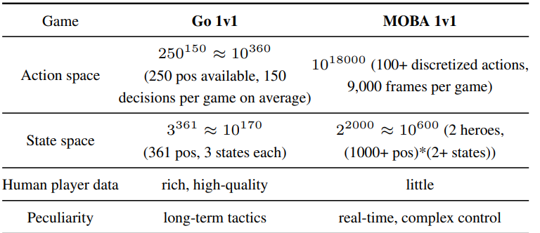

<!--
 * @version:
 * @Author:  StevenJokess（蔡舒起） https://github.com/StevenJokess
 * @Date: 2023-05-14 23:48:17
 * @LastEditors:  StevenJokess（蔡舒起） https://github.com/StevenJokess
 * @LastEditTime: 2023-05-15 21:53:04
 * @Description:
 * @Help me: make friends by a867907127@gmail.com and help me get some “foreign” things or service I need in life; 如有帮助，请赞助，失业3年了。
 * @TODO::
 * @Reference:
-->
# 王者荣耀（绝悟）

Mastering Complex Control in MOBA Games with Deep Reinforcement Learning

作者：Deheng Ye、Zhao Liu、Mingfei Sun 等
论文链接：https://arxiv.org/abs/1912.09729

- Mage的中文是法师，
- Marksman的中文是射手，
- Warrior的中文是战士
- Assassin的中文是刺客。

推荐：腾讯王者荣耀人工智能「绝悟」的论文入选 AAAI 2020。在研究测试中，AI 玩露娜和顶级选手单挑时也赢了个 3：0。

想要达到战胜人类职业选手的水平，光靠人类数据通过监督学习的方式是不可能的，就像人不可能揪住自己的头发把自己提起来一样，监督学习强依赖于数据的质量，它的天花板就是与人类选手平齐。所以要想超越人类，只能另辟蹊径，自己训练自己，探索出新的策略和打法。绝悟通过庞大的算力、改进的算法及针对性的建模设计，最终训练出了击败职业选手的超强AI。

强化学习的流程是一个生产消费模式，生产端一般是选用CPU，通过self play的形式，不断地产生数据，并发送到数据池，数据的格式一般包括特征（feature）、动作（action）、奖惩（reward）等。消费端选用GPU，从数据池中拉取数据进行训练，更新模型，再将模型同步到生产端，生产端按一定的规则从多个历史模型中更新模型，再产生新的数据，以此循环。在训练过程中，可以通过各项指标的监控来实时反应学习的效果，比如reward、loss，或其他业务指标等。

图1 绝悟强化训练流程图

在绝悟团队发表的论文中可知，训练资源有60w核CPU及1064张GPU，每个英雄每天的训练对局堪比人类玩家无眠无休500年的游戏数据，需要如此庞大规模的训练数据，与王者这款游戏的状态空间和动作空间之大，及游戏本身的特性之复杂是正相关的。

以此庞大规模的计算资源产生的训练数据，是强化学习的根基，除此之外，绝悟团队对算法的改进，也是助于提升效果的重要一环。算法的作用是引导模型向更高更强的方向收敛，proximal policy algorithm（PPO）是最早由DeepMind提出（其实是借鉴了OpenAI的TRPO），被广泛应用于机器学习的算法。绝悟团队在PPO算法的基础上进行改进，确保收敛，并结合了attention机制优化目标选择，以及LSTM网络增强记忆等多方面提升效果，细节可能后期会出一篇专门的解读。

图2 绝悟网络结构图

除了资源及算法方面，还有一个比较重要的方面就是建模设计。在机器学习中，特征设计要尽量将状态表达全面，且有差异性，绝悟团队除了用image的特征表达地图信息，还加了vector的特征表达敌我方英雄的状态信息，以及游戏的全局信息。如果说算法影响模型的收敛程度，那么特征是否表达充分，则会影响模型的效果上限。动作建模的设计将控制端输出解耦，形成多标签的优化目标，主要分为两大类，一个是目标选择，另一个是基于这个目标的移动及技能释放的偏移量，这样的设计大大减少了动作的探索空间，更利于模型的收敛速率。除此之外，奖惩也是针对游戏属性的设计，包括血量、经济、击杀、命中、死亡等等。总之特征、动作、奖惩的设计颇需要对游戏的深刻了解和游戏经验，正所谓，要想征服他，必须先成为他。

[1]: https://aijishu.com/a/1060000000100723
[2]: https://zhuanlan.zhihu.com/p/473216291
