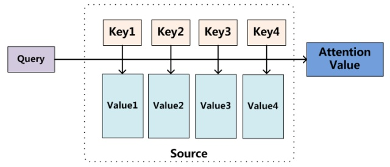
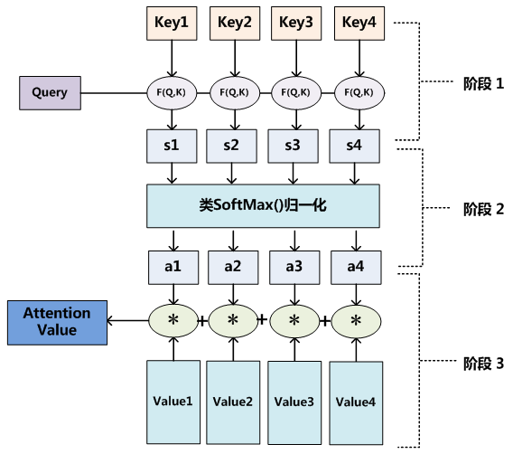

<!--
 * @version:
 * @Author:  StevenJokess（蔡舒起） https://github.com/StevenJokess
 * @Date: 2023-11-04 06:49:00
 * @LastEditors:  StevenJokess（蔡舒起） https://github.com/StevenJokess
 * @LastEditTime: 2023-11-04 10:17:28
 * @Description:
 * @Help me: make friends by a867907127@gmail.com and help me get some “foreign” things or service I need in life; 如有帮助，请资助，失业3年了。
 * @TODO::
 * @Reference:
-->
# 注意力机制

## 概述

Attention（注意力）机制如果浅层的理解，跟他的名字非常匹配。他的核心逻辑就是从关注全部到关注重点。

## 研究进展

Attention机制最早在视觉领域提出，2014年Google Mind发表了《Recurrent Models of Visual Attention》，使Attention机制流行起来，这篇论文采用了RNN模型，并加入了Attention机制来进行图像的分类。

- 2015年，Bahdanau等人在论文《Neural Machine Translation by Jointly Learning to Align and Translate》中，将attention机制首次应用在nlp领域，其采用Seq2Seq+Attention模型来进行机器翻译，并且得到了效果的提升。
- 2017年，Google机器翻译团队发表的《Attention is All You Need》中，完全抛弃了RNN和CNN等网络结构，而仅仅采用Attention机制来进行机器翻译任务，并且取得了很好的效果，注意力机制也成为了大家的研究热点。

## 人类的视觉注意力

Attention 机制很像人类看图片的逻辑，当我们看一张图片的时候，我们并没有看清图片的全部内容，而是将注意力集中在了图片的焦点上。下图形象的展示了人类在看到一副图像时是如何高效分配有限的注意力资源的，其中红色区域表明视觉系统更关注的目标。很明显对于如图所示的场景，人们会把注意力更多的投入到人的脸部，文本的标题以及文章首句等位置。

## Attention原理

上面我们都是在Encoder-Decoder的框架下讨论注意力机制，但是注意力机制本身是一种通用的思想，并不依赖于特定框架。
现在我们抛开Encoder-Decoder来讨论下Attention的原理。

Attention机制其实就是一系列注意力分配系数，也就是一系列权重参数罢了。

### 主流Attention框架

Attention是一组注意力分配系数，那么它是怎样实现的？这里要提出一个函数叫做attention函数，它是用来得到Attention value的。比较主流的attention框架如下：

我们将Source中的元素想像成一系列的<Key,Value>数据对，此时指定Target中的某个元素Query，通过计算Query和各个元素相似性或者相关性，得到每个Key对应Value的权重系数，然后对Value进行加权求和，得到最终的Attention值。

本质上Attention机制是对Source中元素的Value值进行加权求和，而Query和Key用来计算对应Value的权重系数。

## 另一个角度理解

可以将Attention机制看做软寻址，序列中每一个元素都由key(地址)和value(元素)数据对存储在存储器里，当有query=key的查询时，需要取出元素的value值(也即query查询的attention值)，与传统的寻址不一样，它不是按照地址取出值的，它是通过计算key与query的相似度来完成寻址。这就是所谓的软寻址，它可能会把所有地址(key)的值(value)取出来，上步计算出的相似度决定了取出来值的重要程度，然后按重要程度合并value值得到attention值，此处的合并指的是加权求和。

## 三阶段计算Attention过程

基于上面的推广，我们可以用如下方法描述Attention计算的过程。
Attention函数共有三步完成得到Attention值。

- 阶段1:Query与Key进行相似度计算得到权值
- 阶段2:对上一阶段的计算的权重进行归一化
- 阶段3:用归一化的权重与Value加权求和，得到Attention值

## 更多注意力机制

https://imzhanghao.com/2021/09/06/attention-mechanism-variants/#bahdanau-attention-vs-luong-attention
