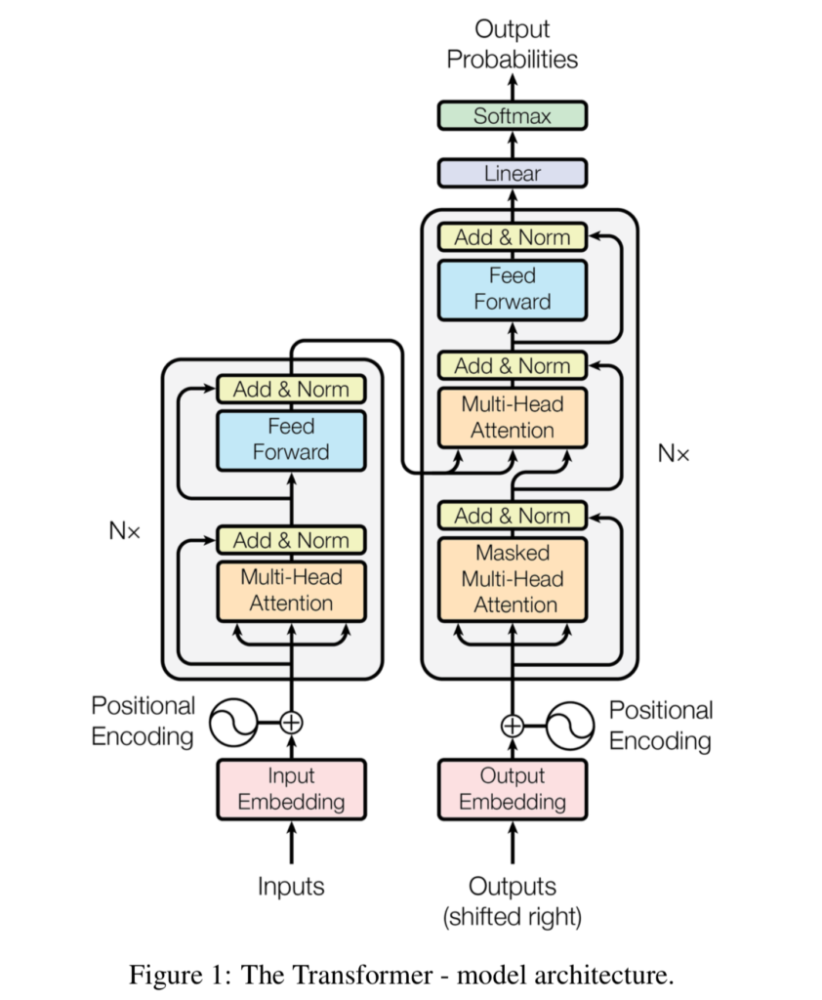

<!--
 * @version:
 * @Author:  StevenJokess（蔡舒起） https://github.com/StevenJokess
 * @Date: 2023-11-01 22:19:47
 * @LastEditors:  StevenJokess（蔡舒起） https://github.com/StevenJokess
 * @LastEditTime: 2023-11-14 05:01:25
 * @Description:
 * @Help me: make friends by a867907127@gmail.com and help me get some “foreign” things or service I need in life; 如有帮助，请资助，失业3年了。
 * @TODO::
 * @Reference:
-->
# LLM(Transformer)

## LLM

### 简介

大语言模型（英文：Large Language Model，缩写LLM），也称大型语言模型，是一种人工智能模型，旨在理解和生成人类语言。

Large Language Model (LLM) 是指规模庞大的语言模型。语言模型是一种机器学习模型，用于理解和生成自然语言文本。LLM 这一术语通常用来描述具有数十亿到数千亿参数的深度学习模型，它们能够学习大规模语言数据的统计规律，以生成自然流畅的文本，或者进行各种自然语言处理任务。

LLM 的训练通常基于预训练和微调的两个阶段。在预训练阶段，模型通过无监督学习大量的文本数据，例如网页、电子书、新闻等，以学习词语的分布、句子的语法结构和语言的常识等。这使得 LLM 能够获取广泛且深入的语言知识。

在微调阶段，使用带标签的特定任务数据对 LLM 进行进一步的训练，例如问答、文本摘要或翻译等。通过微调，LLM 模型可以根据特定任务的上下文和目标进行优化，以提高其在特定任务上的性能。

### 特点

1. 巨大的规模： LLM通常具有巨大的参数规模，可以达到数十亿甚至数千亿个参数。这使得它们能够捕捉更多的语言知识和复杂的语法结构。
1. 预训练和微调： LLM采用了预训练和微调的学习方法。它们首先在大规模文本数据上进行预训练（无标签数据），学会了通用的语言表示和知识，然后通过微调（有标签数据）适1. 应特定任务，从而在各种NLP任务中表现出色。
1. 上下文感知： LLM在处理文本时具有强大的上下文感知能力，能够理解和生成依赖于前文的文本内容。这使得它们在对话、文章生成和情境理解方面表现出色。
1. 多语言支持： LLM可以用于多种语言，不仅限于英语。它们的多语言能力使得跨文化和跨语言的应用变得更加容易。
1. 多模态支持： 一些LLM已经扩展到支持多模态数据，包括文本、图像和声音。这意味着它们可以理解和生成不同媒体类型的内容，实现更多样化的应用。
1. 涌现能力： LLM表现出令人惊讶的涌现能力，即在大规模模型中出现但在小型模型中不明显的性能提升。这使得它们能够处理更复杂的任务和问题。
1. 多领域应用： LLM已经被广泛应用于文本生成、自动翻译、信息检索、摘要生成、聊天机器人、虚拟助手等多个领域，对人们的日常生活和工作产生了深远的影响。

尽管 LLMs 的能力令人印象深刻，但也需要注意以下事项：

1. 数据偏差和错误：LLMs 学习的训练数据可能存在偏差和错误，这可能导致它们生成不准确或有偏的文本。需要进行数据清理和模型验证以解决这些问题。
1. 隐私和伦理问题：LLMs 可能在未经允许的情况下泄露敏感信息，或者被滥用用于伪造虚假信息。对于这些问题，需要采取隐私保护和伦理规范，确保合理和负责任的使用。[4]

## Transformer

### 简介

Transformer最早是Google在2017年的[Attention Is All You Need](https://arxiv.org/abs/1706.03762)论文中提出，用于解决解决传统的序列到序列（sequence-to-sequence，Seq2Seq）模型在**处理可变长序列**时遇到的问题。

> 序列到序列（Seq2Seq）：指的是模型的输入是一段序列，模型输出也是序列；比如语音识别中给模型一段中文语音序列，让模型给出中文文字序列

在传统的序列建模方法中，如循环神经网络（RNN）和卷积神经网络（CNN），在处理长序列均存在限制：

- RNN在处理长序列时容易出现梯度消失或梯度爆炸的问题，模型难以捕捉到长距离的依赖关系，**不能并行计算**；
- CNN卷积操作通常要求输入具有固定的尺寸，在处理可变长序列时，为了使序列具有相同的长度，需要对较短的序列进行填充，导致**计算效率低下**。

而Transformer通过自注意力机制（self-attention）来解决了这些问题，从而使得Transformer成为解决NLP中许多问题的首选模型，取代了较老的循环神经网络模型，如长短期记忆（LSTM）。由于Transformer模型有利于在训练过程中实现更多的并行化，因此它已经实现了在更大的数据集上进行训练，而这在它被引入之前是不可能的。

### Transformer与之前的模型对比

- 在引入Transformer之前，大多数最先进的NLP系统都依赖于门控递归神经网络（RNNs），如LSTMs和门控递归单元（GRU），并增加了注意力机制。
- Transformer在不使用RNN结构的情况下，在这些注意技术的基础上，强调了在不进行递归顺序处理的情况下，仅凭注意机制就足以达到带注意的RNN的性能。

注意力机制让模型直接查看、提取句子中任何较早期的状态。注意力层可以访问所有之前的状态，并根据一些学习到的与当前令牌相关性的衡量标准对它们进行权衡，提供更清晰的远期相关令牌的信息。注意力实用性的一个明显例子是在翻译中。在英译法系统中，法语输出的第一个词很可能在很大程度上取决于英语输入的开头。然而，在经典的编码器-解码器LSTM模型中，为了产生法语输出的第一个单词，模型只被赋予最后一个英语单词的状态向量。理论上，这个向量可以编码整个英语句子的信息，给模型提供所有必要的知识，但在实际应用中，这些信息往往不能很好地保存下来。如果引入注意力机制，模型反而可以学会在产生法语输出的开头时关注早期英语向量的状态，使其对翻译的内容有更好的概念。

和之前发明的模型一样，Transformer是一个编码器-解码器的架构。编码器由一组编码层组成，对输入进行一层又一层的迭代处理，解码器由一组解码层组成，对编码器的输出做同样的事情。

每个编码器层的功能是处理它的输入，生成编码，包含输入中哪些部分是相互相关的信息。它把它的一组编码作为输入传递给下一个编码器层。每一个解码层则反其道而行之，将所有的编码进行处理，利用它们所包含的上下文信息生成一个输出序列。为了达到这个目的，每一个编码器层和解码层都利用一个注意机制，对于每一个输入，它都会权衡其他每一个输入的相关性，并相应地从中抽取信息，从而产生输出。每一层解码器还有一个额外的注意机制，在解码层从编码中抽取信息之前，它先从前面解码器的输出中抽取信息。编码器层和解码器层都有一个前馈神经网络，用于对输出进行额外处理，并包含残余连接和层归一化步骤[2]。

TODO:

### Transformer模型结构

与传统的seq2seq模型一样，Transformer模型的结构分为encoder和decoder两部分

#### Encoder

- Input Embedding: 将原始的输入转换为语义向量
- Positional Encoding: 位置编码。由于不存在递归机制，作者在每个语义向量中还加入了位置信息，以让模型能知道token的绝对和相对位置
- Multi-Head Attention: 注意力模块。这里计算的是源序列的自注意力。Multi-Head是一种emsemble的方法，在后文有介绍。模块有三个输入和一个输出，输入和输出的具体意义在后文介绍。
- Add&Norm: 残差模块。看到直接越过注意力模块指向该模块的箭头，直觉上就能想到这是残差机制，防止反向传播时的梯度消失。
- Feed Forward: （普通）前馈网络。这里使用的是稀疏连接的前馈网络，每个token（语义向量）都单独连接了一个全连接的神经网络，但token与token之间没有连接。

#### Decoder

Decoder中自注意力模块与encoder相似，但是decoder的多了一个mask. 一般的mask的作用是将注意力机制中的某些依赖关系直接切断，即将这些注意力置为0. 这里使用的mask是将所有来自后文的依赖去除。这样一来，本来 x_1,x_2,\cdots,x_T 都会对 x_t 的出现产生影响，现在只有 x_1,x_2,\cdots,x_{t-1} 会对 x_t 产生影响，那么序列 x_1, x_2, \cdots, x_T 出现的log似然就变成了

\log P(x_1,x_2,\cdots,x_T) = \sum_{t} \log P(x_t|x_1,x_2,\cdots,x_{t-1}) \\

不难看出，加上mask后的self-attention的log似然与单向LSTM类似。这样做是因为虽然decoder在训练阶段有完整的目标序列作为输入数据，但是在测试阶段只能依据上文来对下文进行预测，因此如果在训练时引入对下文的依赖，不仅是没有意义的，也会影响模型的正确性。

注意到decoder中在自注意力模块之后还有一个注意力模块，它不是自注意力模块，而是encoder和decoder之间的注意力，也就是传统意义上的注意力。可以看到它的三个输入有两个是来自encoder的。

### Transformer中的注意力

#### 点积注意力

点积注意力的计算需要三个输入，分别是 Q,K,V ，分别代表Query, Key和Value。

下面通过介绍 Q,K,V 以及点积注意力的具体计算方法来对其含义进行理解。

首先， Q,K,V 其实都是输入 X 的线性变换。由矩阵乘法的性质可知，经过线性变换后， 矩阵 Q,K,V 的行数仍然等于 X 的行数，列数取决于 W^Q,W^K,W^V 的列数。在self-attention中， Q,K,V 的形状均为(d_x, d_k).

$$Q=W^QX \\ K=W^KX \\ V=W^VX \\$$

上图中将 Q 和 K 输入MatMul模块的输出是 QK^T ，易知其形状为 $(d_x, d_x)$ ，即输入序列的长度。需要注意的是，这里虽然在矩阵层面上做的是外积（叉积），但对于序列中每个时刻的语义向量(token)而言做的是内积（点积），最终输出矩阵中的第 i 行第 j 列是第 i 时刻的token与第j 时刻的token这两个向量的点积，也代表第j 时刻的token对第 i 时刻token的出现有多大影响，即注意力，QK^T 可以更形象地表述为下面的矩阵

$$
\left[ \begin{gathered} \begin{matrix} 1\rightarrow 1 & 1\rightarrow 2 & \cdots & 1\rightarrow x \\ 2\rightarrow 1 & 2\rightarrow 2 & \cdots & 2\rightarrow x \\ \vdots & \vdots & \ddots & \vdots \\ x\rightarrow 1 & x\rightarrow 2 & \cdots & x\rightarrow x \\ \end{matrix} \end{gathered} \right] \\
$$

其中， $i \rightarrow j$ 表示 $v_i$ 对 $v_j$ 的注意力， $v_i$ 即第 i 时刻的语义向量。

QK^T 经过scaled, mask和softmax后与 V 相乘，为了便于表示，这里先直接解释 QK^TV 的意义

$$
\left[ \begin{gathered} \begin{matrix} 1\rightarrow 1 & 1\rightarrow 2 & \cdots & 1\rightarrow x \\ 2\rightarrow 1 & 2\rightarrow 2 & \cdots & 2\rightarrow x \\ \vdots & \vdots & \ddots & \vdots \\ x\rightarrow 1 & x\rightarrow 2 & \cdots & x\rightarrow x \\ \end{matrix} \end{gathered} \right] \left[ \begin{gathered} \begin{matrix} v_1 \\ v_2 \\ \vdots \\ v_x \end{matrix} \end{gathered} \right] = \left[ \begin{gathered} \begin{matrix} \sum_{i=1}^x (1 \rightarrow i)v_i \\ \sum_{i=1}^x (2 \rightarrow i)v_i \\ \vdots \\ \sum_{i=1}^x (x \rightarrow i)v_i \end{matrix} \end{gathered} \right]
$$

该过程使用注意力对输入中的语义向量进行加权，输出矩阵中的每一行是 v_1,\cdots,v_x 的加权平均，权重则来自注意力矩阵中的每一行。这个输出矩阵便是经过注意力机制处理之后的序列，每一行代表每个时刻出现的语义向量。

注意到，$i \rightarrow j$ 来自 W^Q 和 W^K 对 X 的线性变换， $v_i$ 来自 W^V 对 X 的线性变换，因此最终输出可以表示为 A = f(X; W^Q, W^K, W^V) ，Transformer学习的过程将会对这个函数进行极大似然估计。文中默认读者理解了点积注意力机制，使用 Q,K,V 表示最终结果，即 $A = \text{softmax}(\frac{QK^T}{\sqrt{d_k}})V$ ，其中 $\frac{1}{\sqrt{d_k}}$ 是scale操作，这里省略了mask操作。

Multi-Head注意力

Multi-Head可以理解为是一种ensemble机制。普通的ensemble简单地将多个同构网络的训练结果取平均，而Multi-Head机制则是对这些结果取加权平均，并且这个权重也是由神经网络学得的。

设有以下同构的注意力模块学得的结果

A_1 = f(X;W^Q_1,W^K_1,W^V_1) \\ A_2 = f(X;W^Q_2,W^K_2,W^V_2) \\ \vdots \\ A_h = f(X;W^Q_h,W^K_h,W^V_h) \\

普通的ensemble会得到 A = \frac{1}{h}\sum_{i=1}^hA_i \\ Multi-Head则会得到 W_O \text{concat}(A_1,\cdots,A_h) \\

其中 W_O 是待学习的参数，负责对 A_1, \cdots, A_h 进行加权。

Mask机制
A = \text{softmax}(\frac{QK^T}{\sqrt{d_k}} + M)V \\

M 与 QK^T 形状相同， 矩阵 M 在不需要注意力的位置为 -\infty ，在需要注意力的位置为 0，即 M_{ij} = -\infty 表示切断 v_i 和 v_j 之间的注意力依赖。经过softmax之后被置为 -\infty 的位置会变为0.

Encoder-Decoder注意力
现在来看decoder中的第二个注意力模块，图1中显示，它有两个输入来自encoder，一个输入来自decoder. 文中指出， K, V 来自encoder， Q 来自decoder，因此 QK^T 表示encoder和decoder之间的注意力矩阵，然后使用该注意力对 V 中的token，即输入的token进行加权，得到输出的token. 这样一来，输出token就被表示成了输入token的加权平均，权重是注意力。

### Transformer算法复杂度分析

假设输入序列的长度为 n ，词汇表的大小（语义向量的长度）为 d ，下面比较RNN, CNN, Transformer模型的复杂度[1]。

#### 结构复杂度

- 在有注意力机制的RNN中，RNN对结构复杂度的贡献为 O(nd^2) . RNN像普通全连接网络一样，有一个 d - d 的全连接，共 d^2 条边，产生了 O(d^2) 的复杂度，而这一连接需要被递归执行 n 次，因此复杂度为 O(nd^2) . 注意力机制的贡献为 O(n^2d) . 注意力机制是一个 n - n 的全连接，源和目标语义向量之间没有 d - d 的全连接，而是单纯地重复 d 次。由于通常情况下 d\gg n ，因此取RNN的结构复杂度为 O(nd^2) .
- 在有注意力机制的CNN中，假设kernel的行数为 k （列数固定为 d ），则每个kernel有 kd 个参数，并且由于kernel会沿着序列的时间方向进行移动，该方向的长度为 n ，因此总的复杂度为 O(knd)
- 在Transformer中，只需要考虑注意力机制模块的复杂度。第一步 QK^T 可以看作形状为 (n, d) 的矩阵与形状为 (d, n) 的矩阵相乘，复杂度为 O(n^2d) ，第二步 QK^TV 可以看作 (n, n) 乘 (n, d) ，复杂度仍为 O(n^2d) . 在 d \gg n 的实际情况下，Transformer的复杂度低于RNN

#### 串行复杂度

- RNN在时间维度上不可并行化，每一时刻的运算需要等上一时刻计算完毕，因此串行复杂度为 O(n)
- CNN和Transformer都可以在时间维度上并行化，因此相对的串行复杂度为 O(1)

#### 传播路径复杂度

- RNN：RNN中最长的传播路径是源序列的第一个token和目标序列的最后一个token，这条路径需要经过整个RNN的递归链才能进行反向传播，因此其复杂度为 O(n)
- CNN：下图可以大致表示CNN的seq2seq模型的结构，凭直觉可以看出它是一种 k 叉树，其传播路径的长度取决于树的深度，而树的深度为 O(\log n) .[5]

## 实战代码

Hugging Face Transformers:

## 小结

随着自注意力的发展，RNN 单元被完全抛弃。被称为多头注意力的自注意力与前馈神经网络形成了Transformer。

Transformer 作为一个重要的里程碑，促进了预训练系统的发展，如BERT（Bidirectional Encoder Representations from Transformers）和GPT（Generative Pre-trained Transformer），这些系统已经用巨大的通用语言数据集进行了训练，并可以针对特定的语言任务进行微调。

## 问题测验

1. 强化学习和大模型之间的关联是什么
1. 如何评估大模型中数据集的质量
1. 除了数据之外，还有哪些方向的工作可以进一步优化大模型的效果
1. 大语言模型是怎么输出的，观察过输出的概率值吗[3]
1. 介绍下对Transformer的了解
1. Transformer和RNN有什么相同点与不同点？
1. 网络结构相比于LSTM有什么不同
1. Transformer里用到的正则化方法有哪些
1.

## 附录：问题答案

Transformer和RNN的相同点与不同点：

与RNN相比：都处理顺序数据，但不要求一定按顺序

- 相同点：与递归神经网络（RNNs）一样，Transformers也被设计用来处理顺序数据，如自然语言，以完成翻译和文本摘要等任务。
- 不同点：与RNNs不同的是，Transformers并**不要求顺序处理顺序数据**。
  - 例如，如果输入数据是一个自然语言句子，Transformer就不需要先处理开头再处理结尾。
  - 由于这个特点，Transformer可以比RNNs的**并行化**程度高得多，因此可以减少训练时间。

[1]: https://developer.aliyun.com/article/1229038
[2]: https://zhuanlan.zhihu.com/p/165184447
[3]: https://zhuanlan.zhihu.com/p/659551066
[4]: https://zhuanlan.zhihu.com/p/666734301
[5]: https://zhuanlan.zhihu.com/p/346983386
