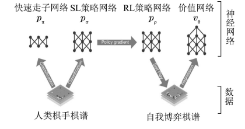
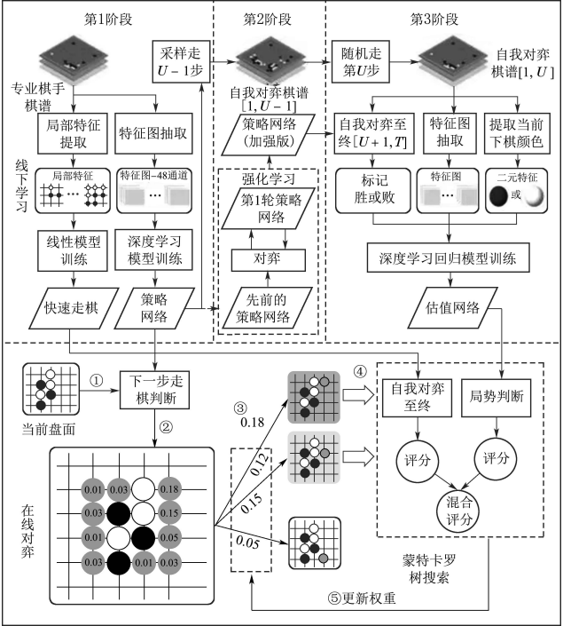
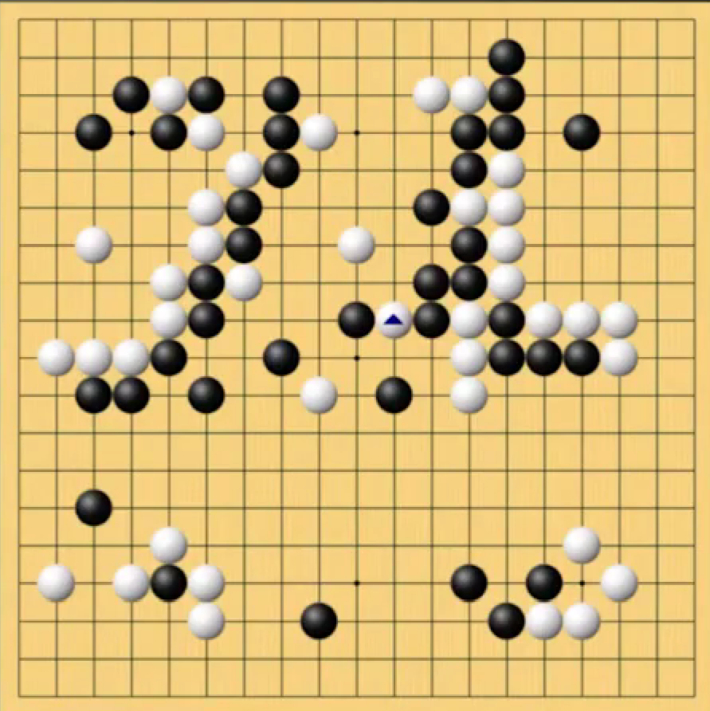

<!--
 * @version:
 * @Author:  StevenJokess（蔡舒起） https://github.com/StevenJokess
 * @Date: 2023-03-21 23:48:20
 * @LastEditors:  StevenJokess（蔡舒起） https://github.com/StevenJokess
 * @LastEditTime: 2023-06-16 23:16:04
 * @Description:
 * @Help me: 如有帮助，请赞助，失业3年了。
 * @TODO::
 * @Reference:
-->
# AlphaGo

## 简述

AlphaGo 是第一个打败围棋世界冠军的程序，共18个冠军。[5]

AlphaGo 具备深度学习能力，可结合人类专家比赛中学到的棋谱，以及在和自己下棋（Self-Play）中进行强化学习。2016年3月，人工智能AlphaGo 在围棋竞技中以4：1[6]击败李世石(Lee Sedol)[2]，标志着AI 具备了自我迭代和学习强化的能力。AlphaGo 的深度学习模型可分为策略网络和价值网络，分别解决了围棋中的“下一手最佳策略”和“下一手后的胜率”两个问题，并以此为核心通过学习人类棋谱和自我对弈，不断调整策略提升棋力。AlphaGo 较好地模拟了人类棋手对于围棋落子的直觉判断，即，由于围棋存在的广度（每一步的可能性）和深度（棋局从开始到结束的步数）导致计算机无法模拟计算所有的可能性，AlphaGo 通过策略网络减少搜索广度，即每一步搜索少量节点，而通过价值网络减少搜索深度，无需将棋局下到底即可得出当前局势的判断。[3]

## 计算机围棋的发展历史与现状(Development history and present situation of computer Go)

计算机围棋起源于20世纪60年代, 长期以来, 它被认为是人工智能领域的一大挑战, 并为智能学习算法的研究提供了一个很好的测试平台. 计算机围棋通过计算一个大约含 $b^d$ 个落子情况序列的搜索树上的最优
值函数来评估棋局和选择落子位置, 其中b是搜索的宽度, d是搜索的深度。与象棋等具有有限搜索空间的棋类不同, 围棋的计算复杂度约为 $250^150$ . 如果采用传统的暴力搜索方式, 按照现有的计算能力是远远无法解决围棋问题的。早期计算机围棋通过专家系统和模糊匹配缩小搜索空间, 减轻计算强度, 但受限于计算资源和硬件能力, 实际效果并不理想。

2006年, 蒙特卡罗树搜索的应用标志着计算机围棋进入了崭新的阶段。 现代计算机围棋的主要算法是基于蒙特卡罗树的优化搜索. Coulom采用这种方法开发的CrazyStone在2006年计算机奥运会上首次夺得九路(9 × 9的棋盘)围棋的冠军。2008年, 王一早开发的MoGo在9路围棋中达到段位水平。2012年, 加藤开发的Zen在19路(19 × 19的全尺寸棋盘) 围棋上以3:1击败二段棋手约翰特朗普. 2014年, 职业棋手依田记基九段让四子不敌razyStone, 这在围棋界引起了巨大的轰动. 赛后依田记基表示此时的Crazy-Stone大概有业余六七段的实力, 但是他依然认为数年内计算机围棋很难达到职业水准. 与此同时, 加藤英树也表示计算机围棋需要数十年的时间才能达到职业水准, 这也是当时大多数围棋领域和人工智能领域的专家持有的观点. 然而, 随着深度学习和蒙特卡罗树搜索方法的结合, 这一观点开始受到挑战. 2015年,Facebook人工智能研究院的Tian结合深度卷积神经网络和蒙特卡罗树搜索开发出的计算机围棋DarkForest表现出了与人类相似的下棋风格和惊人的实力, 这预示着计算机围棋达到职业水准的时间可能会提前。而2016年3月AlphaGo的横空出世彻底宣告基于人工智能算法的计算机围棋达到了人类顶尖棋手水准。

## 原理分析

AlphaGo 创新性地结合深度强化学习和蒙特卡罗树搜索, 通过价值网络(value network)评估局面以减小搜索深度, 利用策略网络(policy network)降低搜索宽度, 使搜索效率得到大幅提升, 胜率估算也更加精确。

策略网络将棋盘状态 $s$ 作为输入, 经过 13 层的卷积神经网络输出不同落子位置的概率分布 $p_\sigma(a \mid s)$ 或 $p_\rho(a \mid s)$, 其中 $\sigma$ 和 $\rho$ 分别表示监督学习和强化学习得 到的策略网络, $a$ 表示采取的落子选择。价值网络同样使用深度卷积神经网络, 输出一个标量值 $v_\theta\left(s^{\prime}\right)$ 来预 测选择落子位置 $s^{\prime}$ 时的期望奖赏, $\theta$ 为价值网络的参数。

原理流程主要包含线下学习和在线对弈两部分。

### 线下学习(Offline learning)

线下学习包含3个阶段, 如下图所示

分为三个阶段：

1. 随机初始化策略网络 $π(a|s; θ)$ 之后，用行为克隆(Behavior Cloning) 从人类棋谱中学习策略网络；
1. 让两个策略网络自我博弈，用REINFORCE算法改进策略网络；第1. 基于已经训练好的策略网络，训练价值网络

#### 第 1 阶段

第一阶段深智团队使用棋圣堂围棋服务器 (Kiseido Go server, KGS)上3000万个专业棋手对弈棋谱的落子数据, 基于监督学习得到一个策略网络, 来预测棋手的落子情况, 称之为监督学习的策略网络 $p_\theta$（SL策略网络），即行为克隆，目标是模仿专业棋手的下棋风格。

其原因是，一开始的时候，策略网络的参数都是随机初始化的。假如此时直接让两个策略网络自我博弈，它们会做出纯随机的动作。它们得随机摸索很多很多次，才能做出合理的动作。假如一上来就用REINFORCE学习策略网络，最初随机摸索的过程要花很久。

训练策略网络时采用随机梯度上升法更新网络权重。

$$
\Delta \sigma \propto \frac{\partial \log p_\sigma(a \mid s)}{\partial \sigma},
$$

> SL 策略网络是一个 13 层的深度卷积神经网络, 该网络的输入是棋盘特征, 也叫做盘面, 其表现形式是一个 $19 \times 19 \times 48$ 二值平面, $19 \times 19$ 是围棋的 棋盘布局, 48 个平面对应不同的盘面特征信息 ${ }^{[15]}$ (如棋子颜色、轮次、气、打吃数目等)。输入经 过 13 层深度卷积神经网络的逐层理解和分析, 最 终输出一个走棋策略 $p_\sigma(a \mid s)$, 表示当前状态 $\mathrm{s}$ 下所 有合法动作 $\mathrm{a}$ 的概率分布, 其中 $\sigma$ 表示该网络的权 重参数也表示策略的名称。SL 策略网络的决策计算速度是 $3 \mathrm{~ms} /$ 步, 即输入当前盘面后, $3 \mathrm{~ms}$ 可得到 下一步的决策。该策略网络主要用于在蒙特卡罗树 搜索的选择阶段提供先验概率信息。[14]

最后预测准确率达到了 $55.7 \%$, 这远远高于其他方法的结果。

快速走棋策略网络 $p_{\Pi}$ (Rollout Policy Networks)使用了相同的训练数据，只是用的局部作为简单的特征来匹配和线性回归的方法, 在牺牲部分准确度的情况下极大地提高了走棋的速率，类似于人类学习过程中的背棋谱的阶段。[14]

> 快速走棋策略网络的学习模型是一个简单线性模型, 输入也更简单且包含了一些人工加工的特征, 这使得快速走棋策略的输出 $p_\pi(\mathrm{a} \mid s)$ 的棋力较差, 但其计算速度非常快, 每步决策仅需要 $2 \mu \mathrm{s}$, 因此 该策略网络用于在蒙特卡罗树搜索的模拟评估阶段执行快速模拟。

#### 第 2 阶段

第2阶段，在第1阶段结果的基础上, 使用强化学习进一步对策略网络进行学习, 得到强化学习的策略网络 $p_\rho$。 训练过程中先使用监督学习的策略网络对强化学习的策略网络进行初始化, 然后两者通过 “自我博弈” 来改善策略网络的性能. 训练过程中采用策略梯度算法REINFORCE, 按照预期结果最大值的方向, 更新权重。

$$
\Delta \theta \propto \frac{\partial \log p_\rho\left(a_t \mid s_t\right)}{\partial \rho} z_t,
$$

其中 $z_t$ 是在时间步长为 $t$ 时的奖赏, 胜方为 +1 、败方为 -1 。在与监督学习的策略网络 $p_\theta$ 的对弈中, 强化学习的策略网络 $p_\rho$ 能够获得 $80 \%$ 的胜率。

#### 第 3 阶段

第3阶段, 使用 “自我博弈” 产生的棋谱, 根据最终胜负结果来训练价值网络 $v_\theta$. 训练价值网络时, 使用随机梯度降序法来最小化预测值 $v_\theta(s)$ 和相应结果 $z$ 间的差值。

为何不用人类棋谱？学者认为人类数据其实并不适合价值评估。很多人类的棋局都是因为中间偶然的失误导致了全盘覆灭（所谓“一着不慎满盘皆输”），其中的偶然性非常大，盘面的估值瞬息万变，所以棋局的结果离理想的估值差距较大。

$$
\Delta \rho \propto \frac{\partial v_\theta(s)}{\partial \theta}\left(z-v_\theta(s)\right),
$$

训练好的价值网络可以对棋局进行评估, 预测最终胜负的概率。

## 在线对弈(Online playing）

AlphaGo以蒙特卡罗树搜索（类比人类考虑势，来减少搜索的宽度）作为主要框架，并结合SL策略网络、快速走棋网络和价值网络以提高蒙特卡罗树搜索的效率。在介绍对弈过程前，首先介绍下每个蒙特卡罗树搜索节点值网络以提高蒙特卡罗树搜索的效率。在介绍对恋 过程前, 首先介绍下每个蒙特卡罗树搜索节点（即 盘面 $s$ ）的统计信息。每一个节点 $s$ 包含多条边连 接着 $s$ 与其子节点, 每一条边对应一个合法的状态动作对 $(s, a)$, 每一条边对应一个六元组统计信息: $\left\{P(s, a), N_v(s, a), N_r(s, a), W_v(s, a), W_r(s, a), Q(s, a)\right\}$, 并将其记录在节点 $s$ 处。 $P(s, a)$ 是树搜索策略中需要 使用的先验概率, 在 AlphaGo 中 $P(s, a)$ 是 SL 策略 网络的输出。 $N_v(s, a)$ 是遍历经过该边并利用价值网 络评估的次数, 而 $N_r(s, a)$ 则是遍历经过该边并利用 快速走棋网络评估的次数。 $W_v(s, a)$ 表示 $N_v(s, a)$ 次价 值网络评估结果的累加值, $W_r(s, a)$ 表示 $N_r(s, a)$ 次快 速走棋评估结果的累加值。所以 $W_v(s, a) / N_v(s, a)$ 和 $W_r(s, a) / N_r(s, a)$ 分别表示价值网络和快速走棋网络模 拟对盘面胜负的平均估计。 $Q(s, a)$ 是价值网络和快 速走棋网络评估均值的加权平均, 表示对应边的联 合平均胜负估值, 如式 (1), 除了 $P(s, a)$ 初始化为 SL 策略网络的输出, 其余统计信息初始化值为零。
$$
Q(s, a)=(1-\lambda) \frac{W_v(s, \mathrm{a})}{N_v(s, \mathrm{a})}+\lambda \frac{W_r(s, \mathrm{a})}{N_r(s, \mathrm{a})}
$$

具体来说，用3个卷积策略网络，2个被用来训练专家动作过程（export moves），另一个带策略梯度，和一个分离的价值网络。[4]

利用前向搜索选择动作, 主要包含5个步骤。

一、预处理: 利用当前棋盘局面提取特征, 作为深度网络的输入, 最终的AlphaGo网络输入包含了48个特征层

二、选择: 每次模拟时从根节点开始执行树搜索策略进行分支选择，搜索执行到叶节点L为止。

树搜索策略基于下式，为式(2)进行动作决策，其中$u(S,a$)是控制参数用于鼓励探索，如下下式：

$$
\mathrm{a}_t=\arg \max _{\mathrm{a}}\left(Q\left(s_t, \mathrm{a}\right)+u\left(s_t, \mathrm{a}\right)\right), t<L
$$

$$
u(s, a) = C\frac{p(s, a)}{1+N(s, a)}
$$

其中，C可以简单认为是常数，$N(s, a)$ 是访问次数。遍历进行到步骤 $L$ 时, 节点记为 $s_L$。

当$(s,a)$是新展开边时，$N_r(s,a)$和$Q(s,a)$均为0，此时树搜索决策主要依赖于先验概率$P(s,α)$即SL策略网络的策略。当经过几次模拟后，树搜索决策由$Q(s,a)$与$u(s,a)$共同决定，由于$u(s,a)$随分母部分$1+N,s,a$的增大而减小，使得决策倾向于模拟次数少的分支，进而鼓励了探索。当模拟次数进一步增多时，遍历模拟得到的$Q(s,a)$值越来越准确，而uS,a由于分母的增大趋向于0，此时决策主要依赖于$Q(s,a)$值。

通俗地讲，在选择模拟阶段，为了减少搜索宽度，AlphaGo倾向于胜率高的分支，但由于模拟次数少的时候胜负估计不够准确，所以基于以往的经验进行指导：同时为了鼓励探索避免陷入局部最优策略，AlphaGo鼓励探索模拟次数少的分支，最终，伴随胜负估计的逐步精确，后续决策基本仅取决于模拟的结果

三、扩展: 访问次数大于一定数目时, 叶节点展开。 这个数目即是阈值 $n_{\mathrm{thr}}$(动态阈值, 默认 40)。 之后, 该边指向的节点 $\mathrm{s}^{\prime}$ 将被加入到博弈树中, 并进行统计信息初始化。扩展时被监督学习策略网络 $p_\sigma$ 处理一次, 此时的输出概率保存为对应动作的前向概率 $P(s, a)=p_\sigma(a \mid s)$, 根据前向概率计算不同落子位置往下发展的权重。

四、模拟评估: 叶节点有两种评估方式: 价值网络的估值 $v_\theta\left(s_L\right)$ 和快速走子产生的结果 $z_L$。

- 当到达叶节点 $s_L$ 时, 若 $s_L$ 之前没有使用价值网络评估过, 则将 $s_L$ 节点加入价值网络评估队列以得到 $v_\theta\left(s_L\right)$;
- 若 $s_L$ 之前访问并使用价值网络评估过, 则不再进行价值网络评估, 即每个节点只进行一次价值网络评估。于此同时, 快速走棋网络则以 $s_L$ 节点为起点, 基于快速走棋策略 $\left(a_t \sim p_\pi\left(\cdot \mid s_t\right), t>L\right)$ 模拟执行到终盘, 得到最终的胜负结果 $z_T, T$ 为终盘时刻。
- 这是因为棋局开始时, 价值网络的估值比较重要, 随着棋局的进行, 局面状态变得复杂, 这时会更加看重快速走子产生的结果。两者通过加权的方式计算叶节点的估值 $V\left(s_L\right)$。

五、备份（反向更新）: 将评估结果作为当前棋局下一步走法的 $Q$ 值。

$$
Q(s, a)=\frac{1}{N(s, a)} \sum_{i=1}^n 1(s, a, i) V\left(s_L^i\right),
$$

其中 $1(s, a, i)$ 表示进行第 $i$ 次模拟时状态动作对 $(s, a)$ 是否被访问. $Q$ 值越大, 之后的模拟选择此走法的次数越多。 模拟结束时, 遍历过的节点的状态动作值和访问次数得到更新。每个节点累计经过此节点的访问次数和平均估值。反复进行上述过程达到一定次数后搜索完成, 算法选取从根节点出发访问次数最多的那条路径落子。

$u(s, a) \propto \frac{P(s, a)}{1+N(s, a)} \quad P(s, a)=p_\rho(a \mid s) \\ V\left(s_L\right)=(1-\lambda) v_\theta\left(s_L\right)+\lambda z_L \\ N(s, a)=\sum_{i=1}^n 1(s, a, i) \\ Q(s, a)=\frac{1}{N(s, a)} \sum_{i=1}^n 1(s, a, i) V\left(s_L^i\right)$

## AlphaGo性能分析(Performance analysis of AlphaGo)

AlphaGo成功地整合了上述方法, 并依托强大的硬件支持达到了顶尖棋手的水平. 与此同时, 在与李世石的比赛中, 我们也看到了初弈号不尽完美的一面。

### 成功的原因(Reason of success)

AlphaGo的成功离不开深度神经网络。传统的基于规则的计算机围棋方法只能识别固定的棋路, 这类似于背棋谱。基于深度学习的初弈号自动提取棋谱局面特征并将其有效地组合在一起, 极大增强了对棋谱的学习能力. 其次, 局面评估也是初弈号成功的关键。价值网络和快速走子网络在局面评估时的互为补充, 能够较好地应对对手下一步棋的不确定性, 对得到更加精确的评估结果至关重要. 此外,硬件配置的大幅提升也功不可没。初弈号采用了异步多线程搜索, 用CPU执行模拟过程, 用GPU计算策略网络和价值网络. 最终单机版本AlphaGo使用了48个CPU和8个GPU, 分布式版本的AlphaGo则采用了1202个CPU和176个GPU. 正是这些计算机硬件的支持, 才得以让初弈号发挥出强大的实力[2]

### 打劫问题分析(Analysis of robbery problem)

AlphaGo在对人类顶尖棋手的对弈中取得了令人瞩目的成绩, 但它也并非完美无缺, 其中打劫能力可能是制约AlphaGo的一个主要因素.打劫在围棋对弈中占据着十分重要的地位, 获取最佳的打劫策略一直是计算机围棋的研究难点. 初弈号的研发成员Huang认为价值网络考虑打劫后搜索深度通常会加深, 复杂度也会提高很多, 所以一般的算法选择消劫[109]. Zheng等认为早期棋盘搜索空间大, 此时打劫能够极大地增加初弈号的搜索宽度和深度。 作为应对AlphaGo的策略, 最好在刚进入中盘时开劫,并且能在盘面上长时间保持两处以上的劫争, 但随着比赛的进行搜索空间变小, 就应该尽量避免打劫4。关于打劫的问题, 目前尚有争议。 初弈号在和樊麾对弈的第3局有打劫、第5局更是有多次打劫,和李世石的比赛中也出现打劫, 并没有明显异常的表现. 从算法原理上分析, 打劫有多种, 只有在个别情况(循环劫)才可能产生蒙特卡罗搜索树的节点循环现象。 但也可以采用状态判断和估值来跳出这个循环节点。

### 第4局失利分析(Analysis of losing the 4th game)

在第4局的失利也让我们认识到它需要改进的地方还很多. 训练初弈号所用的棋谱, 只有小部分是人类职业选手的棋局, 总数上亿的棋局是“自我博弈”产生的, 这远远多于高质量的人类棋谱. 在整个训练数据集中, 低质量的样本占据了绝大多数. 训练样本分布的不均衡可能是导致初弈号失利的原因之一。 蒙特卡罗树搜索本质上是一种随机搜索，只能在一定的概率下得到正确的搜索结果, 相比于人类基于逻辑推理的方式, 可能会对局势产生非准确的判断。初弈号在“自我博弈”的过程中使用的是强化学习. 而强化学习的一个突出问题是存在学习的盲区, 即在整个学习过程中, 存在没有被探索到的部分状态空间[110]。 AlphaGo另一研发成员哈萨比斯赛后也提到其可能存在短暂盲区。如果找到了AlphaGo学习的盲区, 就能找到相应的与其对弈的策略。

李世石唯一赢的一盘，即第四盘的78手是神之一手导致AlphaGo崩溃，

提示：AlphaGo的程序设计每一步耗时上限是5分钟，正是由于这个设定导致崩盘。[8]

### 不足之处

1. 结构复杂：AlphaGo 由 4 个网络构成, 3 个策略网络, 1 个价值网络。策略网络功能相同, 却无法互相替代。 价值网络和快速走棋网络用途相同，但功能互补无法舍弃。这既浪费了有限的平台算力（间接影响了棋力), 也暗示了 AlphaGo 的网络并不完美。

2. 人类经验的羁绊：“尽信书，不如无书。”以往的人类经验可以 减少搜索空间，并使得算法快速稳定的地收敛到更 优策略, 但同时它也局限了我们的探索范围。 AlphaGo 中的强化学习网络就尝试摆脱人类经验的 束缚，但其初始状态仍然是人类经验的体现。
3. RL 策略网络仍然存在性能瓶颈：强化学习利用策略模拟、策略改进、策略再模 拟的迭代过程来优化网络结构，其效果固然强大， 但策略改进的效率决定了其最终效果, 目前 AlphaGo 简单的通过自我对恋还无法达到最佳的效 果。好比两个幼年孩童不断的随意对弈真的就能达到职业 9 段水平么？ 即使达到了, 需要多长的时间？ 因此从现有策略如何提高是一个关键问题。
4. 探索与利用：探索与利用的权衡对于强化学习以及蒙特卡 罗树搜索方法的性能都具有显著的影响。尽管 AlphaGo 中加入了丰富探索多样性的机制, 但目前 并没有理论可以证明怎样的平衡才能达到最佳。式（2）中的红利 $u(s, a)$ 虽然鼓励探索，但是式（2）本身属于确定性决策方式 (决策时动作选择不是概 率性的采样), 使得某一分支占优后很难跳出去探索其他分支。“神之一手” 的出现进一步印证了AlphaGo探索不足的问题。

### 评价(Evaluation)

围棋因为复杂的落子选择和庞大的搜索空间在人工智能领域具有显著的代表性。AlphaGo基于深度卷积神经网络的策略网络和价值网络减小了搜索空间, 并且在训练过程中创新性地结合了监督学习和强化学习, 最后成功地整合蒙特卡罗树搜索算法。

AlphaGo作为人工智能领域的里程碑, 其智能突出体现在以下4点：

1. 棋谱数据可以完全获取, 知识能够自动表达。围棋是一种完全信息博弈的游戏; 通过摄像机拍摄即可获得全部的状态信息。 AlphaGo能够获得完备的数据集, 并且将数据自动地表示成知识。
2. AlphaGo能够较好地应对对手下一步棋的不确定性, 按搜索和评价策略进行决策。 通常控制界要先给出系统的很多假设, 比如不确定性在一定的范围之内, 才能证明系统的收敛性或稳定性; 而人工智能是感知与认知交互迭代的方法, 对系统的不确定性不作预先假设, 虽然很难得到理论证明, 但从实践中(搜索和评价)获得成功. AlphaGo在应对不确
定性中的优秀表现彰显了其智能水平。
3. 以标准赛制产生的人类棋手为智能标准, 设计了较好的智能评价准则. 围棋是一个标准赛制的游戏, 其用段位科学地描述棋手的水平。因此, 计算机围棋的智能水平很容易通过人类棋手来测试。通过与职业棋手樊麾和李世石的对弈, 初弈号的智能水平得到了很好的测试。
4. AlphaGo通过“自我博弈”产生3000万盘棋，深度模仿人类顶尖棋手的对弈, 提升系统的智能水平。AlphaGo具有强大的自学习能力, 通过深度强化学习的机制不断提高自身水平, 从战胜樊麾到战胜李世石, 经历时间不长, 出乎大多数人意料, 可见自学习在其中发挥了重要作用。

虽然根据公开发表的资料, 初弈号所使用的强化学习、深度学习、蒙特卡罗树搜索等人工智能算法都是已有的、广为人知的方法, 但初弈号与人类棋手对弈的结果表明, 它已具备了高级智能, 达到了顶级棋手的对弈水准。

### 问题

### 局限性

2017 年 5 月 AlphaGo 击败柯洁后，Andrej Karpathy 发布了一篇名为“AlphaGo, in context[16]”的博客。他将计算机围棋的特性描述为：完全确定的、完全可观察的、离散的动作空间，易于访问的完美模拟器，相对较短的情节/游戏，清晰快速的评估有利于许多试错，以及巨大的人类游戏数据集，说明 AlphaGo 的局限性。[15]

## 附录：AlphaGo不同版本

- AlphaGo-Fan，DeepMind 第一篇 Nature 论文 Mastering the game of Go with deep neural networks and tree search 中提及的围棋软件，其多次击败欧洲围棋冠军樊麾，最强实力可达职业5段，这是第一个击败职业围棋手的软件。其需要学习人类的围棋对弈，运行时需要数千CPU和数百GPU才能发挥最强性能。
- AlphaGo-Lee，在国际公开赛上以4-1击败李世石的版本，引起世界轰动。基本和 AlphaGo-Fan 相同，可能使用了更强的算力（后来的论文中作为基准线时，使用了48个TPU）。其段位约为9.5。
- AlphaGo-Master，在野狐等在线围棋对局平台上以快棋（限时1分钟）的形式60连胜世界范围内的顶级职业围棋手，引起棋界轰动，并在乌镇比赛上3-0击败未满20岁的柯洁[10]。其学习的对战棋局来自 AlphaGo-Lee，运行时仅需4个TPU和2个CPU（单个计算节点，也就是只要一个小机箱就够了，峰值功耗预计500W）。棋力据称可以让 AlphaGo-Lee 3子（被戏称为职业20段）。
- AlphaGo-Zero，DeepMind 第二篇 Nature 论文 Mastering the game of Go without human knowledge 的主角，不使用任何直接间接来自人类的对战棋谱，不使用除了对战规则以外的任何围棋知识，仅用时3天就以100-0的战绩完胜AlphaGo-Lee（黄士杰称“人类千年围棋，zero三天走过”）。其硬件配置同 Master。AlphaGo-Zero 的最强版本对 AlphaGo-Master 100局胜率为 89%
- AlphaZero，DeepMind最近的作品，硬件配置和算法基本同 AlphaGo-Zero，但是其同一套算法除了解决围棋外，还能够解决国际象棋和日本将棋问题，并击败了 Stockfish（Stockfish使用了版本 8，64个CPU线程，并调节哈希表至其战力最强）。并且其用仅用8个小时就超过了 AlphaGo-Lee。[7]

具体的 Elo 评分（来自 AlphaGo-Zero 论文）：

- AlphaGo-Zero: 5185
- AlphaGo-Zero（仅含网络，不用任何搜索）: 3055
- AlphaGo-Master: 4858
- AlphaGo-Lee: 3739
- AlphaGo-Fan: 3144

200 分的 Elo 差距对应 75% 胜率。

以及它们的功耗对比（按照硬件散热设计功耗TDP计，一般达不到这些样的功耗）：

其中 AlphaGo Lee 的功耗大幅下降得益于硬件（TPU 取代 GPU），而 Master 和 Zero 得益于算法 （删除了 Rollout）。

## 附录：KataGo

贯彻人类棋道，赢最多子。

- Github repo[11]
- 介绍视频[12]
- 训练成果[13]

[1]: https://www.math.pku.edu.cn/teachers/zhzhang/drl_v1.pdf
[2]: http://ir.ia.ac.cn/handle/173211/15288
[3]: http://pg.jrj.com.cn/acc/Res/CN_RES/INDUS/2023/2/9/27c20431-8ed3-4562-83b5-5c82706f28a5.pdf
[4]: https://www.bilibili.com/video/BV147411i7tM/?spm_id_from=333.337.search-card.all.click
[5]: https://www.bilibili.com/video/BV1EV41177VF/?spm_id_from=333.337.search-card.all.click&vd_source=bca0a3605754a98491958094024e5fe3
[6]: https://www.bilibili.com/video/BV1PD4y147gK/?spm_id_from=333.337.search-card.all.click&vd_source=bca0a3605754a98491958094024e5fe3
[7]: https://zhuanlan.zhihu.com/p/31809930#%E6%9C%89%E9%99%90%E7%8A%B6%E6%80%81%E9%9B%B6%E5%92%8C%E5%AE%8C%E5%85%A8%E4%BF%A1%E6%81%AF%E4%B8%A4%E4%BA%BA%E5%8D%9A%E5%BC%88
[8]: https://www.bilibili.com/video/BV1Fj411374z?p=5&vd_source=bca0a3605754a98491958094024e5fe3
[11]: https://github.com/lightvector/KataGo
[12]: https://www.bilibili.com/video/BV1464y127i7?p=8&vd_source=bca0a3605754a98491958094024e5fe3
[13]: https://www.bilibili.com/video/BV18v411v794/?spm_id_from=333.999.0.0&vd_source=bca0a3605754a98491958094024e5fe3
[14]: https://github.com/borninfreedom/DeepLearning/blob/master/Papers/AlphaZero%E5%8E%9F%E7%90%86%E4%B8%8E%E5%90%AF%E7%A4%BA.pdf
[15]: https://arxiv.org/abs/1701.07274
[16]:
