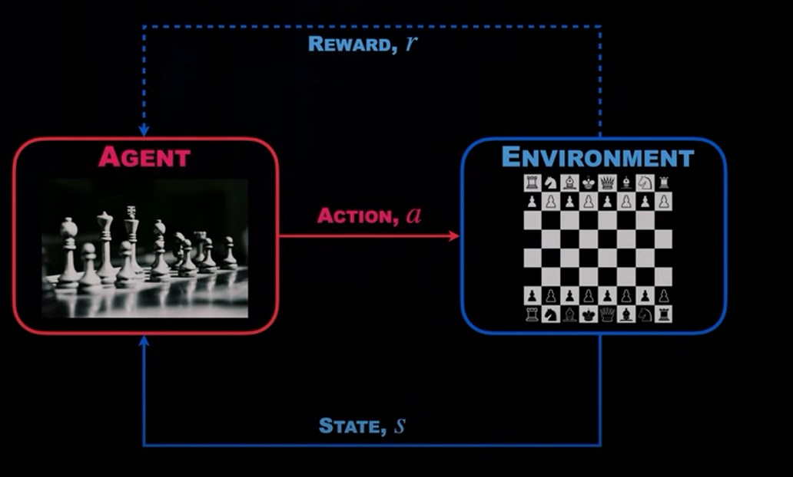

<!--
 * @version:
 * @Author:  StevenJokess（蔡舒起） https://github.com/StevenJokess
 * @Date: 2023-05-12 02:24:31
 * @LastEditors:  StevenJokess（蔡舒起） https://github.com/StevenJokess
 * @LastEditTime: 2023-10-12 23:38:27
 * @Description:
 * @Help me: make friends by a867907127@gmail.com and help me get some “foreign” things or service I need in life; 如有帮助，请赞助，失业3年了。
 * @TODO::
 * @Reference:
-->
# 国际象棋

长时间以来，国际象棋被公认为AI领域的实验用“果蝇”，大量的AI新方法被测试于此。直到1997年，IBM的深蓝击败世界级国际象棋大师加里·卡斯帕罗夫，展现出超人般的国际象棋水平，这只“果蝇”终于退休了[56]。当时深蓝运行在一个超级计算机上，现在一台普通的笔记本就能运行深蓝程序。[1]

1997年5月，国际象棋冠军卡斯帕罗夫和IBM公司的“深蓝”(Deep Blue)计算机在美国纽约展开了一次令全球瞩目的人机大战，如图4.3.1所示。结果，深蓝计算机发挥出色，以2胜3平1负的总比分战胜了卡斯帕罗夫，成为首个在标准比赛时限内击败国际象棋世界冠军的计算机系统，同时也成为人工智能领域的一个里程碑。[2]

在象棋比赛中，一般情况下希望智能算法能够判断某一时刻棋局对整个棋局胜负会带来怎样的影响。为了达到这样的目的，就需要判断该时刻之后每个棋局对整个棋局胜负的影响，然后将这些影响累加起来。但是，这种算法的实现极为困难。为此，深蓝不去判断某个时刻棋局对整个棋局胜负的影响，而是直接对任意一个棋局进行打分，来评估该棋局的优劣程度。在具体实现中，深蓝定义了8000种特征来判断某个棋局的优劣。比如：对于每一个竖线，都会有一个比特位来表示该竖线上是否有敌人的“兵”；用两个比特位表示己方“车”超越己方“兵”的数量（最大为2）等。8000种特征中的每个特征赋予了一定权重，并且这些权重在对弈过程中可调整，使得棋局优劣判断可因局势而灵活变换。

为了选择一个最佳局面来应对当前局势，深蓝采用了一种称为“最小最大”(Min-Max)的原则TODO:ref。“最小最大”的含义是使己方收益最大、对手却使自方收益最小。在如图4.3.2所示的游戏树中，A代表己方所在棋面，B和C代表对手所在棋面，D,E,F,G表示所对应棋面能够带来的收益（比如，棋面E的收益是-3，棋面G的收益是2）。

假设深蓝位于棋面A,现在要从B或C中选择一个棋面。由于B和C是对手所在棋面，对手会尽力选择带给深蓝最小收益的棋面，因此B会选择棋面E(带来一3的收益)、C会选择棋面F(带来1的收益)。最终，深蓝为了使得自己的收益最大，会选择C(因为C选择了棋面F)。这样，深蓝获得的收益为1。

基于上述“最小最大”原则，深蓝要做的就是从当前棋面出发，对当前棋面之后的可能棋面尽可能往前搜索。由于象棋棋面众多，尽管深蓝平均每秒能够对众多棋面进行判断评估，还是无法在规定时间内通过“穷举”计算得到一个最优棋面，因此还需要一种高效的棋局搜索算法。为此，深蓝采用了Alpha-Beta剪枝搜索算法 。TODO:ref

简单来说，Alpha-Beta剪枝算法是一种启发式算法，它能够“剪掉”不需要搜索的棋面而提高搜索效率。比如，某一棋面后自己的“王”将死，就不需要以对手“放自己一条生路”为前提，继续往后搜索。平均来看，深蓝可以在3分钟内通过剪枝搜索算法将12.2步以内的所有棋面搜索完毕。事实上，除了上述的行棋策略外，深蓝还会参考已有的棋谱。这些棋谱由4000个开局棋谱、70000个中盘棋谱和众多的残局棋谱构成，其中，残局棋谱指5个或少于5个棋子的局面，或带有一对“兵”的6个棋子。通过对已有的棋谱库的搜索，深蓝倾向于选择那些在棋谱中出现率更高的走法。

[1]: https://pdf-1307664364.cos.ap-chengdu.myqcloud.com/%E6%95%99%E6%9D%90/%E6%9C%BA%E5%99%A8%E5%AD%A6%E4%B9%A0/%E3%80%8A%E7%99%BE%E9%9D%A2%E6%9C%BA%E5%99%A8%E5%AD%A6%E4%B9%A0%E7%AE%97%E6%B3%95%E5%B7%A5%E7%A8%8B%E5%B8%88%E5%B8%A6%E4%BD%A0%E5%8E%BB%E9%9D%A2%E8%AF%95%E3%80%8B%E4%B8%AD%E6%96%87PDF.pdf
[2]: http://www.dzkbw.com/books/zjb/xinxijishu/gzxzxbx4/020.htm
