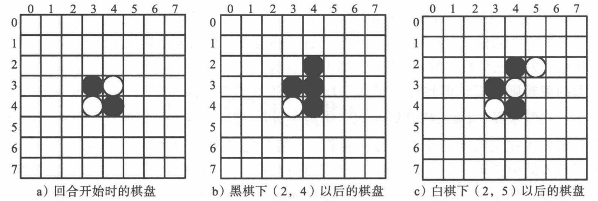

<!--
 * @version:
 * @Author:  StevenJokess（蔡舒起） https://github.com/StevenJokess
 * @Date: 2023-09-20 13:51:12
 * @LastEditors:  StevenJokess（蔡舒起） https://github.com/StevenJokess
 * @LastEditTime: 2023-09-20 14:00:09
 * @Description:
 * @Help me: make friends by a867907127@gmail.com and help me get some “foreign” things or service I need in life; 如有帮助，请资助，失业3年了。
 * @TODO::
 * @Reference:
-->

# 黑白棋

黑白棋(又称翻转棋， Reversi , Othello) 是在 8x8 的棋盘上进行的棋盘游戏 刚开始，棋盘正中有 个黑白相隔的棋子，然后黑棋、白棋轮流落子 如果某个落子能和己方的另夕卡一枚棋子在水平、垂直或对角方向夹住对方棋子，则可以将夹住的对方棋子变为己有;否则这个落子无效 当双方均不能下子时，游戏结束，子多的 方获胜

如图 11-1 所示，一开始棋盘上的 4个棋子如图 ll-1a 所示，棋牌左边的数字和上面的数值表示各网格位置 这时候轮到黑棋下 黑棋可以在 (2, 4) (3, 5) (4, 2) (5, 3)位置下棋，都可以夹住一个白棋 事实上，由于棋盘的对称性，这个位置是等效的现在让黑棋走 (2, 4) 这个位置 这时，位置 (3, 4) 的白棋被夹住了，变成了黑棋，得到图 11-1。现在轮到自棋下，这时候白棋可以下在 (2, 3) (2, 5) (4, 5) 个位置，这个位置都能夹住一个黑棋 如果白棋下在 (2, 5)，那么就会得到图 ll-lc 的局面。

如果将黑白棋扩展到 n x n 的棋盘，可以证明这个问题是 PSPACE 完全问题(PSPACE complete) 。如果两个玩家都按最佳策略对弈，则在 n=4 时白棋获胜，在 n=8 时未有关于结局的理论证明。目前大多数人认为在 n=8 时应该是平局。[1]

[1]: E:/BaiduNetdiskDownload/%E3%80%8A%E5%BC%BA%E5%8C%96%E5%AD%A6%E4%B9%A0%E5%8E%9F%E7%90%86%E4%B8%8Epython%E5%AE%9E%E7%8E%B0%E3%80%8BPDF+%E6%BA%90%E4%BB%A3%E7%A0%81/%E3%80%8A%E5%BC%BA%E5%8C%96%E5%AD%A6%E4%B9%A0%E5%8E%9F%E7%90%86%E4%B8%8Epython%E5%AE%9E%E7%8E%B0%E3%80%8BPDF+%E6%BA%90%E4%BB%A3%E7%A0%81/%E3%80%8A%E5%BC%BA%E5%8C%96%E5%AD%A6%E4%B9%A0%E5%8E%9F%E7%90%86%E4%B8%8Epython%E5%AE%9E%E7%8E%B0%E3%80%8BPDF+%E6%BA%90%E4%BB%A3%E7%A0%81/%E3%80%8A%E5%BC%BA%E5%8C%96%E5%AD%A6%E4%B9%A0%E5%8E%9F%E7%90%86%E4%B8%8Epython%E5%AE%9E%E7%8E%B0%E3%80%8B.pdf
