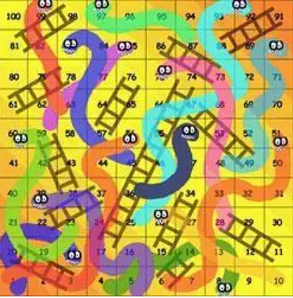

# 蛇棋

作为一个 85 后（暴露年龄），在年幼的时候我曾经接触一种游戏，这种游戏是一种棋类游戏，有一个棋盘，棋盘上有许多小格子，还有几个棋子和一个骰子。棋盘的样子大概是这样的：

这种棋被称为蛇棋，他的玩法大概是这样的：

几个小伙伴一起玩，每个人有一个棋子，大家一开始把棋子放在图中标为“1”的格子中；
每个人依次掷骰子，根据骰子的点数将自己的棋子向前行进相应的步数。如果现在我的棋子在“1”处，并且投掷出了“4”，那么我的棋子就可以到达“5”的位置；
棋盘上有一些梯子，这些梯子十分重要，它的两边将棋盘上的两个格子相连，这样如果棋子落在其中的一个各自上时，就会自动走到梯子对应的另一个格子中。对于上面的例子，如果我的棋子在“1”处，并且投掷出 2，那么我的棋子将到达“3”，由于“3”的位置有梯子，我将直接前进到梯子的另一段——“20”；
最终的目标是到达“100”这个格子，如果在到达时投掷的数字超过了 100，那么棋子将首先到达 100，剩余的步数将反向前进。比方说我的棋子在“99”这个位置，如果我投掷出了“3”，那么我将先前进 1 步到达 100，然后再后退 2 步，这样就到达了“98”。悲剧的是“98”处还有一个梯子，于是我的棋子将顺着梯子到达“81”。
从现在的角度来看，这个游戏的可玩性其实比较有限，游戏中也没有那么多跌宕起伏的情节，但是它确实是那一代人的一大娱乐。由此引出的一系列游戏棋——尤其是大富翁系列的游戏棋，真的影响了很多人。

说了那么多游戏规则和情怀的事情，下面就将来到正题：这东西和增强学习有什么关系？

蛇棋的游戏定义
实际上这个游戏就是增强学习的一个小案例。我们先不介绍增强学习的一些抽象概念，但从这个游戏入手。蛇棋中的棋盘和游戏规则是既定的，胜利规则也是既定的，这些内容帮助玩家建立对这个游戏的世界观，以及游戏的目标。

那么游戏的参与形式呢？就是掷骰子。实际上掷骰子这个问题是一个值得大书特书的问题，君不见，有些人掷骰子的时候要气沉丹田，有的要大喝一声，有的小心翼翼……尤其一个赌局上，每个人掷骰子的模样都不相同。对于这些不同的掷骰子方式，我们显然可以认为不同方式下骰子各个面出现的概率是不同的。为什么？这个就不用细谈了吧……

所以游戏中唯一决定玩家命运的操作出现了——掷骰子的手法。这里我们运用一点抽象，让玩家的手法暂时变成 2 种手法：一种可以均匀投掷出 1～6 这 6 个数字，另一种可以均匀投掷出 1～3 这 3 个数字。这样玩家相当于有了两个选择。

接下来看看游戏的最终获胜条件。一般来说游戏是多人一起玩的（一个人玩是什么鬼……），那么谁先到达“100”，谁就获得了胜利。换句话说，用最少的投掷次数到达“100”是每一个玩家的目标。为了达到这个目标，玩家最好能尽可能地“乘坐”更多的梯子上升，这样可以快速到达终点。一般来说游戏喜欢用一些数字或得分的形式记录玩家的表现，我们这里做一个约定，玩家每走一步，将获得 -1 分，也就是扣一分，到达重点后，将得到 100 分。这样先到达重点的玩家一定会有最高分，也就相当于 TA 获得胜利。

听完了上面的描述，“精通”开发的你一定忍不住想把上面的描述变成代码，于是我们就有了下面的这段代码：

复制代码

import numpy as np

class Snake:
   def __init__(self, ladder_num, dice_ranges):
       self.ladder_num = ladder_num
       self.dice_ranges = dice_ranges
       self.ladders = dict(np.random.randint(1, 100, size=(ladder_num, 2)))
       reverse_ladders = [(v, k)for k,v in self.ladders.items()]
       for item in reverse_ladders:
           self.ladders[item[0]] = item[1]
       print 'ladders info:'
       print self.ladders
       print 'dice ranges:'
       print dice_ranges

   def start(self):
       self.pos = 1

   def action(self, act):
       step = np.random.randint(1, self.dice_ranges[act] + 1)
       self.pos += step
       if self.pos == 100:
           return 100, -1
       elif self.pos > 100:
           self.pos = 200 - self.pos

       if self.pos in self.ladders:
           self.pos = self.ladders[self.pos]
       return -1, self.pos

if __name__ == "__main__":
   env = Snake(10, [3,6])
   env.start()
   while Ture:
       reward, state = env.action(1)
       print reward, state
       if state == -1:
           break
这个代码主要定义了一个蛇棋类，其中包含 3 个函数：

构造函数：需要传人两个参数——梯子数量和骰子数量。我们用一个 dict 存储梯子相连的两个格子的关系，用一个 list 保存可能的骰子的可投掷最大值。
start()：将 pos 设置为“1”，也就是开始游戏
action()：完成一次投掷，参数 act 表示玩家将采用何种手法。完成位置的更新后，函数将返回这一轮玩家的得分（-1 或 100）和玩家的最新位置
代码中的 main 函数用于展示一个蛇棋的游戏过程，运行如下所示：

复制代码

ladders info:
{2: 99, 67: 73, 54: 82, 73: 67, 10: 58, 43: 86, 45: 95, 93: 23, 50: 59, 17: 92, 82: 54, 99: 2, 86: 43, 23: 93, 26: 73, 59: 50, 92: 17, 58: 10, 95: 45}
dice ranges:
[3, 6]
-1 7
-1 9
-1 15
-1 19
…………(以下省略若干中间结果)
-1 73
-1 77
-1 83
-1 88
-1 90
-1 96
-1 97
100 -1
最终玩家完成了一次游戏，在这次游戏中，玩家共进行了 294 次投掷才到达重点，最终得分 -193 分。从上面的梯子情况可以看出，有些梯子真的容易让人绝望：

复制代码

99: 2
95: 45
92: 17
玩家多次掉入这种陷阱，才导致游戏进行了这么长时间。

作为好胜心很强的我们，肯定在想，刚才的游戏中，玩家只使用了一种手法啊，要是两种手法并用，甚至更多的手法并用，一定能提前完成游戏的。这就要涉及要一些策略了。

[1]: https://www.infoq.cn/article/painless-enhanced-learning-portal-part01/
