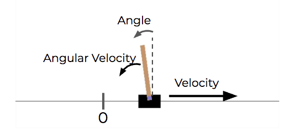

<!--
 * @version:
 * @Author:  StevenJokess（蔡舒起） https://github.com/StevenJokess
 * @Date: 2023-11-01 11:36:30
 * @LastEditors:  StevenJokess（蔡舒起） https://github.com/StevenJokess
 * @LastEditTime: 2023-11-14 05:56:10
 * @Description:
 *
 * @Help me: make friends by a867907127@gmail.com and help me get some “foreign” things or service I need in life; 如有帮助，请资助，失业3年了。
 * @TODO::
 * @Reference:
-->
# 倒立摆（CartPole）

## 倒立摆（Inverted Pendulum）

倒立摆（Inverted Pendulum）是指一个具有质量的杆，其上端固定在一个可以围绕其垂直轴旋转的支座上。当杆处于平衡位置时，它保持直立状态。但是，当受到外部扰动时，它可能会偏离平衡位置，从而产生摆动。倒立摆的目标是通过控制支座旋转的力矩，使杆保持平衡状态，避免其倒下。

它是典型的多变量、高阶次 ，非线性、强耦合、自然不稳定系统。倒立摆系统的稳定控制是控制理论中的典型问题，在倒立摆的控制过程中能有效反映控制理论中的许多关键问题，如非线性问题、鲁棒性问题、随动问题、镇定、跟踪问题等。因此倒立摆系统作为控制理论教学与科研中典型的物理模型 ，常被用来检验新的控制理论和算法的正确性及其在实际应用中的有效性。[3]

## CartPole 环境简介

CartPole 环境是一个类似于倒立摆的问题，但它具有更复杂的动态行为。

1. 它由平衡在可以左右直线移动的推车上的杆组成。
2. 随着小车的移动，杆会产生倾斜。而当倾斜到一定程度时，由于重力作用，杆会倒下。
3. 智能体可以在推车的任一侧施加力。其目标是学会用合适大小和方向的力，去控制在立柱下方的推车的速度，来使得杆尽量垂直向上；果杆与垂直线的夹角下降超过 15 度，智能体就此失败。
4. 给智能体指定了推车的位置，推车的速度，杆的角度和杆的旋转速度作为输入，用向量表示即 [Horizontal Position,Horizontal Velocity, Angle of Pole, Angular Velocity]。[2]

CartPole
CartPole 智能体将使用一个相当适度的神经网络，即使没有 GPU，您也应该能够相当迅速地进行训练。 我们将一如既往地从模型架构开始。 然后，我们将定义网络的内存，探索策略，最后训练智能体。

CartPole 神经网络架构
三个具有 16 个神经元的隐藏层实际上可能足以解决这个简单的问题。 这个模型非常类似于我们在本书开始时使用的一些基本模型。 我们将使用以下代码来定义模型：

def build_model(state_size, num_actions):
    input = Input(shape=(1,state_size))
    x = Flatten()(input)
    x = Dense(16, activation='relu')(x)
    x = Dense(16, activation='relu')(x)
    x = Dense(16, activation='relu')(x)
    output = Dense(num_actions, activation='linear')(x)
    model = Model(inputs=input, outputs=output)
    print(model.summary())
    return model
输入将是一个1 x 状态空间向量，每个可能的动作都有一个输出神经元，它将预测每个步骤该动作的Q值。 通过获取输出的argmax，我们可以选择Q值最高的动作，但是我们不必自己做，因为 Keras-RL 会为我们做。

记忆
Keras-RL 为我们提供了一个名为rl.memory.SequentialMemory的类，该类提供了快速有效的数据结构，我们可以将智能体的经验存储在以下位置：

memory = SequentialMemory(limit=50000, window_length=1)
我们需要为此存储对象指定一个最大大小，它是一个超参数。 随着新的经验添加到该内存中并变得完整，旧的经验会被遗忘。

策略
Keras-RL 提供了一个称为rl.policy.EpsGreedyQPolicy的 ε-贪婪 Q 策略，我们可以用来平衡利用与探索。 当智能体程序向世界前进时，我们可以使用rl.policy.LinearAnnealedPolicy来衰减ε，如以下代码所示：

policy = LinearAnnealedPolicy(EpsGreedyQPolicy(), attr='eps', value_max=1., value_min=.1, value_test=.05, nb_steps=10000)
在这里我们要说的是，我们要从ε的值 1 开始，并且不小于 0.1，同时测试我们的随机数是否小于 0.05。 我们将步数设置为 .1 到 10,000 之间，Keras-RL 为我们处理衰减数学。

智能体
定义了模型，内存和策略后，我们现在就可以创建一个深度 Q 网络智能体，并将这些对象发送给该智能体。 Keras RL 提供了一个称为rl.agents.dqn.DQNAgent的智能体类，我们可以为此使用它，如以下代码所示：

dqn = DQNAgent(model=model, nb_actions=num_actions, memory=memory, nb_steps_warmup=10,
               target_model_update=1e-2, policy=policy)

dqn.compile(Adam(lr=1e-3), metrics=['mae'])
此时，其中两个参数target_model_update和nb_steps_warmup可能还不熟悉：

nb_steps_warmup：确定我们开始进行经验重放之前需要等待的时间，如果您还记得的话，这是我们实际上开始训练网络的时间。 这使我们积累了足够的经验来构建适当的小批量生产。 如果您为此参数选择的值小于批量大小，则 Keras RL 将抽样替换。
target_model_update：Q函数是递归的，当智能体更新它的网络以获取Q(s, a)时，更新也影响其对Q(s', a)所​​做的预测。 这会导致网络非常不稳定。 大多数深度 Q 网络实现解决此限制的方法是使用目标网络，该目标网络是未经训练的深度 Q 网络的副本，而经常被新副本替换。 target_model_update参数控制这种情况发生的频率。
训练
Keras RL 提供了多个类似 Keras 的回调，可以方便地进行模型检查指向和记录。 我将在下面使用这两个回调。 如果您想查看 Keras-RL 提供的更多回调，可以在以下位置找到它们。 您还可以找到可用于创建自己的 Keras-RL 回调的回调类。

我们将使用以下代码来训练我们的模型：

def build_callbacks(env_name):
    checkpoint_weights_filename = 'dqn_' + env_name + '_weights_{step}.h5f'
    log_filename = 'dqn_{}_log.json'.format(env_name)
    callbacks = [ModelIntervalCheckpoint(checkpoint_weights_filename, interval=5000)]
    callbacks += [FileLogger(log_filename, interval=100)]
    return callbacks

callbacks = build_callbacks(ENV_NAME)

dqn.fit(env, nb_steps=50000,
 visualize=False,
 verbose=2,
 callbacks=callbacks)
一旦构建了智能体的回调，我们就可以使用.fit()方法来拟合DQNAgent，就像使用 Keras 模型一样。 在此示例中，请注意visualize参数。 如果将visualize设置为True，我们将能够观察智能体与环境的交互。 但是，这大大减慢了训练的速度。

结果
在前 250 个剧集之后，我们将看到剧集的总奖励接近 200，剧集步骤的总奖励也接近 200。这意味着智能体已学会平衡购物车上的杆位，直到环境结束最多 200 个步骤 。

观看我们的成功当然很有趣，因此我们可以使用DQNAgent.test()方法评估某些剧集。 以下代码用于定义此方法：

dqn.test(env, nb_episodes=5, visualize=True)
在这里，我们设置了visualize=True，以便我们可以看到我们的智能体平衡杆位，如下图所示：

我们走了，那是一根平衡杆！ 好吧，我知道，我承认平衡手推车上的电线杆并不是那么酷，所以让我们再做一个轻量级的例子。 在此示例中，我们将把月球着陆器降落在月球上，希望它将给您留下深刻的印象。

[1]: https://www.kancloud.cn/apachecn/apachecn-dl-zh/1956137
[2]: https://steemit.com/ai/@hongtao/ai-reinforcement-learning-rl
[3]: https://baike.baidu.com/item/%E5%80%92%E7%AB%8B%E6%91%86/7765096
