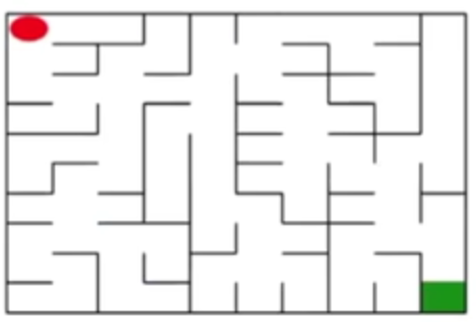

<!--
 * @version:
 * @Author:  StevenJokess（蔡舒起） https://github.com/StevenJokess
 * @Date: 2023-11-05 08:54:18
 * @LastEditors:  StevenJokess（蔡舒起） https://github.com/StevenJokess
 * @LastEditTime: 2023-11-05 08:58:31
 * @Description:
 * @Help me: make friends by a867907127@gmail.com and help me get some “foreign” things or service I need in life; 如有帮助，请资助，失业3年了。
 * @TODO::
 * @Reference:
-->
# 迷宫

如上图所示，左上角的红色椭圆既是起点也是机器人的初始位置，右下角的绿色方块是出口。

- 游戏规则为：从起点开始，通过错综复杂的迷宫，到达目标点（出口）。
- 在任一位置可执行动作包括：向上走"u"、向右走"r"、向下走"d"、向左走"T"
- 执行不同的动作后，根据不同的情况会获得不同的奖励。
- 具体而言，有以下几种情况：撞墙；走到出口；其余情况

## 任务

- 你需要实现基于基础搜素算法和Deep Q Learning算法的机器人，使机器人自动走到迷宫的出口。
- 使用Python语言：使用基础搜索算法完成机器人走迷宫：使用Deep Q Learning算法完成机器人走迷宫。
- 算法部分需要自己实现，不能使用现成的包、工具或者接口。
- 可以使用Python实现基础算法的实现。使用Keras、PyTorch等框架实现Deep QLearning算法。
- 布置日期：2023年10月16日；提交作业：2023年11月16日晚上12点前

[1]: https://www.bilibili.com/video/BV1tG4112746/
