<!--
 * @version:
 * @Author:  StevenJokess（蔡舒起） https://github.com/StevenJokess
 * @Date: 2023-06-08 14:24:05
 * @LastEditors:  StevenJokess（蔡舒起） https://github.com/StevenJokess
 * @LastEditTime: 2023-07-16 20:56:06
 * @Description:
 * @Help me: make friends by a867907127@gmail.com and help me get some “foreign” things or service I need in life; 如有帮助，请赞助，失业3年了。
 * @TODO::Python代码
 * @Reference:
-->
# 投资技术分析概述

## 证券/期货的定义

证券的定义：狭义上的证券主要指的是证券市场中的证券产品，其中包括产权市场产品如股票，债权市场产品如债券，衍生市场产品如股票期货、期权、利率期货等。[53]

而《证券法》的“证券”与《期货法》的“期货”界定：主要按照是否需要发行为标准。那么权证应属于《证券法》调整，个股期权则属于《期货法》调整范围。[54]

## 期货竞价方式

期货交易的早期，由于没有计算机，故在交易时都采用公开喊价方式。公开喊价方式通常有两种形式：

- 一是连续竞价制(动盘)，它是指在场内交易者在交易所的交易池内面对面地公开喊价，表达各自买进或卖出合约的要求。这种竞价方式是期货交易的主流，欧美期货市场都采用这种方式。这种方式的好处是场内气氛活跃，但其缺陷是人员规模受到场地限制。众多的交易者拥挤在交易池内，人声鼎沸，以至于交易者不得不使用手势来帮助传递交易信息。这种方式的另一个缺陷是场内交易员比场外交易者有更多的信息和时间优势。抢帽子交易往往成了场内交易员的专利。
- 二是计算机技术普及后，世界各国的交易所纷纷改弦更张，采用计算机来代替原先的公开喊价方式。

计算机撮合成交是根据公开喊价的原理设计而成的一种自动化交易方式，它具有准确、连续、速度快、容量大等优点。目前，我国的期货交易所都采用计算机撮合成交方式。[91]

### 价格优先、时间优先及撮合成交价的确定

计算机交易系统在撮合成交时，按价格优先、时间优先的原则进行。该原则的完整解释是：买家出价高的优先，卖家出价低的优先，如果出价相同则挂单时间最早的优先。例如，某交易者卖出7月大豆10手，挂出价格为3 400元，交易者甲挂出10手买单，报价为3 398元；随后，交易者乙也想买10手，挂价为3 399元，由于乙的价格比甲高，按照价格优先原则，乙的单子排在甲的前面；后来，丙也挂出10手买单，价格同样为3 399元，由于挂价与乙相同，按照时间优先原则，只能排在乙的后面，但仍在甲之前。假如这时有一个交易者以3 397元卖出10手，买方优先成交者就是乙。读者可能会想到，优先的买方出价是3 399元，而卖方出价是3 397元，那么实际成交价究竟是多少呢？3 397元、3 398元、3 399元似乎都可以？对此，计算机是如何确定的呢？

计算机在撮合时实际上是**依据前一笔成交价而定出最新成交价的**。如果前一笔成交价低于或等于卖出价，则最新成交价就是卖出价；如果前一笔成交价高于或等于买入价，则最新成交价就是买入价；如果前一笔成交价在卖出价与买入价之间，则最新成交价就是前一笔的成交价。

例如，买方出价3 399元，卖方出价3 397元。如果前一笔成交价为3 397元或3 397元以下，最新成交价就是3 397元；如果前一笔成交价为3 399元或3 399元以上，则最新成交价就是3 399元；如果前一笔成交价是3 398元，则最新成交价就是3 398元。

这种撮合方法的好处是既显示公平性，又使成交价格具有相对连续性，避免不必要的无规律跳跃。

## 投资分析的分类

投资分析，分为基本面分析、技术分析。

## 基本面分析定义

基本分析法着重于对一般经济情况以及各个公司的经营管理状况、行业动态等因素进行分析，以此来研究股票的价值，衡量股价的高低。

基本面分析路径：宏-》中-》微

1. 宏观分析：经济、政治环境分析
1. 中观分析：产业分析
1. 微观分析：公司分析

### 宏观经济的三个重要指标

- CPI(Consumer Price Index, 消费者物价指数): 反映与居民生活有关的产品及劳务价格变化，通常用来观察通货膨胀和通货紧缩情况。不同国家和地区的CPI指数，涵盖的产品或服务的范围有明显不同，而且不同子项的权重也有不同。CPI短期涨跌幅度，直接反映出当前经济环境情况。CPI升幅越大，代表通货膨胀形势越明显。
- PPI(Producer Price Index, 生产者物价指数): 反映的是与工业企业生产环节的价格变动情况，用于衡量企业为了生产而购买的原材料、劳务等费用。PPI在不同国家和地区的子项比重也有不同，但基本都覆盖了原材料、中间品和产成品三个阶段的价格变化情况。
- PMI(Purchasing Managers' Index, 采购经理人指数): 通过对采购经理的调查汇总，反映经济是扩张趋势还是收缩趋势的指数，一般分为制造业PMI、服务业PMI、建筑业PMI等。PMI覆盖了新增订单、产量、配送、库存、积压订单、雇员情况等方面，以50为荣枯分界线，PMI高于50则代表经济扩张，高出越多，越显示经济扩张良好，低于50则代表经济收缩下滑，指数越低显示经济越萧条。[88]

#### 三者关系：

PMI及PPI是先行指标，CPI是滞后指标，前两者对后者会有一定的传导性。

PPI（生产者价格指数）对CPI（消费者价格指数）的影响有两种途径：

1. 工业途径：企业生产者的原材料、工资价格上涨导致企业生产成本提高，那么企业盈利空间减小，为了保住既有的利润，企业不得不在销售的消费品上面进行加价（所谓的价格加成），进而导致一般消费品价格上升（CPI）上升；
2. 农业途径：初级农产品的投入（肥料、农业工具等）价格上涨，导致初级农产品（比如做薯片的薯）价格上涨，和以上相似，又将导致食品类消费品价格上涨。

PMI对CPI的影响则主要由于PMI本身是对某个领域的经济或者整个经济荣衰的衡量指数，一般以50为界，低则衰，高则荣。

一般而言，

- 当经济趋向繁荣即超越50时，表明经济走势良好，如果大幅度超过50表明经济过热，供不应求，CPI则很可能随之升高；
- 相反，如果大幅低于50则表明有通货紧缩的危险，CPI自然降低甚至为负数。[89]

## 技术分析定义

而技术分析则是透过图表或技术指标的记录，研究市场过去及现在的行为反应，以推测未来价格的变动趋势。其依据的技术指标的主要内容是由股价、成交量或涨跌指数等数据计算而得的，技术分析只关心证券市场本身的变化，而不考虑会对其产生某种影响的经济方面、政治方面的等各种外部的因素。[61]

技术分析概述  -》 技术图形分析  -》 技术指标分析

技术分析的理论基础是空中楼阁理论。

- 空中楼阁理论是美国经济学家凯恩斯于1936年提出，该理论完全抛开股票的内在价值，强谓心理构造出来的空中楼阁。

### 基本面分析与技术分析的比较

- 基本面分析是为了获得基本收益，研究价格变动背后的原因，从而去判断红利、股票价格的合理性及长远发展前景，告诉我们该购买何种股票；特点：更科学、门槛高（信息要完整、及时、准确；但信息往往不全不及时、解读会和市场不一致），即操作性差。[87]
- 技术分析则是为了获得低价买入高价卖出的差价（spread）即资本收益，**只**研究价格变动本身，侧重预测**短期**内股价涨跌的趋势，去把握具体购买的时机；特点：不但科学（统计概率、行为金融学）而且艺术（经验积累、主观）[28]、操作性强。

大多数成功分析的投资者都是把两种分析方法结合起来运用，用基本面分析方法估计长期走势，而用技术方法判断短期走势和买卖时机。

### 技术分析的理论基础————三大假设

#### 一、市场行为包容消化一切

“市场行为包容消化一切”是技术分析的基石。

1. “市场行为包容消化一切”是指，任何影响股票的因素（基础的、政治的、心理的），实际上**都**反映在价格之中。
2. 所以技术分析者，只研究价格变化就足够了，而不必研究造成价格变化的内在因素。
3. 技术分析者所使用的图表工具本身如实地描述了市场参与者的行为，我们能够把握市场参与者对市场的反应，把握未来趋势。

- 合理性：任何一个因素对股票市场的影响最终都必然体现在股票价格的变动上。
- 不合理性：但市场行为反映的信息只体现在价格的变动中，同原始的信息毕竟有差异，信息损失是必然的。

在此前提下，诞生了道氏理论。[37]

#### 二、价格以趋势方式演变

“趋势”概念是技术分析的核心。如果没有外在因素的影响，价格波动不会改变原来的方向。正因为如此，在一些文献中把这一条称为“牛顿第一定律”。

一般来说，若某段时间的价格一直是下降的或上升的，那么在今后一段时间内，如果不出意外，股票价格也会按照这一方向继续下降或上涨，没有理由改变这一既定的运动方向。（方向思维）如果没有外在的因素，没有必要逆大势而为。[18]

趋势有涨势和跌势：

- 涨势：不断上升的峰和谷
- 跌势：不断下降的峰和谷

技术分析者认为，市场确实有趋势可循，而且当前的市场趋势有势能和惯性，只有当它走到趋势的尽头，它才会掉头反向。（由涨到跌，或由涨到跌）

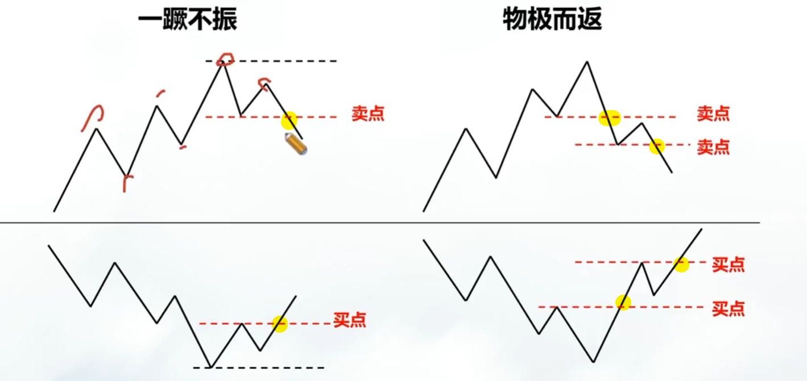

技术分析和市场行为与人类心理学有关，证券投资不过是一种追求利润的行为，不论是昨天、今天或明天这个目的都不会改变。

- 合理性：TODO:
- 不合理性：但当价格沿某个方向波动的时间过长，就会增加反方向的力量，从而使该假设受到冲击。此外，价格的变动受到许多因素的影响，有些是根本想不到的，这使价格的波动表现出无规律的现象。

在此前提下，诞生了波浪理论。[37]

#### 三、历史会重复

该假设是从内因到表象去考虑的。

- 信息不对称和人的有限理性：理性的个体会懂得万事万物的最优解，但由于发展是不断的、可变方向和优化目标是复杂多样的，与自身所了解的真伪难辨的有限信息跟有限的认知能力（信息加工：感知、存储、简化、计算使用[39]）的限制，人难以快速计算得最优解，所以不存在理性的人，至少不存在永久理性的人。当然，也可乐观地说，总有进步的空间。
- 导致了供需关系的周期性：由于市场上的信息不对称和，往往造成供过于求、供不应求现象的存在。当供过于求，价格下降，导致生产不积极，可能过于不积极，导致了供不应求；而当供过于求，价格上升，导致生产积极，可能过于积极，又引发供过于求。不断如此，则呈现一种循环。
- 和非理性的交易心理：人的买卖行为背后有一些心理活动，已被总结为交易心理学的理论（更多见[38]）。
- 从而表象在统计学下呈现周期性：在这种供求关系的循环和固定的心理反应下，市场交易行为将趋于一定的模式，由此导致历史重演，即过去出现过的价格趋势和变动方式，今后会不断出现。
- 利用过去预测较好，去沿用这种预测能力：由于这些图表形态在过去表现良好，我们就假设他在将来表现一样良好，投资者就可以通过分析过去的价格变动资料来侦测未来的价格走势。

在此前提下，诞生了周期理论。[37]

## 技术分析的基本要素

技术分析的基本要素：价、量=》涨跌指数。

### 价

价有开盘价、收盘价、最高价、最低价。

- 开盘价，9：00——9：25之间集合竞价的成交额最大的价格（股票）；开市前 5 分钟集合竞价产生的价格（期货）。
- 收盘价，当日最后一笔成交价格。
- 最高价，当日的最高交易价格。有时最高价只有一笔，有时也不止一笔。
- 最低价，当日的最低交易价格。有时最低价只有一笔，有时也不止一笔。[42]

#### 证券的开盘价：

我国证券交易所单个证券的日开盘价是怎样产生的？交易日开盘前时的**集合竞价**撮合成交价。

世界上大多数证券交易所都采用成交额最大原则来确定开盘价。在股票交易中股票是根据时间优先和价格优先的原则成交的，那么，每天早晨交易所刚上班时，谁是那个“价格优先者”呢？其实，早晨交易所的计算机主机撮合的方法和平时不同，平时叫连续竞价，而早晨叫集合竞价。 每天早晨从9:15-9:25是集合竞价时间。

它的产生原则是：某一个股票在9：00——9：25之间由买卖双方向深沪股市发出的委托单中买卖双方委托价一致股价，但值得说明的是一这个“一致股价”是指能够**单笔撮合量最大量**的那个“一致股价”，它不一定是买卖双方委托价一致的最高价。在9：00——9：25之间产生的“集合竞价”不执行在9：30以后“连续竞价”中当委托价一致时所执行的“时间优先”原则。[7]

如果开市后30分钟内无成交价，则以前日的收盘价作为开盘价。

#### 期货的开盘价：

期货的开盘价：期货交易开盘价又称期货开市价，是指期货交易所每个交易日开市后的第一笔每股买卖成交价格。

期货交易开盘价是通过集合竞价产生，而集合竞价的产生原则又与正常交易中的价格成交原则有区别，所以在个别情况下就会产生申报买价高于开盘价或申报卖价低于开盘价而不能成交的现象。

尽管期货合约的品种多样，但是，其开盘价集合竞价都是在每一个交易日的开市前5分钟内进行。其中，前4分钟为期货合约买进、卖出价格指令申报的时间，最后1分钟为集合竞价撮合的时间，在开市前产生开盘价。我国期货交易所实行计算机自动撮合时间，交易系统会自动控制集合竞价申报的开始和结束，并在计算机终端上显示。开展夜盘交易的期货合约(部分期货品种没有夜盘)的开盘集合竞价在每一个交易日夜盘开市的前5分钟进行，白天不再进行集合竞价。

集合竞价——集合竞价遵循**最大成交量**原则，即以此价格成交能够得到最大成交量。低于集合竞价产生的价格的卖出申报会全部成交;高于集合竞价的价格的买入申报会全部成交；等于集合竞价产生的价格的买入或卖出申报，则根据买入申报量和卖出申报量的多少，为确定有对手方的存在，将会按少的一方的申报量成交。[90]

#### 期货价格的特性

- 期货价格的权威性：由于期货交易的独特机制与广泛的参与性，期货价格较现货价格更有代表意义。
- 期货价格的远期性：期货合约到期之前的成交价格都是远期价格，是期货交易者在当前现货价格水平上，通过对远期持有成本和未来价格影响因素的分析判断的一种评估。
- 期货价格的预期性：反映了是市场人士在现在时点对未来价格的一种心理预期。
- 期货价格的波动敏感性：相对于现货价格而言，期货价格对消息刺激的反应程度更敏感，波动幅度更大。其原因来自于期货的市场的高流动性，信息高效性和交易机制的灵活性。

### 量

量有成交量（VOL, Volume）和持仓量（OPI, Open Position[57] Interest）（期货、期权）

#### 成交量：

- 成交量：一定时间内，成交的总手数。成交量就是价格涨跌过程中的**资源损耗**。[86]反映了市场的迫切性。
- 股票成交量(VOL, volume)：指在某一特定时间段内，投资者购买和出售股票的数量总和。单位：手。手：它是国际上通用的计算成交股数的单位。必须是手的整数倍才能办理交易。目前一般以100股为一手进行交易。即购买股票至少必须购买100股。[45] 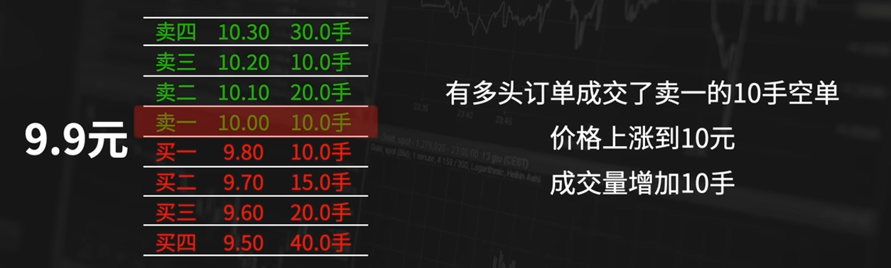
- K线图下的柱状图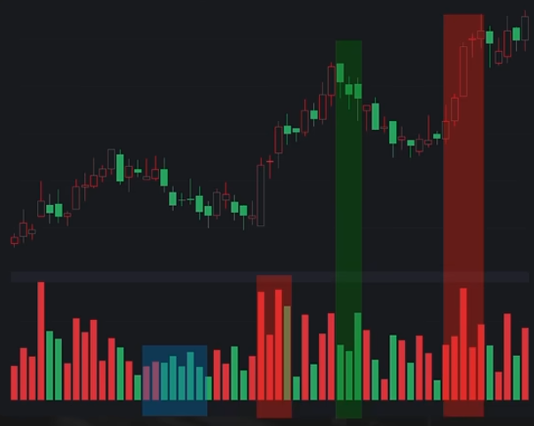：每日的K线对应的一株，代表着这一天的波动所成交的订单。柱体有长有短，表明成交订单数量的多少；颜色有红有绿，则是K线涨跌的结果。
  - 有价无市：成交量较低的时候，价格却很高。这个价格不靠谱，是左手倒右手呢。[76]
  - K线报收阳线时，成交量柱状图为红色，K线报收阴线时，成交量柱状图为绿色。[58]

> 股票成交额是指在某个交易日中股票交易的总金额。它是指买卖双方成交价格的乘积之和，单位是万元。其助于判断市场活跃度、投资者情绪以及股票走势等。
>
> 换手率（Turnover Rate）也称“周转率”，指在一定时间内市场中股票转手买卖的频率，是反映股票流通性强弱的指标之一。换手率 = 某一段时期内的成交量/发行总股数×100%[48]（在中国：成交量/流通股本×100%）[50]一般来说，当股价处于低位时，当日换手率达到4%左右时应引起投资者的关注，而上升途中换手率达到20%左右时则应引起警惕。[49]

- 期货成交量(成交量的缩写CJL)：为在一定的交易时间内某种期货在交易所成交的合约数量。在国内期货市场，计算成交量时采用买入与卖出量两者之和。
  - CJL成交量指标的中间位置有一条虚线，虚线上显示的数值，表示的是成交量，如图中99万，就是指这条虚线代表99万手成交量。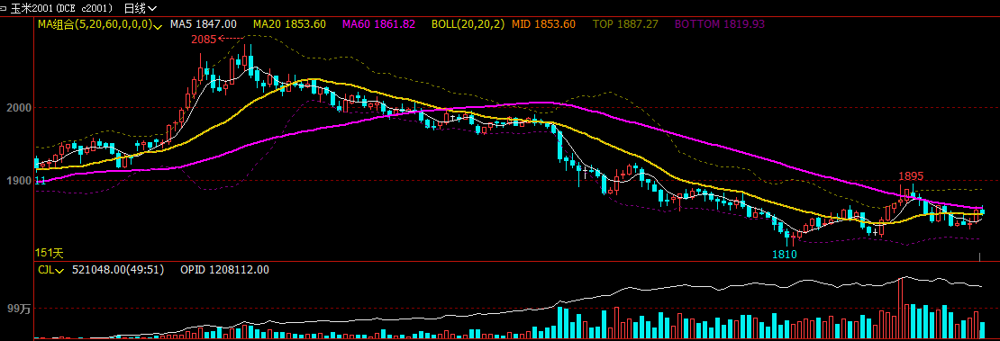
  - 白线是统计成交量的工具，用的是交易量累计法。如果CJL白色曲线上升，期价上涨，说明多头加仓态势，看涨警讯；CJL白色曲线上升，期价下跌，说明空头加仓态势，看跌警讯；CJL白色曲线下降，期价上涨，空头平仓态势，看涨警讯；CJL白色曲线下降，期价下跌，多头平仓态势，看跌警讯。（警讯——>不一定变化；而信号——>命令[87]）
  - 那么，白线以上则是持仓量。总仓位指标（OPID）：1200112.00。
  - 空心柱体表示当前周期的总成交量，柱体为红色时，说明当前周期的收盘价大于开盘价，价格是上涨的；柱体为蓝色时，说明当前周期的收盘价小于开盘价，价格是下跌。红色的实心柱体是外盘数量。如图中显示521048.00（49：51），说明外盘占49%，内盘占51%。红色的实心柱就是49%的长度。一般，当外盘**大于**内盘时，说明主动性买盘增加，价格**将上涨**。
- 但仅仅从成交量图是很难判断价格趋势的。
- 在合约有效期间的初始阶段，交易量和持仓量都相当低，在合约有效期间快要结束时，交易量通常会增加。

#### 持仓量（未平仓量）

需要注意：持仓量是期货和期权市场所特关注的概念，因为期货交易中“持仓量”是可变的；而在股市中，股票在一级市场发行后进入二级市场，只要一级市场没有什么变化（比如增股、缩股），二级市场上的流通筹码就是恒定不变的，因而其持仓量是不会发生变化的。[91]

持仓量是指某一合约在某一时间点的未平仓合约数量，反映出沉淀的资金。

持仓量的变化与资金流向具有正相关。持仓量是从该种期货合约开始交易起，到计算该持仓量止这段时间内尚未对冲结算的合约数量，持仓量越大，该合约到期前平仓交易量和实物交割量的总和就越大，成交量也就越大。因此，分析持仓量的变化可推测资金在期货市场的流向。持仓量增加，表明资金流入期货市场；反之，则说明资金正流出期货市场。

未平仓合约中，多仓与空仓的总量总是相等的。期货市场上有多少多单就对应有多少空单。

##### 持仓量的计算规则：

国内的商品期货持仓量计算的是买方和卖方合计的数量（金融期货计算单边）。

- 如买卖双方均为新开仓，则持仓量增加2个合约量；
- 如其中一方为新开仓，另一方为平仓，则持仓量不变；
- 如买卖双方均为平仓，持仓量减少2个合约量。当下次开仓数与平仓数相等时，持仓量也不变。[92]

##### 分析：

- 持仓量的上涨，就是看多的人觉得价格要涨，看空的人觉得价格要跌，认为对方是傻子。
- 而价格下降持仓量下跌是，有一边心态崩了，亏不起了。
- 价格不变持仓量下跌，是双方觉得没意思了。[76]
- 类似于股票市场的流通股，只是流通股只有多头。但是一手合同对应的是双方，持仓统计可以分为单边和双边。[43]
- 注意：我国期货市场中3家商品期货交易所的行情显示，成交量和总持仓都是按双边统计显示的；而中金所的行情显示，成交量和总持仓是按单边统计显示的。[91]


### 涨跌指数

- 涨跌：以每天的收盘价与前一天的收盘价相比较，来决定股票价格是涨还是跌。一般在交易台上方的公告牌上用"+""-"号表示。
- 涨(跌)停板：交易所规定的股价一天中涨（跌）最大幅度为前一日收盘价的百分数，不能超过此限，否则自动停止交易。[45]
- 涨跌指数（advance-decline index）：根据每天上涨股票数量与下跌股票数量的比率编制的指标，反映市场的总体趋势。[51]

## 技术分析的四维空间：

- 价，即是市场价格，是市场行为最基本的表现, 买卖双方对价格的认同程度通过成交量的大小体现。
- 量，即成交量，量价配合的关系是价升量增、价跌量减、天价天量、地价地量。
- 空，即空间，是市场潜在能量的表现, 指出 “价格有可能上升或下降到什么地方” ，反映的是每次市场发生变动程度的大小。
- 时，即时间，时间指出 “价格有可能在何时出现上升还是下降” 反映市场起伏的内在规律体现了市场潜在能量由小变大再变小的过程。

### 一）价和量是市场行为的最基本的表现

- 市场行为最基本的表现是成交价格和成交量。过去和现在的成交价格及成交量反映大部分市场行为，在某一时间的价格和成交量反映的是买卖双方在这个时间的共同市场行为，是双方暂时的均衡点。均衡会不断地变化，即是价量关系的变化。
- 一般来说，买卖双方对价格的认同程度通过成交量的大小得到确认。认同程度大，成交量大；认同程度小，成交量小。
- K线幅度和成交量多少没有确定的关系，因此会形成不同的量价关系。
- 有放量上涨、也有缩量上涨。
- 缩量上涨：空头对手的资源并没有被充分的消耗。那有可能是空头的资金在当前阶段放弃，也有可能是空头资金把资源集中起来防守某个位置，也有可能是请军入瓮，集中消灭多头。
- 结果>损耗。经过巨大损耗的胜利更有价值损耗小的胜利要小心。

### 二）时间和空间是市场潜在能量的表现

1. 在技术分析中，“时间”是指完成某个过程所经过的时间长短，通常是指一个波段或一个升降周期所经过的时间。“空间”是指价格的升降所能达到的程度。
2. 时间指出了“价格有可能在何时出现上升或下降”，空间指出了“价格有可能上升或下降到什么地方”。投资者对市场的分析，其关注点都集中在这两个因素上。
3. 时间周期：100块到110块。1分钟涨停——市场疯狂了；十年——蜗牛一样。
4. 序列认知：同样的价格、同样的买卖行为、同样的价格变化，它在不同的位置，意义是截然不同的。比如说，同样是卖出行为，在价格低位上，有可能是洗盘，有可能是绝望；在价格高位上，有可能是出货，有可能是反扑。[76]

### 三）成交量与价格趋势的一般关系

1. 价格随成交量的上涨而上升，这是正常的市场特征，这种价量关系表示价格将继续上升；反之，如果价格出现了新高，而成交量没有创出新高，则此上升趋势是令人怀疑的，是价格潜在的反转信号。
2. “井喷”：价格随着缓慢增加的成交量而逐渐上升，某一天平缓的走势突然变成直线上升。成交量剧烈增加、价格暴涨，之后是成交量萎缩、价格大幅度下降，这表明上升已经到了末期。
3. “波谷”：在长期下降后，价格形成了“波谷”，并开始回升，成交量没有因价格的上升而放大；之后，价格再度回到“波谷”。如果此时的成交量低于前一个“波谷”，就是价格将要上升的信号。
4. 市场出现一段时间的上升行情后，出现大的成交量，而价格没有同时向上，说明**卖压**很重，形成价格下降的因素。
5. 成交量是价格的先行指标，价格是虚的，成交量是实的.

> 卖压是一种股市用语。是指在股市上大量抛出股票，使股价迅速下跌。卖压重，说明价位抛盘很多，看空的人很多，股价上行非常困难。[19]

### 四）时间、空间与价格趋势的一般关系

- 在市场中，经常能够听到“长线”和“短线”的说法。
  - 对于大周期，或者说是时间长的周期，今后价格将要经过的变化过程也应该长，价格变动的空间也应该大。
  - 对于时间短的周期，今后价格变动的过程和变动的幅度也应该小。
- 一般来说，时间长、波动空间大的过程，对今后价格趋势的影响和预测作用也大；时间短、波动空间小的过程，对今后价格趋势的影响和预测作用也小。

## 技术分析方法的种类

在历史价、量资料基础上进行的统计、数学计算、绘制图表（chart）方法是技术分析方法主要的手段。

从这个意义上讲，技术分析方法可以有多种。一般说来，可以按约定俗成，将技术分析主要分为如下六类：K线类、支撑压力（趋势线/切线）、形态类、指标类、波浪理论、循环周期。

## 道氏理论

### 道氏理论的演变

- 威廉姆·彼得·汉密尔顿（William Peter Hamilton）1922年出版《股市晴雨表》
- 该理论源于罗伯特·雷亚·道（Robert Rhea Dow）（1851年—1902年[62]）在《华尔街日报》上发表的 255 篇社论
- 他观察到股票价格经常被华尔街的大机构投资者们控制和垄断，从而引起股价的暴涨和暴跌，使一些小的、个人投资者蒙受巨大损失。
- 他出于使价格不再被垄断集团所掌控的目的，希望创造出一个方法来把握市场的总体运行趋势。[65]
- > 罗伯特·雷亚·道（Robert Rhea Dow）是 道·琼斯公司和道琼斯指数的创始人（琼斯来自另一位创始人爱德华·戴维斯·琼斯[64]）；《华尔街日报》（Wall Street Journal）创始人[2]
- 道本人从未使用过道氏理论这个术语，也从未将其作为一种交易系统提出过
- 汉密尔顿（Hamilton）, 罗伯特·雷亚（Robert Rhea）, 和 S·A·纳尔逊（Schaefer）在道死后1932年发行《道氏理论》（The Dow theory）[63]

### 道氏理论基础——三个假设

- 主要趋势是不会被操纵的
- 平均价格指数消溶一切因素
- 道氏理论是客观化的分析理论

### 只考虑收盘价

收盘价是最重要的价格。道氏理论并不注重一个交易日内的最高价和最低价，而只考虑收盘价。

#### 道氏理论的评价：

技术分析的三个假设条件有合理的一面也有不尽合理的一面。

- 例如：第一个假设存在的前提条件是证券市场是有效的市场，然而众多实证分析指出，即使像美国这样发达的证券市场也仅是弱式有效市场，或至多是半强式有效市场，更何况信息损失是必然的，因此市场行为包括一切信息也只能是理想状态。
- 又如一切基本因素确实通过供求关系影响证券价格和成交量，但证券价格最终要受它的内在价值制约。
- 再如，历史也确实有相似之处，但绝不是简单的重复，差异总是存在的，绝不会出现完全相同的历史重演。

正因为如此，技术分析显得**说服力不够强、逻辑联系不够充分**并引起不同的看法和争论。

### 道氏的三种走势

股票价格的周期性变动可以分解成三种运动：主要趋势、次要趋势和短期波动。三种运动合成了复杂的股价运动。

- 短期趋势：持续数天至数个星期。
  - 涨势：表现为各次级波动的低点一点比一点高，若将过去的各个低点相连，可形成一条向上倾斜的直线，这就是上升趋势线。
  - 跌势：则表现为各次级波动的高点一点比一点低，将各个高点相连，可形成一条向下倾斜的直线，这就是下降趋势线。
  - 水平移动
- 中期趋势：持续数个星期至数个月。又称次要趋势，是价格在沿着主要趋势演进过程中产生的重要反复，即在上涨的主要趋势中会出现中期回档下跌，在下跌的主要趋势中会出现中级反弹回升。
- 长期趋势：持续数个月至数年。又称主要走势，代表整体的基本趋势，通常为牛市（Bulish，Bull Market，多头市场）或熊市（Bearish，Bear Market，空头市场）。
  - 牛市：如果每一个后续价位上升到比前一个更高的水平，而每一次回调的低点都比前一次的低点高，那么这一主要趋势就是上升趋势，称之为牛市；
  - 熊市：如果每一个后续价位下跌到比前一个更低的水平，而每一次反弹的高点都比前一次的低，那么这一主要趋势就是下降趋势，称之为熊市。[17]

趋势的结束：只有当出现了明确的反转信号时，才意味着一轮趋势的结束。当一个新的主要趋势第一次确定后，如果不考虑短期的波动，趋势会持续下去，直到出现了明确的反转信号。

#### 成交量与趋势结束的关系

股价从下降的趋势转为上升的趋势，必须要有成交量配合。

- 当股票价格向上突破下降趋势线时，成交量随之放大，为**有效突破**。因为通常，在多头市场，价位上升，成交量增加；价位下跌，成交量减少。在空头市场，当价格滑落时，成交量增加；在反弹时，成交量减少。
- 但是股价下跌突破上升趋势线则不一定需要成交量增加。当股价向下跌破趋势线后如果跌幅不深，成交量不一定增加，甚至有所萎缩，但是当股价回弹至趋势线下方，成交量明显放大，股价立即快速下跌，可确认上升趋势线已被有效突破。
- 当然，这条规则有时也有例外。因此，只根据几天的成交量是很难得出正确结论的。

#### 熊市（空头市场）

- 第一阶段（被高估：价格高于价值，出货）：是对那些在抬高价格之后所购买的股票所寄托希望的破灭。  在这一阶段，有远见的投资者感到交易的利润已达至一个反常的高度，因而在涨势中抛出所持股票，尽管上涨趋势逐渐减弱，交易量仍居高不下，公众仍很活跃。但由于预期利润逐渐消失，行情开始显弱。
- 第二阶段（价格逐渐反应价值，恐慌）：是商业的萧条而导致的卖出阶段。  买方少起来而卖方就变得更为急躁，价格跌势突然加速，成交量也放大，价格几乎是直线落至最低点。在这一阶段之后，可能存在一个相当长的次等回调或一个盘整，然后开始第三阶段。
- 第三阶段（被低估：价格低于价值）：来自于对股票失望的卖压，不论价值如何，许多人急于兑现一部分的股票。  那些在大恐慌阶段坚持过来的投资者此时或因信心不足而抛出所持股票，或由于目前价位比前几个月低而买入。商业信息开始恶化，随着第三阶段推进，跌势并不快，但仍持续着，这是由于某些投资者因其他需要，不得不筹集现金而越来越多地抛出其所持股票。当坏消息被证实，而且预计行情还会继续看跌时，这一轮熊市就结束了，而且通常是在所有的坏消息公布之前就已经结束了。

#### 牛市（多头市场）

- 第一阶段（被低估：价格低于价值，建仓）：人们重新恢复对经济未来发展的信心。在这一阶段，有些远见的投资者，知道尽管现在市场萧条，但形势即将扭转，因而就在此时购入股票，并逐渐抬高其出价以刺激抛售；而一般公众则远离股市，市场活动基本停滞，但也开始有少许反弹。
- 第二阶段（价格逐渐反应价值，乐观）：股票对己知的公司盈利的改善与提高所作出的价格反映。股市表现为一轮十分稳定的上涨，交易量随着公司业务的好转不断增加，同时公司的盈利开始受到关注。也正是在这一阶段，技巧娴熟的投资者往往会得到最大收益。最后，随着公众蜂拥而上，市场高峰出现。
- 第三阶段（高估：价格高于价值）：投机猖獗、通胀显著，股票靠人们的期望或预期支撑价格飞涨。信息令人盲目乐观，使得价格惊人地上扬，并不断创造新高，新股不断大量上市。在这一阶段的最后一个时期，交易量惊人地增长，而卖空也频繁出现。于是又转回熊市。

## 图形

### 闪电图

闪电图又称Tick图、点线图，是在期货交易市场把每笔成交都列出显示的图形，主要用于日内超短线炒作，基本上无技术指标可言，主要靠炒手的盘感。

如果你反应和操作够快的话看闪电图也还是有作用的，但是要求很精确。因为闪电图的波动很快，并且有大单开仓或者平仓的时候就会有相对波峰和谷底，如果手速、盘感不好还是尽量少用。[55]

### 分时图

- 白色曲线：表示大盘加权指数，即证交所每日公布媒体常说的大盘实际指数
- 黄色曲线：大盘不含加权的指标，即不考虑股票盘子的大小，而将所有股票对指数影响看作相同而计算出来的大盘指数
- 参考白黄二曲线的相互位置可知：
  - 当大盘指数上涨时，黄线在白线之上，表示流通盘较小的股票涨幅较大；
    - 反之，黄线在白线之下，说明盘小的股票涨幅落后大盘股。
  - 当大盘指数下跌时，黄线在白线之上，表示流通盘较小的股票跌幅小于盘大的股票；
    - 反之，盘小的股票跌幅大于盘大的股票。

闪电图和分时图的好处是过程清晰，但其缺点是不适用于较长时间的分析。因而，这两种图通常只是在日内交易时使用。如果分析的时间段长一些，就要用其他图形了。

### 条形图

条形图会显示某个时间段内的价格范围，并显示开盘价、最高价、最低价和收盘价。

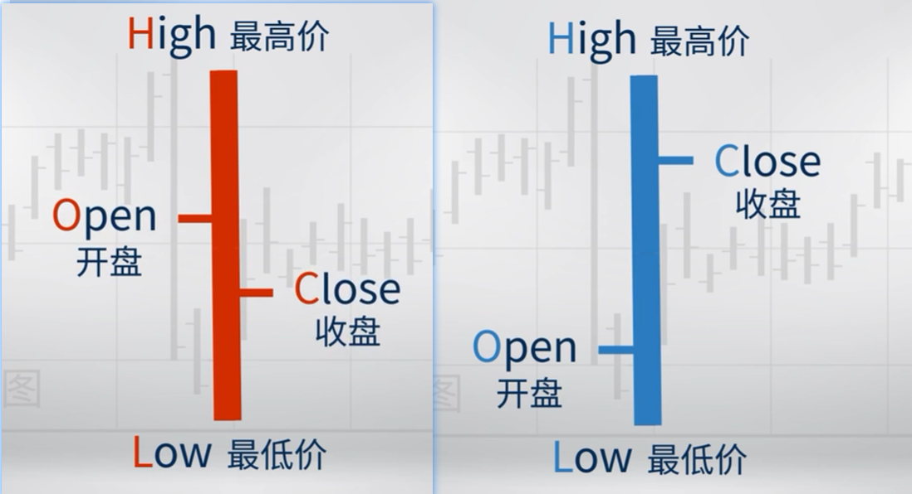

左侧为开盘价，右侧是收盘价；上方是最高价，下方是最低价。


### K线图

#### K线和K线图的历史、意义和功能

K线，俗称为阴阳烛，是一种世界上最古老的图表分析方法。K线图，又称蜡烛图，是为考察当前市场心理提供了一种可视化的分析方法，它简洁而直观，虽不具备严格的逻辑推理性，但是却有相当可信的统计意义，真实、完整地记录了市场价格的变化，反映了价格的变化轨迹。[36]

历史：远在十八世纪中叶，日本德川幕府时代，在大孤堂岛的米市交易中，有一位名叫体间宗久的米商[23]，开始运用阴阳烛（白为阳烛/黑为阳烛）的图表分析技术[17]，创造连续100笔赢利交易的惊人记录，被人称为“相场之神”。[36]后来，美国人史蒂夫·尼森将蜡烛图（Candlestick Charts[24]）入西方股市，绿涨红跌。

意义：每根K线由三部分组成——实体、影线和颜色，有四个数据点——最高价、最低价、开盘价和收盘价。中日韩：红涨绿跌。

种类：有分钟、日（日内投资者）、周、月、年K线。

功能：K线图是各种技术分析中最重要的图表。通过观察，我们可以很明显地看出该日市况“低开高收”还是“高开低收”。[52]K线侧重于K线组合情况，可用于推测市场中多空双方力量的对比。K线图技术被广泛应用于全世界的证券市场、期货市场、外汇市场等领域。[36]

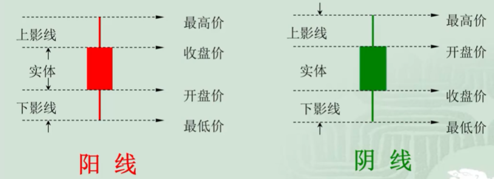

- 阳线：低开高收
- 阴线：高开低收

下面以平安银行为例：

```py
import tushare as ts
import numpy as np
import matplotlib.pyplot as plt

np.seterr(divide='ignore',invalid='ignore') # 忽略warning
plt.rcParams['font.sans-serif']=['SimHei'] #用来正常显示中文标签
plt.rcParams['axes.unicode_minus']=False #用来正常显示负号
```

```py

df1 = ts.get_k_data('000001', ktype='D', start='2013-04-26', end='2023-04-26')

datapath1 = "csv/data.csv"
df1.to_csv(datapath1)
```

#### K线的基本形态

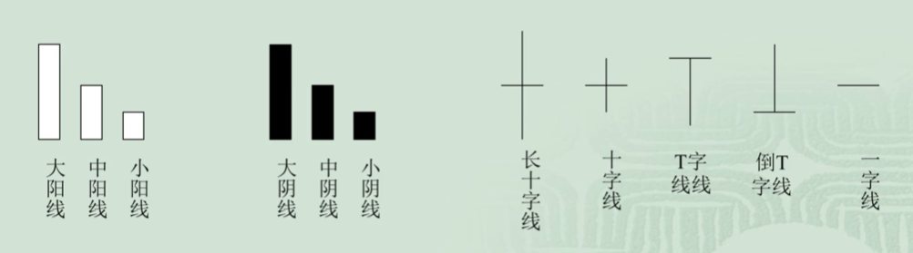

#### K线的解读

K线图非常直观地传递了市场交易信息，因此被广泛用于外汇、商品、国债和股票等各种金融资产市场。

解读：

一、实体大小：

- 大阳线：买方力量大
- 大阴线：卖方力量大
- 十字线：开收接近，买卖方力量均衡

二、阴影的长度：

长影线表明价格一度波动很大，但最终回归原来的价格水平，显示出市场情绪处于不确定性中。而短影线表示市场相对温和（如，一子线：开到收同）。 一般来说，影线越长，价格向影线相反方向移动的可能性就越大。

三、交易量：

分析K线时值得注意的一个关键指标是与其绑定的交易量。

如果价格上涨伴随着交易量的增加，上涨趋势增强的可能性更大。 但是，如果价格大幅上涨而成交量减少，则暗示涨势或许不能持续很久。


#### 应用的原则：

一．分析实体的长短。阳线的实体越长，买方的力量越强；阴线的实体越长，卖方的力量越强。两根或三根K线组合在一起时，如果同是阳线，且后面的阳线实体与前面的阳线相比，一根比一根长，表明买方占绝对优势，股价涨势还将增强；如果后面的阳线与前面相比．渐次缩短，表明买方气势已开始减弱，股价涨幅有限。如果同是阴线则相反，两根或三根阴线，后面比前面的长，卖方势强还会进一步打压股价；阴线渐次缩短，卖方力量开始衰退，股价下跌势头趋缓。

二．分析上影和下影的长短。上影长，说明买方将股价推高后遇空方打压，上影越长，空方阻力越大；下影长，说明买方在低价位有强力支撑，下影越长，支撑力越强。

三．两根、三根K线的相互关系。如果紧连的两根或三根K线，分别为阳线或阴线，则要注意分析它们之间的关系，着重比较收盘价的相对关系。
  - 以两根K线为例，
  - 如果第一根是阴线，第二根为阳线，要看第二根K线的收盘价是否高于第一根K线的收盘价，是否超过第一根K线实体的50％，是否高于阴线的开盘价，是否将前一日阴线全部包入，阳线**收盘价位置越高，表明买方力量越强**。
  - 如果第一根是阳线，第二根是阴线，则看阴线的收盘价是否低于阳线的收盘价，是否低于阳线实体50％，是否低于阳线的开盘价，即将前一日阳线全部包入。阴线收盘价越低，卖方力量越强。
  - 三根或多根K线组合也可依上述办法分析。

四．分析K线是否组成某一形态。多根K线组合分析，要注意是否已组成某一反转或盘整形态，若已组成形态，则应按形态特点分析，而不必过于拘泥于K线的关系，但特别要注意突破形态的K线，如以大阳线向上突破或大阴线向下跌破，加上量的配合，是明确的信号。

五．分析K线在一个较大行情中的位置。分析K线也要胸有全局，不能只见树木不见森林。特别要注意高价圈和低价圈中出现**大阳线、大阴线和十字转机线**，要将它们放在整个行情走势中分析判断。[17]

#### K线信号

- 单根K线：大阳线、大阴线、长影线
- 双根K线：吞没线、乌云盖顶、曙光初现。
- 3根K线：黄昏之星、早晨之星
- 缺口

#### 缺口

缺口是指股票价格在大幅度快速上升或下跌的过程中有一段价格没有发生交易而在股价趋势图上表现为一个空档的现象。缺口的形成必是当日开盘价出现跳空高开继续高走或是跳空低开继续低走的结果。在K线图中，若K线实体间有空档而影线相连的情况不能称为缺口。缺口一般都会被未来股价的变动封闭，称之为补空。一般认为缺口会在短期内被下一个次级趋势封闭，如果未能在短期内被封闭就有可能被下一个中级趋势封闭，甚至被下一个长期趋势封闭。

缺口的出现是多空双方力量对比相差悬殊的表现，而缺口的封闭则是双方力量发生转化的结果。缺口分析就是根据股价变动形成缺口的位置及大小，预测股价走势的强弱，判断股价是整理、突破还是已接近涨跌趋势的尽头。

#### 综合运用

- 上升形态和见底形态的K线、K线组合：早晨十字星(希望十字星)、早晨之星(希望之星)、好友反攻、曙光初现、旭日东升、倒垂头线、锤头线、平底(钳子底)、塔形底、连续跳空、红三兵、冉冉上升形。
- 下跌形态和滞涨形态的K线、K线组合：黄昏十字星、黄昏之星、淡友反攻、高档五阴线、下降覆盖线、低档盘旋形、下跌不止形、下降抵抗形、高开出逃形
- 既是上升形态，又是下跌形态的K线、K线组合：小阴线、十字线、长十字线、螺旋桨、一字线、T字线、倒T字线、搓揉线、尽头线、上档盘旋形、加速度线、下跌三连阴

## 乞讨码

失业三年人的持续要饭的交友Q群：171097552


## 支撑 和 阻（压）力（总称：趋势线/切线）

在技术图表中，按照一定的方式画出一些直线，然后根据这些直线的情况推测股票价格未来有可能停顿的位置。（每个人都有其划线的规则，偏主观，往往千人千线）这些直线就是支撑线或阻力线。

支撑线和阻力线向后的延伸对价格的波动起到一定的制约作用，就是起支撑（相当于天花板）和压力（相当于地板）的作用。例如，价格从下向上抬升的过程中，触及压力线，甚至还未触及，就会调头向下。

说白了，其本质是锚定效应在起作用。市场中的资金**依据**某个位置进行订单的操作就形成了支撑阻力。

另外，如果在支撑线和阻力线的附近，价格没有如期转向，而是继续向上或向下，这时就说支撑线和阻力线被突破。被突破后的支撑线和阻力线仍然有实际作用，只是作用发生了变化。

### 突破

> 常提的突破：如趋势线的突破，没有意义。

我们只在支撑阻力观察突破行为，因为支撑阻力是多空资金投入资源构筑的防线，此时防线的突破与否才有意义。

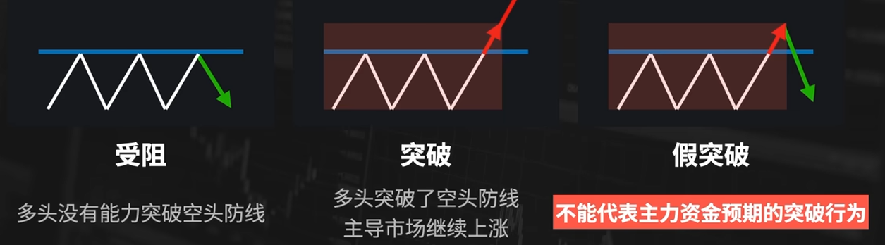

### 假突破

假突破：价格走势突破某个位置，但是并没有继续运行。不能代表主力资金预期的突破行为。

多头没有经过大量消耗就突破了防线，而空头可能还有更多的资源可以投入。

识别假突破：

1. 明确的位置多次受阻
2. 明确的突破
3. 过程中的消耗(成交量)

### 注意点：

这里有两点必须高度注意：

- 一是必须放量突破，方为有效突破。没有成交量配合的突破是假突破，股价往往会迅速回归启动位。
- 二是在低价位的突破可靠性更高，高位放量突破很可能是庄家营造的“多头陷附”，引诱散户跟风，从而达到出货目的。[29]

## 形态理论

打开一个长期图表，我们经常能发现，图中会出现各种各样的几何图形。比如，有的像一个三角形，有的则是一个V字形，还有像一面旗子的——真是五花八门，应有尽有。技术分析人士对这些图形进行了专门研究，一是看各种不同的形态在哪些场合出现得更频繁；二是观察这些图形出现以后在历史上后，市场**通常是怎么演化的**[34]，即根据价格的轨迹预测股票价格的未来趋势。从价格轨迹的形态中，试图推测股票市场处在一个什么样的大环境中，并对今后的行为给予一定的指导。

经验主义：那些经常出现在反转行情中的图形就被归类为反转突破形态。那些经常出现在持续行情中的图形就被归类为持续整理形态。

- 反转突破形态的常见图形有头肩顶(底)、多重顶(底)、三重顶(底)、圆弧形、V形、钻石形、岛形、喇叭形[16]等。
- ![反转突破形态[35]](../../img/反转形态.png)
- 持续整理形态的常见图形有三角形、矩形、旗形、楔形等。

## 技术指标分析

### 技术指标的定义

技术指标法：指按事先规定好的固定的方法对原始数据进行处理，将处理之后的结果制成图表，并用制成的图表对股市进行行情研判。

### 技术指标的应用法则

1. 背离
2. 交叉
3. 极端值
4. 形态
5. 转折
6. 盲点

### 技术指标的本质：

每一个技术指标都是从一个特定的方面用特定的数学公式对股市进行描述，反映股市特定方面的深层内涵

### 市场趋势指标————均线

均线最早由美国投资专家 Joseph E.Granville (格兰威尔) 于 20 世纪中期提出。[13]本质是一种低通滤波。它的目的是过滤掉时间序列中的高频扰动，保留有用的低频趋势。[44]

作用：

1. 均线是由过去价格计算而得，即描述过去的走势（滞后性），而不是预测未来。
2. 均线跟随价格，描述的是价格上涨的节奏。
3. 有的人说：均线作为一种初步处理的材料，用均线去看势和能。（势就是趋势，即价格往什么方向运动。能就是看能量有多大。）但均线与价格的关系，其实并不一定有助涨助跌的作用，主要取决于市场资金是否会依据均线进行交易。均线与价格，像影子和人的关系，影子随着人去走，而不是人随着影子走。
4. 特点：简单、直观、客观、滞后。

#### 一、简单移动平均线（Simple Moving Average）

移动平均线依计算周期分为短期(5天的MA5、10天的MA10)、中期(20天的MA20、40天的MA40)和长期(60天的MA60、120天的MA120、250天的MA250)，移动平均线没有固定的界限。[20]

##### 移动平均线绘制方法和参数

先求移动平均值，再在坐标图上绘制成线。

简单移动平均数（SMA，或简写为MA）: $SMA=\frac{\sum_i^n P}{N}$

- P: 第i天的股价
- N: 计算的日期数

##### 移动平均线的运用法则

- 趋势性
- 时滞性
- 稳定性
- 支撑压力性
- 助涨助跌性

##### Granville均线系统：八大买卖法则

Joseph E.Granville 是美国投资专家葛兰碧（又译为格兰威尔）。他是移动平均线、格兰威尔八大法则的创立者，也是第一个提出量价理论的人。[34]

八大买卖法则：以移动平均价位与当日价位之间的关系，作为判断报价的依据。[47]

买进时机的四大信号：

1. 当MA由持续下降转为平衡或上升，股价从MA下方突破并向上延升时，**买进**
2. MA呈上升状态，股价跌至MA以下时，**买进**
3. 股价在MA之上, 且向MA靠近, 在尚末击穿MA又再度 上升时, **买进**
4. 当MA下降, 股价在MA以下大幅下降时, **买进**

卖出时机的四大信号：

5. MA上升后转为平移或下降状态, 股价则跌至MA之下, **卖出**
6. MA持续下降, 股价在突破MA上升后又回落到MA以下时, **卖出**
7. 股价线在MA的下方, 并朝着MA的方向上升, 在末到达 MA时再次回落, **卖出**
8. MA呈上升态势, 股价线在其上方突然暴涨至远离MA时, **卖出**

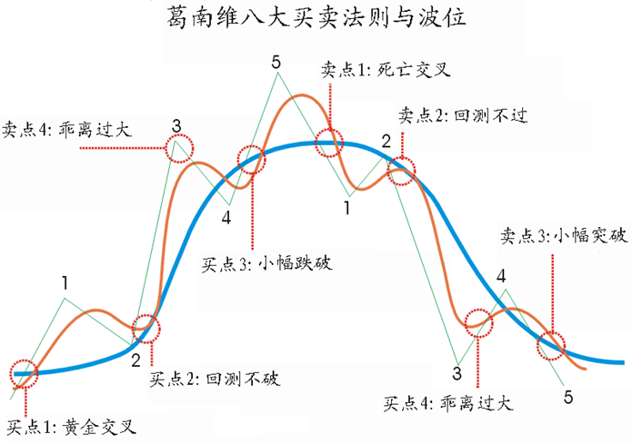

##### 均线理论的不足与改进

均线顾名思义是由计算出的平均值连接成线，平均值在应用过程中存在最大的问题就是其滞后性。当观测出买入卖出信号时，最佳时机早已过去。针对均线的滞后性，有以下两种改进方式：

1. 改进均线上平均值的计算方法。运用加权平均，在移动平均线的基础上按照时间进行加权。越靠近当前日期的价格对未来价格的影响越大，赋予更大的权重；越远离当前日期价格，赋予越小的权重。
2. 调整均线周期。利用不同周期均线得出的买卖结果也不同。少数人赚大多数人的钱，所以大家常用的周期也就不敏感了。[76]许多有经验的投资者发现，在不同的市场中，有些周期均线的判断效果显著优于其他周期均线。更有些长线投资者还会将股价替换成短周期均线进行趋势判断。[27]（如，5日改成4日，10日改成14日）[76]

#### 二、指数移动均线（Exponential Moving Average[78]，EMA）

改进的加权移动平均线：认为近期的，比之前的更管用。所以把近期价格占的权重更大，很早的价格占的权重很小。[77]

指数移动平均值是以指数式递减加权的移动平均。简单的说，当要比较数值与均价的关系时，用MA就可以了，而要比较均价的趋势快慢时，用EMA更稳定；有时，在均价值不重要时，也用EMA来平滑和美观曲线。[79]

其公式为：

$EMA_{today}=α * Price_{today}+ ( 1 - α ) * EMA_{yesterday}$;

其中，α为平滑指数，一般取作2/(N+1)。

> 在计算MACD指标时，EMA计算中的N一般选取12和26天，因此α相应为2/13和2/27。

当公式不断递归，直至EMA1出现，EMA1是没有定义的。EMA1的取值有几种不同的方法，通常情况下取EMA1为Price1，另外有的技术是将EMA1取值为开头4到5个数值的均值。

#### 三、双均线策略原理

双均线策略用到的两条均线分别是短期均线和长期均线，即一条均线的周期较短，另一条均线的周期较长。例如短期均线周期为15，长期均线周期为30。

因此，双均线策略的核心思想便是通过短期均线和长期均线之间的关系判断买进与卖出的时机。

- 由短周期均线自下向上穿越长周期均线，所形成的交点，称为金叉。
  - 这意味着短期均值暂时领先长期均值水平，表明近期市场情绪是相对乐观的，当金叉形成伴随着高交易量时更是如此。[22]
- 当短周期均线自上而下穿越长周期均线，所形成的交点，称为死叉。

所谓自下向上突破：意味着短期价格的平均值越来越高，已经超越了长期均价，股价是不断上涨的，即为多头趋势。反之自上向下突破 意味着是近期价格不断走低。导致近期的评价价格，低于了长期均价，也就是空头趋势。

由此我们可以构建一个双均线策略：

- 双均线金叉的时候，表明市场属于多头市场，应当买入；
- 反之，当出现死叉点时，市场属于空头市场，应当卖出。

##### 注意选择两个周期的差距

值得注意的是，
- 在双均线策略中，若选取的两根均线的周期较为接近，例如周期为5日和10日，这两条均线会非常容易相交缠绕，进而会被判断出形成了较多的买点与卖点，因此会产生大量无效的且费用较高的交易。
- 若选取的两根均线的周期差距过大，例如周期为10日和60日，此时交易周期过长，股价趋势性不显著，买卖点难以在合理的时间段内出现，进而容易造成较大的亏损。因此，所选的两条均线的周期参数很重要，趋势性越显著，双均线均线策略越有效。

#### 四、平滑异同移动平均线(MACD)

基本介绍：MACD的全名为 Moving Average Convergence/Pivergence[59]，它是一种移动平均线的波动指标，不过它使用的不是普通移动平均线，而是将长期与中期的平滑移动平均线 （EMA）的累积差距计算出来。

在MACD图形中显示两条图线，一条是实线就是MACD线（DIF线），而另一条线为虚线 （Trigger line）就是MACD的移动平均线（DEA线）。在MACD线与Trigger线之间的差距可以画成柱状垂直线图 （Oscillators），又被称为能量柱[84]。以零 （0）为中心轴，以柱状垂直线图 （Oscillators）图的正负表示MACD线与Trigger线何者在上，何者在下以作为研判买卖的最佳时机。

##### 双线MACD的计算方法

默认MACD(12, 26, 9)

1、计算指数移动平均值（EMA）：

- 快速平滑移动平均线 (12天) 计算公式为: $\text { 今日EMA }(12)=[2 /(12+1)] \times \text { 今天收盘价 }+[(12-1) /(12+1)] \times \text { 昨日EMA }(12)$
- 慢速平滑移动平均线 (26天) 计算公式为: $\text { 今日EMA }(26)=[2 /(26+1)] \times \text { 今天收盘价 } +[(26-1) /(26+1)] \times \text{ 昨日EMA } (26)$

2、计算离差值（DIF/DIFF：Difference[80]）：

$\mathrm{DIF}=\mathrm{EMA}(12)-\mathrm{EMA}(26)$

解释：

- 近期均价-长期均价，得过去的势头。
- 追涨杀跌：（假设就是涨势——未来还会涨）；跌了（假设就是跌势——未来还会跌）
- 正——金叉，近期涨，（假设还会涨），我就买
- 负——死叉，近期跌，（假设还会跌），我就卖[83]

注意：**DIF组成的线叫做MACD线**

3、计算DIF的 9日EMA：

根据离差值计算其9日的EMA，即离差的指数平均值，是**所求的MACD值**。为了不与指标原名相混淆，此值又名DEA(Difference Exponential Average)或DEM。

$\text { 今日DEA（MACD）}(9) = \text { 今日DIF }×2/（9+1） + \text { 前一日DEA }× (9-1)/(9+1)$

计算出的DIF和DEA的数值均为正值或负值。DEA组成的线叫做Signal线。

解释：

- DIF是快线，DEA是慢线。
- 当当前DIF比平均价差DEA低，说明跌狠了，下跌势能扩大，有的死叉。
- 从势看出能。涨就说是多头，跌就说是空头。
- 再结合快慢。快了就是能量大，慢了就是能量小。[82]

4、用（DIF-DEA）×n（n=1或2）即得MACD柱状图（Histogram），又叫棒形图（MACD bar / Oscillator，OSC）。

> 作用是显示出“差离值”与“讯号线”的差，同时将两条线的走势具体化，以判断差离值和讯号线交叉形成的买卖讯号，例如正在下降的棒形图代表两线的差值朝负的方向走，趋势向下；靠近零轴时，差离值和讯号线将相交出现买卖讯号。[21]

棒形图会根据正负值分布在零轴（X轴）的上下。棒形图在零轴上方时表示走势较强，反之则是走势较弱。

MACD 的结果由上述过程，化简为[79]

$\operatorname{MACD}\left(x_n\right)=\frac{224}{51} \operatorname{EMA}_9\left(x_n\right)-\frac{16}{3} \operatorname{EMA}_{12}\left(x_n\right)+\frac{16}{17} \operatorname{EMA}_{26}\left(x_n\right)$.

5、故MACD指标是由两线一柱组合起来形成，快速线（白色线）为DIF，慢速线（黄色线）为DEA，柱状图为MACD。

> 而单线MACD：默认MACD(12, 26, 1)；此时无DEA，能量柱即DIF线。

##### MACD图形:

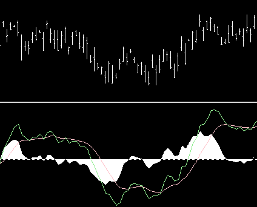

上图为收市价图表，绿线是离差值（DIF），红线是讯号线（DEA / MACD），白色区块柱形图（MACD bar / OSC）是两者的差的n倍，即 n（D-M）。

##### MACD的用法

注意到化简式三个系数之和为零，故 MACD 可以看作是比较不同周期的 EMA 得出的股票涨跌趋势，也可以理解为股价的 “速度”。[79]

1. 当DIF和DEA在0以上→**多头市场**。DIF由下向上交叉DEA(**金叉**：MACD由负增到零)为**买入**点；若DIF向下突破MACD只能认为是回档，作获利了结。
2. 当DIF和DEA在0以下→**空头市场**。DIF由上向下交叉DEA(**死叉**：MACD由正减到零)为**卖出**点；若DIF向上突破MACD，只能认为是反弹，可暂时补空。
3. DIF二次死叉DEA时，下跌幅度会较深。
4. DIF二次金叉DEA时，上涨幅度将较大。
5. 行情的高点比前一次的高点高，MACD指标的高点却比指标前一次的高点低（顶背离）时，暗示行情很快将会**反转下跌**。
6. 行情的低点比前一次的低点低，MACD指标的低点却比前一次的低点高（底背离）时，暗示行情很快就会反转上涨。
7.

> MACD指标出现顶背离时应（卖出）
> 解析：
> 顶背离：指当股价K线图上的股票走势一峰比一峰高，股价一直在向上涨，而MACD指标图形上的由红柱构成的图形的走势是一峰比一峰低，即当股价的高点比前一次的高点高、而MACD指标的高点比指标的前一次高点低，这叫顶背离现象。
> 表示该股价的上涨是外强中干，暗示股价很快就会反转下跌，是比较强烈的卖出信号。[10]

##### MACD的优缺点

- MACD的优点是除掉了移动平均线产生的频繁出现买入与卖出信号，避免一部分假信号的出现，用起来比移动平均线更有把握。
- MACD的缺点与移动平均线相同，在股市没有明显趋势而进入盘整（牛皮市）时，失误的时候较多，即指标失真，使用价值降低。
- 牛皮市：指在所考察交易日里，证券价格上升、下降的幅度很小，价格变化不大，市价像被钉住了似的，如牛皮之坚韧。在牛皮市上往往成交量也很小，牛皮市是一种买卖双方在力量均衡时的价格行市表现。[81]

#### BOLL指标

布林带/布林通道（Bollinger Bands）是利用统计学中的均值和标准差联合计算得出的，分为均线，上轨线和下轨线。（统计派指标）布林线均值回归策略认为，标的价格在上轨线和下轨线围成的范围内浮动，即使短期内突破上下轨，但长期内仍然会回归到布林带之中。因此，一旦突破上下轨，即形成买卖信号。其背后理念是认为其符合正态分布，那均值加减2标准差范围的数据应占95.4%，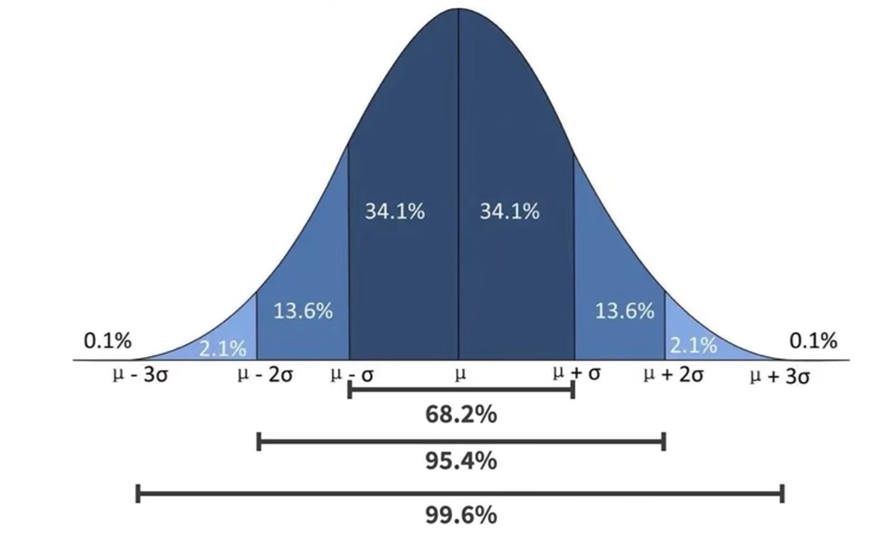

##### 布林各个线的计算公式：

有3条线：上轨线，中轨线，下轨线。下轨线起到支撑作用，上轨线起到压力作用，布林敞口 是 上轨线 到 下轨线 的口。

- 中轨线(MID) = N日移动平均线（默认20）= MA
- 上轨线(TOP) = 中轨线 + N（默认2）倍的 标准差 = MA+2MD
- 下轨线(BOTTOM) = 中轨线 - N（默认2）倍的 标准差 = MA-2MD

#### 布林线的用法

势：

- 中轨线以上，势是多，
- 中轨线以下，势是空，


右侧：价格上涨一价格和均线离散程度增大一标准差增大一形成了BOLL开口

能：
- 突破上轨线或下轨线，则能量大，是行情；否则是震荡。
- 趋势跟随策略（慎用）：当股价向上突破上界时，为卖出信号；当股价向下突破下界时，为买入信号。[60]
- 因为其实由于其本质是基于均线形成的指标，所以也是滞后性的，即复盘可行，交易不行。
- 只有稳定（不是说，独立同分布？）的数据才能形成正态分布，所以当不稳定时意义并不大。
- 所以价格在震荡时，布林带可以给我们一个有价值的空间。[85]

### 市场动量指标


#### 一、强弱指标(RSI)

##### 相对强弱指标编制方法：

投资的一般原理认为，投资者的买卖行为是各种因素综合结果的反映，行情的变化最终取决于供求关系，而RSI指标正是根据供求平衡的原理。[30]

相对强弱指标（Relative Strength Index）是通过比较一定时期内相邻两天之间收盘价格的平均上涨数值与平均下跌数值来分析市场买卖盘的方向和实力，进而判断未来市场的走势。

$$
\begin{aligned}
R S I & =\frac{N \text { 日内平均上升幅度 }}{N \text { 日内平均上升幅度 }+\quad N \text { 日内平均下跌幅度 }} \times 100 = 100-\left[\frac{100}{1+\frac{\text { Average gain }}{\text { Average loss }}}\right]
\end{aligned}
$$

可见其范围是0到100，涨幅和跌幅差不多的情况下为50。其中，用上涨收盘的平均收盘价除以下跌收盘价的平均收盘价，即 $\frac{\text { Average gain }}{\text { Average loss }}$，来计算衡量的是当前价格上涨势头有多强劲。

相对强弱系数是一个动量指标，所谓动量是指价格上涨和下跌的速度和幅度。

它提供了一个超买或者超卖的信号：
- 相对强弱系数的取值范围为0到100，
- 如果其值低于30，表示超卖，
- 如果其值高于70时，表示超买。

##### RSI的使用方法

其中，用RSI与股价的背离来判断行情最为可靠:
在股价不断走高的过程中，如果RSI处于高位，但并未跟随股价形成一个比一个高的高点，这预示股价涨升可能已经进入了最后阶段，此时顶背离出现是一个比较明确的**卖出**信号。[56]

通常使用三条线：

- RSI1(快速线，周线，6日，5个交易日)，
- RSI2(中速线，双周线，12日，10个交易日)，
- RSI3(慢速线，月线，24日，20-21个交易日)

相对强弱指数（RSI）有助于衡量短期至中期反转的可能性。它没有告诉确切的进入或退出点，但它能够提示，一个逆转即将发生。[31]

比如，交叉信号：

- RSI1在20以下向上突破RSI2为**买入信号**，
- RSI1在80以上击穿RSI2为**卖出信号**。

##### RSI的优缺点：

优点：

- RSI属于领先指标，较早地发现底部或顶部的出现以及趋势的突破
- RSI对长、中、短线的分析和操作都可以用
- 容易判定行情的强弱势头，对制定投资策略有很大的帮助

缺点：

- 个人主观判断：该项指标比较复杂和难以掌握，特别是在图形形态分析方面比较容易导致主观性的判断。
- 长线下指标的敏感度不够：RSI较长时期内计算出的指标信号很慢，经常错过买卖机会，指标的敏感度不够，反应也太慢。
- 只考虑收盘价，没考虑波动：RSI是通过收盘价来计算的，当一天的市场波动很大，上下阴影很长时，RSI的波动不足以反映市场的波动。
- 超买、超卖的模糊性：在超买区80以上或超卖区20以下，即使市势有较大的波动，而RSI变动速率渐趋缓慢，波幅愈来愈微[56]，即容易发生钝化（指标不敏感）现象。此时反而容易误导投资者，使得超买之后经常继续超买，或超卖之后还要超卖。解决这个问题的办法，仅就RSI指标本身而言是调整超买区或超卖区的界定指标，如90以上、10以下。可是在"牛市"和"熊市"之中，RSI值升至90或降至10时也有发生钝化；二是加大N的取值。
- 背离趋势的滞后。背离的出现通常表明双方之间的力量平衡正在变化，市场即将发生重大逆转。然而，背离信号有时仅发生在事件之后，并且难以事先确认。有时背离现象直到出现一两次才真正逆转，所以有许多随机因素很难确定。

##### MACD和RSI的区别和共同点

区别：

1. MACD主要用于衡量价格走势的强度。MACD线是由12周期的夹均值中减去26个 周期的平均值获得的，表示辻算的9周期均值的线被绘制在MACD的基本柱状图 上。零线为MACD提供正或负的值。本质上，12周期均线与26周期均线之间更大的 分离显示了市场动能的增加或减少。
2. 相对强度指数(RSI) 用于表明相对于最近的价格水平，市场被认为是超卖还是 超买。RSI计算给定期间的平均价格损益；默认时间段是14个时间段。RSI值绘制 在0到100的范围内。高于80的RSI值被认为是市场相对于最新价格水平超买的迹象，而低于20的值则是市场超卖的迹象。
3. 由于这两个指标衡量不同的因素，它们有时给出相反的指标。例如，RSI可能 会在一段持续时间内显示指数高于 80 ，这表明与最近的价格相比，市场对买家过度扩张；而MACD则表明市场的购买势头仍在增强。

共同点：这两个指标都可能通过显示价格背离来预测即将到来的趋势变化。

#### 二、随机指标(KD, KDJ)

当市场进入了无趋势阶段时，价格通常在一个区间内上下波动，在这种情况下，绝大多数跟随趋势的分析系统都不能正常工作，而随机指标却独树一帜。因此，对技术型投资者来说，**随机指标对症下药**，使他们能够从经常出现的无趋势市场环境中获利。

KDJ指标是反映当前市场人气强弱的指标，该指标有三天曲线，其中波动最快速的是指标J，其次是指标K，波动最缓慢的是指标D。其先用于期货市场的分析，后被广泛用于股市的中短期趋势分析。[46]

**注意**：随机指标必须附属于基本的趋势分析，从这个意义上说，它只是一种第二位的指标。市场的主要趋势是压倒一切的，顺着它的方向交易这一原则具有重要意义。然而，在某些场合，随机指标也有其特长。例如，在一场重要趋势即将来临时，随机指标分析不仅用处不大，甚至可能使投资者误入歧途。一旦市场运动接近尾声时，随机指标就极有价值了。[40]

##### 编制方法

理论依据：当价格上涨的时候，收盘价格倾向于接近当日价格区间的上端：而在下降趋势中，收盘价格倾向于接近当日价格区间的下端。

##### 非成熟随机值RSV的计算：

RSV = (收盘价 - N 日内最低价) / (N 日内最高价 - N 日内最低价) × 100%[11]

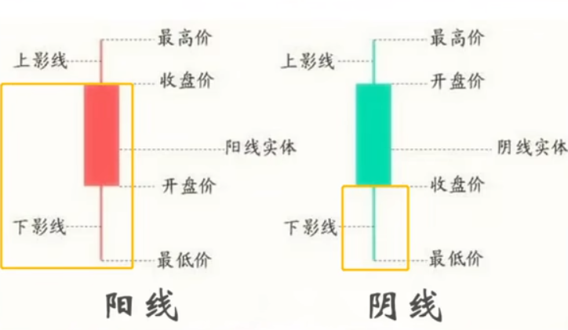

交易系统默认KDJ(9,3,3)[71]：

- $\mathrm{N}=9$
- $\mathrm{M1}=3$
- $\mathrm{M2}=3$

RSV值说明当日收盘处于N日内最高、最低价位幅度内的位置百分比, 该数值越大说明越接近最高价。

Python代码：

```py
N=9
for j in range(N-1,ndate):
    i = date[j]
    prhigh[i] = high.iloc[j+1-N:j+1].max()
    prlow[i] = low.iloc[j+1-N:j+1].min()
    RSV[i] = 100*(close[i]-prlow[i])/(prhigh[i]-prlow[i])
```

##### 随机快速线K、D、J值的计算

- 若无前一日K 值与D值，可用50，作为K、D的初始值
- 输出K：RSV的M1日[1日权重]移动平均[71]，即，今日 K值 = 2/3 × 昨日 K值 + 1/3 × 今日 RSV；RSV的M1=3日加权移动平均
- 输出D：K的M2日[1日权重]移动平均[71]，即，今日 D值 = 2/3 x 昨日 D值 + 1/3 × 今日 K；K的M2=3日加权移动平均
- J = 3 x D值-2 x K值


Python代码：

```py
for i in range(1, len(RSV1)):
  KValue[i] = 2/3*KValue[i-1]+RSV1[i]/3
  DValue[i] = 2/3*DValue[i-1]+KValue[i]/3
  JValue[i] = 3*KValue[i] - 2*DValue[i]
```

##### KD指标的用法

- 当 D 值在 80 以上，市场呈现超买信号，为卖出信号。
- 当 D 值在 20 以下, 市场呈现超卖信号，为买入信号。
- 当 D 值在20-80之间为徘徊区。
- 另外数值50为中间线，低于50为弱势，高于50为强势。[72]
- 当 K 值线发生倾斜度趋于平缓时, 是警告信号，应提防随时发生反转。
- 当 $K、D$ 值在 80 以上死叉或 20 以下金叉时, 往往是比较准确的 买进或卖出信号。
- 当 “底背离” 或 “顶背离” 出现时, 就是非常难得的。

##### KDJ的优缺点

- KD指标不仅能够显示超买与超卖状态，而且能够发出比较明确的买卖信号
- “顶背离”与“底背离”是比较可靠的转向信号
- KD指标可以用在长、中、短线上

#### 三、威廉指标(WR)

表示当天的收盘价在过去一段日子的全部价格范围内所处的相对位置，是一种兼具超买超卖和强弱分界的指标。主要的作用在于辅助其他指标确认讯号。

##### 编制方法

$$
W R=\frac{H_n-C}{H_n-L_n} \times 100 \%
$$

- C：当日收市价
- $\mathrm{L}_{\mathrm{n}}$ : $\mathrm{n}$ 日内最低价
- $\mathrm{H}_{\mathrm{n}}$ : $\mathrm{n}$ 日内最高价
- n：分析周期（10日或20日）

##### 应用法则

当WR进入超买区，并非表示行情会立即下跌，在超买区内波动，只是表示行情仍然处于强势之中，直至WR回头跌破“卖出线”时，才是卖出信号

若WR向下碰触底部四次，则第四次碰触时，是一个相当良好的买点。

##### 威廉指标(WR)的优点

该指标能较早地发现行情的转向信号，对付突发性行情的反应很灵敏，使投资者能从容处之集超买

超卖信号和买卖信号于一身，出现超卖（买）信号不等于可以买进（卖出），只是警告不要盲目在此价值追卖（买）而已。

##### 威廉指标(WR)的缺点

杂讯较多，弄不清哪一个才是真正的信号

超买之后再超买，超卖之后再超卖

#### 四、能量潮指标(OBV)

能量潮（On Balance Volume，OBV）是一种动量技术分析工具，OBV指标就是将成交量数据化，编制成趋势线，配合股价趋势，从量能角度判断股价走向。

##### 编制方法

根据每天价格的变化情况，将每日的成交量按照正负方向进行累计。

- 若当天收盘价（OBV，Current on-balance volume level）高于前一日的收盘价（$\mathrm{OBV}_{\text {prev }}$，Previous on-balance volume level），则加今日成交量（volume，Latest trading volume amount）；
- 反之，则减今日成交量；
- 若平盘，则忽略今日成交量。

计算公式：当日OBV = 前一日OBV±今日成交量

$$
\mathrm{OBV}=\mathrm{OBV}_{\text {prev }}+ \begin{cases}\text { volume, } & \text { if close }>\text { close }_{\text {prev }} \\ 0, & \text { if close }=\text { close }_{\text {prev }} \\ - \text { volume, } & \text { if close }<\text { close }_{\text {prev }}\end{cases}
$$

##### 如何应用：

- 当OBV指标持续横盘整理超过三个月时，多方可能已经积攒了充足的力量，此后一旦OBV指标向上突破，就形成看涨的买入信号。
- 当股价下跌的时候，如果OBV指标上涨，就形成了底背离，这是看涨的买入信号。
- 当股价上涨的时候，如果OBV指标下跌，就形成了顶背离，这是看跌卖出的信号。
- 当OBV指标与股价一起上涨时，表示仍处于良性上涨区间，预示上涨趋势还将延续。
- 当OBV指标加速上涨时，如果股价上涨的速度没有加快，就形成看跌卖出信号。

##### 应用法则

- 必须观察OBV之N字形波动
- 当OBV超越前一次N字形高点，即记一个向上的箭号，“上升潮”(up tide)。
- 当OBV跌破前一次N字形低点，即记一个向下的箭号，“跌潮”(down field)。[26]
- 累计5个向下或向上之箭号，即为短期反转讯号
- 累计9个向下或向上之箭号，即为中期反转讯号
- N字形波动加大时，须注意行情随时有反转的可能

##### 缺点：

由于该指标仅仅只跟踪了成交量，因此在短期如果因特殊因素导致量能剧烈波动，其有效性也会大打折扣。[25]

### 市场人气指标

投资者心理的反应。下面介绍测试市场人气的指标。

#### 一、乖离率指标(BIAS)

通过测算股价在波动过程中偏离简单移动平均线(SMA)的程度，得出因这种**偏离**而造成的回调或反弹是否能继续原有的趋势的可信度(Y值)

可用来弥补均线指标的不足。

$$
\begin{aligned}
& Y_n=\frac{\text { 当日收盘价 }-\quad n \text { 日简单移动平均值 }}{n \text { 日简单移动平均值 }} *100 \\
& \mathrm{n}: 10 、 20 、 30 \ldots
\end{aligned}
$$

##### 乖离率指标(BIAS)的应用法则：

- 正乖离率涨至一定的百分比，表明短期市场获利的较多，则获利回吐可能性很大，即是卖出讯号。
- 而负乖离率，如果绝对值越大，则表明空头回补的可能性也就越大，即是买入讯号。
- 如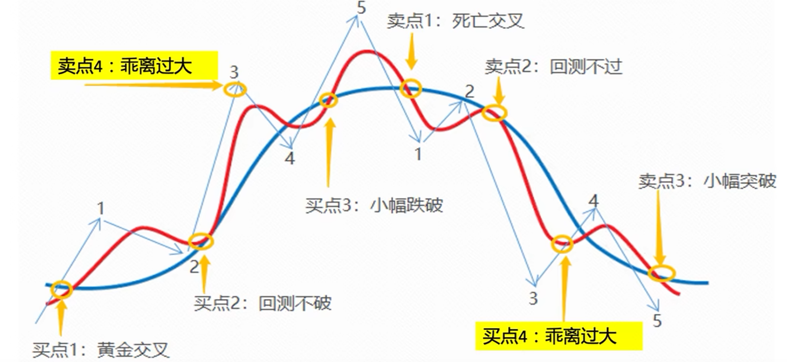
- 乖离率的高低有一定的测市功能。
- 寻找偏离分界点是关键。要精确的寻找偏离分界点比较困难，而且具体的每一个品种对应的偏离分界值也不一样，但可以确定的是波动性越大的品种对应的偏离值越高，而波动型越小的品种对应的偏离值相对比较小。
- 需要注意的是：乖离率指标作为加减仓位的判断，不是对应建仓方向的选择。意思就是说乖离率本身是无法给出趋势判断的，行情的主趋势还是什么均线来说了算。比如，现在向上突破了均线形成了涨势，那么我们开始做多，当出现涨势过快，乖离太大的时候，我们可以降低自己的多头仓位来对利润进行保护，但是并不建议反手做空哦！减速而非往回开。

##### 乖离率指标(BIAS)的缺陷与补救：

BIAS指标的缺陷就是买卖信号过于频繁，所以可以和随机指标KDJ等指标搭配使用。我们看到左侧框内由予行情上涨过快。[73]

| BIAS周期 | 减少多头 | 减少空头 |
| -------- | ------ | -------- |
| 6日     | >+4.5% | <-4%  |
| 12日    | >+6%   | <-5.5%|
| 24日    | > +9%  | <-8%  |

#### 二、心理线指标(PSY)

将一定时期内投资者趋向买方或卖方的心理事实转化为数值，形成测度人气，用以分析价位的未来走势的技术指标

$$
\begin{aligned}
& P S Y(n)=\frac{N \text { 日内上涨的天数 }}{N} \times 100 \% \\
& \text { N:一般为 } 5 、 10 、 20 、 30
\end{aligned}
$$

心理线指标(PSY)的运用法则：

- 心理线超过75或低于25时，应准备卖出或买入
- 一段行情展开前，超卖超买的点位通常会出现两次。第二次出现超卖超买的高低点
- 一般是买卖出良机当百分比降至10或10以下时，是很强的超卖，此时是短线抢反弹的机会

## 技术分析法的优势与缺陷

- 技术分析法的优势是：利用各种图表，免去收集资料之苦。由于图表集中反映各种因素，对交易者来说，不仅非常直观，而且具有客观性，图表上的买入卖出信号并不随人的主观意愿而改变。通过参考期价历史走势来判断当前行情，能够给投资者一定的前瞻性指导，使其能够顺应趋势操作。
- 技术分析法的缺陷是：并不是一整套环环相扣的理论体系，不具备严格的科学特征，带有明显的经验性和一定的主观色彩；各种指标都是处理后的结果，这将导致原始信息有所损失；滞后性也将使得指标信号较行情迟缓一大截；有时会出现“技术陷阱”，再加上不可能有完全相同的情况重复出现，出现的差异有可能使投资者判断失误；技术分析的方法在不断变换，当大多数人都在使用这些方法时，这些方法很容易失效。

## 注意：

1、任何技术指标都有自己的适应范围和应用条件

任何技术指标都有自己的适应范围和应用条件，得出的结论也都有成立的前提和可能发生的意外。因此，不问这些结论成立的条件，盲目绝对地相信技术指标，是要出错误的；从另外一个角度，也不能认为技术指标有可能出错误而完全否定技术指标的作用。

每种指标都有自己的盲点，也就是指指标失效的时候。在实际应用中应不断总结，并找出盲点所在，这对技术指标应用时少犯错误是很有益处的。当一个技术指标失效时，应考虑其他技术指标。

2、在实际应用时，应将多种技术指标结合起来，进行组合分析。

应用一种指标容易出现错误，但当使用多个具有互补性的指标时，可以大大提高预测的精度。因此，实际应用时，常常以四五个互补性的指标为主，辅以其他的技术指标，用以提高预测的精度，提高决策水平。

3、过去的结论要不断地进行修正，并经过实践验证后才能放心地使用

已有的结论是在特殊条件下得到的。随着环境的改变，这些曾经成功的结论用到自己身上就可能失败，所以必须验证后才能使用。自己研究和吸取别人的经验，都是为了不断地使技术分析方法更准确、更适用和更有效。

4、对技术分析的期望不要超过技术分析力所能及的范围

技术分析有自己的不足和盲点。如果不了解各种技术分析方法的优点和缺点，一味依靠技术分析，那是十分可怕的事情。技术分析能够避免明显的错误，但不能避免全部的错误。如果没有认清这一点，那么当技术分析给你造成亏损的时候，就不能怪技术分析不灵了。技术分析永远是灵的，不灵的是使用技术分析的人。

## 技术分析的更多理论

与技术分析有关的几个理论：

### 随机漫步理论

1. 随机漫步理论和有效市场假说的思想的奠基人相同，都是20世纪初法国著名数学家路易斯·巴舍利耶(Louis Bachelier)。[65]
2. 随机漫步(random walk)理论是布朗运动的延伸，该理论认为，证券的价格是随机的。对一个在宽阔的广场上漫无边际行走的人来说，不知道他的下一步将走向哪个方向，一点相关的信息也没有。随机漫步理论对价格波动的认识也是这样。
3. 在证券市场中，价格的走向受到多方面因素的影响，在一个特定的时间，可以认为价格的波动方向是随机的。因此，随机漫步理论有一定的道理。
4. 随机漫步理论是部分人对证券市场的看法之一，但从其他方面看，证券价格毕竟不是“运动的分子”，证券有自身素质好坏的区别，有受外界因素影响程度的区别。
5. 因此，证券价格的变化要受到一些因素制约，价格的波动不是一点规律都没有，应该存在一定的规律，只不过我们还没有充分地掌握这些规律。例如，股票市场的价格指数整体上是上升的就是一个普遍的规律。

#### 循环周期理论

1. 循环周期理论认为，无论是何种程度和何种规模的价格波动，都不会朝一个方向永远走下去，价格的波动过程必然产生局部的高点和低点。这些高点和低点的出现，在时间上有一定的规律。可以选择低点进入市场，在高点退出市场。
2. 美国人在周期理论方面做了许多工作，发现了很多适合其证券市场的周期。从时间上看，证券市场的周期是相当长的，而这些长周期对我国证券市场的作用不大，因为我国证券市场的时间太短了。
3. 循环周期理论考虑的重点是价格波动的时间因素，可为进行具体的实践提供时间上的帮助。
4. 周期的时间跨度也有长有短，计算周期的方法有等时间跨度、特殊数字跨度、农历节气和节假日等。

### 相反理论

1. 相反理论认为，大多数投资者看法一致的结论，是没有价值的结论。与大多数人的行动一致，是不可能发大财的。
2. 相反理论的理由：证券市场本身并不创造新的价值，手中的证券没有出现增值，甚至可以说是减值(交易成本)。所有投资者持有证券的总值是固定的，不可能出现多数人获利的现象。要想获得大的收益，必须与大多数人的行动不一致。
3. 相反理论已经存在了很久，道理并不复杂，但没有得到足够的重视。人们往往克服不了天生的从众心理，而忘记相反理论。特别地，当我们得到了一个“连傻瓜都能看出来”的结果时，应该想到还有相反理论存在。
4. 应该指出，相反理论只是告诉我们与大众一致肯定不会获得大的利益，并不是说与大众的行动相反就一定能够获利。

### 波浪理论

20世纪30年代，拉尔夫.纳尔逊.艾略特发现股票价格的变化是有章可循的。虽然股价运动的时间和幅度一直在变化，但是总是以某种方式在不断重复。艾略特把这种变化规律提炼了出来，也就是我们熟知的“艾略特波浪理论”。

其基本形态为：期价经历5浪上升后，接着会出现3浪下降。如此8浪构成期价变动的一个循环。

- 上升：5浪中，1、3、5为顺势浪（驱动浪）；2、4为回调浪（调整浪）
- 下降：3浪中，a、c为顺势浪，b浪为反弹浪。
- 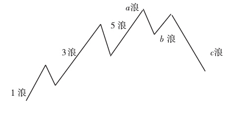

波浪理论三大铁律：

- 浪2永远不会超过浪1的起点
- 浪3永远不是最短的一浪
- 浪4永远不会进入浪1的区间[74]

波浪理论除了考虑价格走势的形态外，还对走势图中各个高低点位置比例进行研究，比如，通过测算各个波浪之间的相互关系，来确定回撤点和价格目标。其中，菲波纳切数字（常见的黄金分割数字0.382、0.5、0.618、1.618等都与菲波纳切数字有关）被大量应用。

波浪理论还对完成某个形态所需的时间作了研究。其通常的做法是利用菲波纳切数字1、2、3、5、8、13、21、34、55、89……来寻找行情发生转折的时间之窗。比如，在日线图上，从重要的转折点出发，向后数到某个菲波纳切交易日，预期未来的顶或底就出现在这些“菲波纳切日”上。该做法也可应用在周线图、月线图，甚至年线图上。

波浪理论是一套主观性较强的分析工具。在具体应用上，难度不小。

单看波浪结构，似乎很清晰。但问题在于你站在什么尺度上看，比如，当你往小里看时，每个浪其实都是由更小的波浪所组成的，比如，按波浪理论解释，每个顺势浪都有5个更小的浪组成，每个逆势浪都有3个更小的浪组成，这样，原来的8浪就可分解为34个小浪了。当你往大处看时，这8浪又变成一个上升浪和一个下跌浪，成为更大级别波浪中的一部分。艾略特把趋势的规模划分成9个层次，上可覆盖200年的超长周期，下至仅仅延续数小时的微小尺度。

其实，这还不是最难的，更难的是由于实际走势不可能这么中规中矩，当出现异常时，波浪理论会以延伸浪或X浪来解释，比如行情走出了第7浪甚至第9浪，这就是延伸浪，而在调整期间，有些浪与前后浪的关系无法说清，就命名为X浪。

由此，不难想到，交易者在应用波浪理论时，要确定目前的走势属于哪一个层次的哪一个浪并非易事。主浪的变形和调整浪的变形会产生复杂多变的形态，波浪所处的层次又会产生大浪套小浪，浪中有浪的多层次形态，这些都会引发数浪时的偏差。事实上，面对同一个形态，由于在确定波浪的层次和起始点不一样，不同的波浪专家也会产生不同的数法，而且，谁也说服不了谁。最后仍旧陷入大家来猜谜的格局。

波浪理论最早是针对股指进行研究的，股指走势图可以有几十年甚至上百年的连续图。由于单个期货合约都有到期日，时间展开有限，因而即使在期货中应用波浪理论，也应该少用单个合约月图，采用期货价格连续图可以减少分析误差。[75]

## 股市VS期市

### 股票分析师几乎很少讲技术指标，但是期货分析全都讲技术指标，这是为什么？

股票是做多为主的，简单来说对一家公司的未来前景进行展望，发掘出它的闪光点，吸引投资者去买，之后随着公司的良好发展，逐步兑现了之前的业绩预期，股价节节攀升，并吸引投资者。推的时候只要看多就可以了，节奏不用太细腻，其难点在选股和择时。但是期货不一样，因为期货时自由做空的，期货分析师不仅会考虑该不该买入，还会考虑该不该抛空，两面都要想，所以对技术形态的把握就很关键。而且期货投资存在杠杆，行情大的时候，很容易爆仓，根本不存在那种套了好几年最终翻本的成功案例，所以投资者们在入场的时候都会比较谨慎，很多都想好了什么时候止盈止损。对于短平快的投资，需要不断地寻找入场时机。[70]

## 在股市与期市中技术分析的差异

首先，期货交易的交易周期远比股票交易的交易周期**短**。期货交易者必须密切关注市场的一举一动。股市分析者喜欢更长时间的图表，研究更长时间的问题。他们也许要预测的是3个月或半年后的市场。期货交易者想知道的则是下周、明天乃至下半天的形势如何。由此，期货交易中的技术分析更重视短期内适用交易的工具。比如，股票交易中**50或200天均线**最受重视，但在期货交易中，大多数平均线在50天以下，最流行的组合是4天、9天和18天均线。

其次，期货交易中，选择出入时机比在股票市场重要得多。期货交易中，入市时间相差一天，有时甚至仅几分钟，成败结果可能就截然不同。基本面因素不会天天有变，时机抉择主要依赖技术分析。因而，在期货交易的技术分析中，非常注重时机抉择的工具。

最后，股市分析中有一些方法对期货交易不适用。比如，股市分析对股指的依赖性很强，但在商品期货交易中，尽管也有一些代表商品市场总体价格的指数，但它们没有股票指数那样重要。又如，股市分析中经常运用**情绪指标和资金流分析工具**，但这些在期货交易中用处不大。比如，相反理论在股市分析中很看重，但在期货市场中很难实际应用。相比较而言，期货市场中的技术分析是更纯粹的价格分析。应用得更多的还是趋势分析以及一些传统技术指标。[31]

## 交易规则

技术分析与交易规则是两个体系，二者有关联，但并非是一回事，很多人分不清。

- 技术分析是分析师、预测师的技术，比如道氏理论、波浪理论、江恩时间周期理论。
- 交易规则是交易员、交易大师的技术，例如江恩买卖规则、海龟交易法则、海豚交易系统、三重滤网交易系统。[66]

### 江恩理论

江恩理论与波浪理论一样，也是一个内容很多且自成体系的理论，市面上专门介绍这两个理论的书籍并不少见。

江恩理论是以美国投资家威廉姆•江恩（Willian D. Gann）的名字命名的，也有译为甘氏理论的。其主要分析方法有江恩历法、江恩矩阵、江恩角度线及江恩轮中轮，用以推测价格的顶、底以及可能到达的时间。推崇者通常都会举出很多例子来说明其具有神奇功效。

但是，在实际应用中仍旧有不少难度。由于江恩数和江恩线很多，事后看看好像总在某个数或某根线附近，但问题在于事先是无法预知的。所以，在利用江恩理论时，这些数字和线可以参考但不能迷信。

### 海龟交易法则

著名的交易大师理查德.丹尼斯（交易厅王子，几千-》几亿美元），想弄清楚伟大的交易员是天生的还是后天培养的，为此，在1983年他从1000人中招募了13个人，给各自百万美元，背景各异但基本都擅长概率学的，教授他们期货交易基本概念，以及自己的交易方法和原则，学员们被称为“海龟”。训练后，年化80%的收益率。[68]

涵盖了交易系统的各个方面。其法则覆盖了交易的各个方面，并且不给交易员留下一点主观想象决策的余地。它具备一个完整的交易系统的所有成分。有学员违背了保密协议公开售卖他的系统，于是丹尼斯让最优秀的学员科迪斯费斯写成书——《海龟交易法则》，这是一本入门量化投资的经典书籍。

核心策略：

- 掌握优势：找到一个期望值为正的交易策略，因为从长期看，他能创造正的回报。
- 管理风险：控制风险，守住阵地，否则你可能等不到创造成果的一天。
- 坚定不移：唯有坚定不移的执行你的策略，你才能真正获得系统的成效。
- 简单明了：从长久看，简单的系统比复杂的系统更有生命力。[67]

分清楚投资者和交易员：

- 投资者：他买入某一件东西是想要长期的持有，渴望这件物本身的增长。只投资了解的良好的公司（管理层、市场定位）。
- （投机/风险）交易员：为了获取所有买卖合约的价差。
  - 期货行业：
  - 套期保值者：通过期货来规避掉自己原材料价格波动的风险，进而锁定利润或者锁定原材料成本，专注于自己的生产经营。航空业的燃料。（25元期货，到期了提取期货或者直接卖掉期货（因为期货又涨回到现在现货的价值附近）、买入现货，所以能把燃料费锁定在25元）。
  - 投机交易者：有很多弱点，即情绪陷阱。
    - 一、厌恶损失。损失比盈利回撤更难接受；难以止损，因为止损意味着真正的损失。
    - 二、被沉迷成本绑架。新技术很好，但，亏的股票希望涨回来再平仓，等了好久。而是应该立足当下，着眼边际成本。[69]
    - TODO：https://www.bilibili.com/video/BV1rP4y1E7xk/

## 乞讨码

失业三年人的持续要饭的交友Q群：171097552


## 声明

投资有风险，交易须谨慎：

1. 本文所有内容均来自他人交易技术经验分享，并不特定针对任何市场；
2. 本人从不鼓励、倡导在期货、外汇、股票、数字货币等交易市场的投资；
3. 文中所涉及到的图表、K线形态、技术指标不具备投资建议与指导；
4. 文中所述内容仅代表个人观点，不构成投资建议、仅供参考！


[1]: https://mooc1.xueyinonline.com/nodedetailcontroller/visitnodedetail?courseId=215575469&knowledgeId=374258422
[2]: https://mooc1.xueyinonline.com/nodedetailcontroller/visitnodedetail?courseId=215575469&knowledgeId=374258423&enc=
[3]: https://mooc1.xueyinonline.com/nodedetailcontroller/visitnodedetail?courseId=215575469&knowledgeId=374258424&enc=
[4]: https://mooc1.xueyinonline.com/nodedetailcontroller/visitnodedetail?courseId=215575469&knowledgeId=374258426&enc=
[5]: https://mooc1.xueyinonline.com/nodedetailcontroller/visitnodedetail?courseId=215575469&knowledgeId=374258427&enc=
[6]: https://mooc1.xueyinonline.com/nodedetailcontroller/visitnodedetail?courseId=215575469&knowledgeId=374258428&enc=
[7]: https://mooc1.xueyinonline.com/nodedetailcontroller/visitnodedetail?courseId=215575469&knowledgeId=374258446&enc=
[8]: https://zhuanlan.zhihu.com/p/25928648
[9]: https://www.gaodun.com/q/a050k3
[10]: https://baike.baidu.com/item/%E9%A1%B6%E8%83%8C%E7%A6%BB/9368270
[11]: https://juejin.cn/s/rsv%E8%AE%A1%E7%AE%97%E5%85%AC%E5%BC%8F%E5%A6%82%E4%BD%95%E7%90%86%E8%A7%A3
[12]: https://juejin.cn/post/6844904148081590279
[13]: https://blog.csdn.net/weixin_42322206/article/details/124065623
[14]: https://blog.csdn.net/weixin_44612221/article/details/114318491
[15]: https://www.investor.org.cn/learning_center/gmjytx/bk/kj/jyxl_3467/202302/P020230227641654237804.pdf
[16]: https://www.gaodun.com/q/7050sl
[17]: https://www.econ.sdu.edu.cn/info/1354/25423.htm
[18]: https://www.investor.org.cn/learning_center/gmjytx/bk/kj/jyxl_3467/202302/P020230227641654237804.pdf
[19]: https://baike.baidu.com/item/%E5%8D%96%E5%8E%8B/4148446
[20]: https://luojun0115.github.io/shujuwajue/day05/section4.html
[21]: https://bigquant.com/community/t/topic/111172
[22]: https://www.futunn.com/learn/detail-what-is-a-golden-cross-59272-0
[23]: https://www.futunn.com/learn/detail-what-is-a-candlestick-59118-0
[24]: https://www.futunn.com/learn/detail-learn-21-technical-analysis-tools-quickly-84515-0
[25]: https://www.futunn.com/learn/detail-what-is-the-obv-73025-0
[26]: https://xueqiu.com/1893713643/122133134
[27]: http://quant.10jqka.com.cn/view/article/1468#id/1468
[28]: https://www.investor.org.cn/learning_center/gmjytx/bk/kj/jyxl_3462/202303/P020230301513607874985.pdf
[29]: https://www.zhihu.com/question/46498645/answer/512756872
[30]: https://baike.baidu.com/item/RSI%E6%8C%87%E6%A0%87/7459334
[31]: https://www.bilibili.com/video/BV1eM4y197Af
[32]: http://edu.cfachina.org/zsyd/qhabc/jsmfx/201510/t20151023_20303.html
[33]: https://zhuanlan.zhihu.com/p/462289266
[34]: http://edu.cfachina.org/zsyd/qhabc/jsmfx/201510/t20151023_20319.html
[35]: https://xueqiu.com/7254126008/81924297
[36]: https://zhuanlan.zhihu.com/p/461939067
[37]: https://zhuanlan.zhihu.com/p/461594250
[38]: https://zhuanlan.zhihu.com/p/385254314
[39]: https://www.zwbk2009.com/index.php?title=%E8%AE%A4%E7%9F%A5%E5%BF%83%E7%90%86%E5%AD%A6
[40]: http://finance.sina.com.cn/futuremarket/help/53.html
[41]: http://finance.sina.com.cn/futuremarket/help/46.html
[42]: http://finance.sina.com.cn/futuremarket/help/46.html
[43]: http://www.yjcf360.com/gushifocus/868952.htm
[44]: https://blog.csdn.net/FrankieHello/article/details/85938381
[45]: https://www.moomoo.com/us/hans/support/topic3_86
[46]: https://www.moomoo.com/us/hans/support/topic3_142
[47]: https://www.moomoo.com/us/hans/support/topic3_240
[48]: https://www.sohu.com/a/403467548_120163509
[49]: https://www.econ.sdu.edu.cn/info/1387/25046.htm
[50]: https://baike.sogou.com/v254407.htm?ch=zhihu.topic
[51]: https://baike.baidu.com/item/%E6%B6%A8%E8%B7%8C%E6%8C%87%E6%95%B0/5199150
[52]: https://finance.sina.com.cn/money/future/roll/2020-02-14/doc-iimxyqvz2734205.shtml
[53]: https://baike.baidu.com/item/%E8%AF%81%E5%88%B8/267#:~:text=%E7%8B%AD%E4%B9%89%E4%B8%8A%E7%9A%84%E8%AF%81%E5%88%B8%E4%B8%BB%E8%A6%81,%E3%80%81%E6%9C%9F%E6%9D%83%E3%80%81%E5%88%A9%E7%8E%87%E6%9C%9F%E8%B4%A7%E7%AD%89%E3%80%82
[54]: https://www.cifcm.cn/uploadfile/2018/0309/20180309030255592.pdf
[55]: https://www.163.com/dy/article/F933SCJD053903CM.html
[56]: https://blog.csdn.net/roadmore/article/details/80889274
[57]: https://zh.wikipedia.org/zh-hans/%E5%80%89%E4%BD%8D
[58]: https://baijiahao.baidu.com/s?id=1650627299594333071
[59]: https://m.shangjia.com/item/4401531
[60]: https://www.myquant.cn/docs/python_strategyies/428
[61]: https://wen.baidu.com/question/1925705806263800347.html?qbl=relate_question_7
[62]: https://zh.wikipedia.org/zh-hans/%E9%81%93%E6%B0%8F%E7%90%86%E8%AE%BA
[63]: https://www.zhihu.com/pub/book/119963287
[64]: http://m.ikanchai.com/pcarticle/263524
[65]: https://www.sohu.com/a/288554216_234161
[66]: https://caifuhao.eastmoney.com/news/20220618112100333190560
[67]: https://bigquant.com/wiki/doc/haigui-celve-qihuoshichang-NHyCBE5cZh
[68]: https://www.bilibili.com/video/BV1LZ4y1S716
[69]: https://www.bilibili.com/video/BV11D4y1F7fT
[70]: https://www.bilibili.com/video/BV1Er4y1i7Vn
[71]: https://zhidao.baidu.com/question/86747419
[72]: https://www.163.com/dy/article/EQALSHD00519B93H.html
[73]: https://www.bilibili.com/video/BV1oB4y1j7MN
[74]: https://www.bilibili.com/video/BV1zv4y1M744
[75]: http://www.cs.ecitic.com/newsite/tzzjy/qhIB/xsxt/202007/t20200701_1114768.html##
[76]: https://www.bilibili.com/video/BV1YG4y1k7rN
[77]: https://www.bilibili.com/video/BV1qa41137pZ
[78]: https://www.oanda.com/bvi-ft/lab-education/technical_analysis/moving_average-exponential_smoothing_moving_average/#:~:text=%E6%8C%87%E6%95%B8%E5%B9%B3%E6%BB%91%E7%A7%BB%E5%8B%95%E5%B9%B3%E5%9D%87%E7%B7%9A%E7%9A%84%E5%88%9D%E5%A7%8B%E5%80%BC%E8%A8%88%E7%AE%97%E6%96%B9%E6%B3%95,%E6%8C%87%E6%95%B8%E5%87%BD%E6%95%B8%E6%80%A7%E7%9A%84%E8%A1%B0%E6%B8%9B%E3%80%82
[79]: https://baike.sogou.com/v67698457.htm
[80]: https://weibo.com/6187267226/Ieexs1dlB
[81]: https://wiki.mbalib.com/wiki/%E7%89%9B%E7%9A%AE%E5%B8%82
[82]: https://www.bilibili.com/video/BV1qa41137pZ
[83]: https://www.bilibili.com/video/BV1oK411f7vN
[84]: https://www.bilibili.com/read/cv23238595
[85]: https://www.bilibili.com/video/BV1Df4y1f7bj
[86]: https://www.bilibili.com/video/BV1fc411J72B
[87]: https://www.bilibili.com/video/BV1uP411y7gd
[88]: https://www.futunn.com/learn/detail-what-is-cpi-ppi-pmi-70835-0
[89]: https://www.zhihu.com/question/19765287/answer/185966903
[90]: https://zhuanlan.zhihu.com/p/118659099
[91]: https://www.investor.org.cn/learning_center/investors_classroom/basic_knowledge/futures/online/qhsc_812/201605/t20160525_43130.shtml
[92]: https://finance.sina.com.cn/money/future/fmnews/2020-10-15/doc-iiznctkc5639114.shtml?cref=cj
