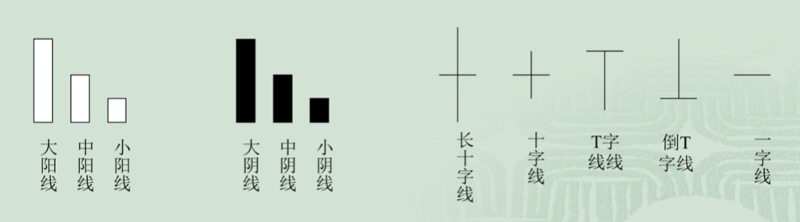
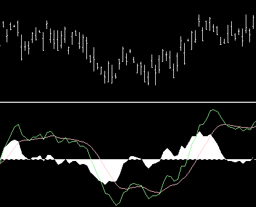

<!--
 * @version:
 * @Author:  StevenJokess（蔡舒起） https://github.com/StevenJokess
 * @Date: 2023-06-08 14:24:05
 * @LastEditors:  StevenJokess（蔡舒起） https://github.com/StevenJokess
 * @LastEditTime: 2023-06-10 16:01:37
 * @Description:
 * @Help me: make friends by a867907127@gmail.com and help me get some “foreign” things or service I need in life; 如有帮助，请赞助，失业3年了。
 * @TODO::Python代码
 * @Reference:
-->
# 证券投资技术分析概述

## 证券投资分析的分类

证券投资分析，分为基本面分析、技术分析。

基本面分析路径：宏-》中-》微

1. 宏观分析：经济、政治环境分析
1. 中观分析：产业分析
1. 微观分析：公司分析

基本面分析法着重对透过图表或技术指标般经济情况即各个公司的记录，研究市场过的经营管理状况、行业去及现在行为的反应动态等因素进行分析以推测股票价格未来。

依此来研究股票的价格的变动趋势值衡量股价的高低。

## 技术分析定义

而技术分析是透过图表或技术指标的记录，研究市场过去及现在行为的反应以推测股票价格未来的变动趋势。

技术分析概述  -》 技术图形分析  -》 技术指标分析

技术分析的理论基础是空中楼阁理论。

- 空中楼阁理论是美国经济学家凯恩斯于1936年提出，该理论完全抛开股票的内在价值，强谓心理构造出来的空中楼阁。

### 基本面分析与技术分析的比较

- 基本面分析是为了获得基本收益，研究价格变动背后的原因，从而去判断红利、股票价格的合理性及长远发展前景，告诉我们该购买何种股票；特点：更科学、门槛高、信息不全不及时、解读会和市场不一致。
- 技术分析则是为了获得低价买入高价卖出的差价（spread）即资本收益，研究价格变动本身，侧重预测**短期**内股价涨跌的趋势，去把握具体购买的时机；特点：不但科学（统计概率、行为金融学）而且艺术（经验积累、主观）[28]

大多数成功分析的投资者都是把两种分析方法结合起来运用，用基本面分析方法估计长期走势，而用技术方法判断短期走势和买卖时机。

### 技术分析的理论基础————三大假设

#### 一、市场行为包容一切

“市场行为包容一切”是技术分析的基石。

1. “市场行为包容一切”是指，任何影响股票的因素（基础的、政治的、心理的），实际上**都**反映在价格之中。
2. 所以技术分析者，只研究价格变化就足够了，而不必研究造成价格变化的内在因素。
3. 技术分析者所使用的图表工具本身如实地描述了市场参与者的行为，我们能够把握市场参与者对市场的反应，把握未来趋势。


- 合理性：任何一个因素对股票市场的影响最终都必然体现在股票价格的变动上。
- 不合理性：但市场行为反映的信息只体现在价格的变动中，同原始的信息毕竟有差异，信息损失是必然的。

#### 二、价格以趋势方式演变

“趋势”概念是技术分析的核心。如果没有外在因素的影响，价格波动不会改变原来的方向。正因为如此，在一些文献中把这一条称为“牛顿第一定律”。

一般来说，若某段时间的价格一直是下降的或上升的，那么在今后一段时间内，如果不出意外，股票价格也会按照这一方向继续下降或上涨，没有理由改变这一既定的运动方向。如果没有外在的因素，没有必要逆大势而为。[18]

技术分析者认为，市场确实有趋势可循，而且当前的市场趋势有势能和惯性，只有当它走到趋势的尽头，它才会掉头反向。

技术分析和市场行为与人类心理学有关，证券投资不过是一种追求利润的行为，不论是昨天、今天或明天这个目的都不会改变。

- 合理性：
- 不合理性：当价格沿某个方向波动的时间过长，就会增加反方向的力量，从而使该假设受到冲击。此外，价格的变动受到许多因素的影响，有些是根本想不到的，这使价格的波动表现出无规律的现象。

#### 三、历史会重复

该假设是从统计学和心理学两个方面考虑的。

- 心理学：人的买卖行为要受心理学中某些理论的制约，在这种心理状态下，市场交易行为将趋于一定的模式，由此导致历史重演，即过去出现过的价格趋势和变动方式，今后会不断出现。
- 统计学：由于这些图表形态在过去表现良好，我们就假设他在将来表现一样良好，投资者就可以通过分析过去的价格变动资料来侦测未来的价格走势。

## 技术分析的三要素和思维空间

技术分析的三要素：涨跌指数、股价、成交量。

技术分析的四维空间：

- 价，即是股票的市场价格，是市场行为最基本的表现, 买卖双方对价格的认同程度通过成交量的大小体现。
- 量，即成交量，量价配合的关系是价升量增、价跌量减、天价天量、地价地量。
- 空，即空间，是市场潜在能量的表现, 指出 “价格有可能上升或下降到什么地方” ，反映的是每次市场发生变动程度的大小。
- 时，即时间，时间指出 “价格有可能在何时出现上升还是下降” 反映市场起伏的内在规律体现了市场潜在能量由小变大再变小的过程。

### 一）价和量是市场行为的最基本的表现

- 市场行为最基本的表现是成交价格和成交量。过去和现在的成交价格及成交量反映大部分市场行为，在某一时间的价格和成交量反映的是买卖双方在这个时间
的共同市场行为，是双方暂时的均衡点。均衡会不断地变化，即是价量关系的变化。
- 一般来说，买卖双方对价格的认同程度通过成交量的大小得到确认。认同程度大，成交量大；认同程度小，成交量小。双方的这种市场行为反映在价量上就呈现
出这样的一种趋势规律：价增量增，价跌量减。

### 二）时间和空间是市场潜在能量的表现

1. 在技术分析中，“时间”是指完成某个过程所经过的时间长短，通常是指一个波段或一个升降周期所经过的时间。“空间”是指价格的升降所能达到的程度。
2. 时间指出“价格有可能在何时出现上升或下降”，空间指出“价格有可能上升或下降到什么地方”。投资者对市场的分析，其关注点都集中在这两个因素上。

### 三）成交量与价格趋势的一般关系

1. 价格随成交量的上涨而上升，这是正常的市场特征，这种价量关系表示价格将继续上升；反之，如果价格出现了新高，而成交量没有创出新高，则此上升趋势是令人怀疑的，是价格潜在的反转信号。
2. “井喷”：价格随着缓慢增加的成交量而逐渐上升，某一天平缓的走势突然变成直线上升。成交量剧烈增加、价格暴涨，之后是成交量萎缩、价格大幅度下降，这表明上升已经到了末期。
3. “波谷”：在长期下降后，价格形成了“波谷”，并开始回升，成交量没有因价格的上升而放大；之后，价格再度回到“波谷”。如果此时的成交量低于前一个“波谷”，就是价格将要上升的信号。
4. 市场出现一段时间的上升行情后，出现大的成交量，而价格没有同时向上，说明**卖压**很重，形成价格下降的因素。
5. 成交量是价格的先行指标，价格是虚的，成交量是实的.

> 卖压是一种股市用语。是指在股市上大量抛出股票，使股价迅速下跌。卖压重，说明价位抛盘很多，看空的人很多，股价上行非常困难。[19]

### 四）时间、空间与价格趋势的一般关系

- 在市场中，经常能够听到“长线”和“短线”的说法。对于大周期，或者说是时间长的周期，今后价格将要经过的变化过程也应该长，价格变动的空间也应该大。
对于时间短的周期，今后价格变动的过程和变动的幅度也应该小。
- 一般来说，时间长、波动空间大的过程，对今后价格趋势的影响和预测作用也大；时间短、波动空间小的过程，对今后价格趋势的影响和预测作用也小。


## 技术分析方法的种类

在历史价、量资料基础上进行的统计、数学计算、绘制图表（chart）方法是技术分析方法主要的手段。

从这个意义上讲，技术分析方法可以有多种。一般说来，可以按约定俗成，将技术分析主要分为如下六类：K线类、支撑压力（趋势线/切线）、形态类、指标类、波浪理论、循环周期。

## 道氏理论

### 道氏理论的演变

- 威廉姆·彼得·汉密尔顿（William Peter Hamilton）1922年出版《股市晴雨表》
- 罗伯特·雷亚（Robert Rhea）1932年发行《道氏理论》

Robert Rhea：道·琼斯公司创始人《华尔街日报》创始人 1902年辞世 [2]

### 道氏理论基础——三个假设

- 主要趋势是不会被操纵的
- 平均价格指数消溶一切因素
- 道氏理论是客观化的分析理论

### 最重要的价格——收盘价

收盘价是最重要的价格。道氏理论并不注重一个交易日内的最高价和最低价，而只考虑收盘价。

#### 道氏理论的评价：

技术分析的三个假设条件有合理的一面也有不尽合理的一面。

- 例如：第一个假设存在的前提条件是证券市场是有效的市场，然而众多实证分析指出，即使像美国这样发达的证券市场也仅是弱式有效市场，或至多是半强式有效市场，更何况信息损失是必然的，因此市场行为包括一切信息也只能是理想状态。
- 又如一切基本因素确实通过供求关系影响证券价格和成交量，但证券价格最终要受它的内在价值制约。
- 再如，历史也确实有相似之处，但绝不是简单的重复，差异总是存在的，绝不会出现完全相同的历史重演。

正因为如此，技术分析显得**说服力不够强、逻辑联系不够充分**并引起不同的看法和争论。

### 道氏的三种走势

股票价格的周期性变动可以分解成三种运动：主要趋势、次要趋势和短期波动。三种运动合成了复杂的股价运动。

- 短期趋势：持续数天至数个星期。
  - 涨势：表现为各次级波动的低点一点比一点高，若将过去的各个低点相连，可形成一条向上倾斜的直线，这就是上升趋势线。
  - 跌势：则表现为各次级波动的高点一点比一点低，将各个高点相连，可形成一条向下倾斜的直线，这就是下降趋势线。
  - 水平移动
- 中期趋势：持续数个星期至数个月。又称次要趋势，是价格在沿着主要趋势演进过程中产生的重要反复，即在上涨的主要趋势中会出现中期回档下跌，在下跌的主要趋势中会出现中级反弹回升。
- 长期趋势：持续数个月至数年。又称主要走势，代表整体的基本趋势，通常为牛市（Bulish，Bull Market，多头市场）或熊市（Bearish，Bear Market，空头市场）。
  - 牛市：如果每一个后续价位上升到比前一个更高的水平，而每一次回调的低点都比前一次的低点高，那么这一主要趋势就是上升趋势，称之为牛市；
  - 熊市：如果每一个后续价位下跌到比前一个更低的水平，而每一次反弹的高点都比前一次的低，那么这一主要趋势就是下降趋势，称之为熊市。[17]

趋势的结束：只有当出现了明确的反转信号时，才意味着一轮趋势的结束。当一个新的主要趋势第一次确定后，如果不考虑短期的波动，趋势会持续下去，直到出现了明确的反转信号。

#### 成交量与趋势结束的关系

股价从下降的趋势转为上升的趋势，必须要有成交量配合。

- 当股票价格向上突破下降趋势线时，成交量随之放大，为**有效突破**。因为通常，在多头市场，价位上升，成交量增加；价位下跌，成交量减少。在空头市场，当价格滑落时，成交量增加；在反弹时，成交量减少。
- 但是股价下跌突破上升趋势线则不一定需要成交量增加。当股价向下跌破趋势线后如果跌幅不深，成交量不一定增加，甚至有所萎缩，但是当股价回弹至趋势线下方，成交量明显放大，股价立即快速下跌，可确认上升趋势线已被有效突破。
- 当然，这条规则有时也有例外。因此，只根据几天的成交量是很难得出正确结论的。

#### 熊市（空头市场）

- 第一阶段（被高估：价格高于价值，出货）：是对那些在抬高价格之后所购买的股票所寄托希望的破灭。  在这一阶段，有远见的投资者感到交易的利润已达至一个反常的高度，因而在涨势中抛出所持股票，尽管上涨趋势逐渐减弱，交易量仍居高不下，公众仍很活跃。但由于预期利润逐渐消失，行情开始显弱。
- 第二阶段（价格逐渐反应价值，恐慌）：是商业的萧条而导致的卖出阶段。  买方少起来而卖方就变得更为急躁，价格跌势突然加速，成交量也放大，价格几乎是直线落至最低点。在这一阶段之后，可能存在一个相当长的次等回调或一个盘整，然后开始第三阶段。
- 第三阶段（被低估：价格低于价值）：来自于对股票失望的卖压，不论价值如何，许多人急于兑现一部分的股票。  那些在大恐慌阶段坚持过来的投资者此时或因信心不足而抛出所持股票，或由于目前价位比前几个月低而买入。商业信息开始恶化，随着第三阶段推进，跌势并不快，但仍持续着，这是由于某些投资者因其他需要，不得不筹集现金而越来越多地抛出其所持股票。当坏消息被证实，而且预计行情还会继续看跌时，这一轮熊市就结束了，而且通常是在所有的坏消息公布之前就已经结束了。

#### 牛市（多头市场）

- 第一阶段（被低估：价格低于价值，建仓）：人们重新恢复对经济未来发展的信心。在这一阶段，有些远见的投资者，知道尽管现在市场萧条，但形势即将扭转，因而就在此时购入股票，并逐渐抬高其出价以刺激抛售；而一般公众则远离股市，市场活动基本停滞，但也开始有少许反弹。
- 第二阶段（价格逐渐反应价值，乐观）：股票对己知的公司盈利的改善与提高所作出的价格反映。股市表现为一轮十分稳定的上涨，交易量随着公司业务的好转不断增加，同时公司的盈利开始受到关注。也正是在这一阶段，技巧娴熟的投资者往往会得到最大收益。最后，随着公众蜂拥而上，市场高峰出现。
- 第三阶段（高估：价格高于价值）：投机猖獗、通胀显著，股票靠人们的期望或预期支撑价格飞涨。信息令人盲目乐观，使得价格惊人地上扬，并不断创造新高，新股不断大量上市。在这一阶段的最后一个时期，交易量惊人地增长，而卖空也频繁出现。于是又转回熊市。

## K线图

### K线的历史、意义和功能

K线，俗称为阴阳烛，是一种世界上最古老的图表分析方法。

历史：远在十八世纪中叶，日本德川幕府时代，在大孤堂岛的米市交易中，有一位名叫体间宗久的米商[23]，开始运用阴阳烛（白为阳烛/黑为阳烛）的图表分析技术。[17]后来，美国人史蒂夫·尼森将蜡烛图（Candlestick Charts[24]）入西方股市，绿涨红跌。

意义：每根K线由三部分组成——实体、影线和颜色，有四个数据点——最高价、最低价、开盘价和收盘价。中日韩：红涨绿跌。

种类：有分钟、日（日内投资者）、周、月、年K线。

功能：K线侧重于K线组合情况，可用于推测市场中多空双方力量的对比。K线图是各种技术分析中最重要的图表。


- 阳线：低开高收
- 阴线：高开低收

下面以平安银行为例：

```py
import tushare as ts
import numpy as np
import matplotlib.pyplot as plt

np.seterr(divide='ignore',invalid='ignore') # 忽略warning
plt.rcParams['font.sans-serif']=['SimHei'] #用来正常显示中文标签
plt.rcParams['axes.unicode_minus']=False #用来正常显示负号
```

```py

df1 = ts.get_k_data('000001', ktype='D', start='2013-04-26', end='2023-04-26')

datapath1 = "csv/data.csv"
df1.to_csv(datapath1)
```

> 我国证券交易所单个证券的日开盘价是怎样产生的？交易日开盘前时的集合竞价撮合成交价。

> 世界上大多数证券交易所都采用成交额最大原则来确定开盘价。在股票交易中股票是根据时间优先和价格优先的原则成交的，那么，每天早晨交易所刚上班时，谁是那个“价格优先者”呢？其实，早晨交易所的计算机主机撮合的方法和平时不同，平时叫连续竞价，而早晨叫集合竞价。 每天早晨从9:15-9:25是集合竞价时间。
> 它的产生原则是：某一个股票在9：00——9：25之间由买卖双方向深沪股市发出的委托单中买卖双方委托价一致股价，但值得说明的是一这个“一致股价”是指能够单笔撮合量最大量的那个“一致股价”，它不一定是买卖双方委托价一致的最高价。在9：00——9：25之间产生的“集合竞价”不执行在9：30以后“连续竞价”中当委托价一致时所执行的“时间优先”原则。[7]

### K线的基本形态



### K线的解读

K线图非常直观地传递了市场交易信息，因此被广泛用于外汇、商品、国债和股票等各种金融资产市场。

解读：

一、实体大小：

- 大阳线：买方力量大
- 大阴线：卖方力量大
- 十字线：开收接近，买卖方力量均衡

二、阴影的长度：

长影线表明价格一度波动很大，但最终回归原来的价格水平，显示出市场情绪处于不确定性中。而短影线表示市场相对温和（如，一子线：开到收同）。 一般来说，影线越长，价格向影线相反方向移动的可能性就越大。

三、交易量：

分析K线时值得注意的一个关键指标是与其绑定的交易量。

如果价格上涨伴随着交易量的增加，上涨趋势增强的可能性更大。 但是，如果价格大幅上涨而成交量减少，则暗示涨势或许不能持续很久。


### 应用的原则：

一．分析实体的长短。阳线的实体越长，买方的力量越强；阴线的实体越长，卖方的力量越强。两根或三根K线组合在一起时，如果同是阳线，且后面的阳线实体与前面的阳线相比，一根比一根长，表明买方占绝对优势，股价涨势还将增强；如果后面的阳线与前面相比．渐次缩短，表明买方气势已开始减弱，股价涨幅有限。如果同是阴线则相反，两根或三根阴线，后面比前面的长，卖方势强还会进一步打压股价；阴线渐次缩短，卖方力量开始衰退，股价下跌势头趋缓。

二．分析上影和下影的长短。上影长，说明买方将股价推高后遇空方打压，上影越长，空方阻力越大；下影长，说明买方在低价位有强力支撑，下影越长，支撑力越强。

三．两根、三根K线的相互关系。如果紧连的两根或三根K线，分别为阳线或阴线，则要注意分析它们之间的关系，着重比较收盘价的相对关系。
  - 以两根K线为例，
  - 如果第一根是阴线，第二根为阳线，要看第二根K线的收盘价是否高于第一根K线的收盘价，是否超过第一根K线实体的50％，是否高于阴线的开盘价，是否将前一日阴线全部包入，阳线**收盘价位置越高，表明买方力量越强**。
  - 如果第一根是阳线，第二根是阴线，则看阴线的收盘价是否低于阳线的收盘价，是否低于阳线实体50％，是否低于阳线的开盘价，即将前一日阳线全部包入。阴线收盘价越低，卖方力量越强。
  - 三根或多根K线组合也可依上述办法分析。

四．分析K线是否组成某一形态。多根K线组合分析，要注意是否已组成某一反转或盘整形态，若已组成形态，则应按形态特点分析，而不必过于拘泥于K线的关系，但特别要注意突破形态的K线，如以大阳线向上突破或大阴线向下跌破，加上量的配合，是明确的信号。

五．分析K线在一个较大行情中的位置。分析K线也要胸有全局，不能只见树木不见森林。特别要注意高价圈和低价圈中出现**大阳线、大阴线和十字转机线**，要将它们放在整个行情走势中分析判断。[17]

### K线信号

- 单根K线：大阳线、大阴线、长影线
- 双根K线：吞没线、乌云盖顶、曙光初现。
- 3根K线：黄昏之星、早晨之星
- 缺口

### 缺口

缺口是指股票价格在大幅度快速上升或下跌的过程中有一段价格没有发生交易而在股价趋势图上表现为一个空档的现象。缺口的形成必是当日开盘价出现跳空高开继续高走或是跳空低开继续低走的结果。在K线图中，若K线实体间有空档而影线相连的情况不能称为缺口。缺口一般都会被未来股价的变动封闭，称之为补空。一般认为缺口会在短期内被下一个次级趋势封闭，如果未能在短期内被封闭就有可能被下一个中级趋势封闭，甚至被下一个长期趋势封闭。

缺口的出现是多空双方力量对比相差悬殊的表现，而缺口的封闭则是双方力量发生转化的结果。缺口分析就是根据股价变动形成缺口的位置及大小，预测股价走势的强弱，判断股价是整理、突破还是已接近涨跌趋势的尽头。

### 综合运用

- 上升形态和见底形态的K线、K线组合：早晨十字星(希望十字星)、早晨之星(希望之星)、好友反攻、曙光初现、旭日东升、倒垂头线、锤头线、平底(钳子底)、塔形底、连续跳空、红三兵、冉冉上升形。
- 下跌形态和滞涨形态的K线、K线组合：黄昏十字星、黄昏之星、淡友反攻、高档五阴线、下降覆盖线、低档盘旋形、下跌不止形、下降抵抗形、高开出逃形
- 既是上升形态，又是下跌形态的K线、K线组合：小阴线、十字线、长十字线、螺旋桨、一字线、T字线、倒T字线、搓揉线、尽头线、上档盘旋形、加速度线、下跌三连阴

## 乞讨码

失业三年人的持续要饭的交友Q群：171097552


## 支撑压力（趋势线/切线）

在技术图表中，按照一定的方式画出一些直线，然后根据这些直线的情况推测股票价格未来有可能停顿的位置。这些直线就是支撑线或压力线。

支撑线和压力线向后的延伸对价格的波动起到一定的制约作用，就是起支撑和压力的作用。例如，价格从下向上抬升的过程中，触及压力线，甚至还未触及，就会调头向下。另外，如果在支撑线和压力线的附近，价格没有如期转向，而是继续向上或向下，这时就出现了支撑线和压力线被突破。被突破后的支撑线和压力线仍然有实际作用，只是作用发生了变化。

### 趋势线被突破

趋势线经过一段时间后终会被突破，关键是要及时确认是改变行情变化方向的有效突破，还是因某一偶然因素作用的无效突破。

1. 收盘价突破。如果在某一交易日的交易过程中，股价曾以最高价或最低价突破趋势线，但收盘价仍未突破趋势线，这种突破不可确认。
2. 连续两天以上的突破。趋势线被突破后市场价格连续两天以上向突破方向发展，突破有效。
3. 连续两天创新价的突破。在上升趋势线被突破后，连续两天创新低价或是下跌趋势线被突破后连续两天创新高价，可视为有效突破。
4. 长期趋势线突破。时间跨度很长的趋势线一旦被突破，说明大势反转的可能性大，股价反向变化的力度强，形成新趋势线的时间跨度也大。
5. 与成交量配合的突破。股价从下降的趋势转为上升的趋势，必须要有成交量配合。当股票价格向上突破下降趋势线时，成交量随之放大，为有效突破。但是股价下跌突破上升趋势线则不一定需要成交量增加。当股价向下跌破趋势线后如果跌幅不深，成交量不一定增加，甚至有所萎缩，但是当股价回弹至趋势线下方，成交量明显放大，股价立即快速下跌，可确认上升趋势线已被有效突破。
6. 趋势线与形态同时突破。趋势线一旦与股价形态同时被突破会产生叠加效应，突破后股价走势力度加大，是一种有效突破。

### 注意点：

这里有两点必须高度注意：
- 一是必须放量突破，方为有效突破。没有成交量配合的突破是假突破，股价往往会迅速回归启动位。
- 二是在低价位的突破可靠性更高，高位放量突破很可能是庄家营造的“多头陷附”，引诱散户跟风，从而达到出货目的。[29]

## 形态理论

打开一个长期图表，我们经常能发现，图中会出现各种各样的几何图形。比如，有的像一个三角形，有的则是一个V字形，还有像一面旗子的——真是五花八门，应有尽有。技术分析人士对这些图形进行了专门研究，一是看各种不同的形态在哪些场合出现得更频繁；二是观察这些图形出现以后在历史上后，市场**通常是怎么演化的**[34]，即根据价格的轨迹预测股票价格的未来趋势。从价格轨迹的形态中，试图推测股票市场处在一个什么样的大环境中，并对今后的行为给予一定的指导。

经验主义：那些经常出现在反转行情中的图形就被归类为反转突破形态。那些经常出现在持续行情中的图形就被归类为持续整理形态。

- 反转突破形态的常见图形有头肩顶(底)、多重顶(底)、三重顶(底)、圆弧形、V形、钻石形、岛形、喇叭形[16]等。
- ![反转突破形态[35]](../../img/反转形态.png)
- 持续整理形态的常见图形有三角形、矩形、旗形、楔形等。


[16]


## 技术指标分析

### 技术指标的定义

技术指标法：指按事先规定好的固定的方法对原始数据进行处理，将处理之后的结果制成图表，并用制成的图表对股市进行行情研判。

### 技术指标的应用法则

1. 背离
2. 交叉
3. 极端值
4. 形态
5. 转折
6. 盲点

### 技术指标的本质：

每一个技术指标都是从一个特定的方面用特定的数学公式对股市进行描述，反映股市特定方面的深层内涵

### 市场趋势指标

#### 一、移动平均线（Moving Average）

均线最早由美国投资专家 Joseph E.Granville (格兰威尔) 于 20 世纪中期提出。[13]

移动平均线依计算周期分为短期(5天)、中期(20天)和长期(60天、120天)，移动平均线没有固定的界限。[20]

##### 移动平均线绘制方法和参数

先求移动平均值，再在坐标图上绘制成线

（简单 S）移动平均数 $MA=\frac{\sum_i^n P}{N}$

- P: 第i天的股价
- N: 计算的日期数

##### 移动平均线的运用法则

- 趋势性
- 时滞性
- 稳定性
- 支撑压力性
- 助涨助跌性

##### Granville均线系统八大买卖法则

Joseph E.Granville 是美国投资专家葛兰碧（又译为格兰威尔）。他是移动平均线、格兰威尔八大法则的创立者，也是第一个提出量价理论的人。[34]

买进时机的四大信号：

1. 当MA由持续下降转为平衡或上升，股价从MA下方突破并向上延升时，**买进**
2. MA呈上升状态，股价跌至MA以下时，**买进**
3. 股价在MA之上, 且向MA靠近, 在尚末击穿MA又再度 上升时, **买进**
4. 当MA下降, 股价在MA以下大幅下降时, **买进**

卖出时机的四大信号：

5. MA上升后转为平移或下降状态, 股价则跌至MA之下, **卖出**
6. MA持续下降, 股价在突破MA上升后又回落到MA以下时, **卖出**
7. 股价线在MA的下方, 并朝着MA的方向上升, 在末到达 MA时再次回落, **卖出**
8. MA呈上升态势, 股价线在其上方突然暴涨至远离MA时, **卖出**


##### 均线理论的不足与改进

均线顾名思义是由计算出的平均值连接成线，平均值在应用过程中存在最大的问题就是其滞后性。当观测出买入卖出信号时，最佳时机早已过去。针对均线的滞后性，有以下两种改进方式：

1. 改进均线上平均值的计算方法。运用加权平均，在移动平均线的基础上按照时间进行加权。越靠近当前日期的价格对未来价格的影响越大，赋予更大的权重；越远离当前日期价格，赋予越小的权重。
2. 调整均线周期。利用不同周期均线得出的买卖结果也不同。许多有经验的投资者发现，在不同的市场中，有些周期均线的判断效果显著优于其他周期均线。更有些长线投资者还会将股价替换成短周期均线进行趋势判断。[27]


#### 二、双均线策略原理

双均线策略用到的两条均线分别是短期均线和长期均线，即一条均线的周期较短，另一条均线的周期较长。例如短期均线周期为15，长期均线周期为30。

因此，双均线策略的核心思想便是通过短期均线和长期均线之间的关系判断买进与卖出的时机。

由短周期均线自下向上穿越长周期均线，所形成的交点，称为金叉。当短周期均线自上而下穿越长周期均线，所形成的交点，称为死叉。

所谓自下向上突破：意味着短期价格的平均值越来越高，已经超越了长期均价，股价是不断上涨的，即为多头趋势。反之自上向下突破 意味着是近期价格不断走低。导致近期的评价价格，低于了长期均价，也就是空头趋势。

由此我们可以构建一个双均线策略：

- 双均线金叉的时候，表明市场属于多头市场，应当买入；
- 反之，当出现死叉点时，市场属于空头市场，应当卖出。

##### 注意选择两个周期的差距

值得注意的是，
- 在双均线策略中，若选取的两根均线的周期较为接近，例如周期为5日和10日，这两条均线会非常容易相交缠绕，进而会被判断出形成了较多的买点与卖点，因此会产生大量无效的且费用较高的交易。
- 若选取的两根均线的周期差距过大，例如周期为10日和60日，此时交易周期过长，股价趋势性不显著，买卖点难以在合理的时间段内出现，进而容易造成较大的亏损。因此，所选的两条均线的周期参数很重要，趋势性越显著，双均线均线策略越有效。

#### 三、平滑异同移动平均线(MACD)

基本介绍：MACD的全名为 Moving Average Convergence/Pergence，它是一种移动平均线的波动指标，不过它使用的不是普通移动平均线，而是将长期与中期的平滑移动平均线 （EMA）的累积差距计算出来。

在MACD图形中显示两条图线，一条是实线就是MACD线，而另一条线为虚线 （Trigger line）就是MACD的移动平均线。在MACD线与Trigger线之间的差距可以画成柱状垂直线图 （Oscillators），且以零 （0）为中心轴，以柱状垂直线图 （Oscillators）图的正负表示MACD线与Trigger线何者在上，何者在下以作为研判买卖的最佳时机。

##### MACD的计算方法

1、计算指数移动平均值（EMA）：

快速平滑移动平均线 (12天) 计算公式为: $\text { 今日EMA }(12)=[2 /(12+1)] \times \text { 今天收盘价 }+[(12-1) /(12+1)] \times \text { 昨日EMA }(12)$

慢速平滑移动平均线 (26天) 计算公式为: $\text { 今日EMA }(26)=[2 /(26+1)] \times \text { 今天收盘价 } +[(26-1) /(26+1)] \times \text{ 昨日EMA } (26)$

2、计算离差值（DIF）：$\mathrm{DIF}=\mathrm{EMA}(12)-\mathrm{EMA}(26)$  注意：**DIF组成的线叫做MACD线**

3、计算DIF的 9日EMA：

根据离差值计算其9日的EMA，即离差平均值，是**所求的MACD值**。为了不与指标原名相混淆，此值又名DEA或DEM。

$\text { 今日DEA（MACD）}(9) = \text { 今日DIF }×2/（9+1） + \text { 前一日DEA }× (9-1)/(9+1)$

计算出的DIF和DEA的数值均为正值或负值。DEA组成的线叫做Signal线。又称MACD值）

4、用（DIF-DEA）×2即得柱状图（Histogram），又叫棒形图（MACD bar / Oscillator，OSC）。

> 作用是显示出“差离值”与“讯号线”的差，同时将两条线的走势具体化，以判断差离值和讯号线交叉形成的买卖讯号，例如正在下降的棒形图代表两线的差值朝负的方向走，趋势向下；靠近零轴时，差离值和讯号线将相交出现买卖讯号。[21]

棒形图会根据正负值分布在零轴（X轴）的上下。棒形图在零轴上方时表示走势较强，反之则是走势较弱。

5、故MACD指标是由两线一柱组合起来形成，快速线（白色线）为DIF，慢速线（黄色线）为DEA，柱状图为MACD。

##### MACD图形:



上表为收市价图表，绿线是离差值（DIF），红线是讯号线（DEA / MACD），白色区块柱形图（MACD bar / OSC）是两者的差的两倍，即 2（D-M）。

##### MACD的用法

> 金叉，短期均线向上穿越长期均线，这意味着短期均值暂时领先长期均值水平，表明近期市场情绪是相对乐观的，当金叉形成伴随着高交易量时更是如此。
> 反之短期均线向下穿越长期均线为死叉。[22]

1. 当DIF和DEA在0以上→**多头市场**。DIF由下向上交叉DEA(**金叉**)为**买入**点；若DIF向下突破MACD只能认为是回档，作获利了结。
2. 当DIF和DEA在0以下→**空头市场**。DIF由上向下交叉DEA(**死叉**)为**卖出**点；若DIF向上突破MACD，只能认为是反弹，可暂时补空。
3. DIF二次死叉DEA时，下跌幅度会较深。
4. DIF二次金叉DEA时，上涨幅度将较大。
5. 行情的高点比前一次的高点高，MACD指标的高点却比指标前一次的高点低（顶背离）时，暗示行情很快将会**反转下跌**。
6. 行情的低点比前一次的低点低，MACD指标的低点却比前一次的低点高（底背离）时，暗示行情很快就会反转上涨。

> MACD指标出现顶背离时应（卖出）
> 解析：
> 顶背离：指当股价K线图上的股票走势一峰比一峰高，股价一直在向上涨，而MACD指标图形上的由红柱构成的图形的走势是一峰比一峰低，即当股价的高点比前一次的高点高、而MACD指标的高点比指标的前一次高点低，这叫顶背离现象。
> 表示该股价的上涨是外强中干，暗示股价很快就会反转下跌，是比较强烈的卖出信号。[10]
>
##### MACD的优缺点

- MACD的优点是除掉了移动平均线产生的频繁出现买入与卖出信号，避免一部分假信号的出现，用起来比移动平均线更有把握。
- MACD的缺点与移动平均线相同，在股市没有明显趋势而进入盘整时，失误的时候较多。

### 市场动量指标

#### 一、强弱指标(RSI)

##### 相对强弱指标编制方法：

投资的一般原理认为，投资者的买卖行为是各种因素综合结果的反映，行情的变化最终取决于供求关系，而RSI指标正是根据供求平衡的原理。[30]

相对强弱指标（Relative Strength Index）是通过比较一定时期内相邻两天之间收盘价格的平均上涨数值与平均下跌数值来分析市场买卖盘的方向和实力，进而判断未来市场的走势。

$$
\begin{aligned}
R S I & =\frac{N \text { 日内平均上升幅度 }}{N \text { 日内平均上升幅度 }+\quad N \text { 日内平均下跌幅度 }} \times 100 = 100-\left[\frac{100}{1+\frac{\text { Average gain }}{\text { Average loss }}}\right]
\end{aligned}
$$

可见其范围是0到100。其中，用上涨收盘的平均收盘价除以下跌收盘价的平均收盘价，即 $\frac{\text { Average gain }}{\text { Average loss }}$，来计算衡量的是当前价格上涨势头有多强劲。它通过与先前的动量相比较来指示动量何时减速或加速。而动量是指价格上涨和下跌的速度和幅度。

##### RSI的用法

通常使用三条线：

- RSI1(快速线，周线，6日，5个交易日)，
- RSI2(中速线，双周线，12日，10个交易日)，
- RSI3(慢速线，月线，24日，20-21个交易日)

相对强弱指数（RSI）有助于衡量短期至中期反转的可能性。它没有告诉确切的进入或退出点，但它能够提示，一个逆转即将发生。[31]

比如，交叉信号：

- 6日RSI在20以下向上突破14日RSI为**买入信号**，
- 以6日RSI在80以上击穿14日RSI为**卖出信号**。


##### RSI的优缺点：

优点：

- RSI属于领先指标，较早地发现底部或顶部的出现以及趋势的突破
- RSI对长、中、短线的分析和操作都可以用
- 容易判定行情的强弱势头，对制定投资策略有很大的帮助

缺点：

- 个人主观判断：该项指标比较复杂和难以掌握，特别是在图形形态分析方面比较容易导致主观性的判断。
- 长线下指标的敏感度不够：RSI较长时期内计算出的指标信号很慢，经常错过买卖机会，指标的敏感度不够，反应也太慢。
- 只考虑收盘价，没考虑波动：RSI是通过收盘价来计算的，当一天的市场波动很大，上下阴影很长时，RSI的波动不足以反映市场的波动。
- 超买、超卖的模糊性：在80以上或20以下容易发生钝化（指标不敏感）现象，比如在"牛市"和"熊市"之中，RSI值升至9或降至10时也有发生。此时反而容易误导投资者，使得超买之后经常继续超买，或超卖之后还要超卖。
- 背离趋势的滞后。背离的出现通常表明双方之间的力量平衡正在变化，市场即将发生重大逆转。然而，背离信号有时仅发生在事件之后，并且难以事先确认。有时背离现象直到出现一两次才真正逆转，所以有许多随机因素很难确定。


##### MACD和RSI的区别和共同点

区别：

1. MACD主要用于衡量价格走势的强度。MACD线是由12周期的夹均值中减去26个 周期的平均值获得的，表示辻算的9周期均值的线被绘制在MACD的基本柱状图 上。零线为MACD提供正或负的值。本质上，12周期均线与26周期均线之间更大的 分离显示了市场动能的增加或减少。
2. 相对强度指数(RSI) 用于表明相对于最近的价格水平，市场被认为是超卖还是 超买。RSI计算给定期间的平均价格损益；默认时间段是14个时间段。RSI值绘制 在0到100的范围内。高于80的RSI值被认为是市场相对于最新价格水平超买的迹象，而低于20的值则是市场超卖的迹象。
3. 由于这两个指标衡量不同的因素，它们有时给出相反的指标。例如，RSI可能 会在一段持续时间内显示指数高于 80 ，这表明与最近的价格相比，市场对买家过度扩张；而MACD则表明市场的购买势头仍在增强。

共同点：这两个指标都可能通过显示价格背离来预测即将到来的趋势变化。

#### 二、随机指标(KDJ)

##### 编制方法

理论依据：当价格上涨的时候，收盘价格倾向于接近当日价格区间的上端：而在下降趋势中，收盘价格倾向于接近当日价格区间的下端

##### 非成熟随机值RSV的计算：

RSV = (收盘价 - N 日内最低价) / (N 日内最高价 - N 日内最低价) × 100%[11]

$\mathrm{N}$ : 时间参数, 取 9

RSV值说明当日收盘处于N日内最高、最低价位幅度内的位置百分比, 该数值越大说明越接近最高价

Python代码：

```py
N=9
for j in range(N-1,ndate):
    i = date[j]
    prhigh[i] = high.iloc[j+1-N:j+1].max()
    prlow[i] = low.iloc[j+1-N:j+1].min()
    RSV[i] = 100*(close[i]-prlow[i])/(prhigh[i]-prlow[i])
```

##### 随机快速线K、D、J值的计算

- 若无前一日K 值与D值，可用50，作为K、D的初始值
- 今日 K值 = 2/3 × 昨日 K值 + 1/3 × 今日 RSV
- 今日 D值 = 2/3 x 昨日 D值 + 1/3 × 今日 K
- J = 3 x D值-2 x K值

Python代码：

```py
for i in range(1, len(RSV1)):
  KValue[i] = 2/3*KValue[i-1]+RSV1[i]/3
  DValue[i] = 2/3*DValue[i-1]+KValue[i]/3
  JValue[i] = 3*KValue[i] - 2*DValue[i]
```

##### KD指标的用法

- 当 D 值在 80 以上或在 20 以下, 即说明市场呈现超买或超卖 现象
- 当 K 值线发生倾斜度趋于平缓时, 是警告信号，应提防随 时发生反转
- 当 $K、D$ 值在 80 以上死叉或 20 以下金叉时, 往往是比较准确的 买进或卖出信号
- 当 “底背离” 或 “顶背离” 出现时, 就是非常难得的

##### KDJ的优点

- KD指标不仅能够显示超买与超卖状态，而且能够发出比较明确的买卖信号
- “顶背离”与“底背离”是比较可靠的转向信号
- KD指标可以用在长、中、短线上

#### 三、威廉指标(WR)

表示当天的收盘价在过去一段日子的全部价格范围内所处的相对位置，是一种兼具超买超卖和强弱分界的指标。主要的作用在于辅助其他指标确认讯号。

##### 编制方法

$$
W R=\frac{H_n-C}{H_n-L_n} \times 100 \%
$$

- C：当日收市价
- $\mathrm{L}_{\mathrm{n}}$ : $\mathrm{n}$ 日内最低价
- $\mathrm{H}_{\mathrm{n}}$ : $\mathrm{n}$ 日内最高价
- n：分析周期（10日或20日）

##### 应用法则

当WR进入超买区，并非表示行情会立即下跌，在超买区内波动，只是表示行情仍然处于强势之中，直至WR回头跌破“卖出线”时，才是卖出信号

若WR向下碰触底部四次，则第四次碰触时，是一个相当良好的买点。

##### 威廉指标(WR)的优点

该指标能较早地发现行情的转向信号，对付突发性行情的反应很灵敏，使投资者能从容处之集超买

超卖信号和买卖信号于一身，出现超卖（买）信号不等于可以买进（卖出），只是警告不要盲目在此价值追卖（买）而已。

##### 威廉指标(WR)的缺点

杂讯较多，弄不清哪一个才是真正的信号

超买之后再超买，超卖之后再超卖

#### 四、能量潮指标(OBV)

能量潮（On Balance Volume，OBV）是一种动量技术分析工具，OBV指标就是将成交量数据化，编制成趋势线，配合股价趋势，从量能角度判断股价走向。

##### 编制方法

根据每天价格的变化情况，将每日的成交量按照正负方向进行累计。

- 若当天收盘价（OBV，Current on-balance volume level）高于前一日的收盘价（$\mathrm{OBV}_{\text {prev }}$，Previous on-balance volume level），则加今日成交量（volume，Latest trading volume amount）；
- 反之，则减今日成交量；
- 若平盘，则忽略今日成交量。

计算公式：当日OBV = 前一日OBV±今日成交量

$$
\mathrm{OBV}=\mathrm{OBV}_{\text {prev }}+ \begin{cases}\text { volume, } & \text { if close }>\text { close }_{\text {prev }} \\ 0, & \text { if close }=\text { close }_{\text {prev }} \\ - \text { volume, } & \text { if close }<\text { close }_{\text {prev }}\end{cases}
$$

##### 如何应用：

- 当OBV指标持续横盘整理超过三个月时，多方可能已经积攒了充足的力量，此后一旦OBV指标向上突破，就形成看涨的买入信号。
- 当股价下跌的时候，如果OBV指标上涨，就形成了底背离，这是看涨的买入信号。
- 当股价上涨的时候，如果OBV指标下跌，就形成了顶背离，这是看跌卖出的信号。
- 当OBV指标与股价一起上涨时，表示仍处于良性上涨区间，预示上涨趋势还将延续。
- 当OBV指标加速上涨时，如果股价上涨的速度没有加快，就形成看跌卖出信号。

##### 应用法则

- 必须观察OBV之N字形波动
- 当OBV超越前一次N字形高点，即记一个向上的箭号，“上升潮”(up tide)。
- 当OBV跌破前一次N字形低点，即记一个向下的箭号，“跌潮”(down field)。[26]
- 累计5个向下或向上之箭号，即为短期反转讯号
- 累计9个向下或向上之箭号，即为中期反转讯号
- N字形波动加大时，须注意行情随时有反转的可能

##### 缺点：

由于该指标仅仅只跟踪了成交量，因此在短期如果因特殊因素导致量能剧烈波动，其有效性也会大打折扣。[25]

### 市场人气指标

投资者心理的反应。下面介绍测试市场人气的指标。

#### 一、乖离率指标(BIAS)

通过测算股价在波动过程中偏离移动平均线(MA)的程度，得出因这种**偏离**而造成的回调或反弹是否能继续原有的趋势的可信度(Y值)

$$
\begin{aligned}
& Y_n=\frac{\text { 当日收盘价 }-\quad n \text { 日移动平均值 }}{n \text { 日移动平均值 }} \\
& \mathrm{n}: 10 、 20 、 30 \ldots
\end{aligned}
$$

乖离率指标(BIAS)的应用法则：

正乖离率涨至一定的百分比，表明短期市场获利的较多，则获利回吐可能性很大，是卖出讯号，而负乖离率发出的是买入讯号

#### 二、心理线指标(PSY)

将一定时期内投资者趋向买方或卖方的心理事实转化为数值，形成测度人气，用以分析价位的未来走势的技术指标

$$
\begin{aligned}
& P S Y(n)=\frac{N \text { 日内上涨的天数 }}{N} \times 100 \% \\
& \text { N:一般为 } 5 、 10 、 20 、 30
\end{aligned}
$$

心理线指标(PSY)的运用法则：

- 心理线超过75或低于25时，应准备卖出或买入
- 一段行情展开前，超卖超买的点位通常会出现两次。第二次出现超卖超买的高低点
- 一般是买卖出良机当百分比降至10或10以下时，是很强的超卖，此时是短线抢反弹的机会

## 注意：

1、任何技术指标都有自己的适应范围和应用条件

任何技术指标都有自己的适应范围和应用条件，得出的结论也都有成立的前提和可能发生的意外。因此，不问这些结论成立的条件，盲目绝对地相信技术指标，是要出错误的；从另外一个角度，也不能认为技术指标有可能出错误而完全否定技术指标的作用。

每种指标都有自己的盲点，也就是指指标失效的时候。在实际应用中应不断总结，并找出盲点所在，这对技术指标应用时少犯错误是很有益处的。当一个技术指标失效时，应考虑其他技术指标。

2、在实际应用时，应将多种技术指标结合起来，进行组合分析。

应用一种指标容易出现错误，但当使用多个具有互补性的指标时，可以大大提高预测的精度。因此，实际应用时，常常以四五个互补性的指标为主，辅以其他的技术指标，用以提高预测的精度，提高决策水平。

3、过去的结论要不断地进行修正，并经过实践验证后才能放心地使用

已有的结论是在特殊条件下得到的。随着环境的改变，这些曾经成功的结论用到自己身上就可能失败，所以必须验证后才能使用。自己研究和吸取别人的经验，都是为了不断地使技术分析方法更准确、更适用和更有效。

4、对技术分析的期望不要超过技术分析力所能及的范围

技术分析有自己的不足和盲点。如果不了解各种技术分析方法的优点和缺点，一味依靠技术分析，那是十分可怕的事情。技术分析能够避免明显的错误，但不能避免全部的错误。如果没有认清这一点，那么当技术分析给你造成亏损的时候，就不能怪技术分析不灵了。技术分析永远是灵的，不灵的是使用技术分析的人。

### 交易理论

与技术分析有关的几个理论：

### 随机漫步理论

1. 随机漫步(random walk)理论是布朗运动的延伸，该理论认为，证券的价格是随机的。对一个在宽阔的广场上漫无边际行走的人来说，不知道他的下一步将走向哪个方向，一点相关的信息也没有。随机漫步理论对价格波动的认识也是这样。
2. 在证券市场中，价格的走向受到多方面因素的影响，在一个特定的时间，可以认为价格的波动方向是随机的。因此，随机漫步理论有一定的道理。
3. 随机漫步理论是部分人对证券市场的看法之一，但从其他方面看，证券价格毕竟不是“运动的分子”，证券有自身素质好坏的区别，有受外界因素影响程度的区别。
4. 因此，证券价格的变化要受到一些因素制约，价格的波动不是一点规律都没有，应该存在一定的规律，只不过我们还没有充分地掌握这些规律。例如，股票市场的价格指数整体上是上升的就是一个普遍的规律。

#### 循环周期理论

1. 循环周期理论认为，无论是何种程度和何种规模的价格波动，都不会朝一个方向永远走下去，价格的波动过程必然产生局部的高点和低点。这些高点和低点的出现，在时间上有一定的规律。可以选择低点进入市场，在高点退出市场。
2. 美国人在周期理论方面做了许多工作，发现了很多适合其证券市场的周期。从时间上看，证券市场的周期是相当长的，而这些长周期对我国证券市场的作用不大，因为我国证券市场的时间太短了。
3. 循环周期理论考虑的重点是价格波动的时间因素，可为进行具体的实践提供时间上的帮助。
4. 周期的时间跨度也有长有短，计算周期的方法有等时间跨度、特殊数字跨度、农历节气和节假日等。

### 相反理论

1. 相反理论认为，大多数投资者看法一致的结论，是没有价值的结论。与大多数人的行动一致，是不可能发大财的。
2. 相反理论的理由：证券市场本身并不创造新的价值，手中的证券没有出现增值，甚至可以说是减值(交易成本)。所有投资者持有证券的总值是固定的，不可能出现多数人获利的现象。要想获得大的收益，必须与大多数人的行动不一致。
3. 相反理论已经存在了很久，道理并不复杂，但没有得到足够的重视。人们往往克服不了天生的从众心理，而忘记相反理论。特别地，当我们得到了一个“连傻瓜都能看出来”的结果时，应该想到还有相反理论存在。
4. 应该指出，相反理论只是告诉我们与大众一致肯定不会获得大的利益，并不是说与大众的行动相反就一定能够获利。

### 波浪理论


### 江恩理论

## 技术分析在股市与期市中的差异

首先，期货交易的交易周期远比股票交易的交易周期**短**。期货交易者必须密切关注市场的一举一动。股市分析者喜欢更长时间的图表，研究更长时间的问题。他们也许要预测的是3个月或半年后的市场。期货交易者想知道的则是下周、明天乃至下半天的形势如何。由此，期货交易中的技术分析更重视短期内适用交易的工具。比如，股票交易中**50或200天均线**最受重视，但在期货交易中，大多数平均线在50天以下，最流行的组合是4天、9天和18天均线。

其次，期货交易中，选择出入时机比在股票市场重要得多。期货交易中，入市时间相差一天，有时甚至仅几分钟，成败结果可能就截然不同。基本面因素不会天天有变，时机抉择主要依赖技术分析。因而，在期货交易的技术分析中，非常注重时机抉择的工具。

最后，股市分析中有一些方法对期货交易不适用。比如，股市分析对股指的依赖性很强，但在商品期货交易中，尽管也有一些代表商品市场总体价格的指数，但它们没有股票指数那样重要。又如，股市分析中经常运用**情绪指标和资金流分析工具**，但这些在期货交易中用处不大。比如，相反理论在股市分析中很看重，但在期货市场中很难实际应用。相比较而言，期货市场中的技术分析是更纯粹的价格分析。应用得更多的还是趋势分析以及一些传统技术指标。[31]

## 乞讨码

失业三年人的持续要饭的交友Q群：171097552


[1]: https://mooc1.xueyinonline.com/nodedetailcontroller/visitnodedetail?courseId=215575469&knowledgeId=374258422
[2]: https://mooc1.xueyinonline.com/nodedetailcontroller/visitnodedetail?courseId=215575469&knowledgeId=374258423&enc=
[3]: https://mooc1.xueyinonline.com/nodedetailcontroller/visitnodedetail?courseId=215575469&knowledgeId=374258424&enc=
[4]: https://mooc1.xueyinonline.com/nodedetailcontroller/visitnodedetail?courseId=215575469&knowledgeId=374258426&enc=
[5]: https://mooc1.xueyinonline.com/nodedetailcontroller/visitnodedetail?courseId=215575469&knowledgeId=374258427&enc=
[6]: https://mooc1.xueyinonline.com/nodedetailcontroller/visitnodedetail?courseId=215575469&knowledgeId=374258428&enc=
[7]: https://mooc1.xueyinonline.com/nodedetailcontroller/visitnodedetail?courseId=215575469&knowledgeId=374258446&enc=
[8]: https://zhuanlan.zhihu.com/p/25928648
[9]: https://www.gaodun.com/q/a050k3
[10]: https://baike.baidu.com/item/%E9%A1%B6%E8%83%8C%E7%A6%BB/9368270
[11]: https://juejin.cn/s/rsv%E8%AE%A1%E7%AE%97%E5%85%AC%E5%BC%8F%E5%A6%82%E4%BD%95%E7%90%86%E8%A7%A3
[12]: https://juejin.cn/post/6844904148081590279
[13]: https://blog.csdn.net/weixin_42322206/article/details/124065623
[14]: https://blog.csdn.net/weixin_44612221/article/details/114318491
[15]: https://www.investor.org.cn/learning_center/gmjytx/bk/kj/jyxl_3467/202302/P020230227641654237804.pdf
[16]: https://www.gaodun.com/q/7050sl
[17]: https://www.econ.sdu.edu.cn/info/1354/25423.htm
[18]: https://www.investor.org.cn/learning_center/gmjytx/bk/kj/jyxl_3467/202302/P020230227641654237804.pdf
[19]: https://baike.baidu.com/item/%E5%8D%96%E5%8E%8B/4148446
[20]: https://luojun0115.github.io/shujuwajue/day05/section4.html
[21]: https://bigquant.com/community/t/topic/111172
[22]: https://www.futunn.com/learn/detail-what-is-a-golden-cross-59272-0
[23]: https://www.futunn.com/learn/detail-what-is-a-candlestick-59118-0
[24]: https://www.futunn.com/learn/detail-learn-21-technical-analysis-tools-quickly-84515-0
[25]: https://www.futunn.com/learn/detail-what-is-the-obv-73025-0
[26]: https://xueqiu.com/1893713643/122133134
[27]: http://quant.10jqka.com.cn/view/article/1468#id/1468
[28]: https://www.investor.org.cn/learning_center/gmjytx/bk/kj/jyxl_3462/202303/P020230301513607874985.pdf
[29]: https://www.zhihu.com/question/46498645/answer/512756872
[30]: https://baike.baidu.com/item/RSI%E6%8C%87%E6%A0%87/7459334
[31]: https://www.bilibili.com/video/BV1eM4y197Af
[32]: http://edu.cfachina.org/zsyd/qhabc/jsmfx/201510/t20151023_20303.html
[33]: https://zhuanlan.zhihu.com/p/462289266
[34]: http://edu.cfachina.org/zsyd/qhabc/jsmfx/201510/t20151023_20319.html
[35]: https://xueqiu.com/7254126008/81924297
