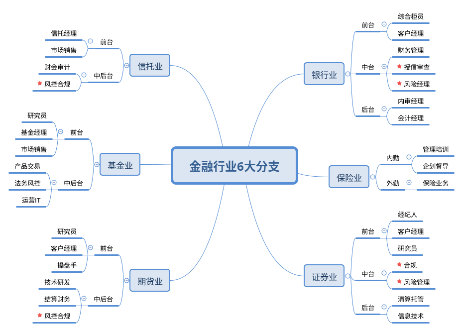

# 传统金融行业六大分支和六大功能

## 传统金融体系的六大分支

金融的内容可概括为货币的发行与回笼、存款的吸收与付出、贷款的发放与回收、金银或外汇的买卖、有价证券的发行与转让，以及保险、信托、国内国际的货币结算等。

从事金融活动的机构主要有银行、信托投资公司、保险公司、证券公司、投资基金、证券交易所等。

## 传统金融体系的六大功能

1. 清结算和支付功能：金融体系为商品、劳务的交易提供了清结算以及支付手段。互联网金融兴起的一大亮点就是支付方式的巨大变化。
1. 融资和股权细化功能：金融体系可以通过合法的手段融合资金，使得资金从一方流转到另一方，在资金流转的过程中实现了资金的整合，即融资。融资对于大型项目的建设以及有发展潜力的企业而言是至关重要的。股权融资就是将大型投资项目划分为小额股份，以便中小投资者进行投资参与，这样的分配即实现了股权的细化。
1. 资源配置功能：单个投资者往往很难对市场投资环境以及公司投资预期做出合理的判断。金融中介机构承担了帮助投资者做投资决策的功能，分散了投资风险，优化了社会资本投资配置。
1. 风险管理功能：由于金融市场上交易成本和信息不对称性，金融投资存在高低不同的风险。金融体系可以对风险进行定价、交易、分散及转移。使得金融市场风险得到合理的分配。
1. 激励功能：这里的激励主要指的是股权问题。对于企业而言，如果其员工拥有企业一定的股票或股票期权，就能实现对员工的激励。
1. 信息功能：在金融市场上，筹资者可以获取各种不同融资方式的成本信息，投资者可以从获取投资品的价格以及价格影响因素的信息。

[1]: https://chengzhaoxi.xyz/fed6e7.html
