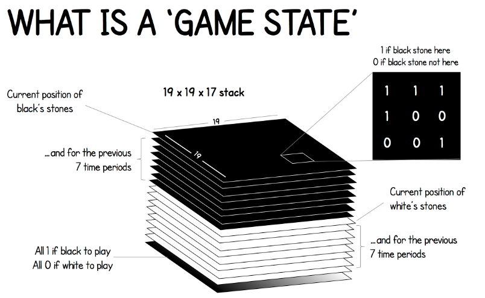

<!--
 * @version:
 * @Author:  StevenJokess（蔡舒起） https://github.com/StevenJokess
 * @Date: 2023-03-22 00:05:23
 * @LastEditors:  StevenJokess（蔡舒起） https://github.com/StevenJokess
 * @LastEditTime: 2023-04-06 03:54:12
 * @Description:
 * @Help me: 如有帮助，请赞助，失业3年了。
 * @TODO::
 * @Reference:
-->
# AlphaGo Zero

AlphaGo Zero没有专家动作过程的监督学习（即完全不需要人类棋谱），通过自我对弈完成棋力提高。

主要使用了两个模型，第一个就是我们之前介绍MCTS树结构，另一个是一个神经网络。策略网络（输出各个落子动作对应的获胜概率p）和价值网络（输出获胜或者失败的评估[-1,1]）整合到单个残差神经神经网络中（即走棋和估值网络合并为一个网络：$(p,v)=f(s)$ [3]），

策略网络更新去跟上MCTS的动作。[2]：AlphaGo Zero的**行棋**主要是由MCTS指导完成的，但是在MCTS搜索的过程中，由于有一些不在树中的状态需要仿真，做局面评估，因此需要一个简单的策略来帮助MCTS评估改进策略，这个策略改进部分由前面提到的神经网络完成。

这两部分的关系如下图所示：

## 训练过程简介

在讨论AlphaGo Zero的MCTS如何搜索，神经网络如何训练等细节之前，我们先看看AlphaGo Zero的训练过程是什么样的。

AlphaGo Zero训练过程主要分为三个阶段：自我对战学习阶段，训练神经网络阶段和评估网络阶段。

### 自我对战学习阶段

自我对战学习阶段，主要是AlphaGo Zero自我对弈，产生大量棋局样本的过程，由于AlphaGo Zero并不使用围棋大师的棋局来学习，因此需要自我对弈得到训练数据用于后续神经网络的训练。在自我对战学习阶段，每一步的落子是由MCTS搜索来完成的。在MCTS搜索的过程中，遇到不在树中的状态，则使用神经网络的结果来更新MCTS树结构上保存的内容。在每一次迭代过程中，在每个棋局当前状态s下，每一次移动使用1600次MCTS搜索模拟。最终MCTS给出最优的落子策略π,这个策略π和神经网络的输出p是不一样的。当每一局对战结束后，我们可以得到最终的胜负奖励z,1或者-1. 这样我们可以得到非常多的样本(s,π,z)，这些数据可以训练神经网络阶段。

### 训练神经网络阶段

在训练神经网络阶段，我们使用自我对战学习阶段得到的样本集合(s,π,z),训练我们神经网络的模型参数。训练的目的是对于每个输入s, 神经网络输出的p,v和我们训练样本中的π,z差距尽可能的少。这个损失函数L其实是很简单的：

$L=(z-v)^2-\pi^T \log (p)+c\|\theta\|^2$

损失函数由三部分组成，第一部分是均方误差损失函数，用于评估神经网络预测的胜负结果和真实结果之间的差异。第二部分是交叉熵损失函数，用于评估神经网络的输出策略和我们MCTS输出的策略的差异。第三部分是L2正则化项。

通过训练神经网络，我们可以优化神经网络的参数θ,用于后续指导我们的MCTS搜索过程。

当神经网络训练完毕后，我们就进行了评估阶段，这个阶段主要用于确认神经网络的参数是否得到了优化，这个过程中，自我对战的双方各自使用自己的神经网络指导MCTS搜索，并对战若干局，检验AlphaGo Zero在新神经网络参数下棋力是否得到了提高。除了神经网络的参数不同，这个过程和第一阶段的自我对战学习阶段过程是类似的。

## AlphaGo Zero的神经网络结构

在第二节我们已经讨论了AlphaGo Zero的主要训练过程，但是还有两块没有讲清楚，一是AlphaGo Zero的MCTS搜索过程是怎么样的，二是AlphaGo Zero的神经网络的结构具体是什么样的。这一节我们来看看AlphaGo Zero的神经网络的细节。

首先我们看看AlphaGo Zero的输入，当前的棋局状态。

由于围棋是19x19的361个点组成的棋局，每个点的状态有二种：

- 如果当前是黑方行棋，则当前有黑棋的点取值1，有白棋或者没有棋子的位置取值为0，
- 反过来，如果当前是白方行棋，则当前有白棋的点取值1，有黑棋或者没有棋子的位置取值为0。

同时，为了提供更多的信息，输入的棋局状态不光只有当前的棋局状态，包括了黑棋白棋各自前8步对应的棋局状态。
除了这16个棋局状态，还有一个单独的棋局状态用于标识当前行棋方，如果是当前黑棋行棋，则棋局状态上标全1，白棋则棋局状态上标全0。如下图所示：

最终神经网络的输入是一个19x19x17的张量。里面包含黑棋和白棋的最近8步行棋状态和当前行棋方的信息。

接着我们看看神经网络的输出，神经网络的输出包括策略部分和价值部分。对于策略部分，它预测当前各个行棋点落子的概率。由于围棋有361个落子点，加上还可以Pass一手，因此一共有362个策略端概率输出。对于价值端，输出就简单了，就是当前局面胜负的评估值，在[-1,1]之间。

看完了神经网络的输入和输出，我们再看看神经网络的结构，主要是用CNN组成的深度残差网络。如下图所示：

在19x19x17的张量做了一个基本的卷积后，使用了19层或者39层的深度残差网络，这个是ResNet的经典结构。理论上这里也可以使用DenseNet等其他流行的网络结构。神经网络的损失函数部分我们在第二节已经将了。整个神经网络就是为了当MCTS遇到没有见过的局面时，提供的当前状态下的局面评估和落子概率参考。这部分信息会被MCTS后续综合利用。

## AlphaGo Zero的MCTS搜索

现在我们来再看看AlphaGo Zero的MCTS搜索过程，之前已经介绍了MCTS的基本原理和4个主要的搜索阶段: 选择，扩展，仿真和回溯。

>AlphaGo Zero相对于AlphaGo来说，其MCTS算法更为简单，因为它没有包括完整游戏的rollouts，所以不需要rollout策略。AlphaGo Zero的每一次MCTS迭代都会在当前搜索树的叶节点处结束模拟，而不是在完整游戏模拟的终止位置结束。[8]

和上一篇的内容相比，这里MCTS的不同主要体现在树结构上保存的信息不同，进而UCT的计算公式也稍有不同。最后MCTS搜索完毕后，AlphaGo Zero也有自己选择真正落子点的策略。

在上一篇里，我们的MCTS上保存的数据很简单，就是下的总盘数和贏的总盘数。在AlphaGo Zero这里，我们保存的信息会多一些。主要包括下面的 4 部分:

- $N(s, a)$ :记录边的访问次数
- $W(s, a)$ ：合计行动价值
- $Q(s, a):$ 平均行动价值
- $P(s, a)$ : 选择该条边的先验概率
其中 $s$ 为当前棋局状态， $a$ 为某一落子选择对应的树分支。

有了MCTS上的数据结构，我们看看AlphaGo Zero的MCTS搜索的4个阶段流程：

### 首先是选择

在MCTS内部，出现过的局面，我们会使用UCT选择子分支。子分支的UCT原理和上一节一样。但是具体的公式稍有不同，如下：

$$
\begin{gathered}
U(s, a)=c_{p u c t} P(s, a) \frac{\sqrt{\sum_b N(s, b)}}{1+N(s, a)} \\
a_t=\underset{a}{\arg \max }\left(Q\left(s_t, a\right)+U\left(s_t, a\right)\right)
\end{gathered}
$$

最终我们会选择Q+U最大的子分支作为搜索分支，一直走到棋局结束，或者走到了没有到终局MCTS的叶子节点。$c_puct$ 是决定探索程度的一个系数，上一篇已讲过。

如果到了没有到终局的MCTS叶子节点，那么我们就需要进入MCTS的第二步，扩展阶段,以及后续的第三步仿真阶段。我们这里一起讲。对于叶子节点 状态 $s$ ，会利用神经网络对叶子节点做预测，得到当前叶子节点的各个可能的子节点位置 $s_L$ 落子的概率 $p$ 和对应的价值 $v$, 对于这些可能的新节点我们在MCTS中创 建出来，初始化其分支上保存的信息为：

$$
\left\{N\left(s_L, a\right)=0, W\left(s_L, a\right)=0, Q\left(s_L, a\right)=0, P\left(s_L, a\right)=P_a\right\}
$$

这个过程如下图所示：

---

这样扩展后，之前的叶子节点 $s$ ，现在就是内部节点了。做完了扩展和仿真后，我们需要进行回溯，将新叶子节点分支的信息回溯累加到祖先节点分支上 去。这个回溯的逻辑也是很简单的，从每个叶子节点 $L$ 依次向根节点回溯，并依次更新上层分支数据结构如下:

$$
\begin{aligned}
N\left(s_t, a_t\right) & =N\left(s_t, a_t\right)+1 \\
W\left(s_t, a_t\right) & =W\left(s_t, a_t\right)+v \\
Q\left(s_t, a_t\right) & =\frac{W\left(s_t, a_t\right)}{N\left(s_t, a_t\right)}
\end{aligned}
$$

这个MCTS搜索过程在一次真正行棋前，一般会进行约1600次搜索，每次搜索都会进行上述4个阶段。I
这上干次MCTS搜索完毕后，AlphaGo Zero就可以在MCTS的根节点 $s$ 基于以下公式选择行棋的MCTS分支了:

$$
\pi(a \mid s)=\frac{N(s, a)^{1 / \tau}}{\sum_b N(s, b)^{1 / \tau}}
$$

其中， $\tau$ 为温度参数，控制探索的程度， $\tau$ 越大，不同走法间差异变小，探索比例增大，反之，则更多选择当前最优操作。每一次完整的自我对恋的前 30 步，参数 $\tau=1$ ，这是早期鼓励探索的设置。游戏剩下的步数，该参数将逐渐降低至 0 。如果是比赛，则直接为 0 .

---

.. then select a move

After 1,600 simulations, the move can either be chosen:

**Deterministically** (for competitive play)

Choose the action from the current state with greatest $\mathrm{N}$

**Stochastically** (for exploratory play)

Choose the action from the current state from the distribution

$$
\pi \sim N^{1 / \tau}
$$

where $\tau$ is a temperature parameter, controlling exploration

同时在随后的时间步中，这个MCTS搜索树将会继续使用，对应于实际所采取的行为的子节点将变成根节点，该子节点下的子树的统计数据将会被保留，而这颗树的其余部分将会丢弃 。

以上就是AlphaGo Zero MCTS搜索的过程。

---

$$
\boldsymbol{\theta}_{\text {new }} \leftarrow \boldsymbol{\theta}_{\text {now }}-\beta \cdot \frac{1}{n} \sum_{t=1}^n \nabla_{\boldsymbol{\theta}} H\left(\boldsymbol{p}_t, \pi\left(\cdot \mid s_t \boldsymbol{\theta}_{\text {now }}\right)\right) .
$$

此处的 $\beta$ 是学习率。

更新价值网络：训练价值网络的方法与 AlphaGo 2016版本基本一样, 都是让 $v\left(s_t ; \boldsymbol{w}\right)$ 拟合回报 $u_t$ 。定义回归问题：

$$
\min _{\boldsymbol{w}} \frac{1}{2 n} \sum_{t=1}^n\left[v\left(s_t ; \boldsymbol{w}\right)-u_t\right]^2
$$

设价值网络 $v$ 当前参数是 $\boldsymbol{w}_{\text {now }}$ 。用价值网络做预测: $\widehat{v}_t=v\left(s_t ; \boldsymbol{w}_{\text {now }}\right), \forall t=1, \cdots, n$ 。做 一次梯度下降更新 $w$ :

$$
\boldsymbol{w}_{\text {new }} \leftarrow \boldsymbol{w}_{\text {now }}-\alpha \cdot \frac{1}{n} \sum_{t=1}^n\left(\widehat{v}_t-u_t\right) \cdot \nabla_{\boldsymbol{w}} v\left(s_t ; \boldsymbol{w}_{\text {now }}\right) .
$$

训练流程：随机初始化策略网络参数 $\theta$ 和价值网络参数 $w$ 。然后让 MCTS 自我溥 恋, 玩很多局游戏; 每完成一局游戏, 更新一次 $\theta$ 和 $w$ 。训练的具体流程就是重复下面 三个步骤直到收敛：

1. 让 MCTS 自我博弈, 完成一局游戏, 收集到 $n$ 个三元组: $\left(s_1, \boldsymbol{p}_1, u_1\right), \cdots,\left(s_n, \boldsymbol{p}_n, u_n\right)$ 。
2. 按照公式 (18.2) 做一次梯度下降, 更新策略网络参数 $\boldsymbol{\theta}$ 。
3. 按照公式 (18.3) 做一次梯度下降, 更新价值网络参数 $w$ 。

https://en.wikipedia.org/wiki/Self-play_(reinforcement_learning_technique

## 总结

AlphaGo Zero巧妙了使用MCTS搜索树和神经网络一起，通过MCTS搜索树优化神经网络参数，反过来又通过优化的神经网络指导MCTS搜索。两者一主一辅，非常优雅的解决了这类状态完全可见，信息充分的棋类问题。

当然这类强化学习算法只对特定的这类完全状态可见，信息充分的问题有效，遇到信息不对称的强化学习问题，比如星际，魔兽之类的对战游戏问题，这个算法就不那么有效了。要推广AlphaGo Zero的算法到大多数普通强化学习问题还是很难的。因此后续强化学习算法应该还有很多发展的空间。[7]

相关开源程序：[5]

## PUCT

PUCT则是对UCT的改进，主要用于棋类游戏中。PUCT通过考虑位置信息，对UCT进行了扩展，引入了一个额外的参数来调整UCB公式中的探索项。具体而言，PUCT将UCB公式中的探索项扩展为两部分，一部分是全局探索项，另一部分是局部探索项，用于考虑当前节点所在的棋盘位置。这样可以使得PUCT在搜索过程中更加注重对棋盘中关键位置的探索，从而提高搜索的效果。

因此，PUCT可以看作是对UCT的一种改进，通过引入位置信息，使得搜索算法更加针对特定的棋类游戏进行优化，从而在搜索过程中更加有效地选择和扩展节点。

[1]: https://www.math.pku.edu.cn/teachers/zhzhang/drl_v1.pdf 18.3.2
[2]: https://www.bilibili.com/video/BV1qx411j7Tq/?spm_id_from=333.999.0.0
[3]: https://www.bilibili.com/video/BV1V44y1n793?p=35&vd_source=bca0a3605754a98491958094024e5fe3
[4]:https://www.bilibili.com/video/BV164411p7bs/?spm_id_from=333.999.0.0&vd_source=bca0a3605754a98491958094024e5fe3
[5]: https://github.com/leela-zero/leela-zero
[6]: https://www.deepmind.com/blog/alphago-zero-starting-from-scratch
[7]: https://cloud.tencent.com/developer/article/1408923?areaSource=&traceId=
[8]: http://incompleteideas.net/book/RLbook2020.pdf

TODO:https://zhiqingxiao.github.io/rl-book/en2022/code/TicTacToe-v0_AlphaZero_torch.html
