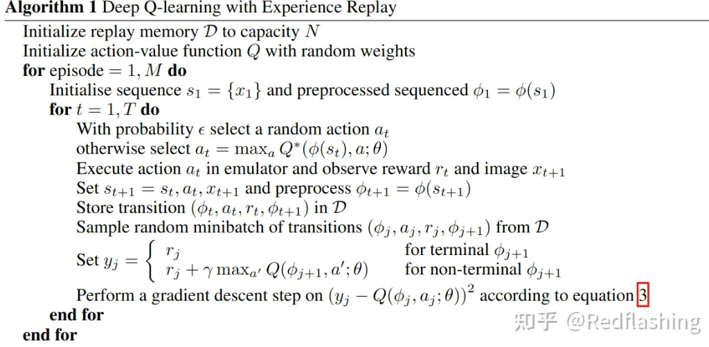

# Atari

基本内容在[Game](Game.md)已经介绍过了，[DQN](../chapter_DQN-algs)也讲过了，

## 经典环境

下面再介绍几个经典环境：

- 倒立摆（Cart Pole）：这是一个经典控制问题。一个杆一个小车，杆的一端连接到小车，连接处自由，杆可以摆来摆去。小车前后两个方向移动，移动取决于施加的前后作用力，大小为1。目标是控制力的方向，进而控制小车，让杆保持站立。注意小车的移动范围是有限制的。
- 月球登陆者（Lunar  Lander）：这个游戏构建在Box2D模拟器上。Box2D是一款2D游戏世界的物理引擎，可处理二维物体的碰撞、摩擦等力学问题。本游戏的场景是让月球车顺利平稳地着陆在地面上的指定区域，接触地面一瞬间的速度最好为0，并且消耗的燃料越少越好。
- 双足行走者（Bipedal  Walker）：同样基于Box2D模拟器，这个游戏中玩家可以控制双足行走者的步进姿态。具体地说，是控制腿部膝关节处的马达扭力，尽量让行走者前进得更远，同时避免摔倒。本环境提供的路面包括台阶、树桩和陷坑，同时给行走者提供10个激光测距值。另外，环境的状态信息包括水平速度、垂直速度、整体角速度和关节处角速度等。[2]

## 伪代码

下面介绍如何利用DQN解决Atari。

直接处理原始 Atari 帧，即 $210 \times 160$ 像素图像和 128 色，在计算上要求很高，因此作者应用 了一个旨在降低输入维度的基本预处理步骤。对原始帧进行预处理通过首先将其 RGB 表示转换为 灰度并将其下采样为 $110 \times 84$ 图像。最终的输入表示是通过裁剪图像的 $84 \times 84$ 区域来获得 的，该区域粗略地捕获了播放区域。最后的裁剪阶段之所以需要是因为作者使用了中 $2 D$ 卷积的 GPU 实现，它需要方形输入。对于本文中的实验，算法 1 中的函数 $\phi$ 将此预处理应用于历史的最后 4 帧，并将它们堆叠起来以生成 $Q$ 函数的输入。

有几种使用神经网络参数化 $Q$ 的可能方法。由于 $Q$ 将历史-动作对（ history-action pairs）映射到其 $Q$ 值的估计， 因此历史和动作已被某些先前的方法用作神经网络的输入。这种架构的主要缺 点是需要单独的前向传播来计算每个动作的 $Q$ 值，导致成本与动作数量成线性比例。作者改为使 用一种架构，其中每个可能的动作都有一个单独的输出单元，只有状态表示是神经网络的输入。输出对应于输入状态的单个动作的预测 $Q$ 值。这种架构的主要优点是能够计算给定状态下所有可能动作的 $\mathrm{Q}$ 值，只需通过网络进行一次前向传递。

作者现在描述用于所有七款 Atari 游戏的具体架构。神经网络的输入是由 $\phi$ 生成的 $84 \times 84 \times 4$ 图像。第一个隐藏层将 16 个步长为 4 的 $8 \times 8$ 滤波器与输入图像进行卷积，并应用激活函数。 第二个隐藏层卷积 32 个 $4 \times 4$ 的滤波器，步长为 2 ，再次跟随激活函数。最后的隐藏层是全连接层，由 256 个神经元组成。输出层是一个全连接层，每个有效动作都有一个输出。在作者考虑的游戏中，有效动作的数量在 4 到 18 之间。作者将使用该方法训练的卷积网络称为 Deep Q Networks (DQN)。

[1]: https://zhuanlan.zhihu.com/p/441314394?utm_campaign=&utm_medium=social&utm_oi=772887009306906624&utm_psn=1628228840898924544&utm_source=qq
[2]: https://pdf-1307664364.cos.ap-chengdu.myqcloud.com/%E6%95%99%E6%9D%90/%E6%9C%BA%E5%99%A8%E5%AD%A6%E4%B9%A0/%E3%80%8A%E7%99%BE%E9%9D%A2%E6%9C%BA%E5%99%A8%E5%AD%A6%E4%B9%A0%E7%AE%97%E6%B3%95%E5%B7%A5%E7%A8%8B%E5%B8%88%E5%B8%A6%E4%BD%A0%E5%8E%BB%E9%9D%A2%E8%AF%95%E3%80%8B%E4%B8%AD%E6%96%87PDF.pdf
