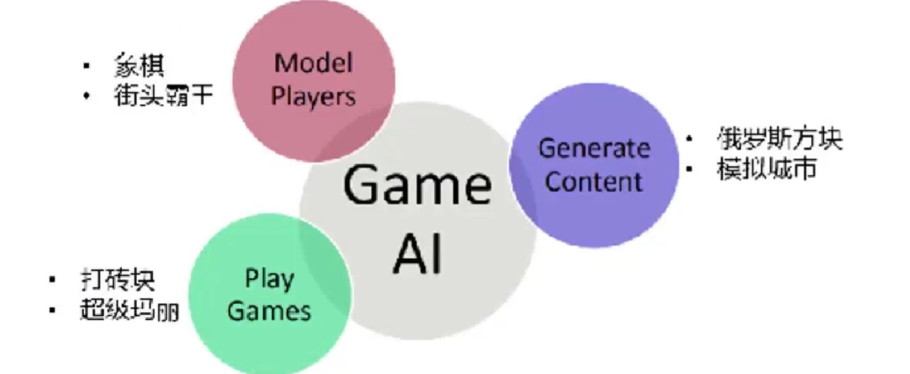

<!--
 * @version:
 * @Author:  StevenJokess（蔡舒起） https://github.com/StevenJokess
 * @Date: 2023-03-26 23:13:56
 * @LastEditors:  StevenJokess（蔡舒起） https://github.com/StevenJokess
 * @LastEditTime: 2023-04-12 20:05:09
 * @Description
 * @Help me: 如有帮助，请赞助，失业3年了。
 * @TODO::
 * @Reference:
-->
# 游戏

本篇会先介绍下AI中的游戏类型、电动游戏的概念，传统人工智能在游戏上的应用，最后再介绍强化学习在电动游戏上的应用。

## AI中的游戏类型

|   |      确定性          |        非确定性       |
|---|----------------------|----------------------|
| 完美信息 |国际象棋，跳棋，奥赛罗| 步步高，垄断[10]|
|不完善信息 | 战舰，盲人，tic-tac-toe | 桥牌，扑克，拼字游戏，核战争 |

- 完美信息：拥有完美信息的游戏是智能体可以查看整个电路板的游戏。智能体拥有关于游戏的所有信息，他们也可以看到彼此的动作。例如Chess，Checkers，Go等。
- 不完美的信息：如果在游戏中智能体没有关于游戏的所有信息并且不知道正在发生什么，这种类型的游戏被称为具有不完全信息的游戏，例如井字游戏，战舰，盲人，桥，等等
- 确定性游戏：确定性游戏是那些遵循严格模式和游戏规则的游戏，并且没有与之相关的随机性。例如国际象棋，Checkers，Go，tic-tac-toe等。
- 非确定性游戏：非确定性游戏是那些具有各种不可预测事件且具有机会或运气因素的游戏。这个机会或运气因素是由骰子或卡片引入的。这些是随机的，每个动作响应都不是固定的。这种游戏也被称为随机游戏。示例：步步高，垄断，扑克等

## 电动游戏

电动游戏，主要指玩家需要根据屏幕画面的内容进行操作的游戏，包括主机游戏吃豆人（PacMan）、PC游戏星际争霸（StarCraft）、手机游戏Flappy Bird等。很多游戏需要得到尽可能高的分数，或是要在多方对抗中获得胜利。同时，对于这些游戏，很难获得在每一步应该如何操作的标准答案。[1]

得，电动游戏是不完美的信息，有可能是确定性，也有可能非确定性。

## 人工智能可在游戏上的应用

强化学习主要集中在Play games、Model players上。

### 相关学术研究会议

日前与游戏相关的学术研究会议也有很多，最著名的两个是ICEE CIG(计算智能与游戏)和AIIE(人工智能与交互式数字娱乐)大会，孕育了许多成功的游戏人工智能。从会议中发表论文的占比也可以看出，越来越多的研究者开始涉足游戏人工智能领域，而研究的内容也越来越多样化，这止是游戏人工智能正迅速发展的表现。

### 传统游戏-状态行为树

黄鸿波表示，关于游戏情况的最酷事情是，在游戏的压力下训练了智能体的策略。 例如，它可以了解受到攻击时的处理方式，或如何行为以达到特定目标。[6]

### 那如何判定"受到攻击"的状态？

格斗游戏是动作游戏的一种，简称为TG(Fight Technology Game)，格斗通常是多个阵营的作战，通过使用武力击败对手以获得胜利。此类游戏是典型的动作类游戏，更是动作游戏之中很重要的一个游戏分文，前文提到的《街头霸王》就是经典的格斗游戏。

格斗游戏的玩家使用不同角色的格斗技巧来进行对战，那么计算机对角色攻击与被攻击的精准判定就是必须的。对丁每一个角色，攻击与被攻击的判定范国都可以是矩形框。如下左图，红色矩形框为角色攻击范围的判定框，蓝色矩形框为角色受击范国的判定框。对于任意两个矩形，只需些知道其左上角和右下角的两个点航可以定位出整个矩形，进而可以判定二者是否重叠。

在建立了游戏场景内的判定框之后，还要考感时间维度上的判定。每一个角色的招式都不是瞬发的，而是有一个播放动画的过程，那么播放动画的过程中，判定框的改变也需要在游戏设计中考虑到。如图所示，上部为人物动画及其攻击判定框，下方为整个动画的时间轴。将每一个招式动西分为前摇、改击判定和收招，在攻击判定时间的动画内可以设置不同的判定框和不同的伤害数据。因为攻击判定都是与动画强相关的，所以一般动画和判定框都是直接做在相应的动画编辑工具中。除此之外，随着游戏玩法的丰高，判定框的功能也不仅限于判定攻击与受击，击飞、举起、推拉等判定也可以使用矩形框。

## 能玩Atari的AI

雅达利(Atari)游戏机是一种由北美游戏制造商雅达利公司于1977年推出的视频游戏游戏机。雅达利曾是历史上最受欢迎的游戏系统之一，在30年的时间里，它的销量超过了3000万部，发布了418个不同的原创游戏，包括冒险，小行星，突破，恶魔攻击，青蛙，和知名的吃豆人和Pong。

Atari 2600 是一个具有挑战性的 RL 测试平台，它为智能体提供高维视觉输入（ 60Hz 的 210 × 160 RGB 视频）和一组多样化且有趣的任务，这些任务旨在对人类玩家来说是困难的。作者的目标是创建一个能够成功学习玩尽可能多的游戏的单一神经网络智能体。网络没有提供任何特定于游戏的信息或人工设计的视觉特征，也不知道模拟器的内部状态；它只从视频输入、奖励和终端信号以及一组可能的动作中学习——就像人类玩家一样。此外，用于训练的网络架构和所有超参数在整个游戏中保持不变。[8]

2013年底，当时鲜为人知的公司DeepMind在强化学习领域取得了突破：使用深度强化学习，他们实现了一个人工智能系统可以玩许多经典Atari游戏。而且在主机Atari 2600的数十个经典游戏中，基于强化学习的游戏AI已经在将近一半的游戏中超过人类的历史最佳结果。

## 智能博弈

近年来，在人机对抗场景中，AlphaGo、AlphaStar、Pluribus、Suphx、绝悟等一大批高水平AI在游戏验证平台中战胜了人类玩家，智能博弈发展取得了显著突破。智能博弈技术的巨大成功主要依赖于博弈论和强化学习两种范式的结合:博弈论提供了有效的解概念来描述多智能体系统的学习结果，但主要是在理论上发展，应用于实际问题的范围较窄；深度强化学习算法为智能体的训练提供了可收敛性学习算法,可以在序列决策过程中达到稳定和理性的均衡。

### 第一个战胜围棋职业棋手的AI AlphaGo

2015年10月，AlphaGo击败樊麾，成为第一个无需让子即可在19路棋盘上击败围棋职业棋手的电脑围棋程序，写下了历史，并于2016年1月发表在知名期刊《自然》。[12]

关于AlphaGo的发展，之后会分四节详细介绍，分别是[AlphaGo](AlphaGo.md)、[AlphaGo_Zero](AlphaGo_Zero.md)、[AlphZero](AlphZero.md)、[MuZero](MuZero.md)

### 能玩电竞的人工智能AlphaStar

2019年10月30日，DeepMind推出的即时战略人工智能候AlphaStar在星际争霸11上打败了世界顶级的人类职业电竞选手，其研究作为封面文章发表在Nature上，星际争霸11不但是电脑游戏传奇星际争霸的代秀续作，也是具有极高复杂度的即时战略游戏：它具备分散的任务目标，包括采矿、建造。生产。还有战略、战役、战术层面的复条兵种群移动、布阵、攻击、撤退、掩护等操作，可以说，星际争霸11的指挥塘比斯大林格防根卫栈的复余程度。[3]更多见[AlphaStar](AlphaStar.md)

### “Suphx”在国际知名专业麻将平台“天凤”上荣升十段。

### “绝悟”已达到王者荣耀职业水平

2019年8月2日，在吉隆坡举办的《王者荣耀》世界冠军杯（该游戏最高规格的赛事）半决赛的特设环节中，腾讯 AI Lab 策略协作型 AI “绝悟”在与职业选手赛区联队的 5v5 竞技中获胜。这表明绝悟 AI 已经达到了《王者荣耀》电竞职业水平。

“绝悟”名字寓意绝佳领悟力，其技术研发始于2017年12月，并在2018年12月通过了顶尖业余水平测试（前职业选手与主播联队带来）。

### 服务于游戏运营的冷启动

AI通过较高的拟人性、差异化的段位和风格，能够很好地解决冷启动匹配的问题。[4]

1. 高拟人性AI的表现需要符合人类玩家的常态，其他玩家无法分辨AI与真人。AI的操作有一定多样性——大部分是“常规操作”，偶尔也会犯下低级失误或打出“神之一手”。
2. 差异化段位不同段位的AI能明显体现出符合该段位的水平。比如低等级AI失误率更高，逻辑链简单；而高等级AI有更多套路，推理/反推理能力更强，各身份下胜率也普遍更高。
3. 差异化风格不同风格的AI在相同局面下会采取截然不同的行动。以捣乱者为例：冲锋型AI可能开局直接捣乱，力图快攻取胜；而猥琐型AI则可能连续潜水，甚至打出“双狼平安夜”，到后三轮再连续捣乱。我们希望将满足上述标准的AI引入到游戏中，实现桌游玩法的AI化改造。通过大量行为拟人的、符合目标玩家段位的、具备多样化风格的AI“虚拟玩家”，来解决核心的冷启动匹配问题。[5]

# 游戏AI机遇与挑战并存

- 样本大
  - 一位兼具游戏跟AI背景的资深人士告诉笔者，AI的确可以有效提升游戏体验。掣肘在于，样本大、训练成本高。像《王者荣耀》这类大DAU，高流水竞技性产品，固然可以一试。对于中型体量产品而言，往往不太划算。一位创业游戏公司高层说，小样本模型效果不错的话，拿几千万尝试也不是没有可能。换言之，大大样本模型，让企业望而却步。
- 成本高
  - 据估算，AlphaGo整体训练成本高达3500万美元，消耗能量足以支持12760个人类大脑在三天内不眠不休地工作。
  - 训练AlphaStar需要使用Google v3 TPU,用以支撑数千个《星际争霸II》协同运行。AlphaStar共对战14天，每个智能体使用16个TPU。在训练期间，每个智能体都经历了长达200年的实时游戏。粗略估算下来，训练成本达到数百万美元。
- 灵活性差
  - 在单一地图上使用同一“种族”进行对战时，其成绩确实优于人类。不过一旦在其它地图使用不同“种族”时，衣现就要差很多。要想切换操作风格，必须得从头开始重新训练AlphaStar。简言之，即系统缺乏足够的灵活性。这一特性会让DeepMind训练成本迅速放大。

[1]: https://developer.aliyun.com/article/718967
[2]: https://www.jsjkx.com/EN/article/openArticlePDF.jsp?id=20967
[3]: https://www.bilibili.com/video/BV13e4y1m7Jr/?spm_id_from=333.337.search-card.all.click
[4]: http://youxichaguan.com/news/23578.html
[5]: https://www.dianwannan.com/app/1000000182014/
[6]: https://www.51cto.com/article/716590.html
[7]: https://www.bilibili.com/video/BV1a14y1V78N/?spm_id_from=333.337.search-card.all.click&vd_source=bca0a3605754a98491958094024e5fe3
[8]: https://zhuanlan.zhihu.com/p/441314394?utm_campaign=&utm_medium=social&utm_oi=772887009306906624&utm_psn=1628228840898924544&utm_source=qq
[9]: https://www.yiibai.com/artificial-intelligence-tutorial/ai-adversarial-search.html
[10]: https://www.yiibai.com/artificial-intelligence-tutorial/ai-adversarial-search.html
[11]: https://tech.sina.com.cn/roll/2020-02-03/doc-iimxxste8529404.shtml
[12]: https://zh.wikipedia.org/wiki/AlphaGo
