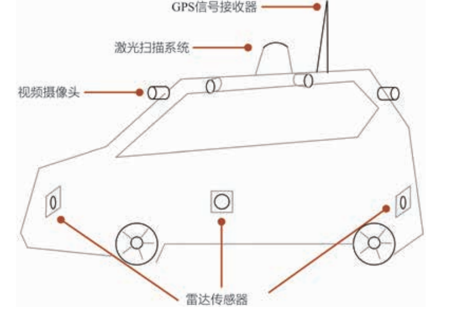

<!--
 * @version:
 * @Author:  StevenJokess（蔡舒起） https://github.com/StevenJokess
 * @Date: 2023-03-23 23:05:23
 * @LastEditors:  StevenJokess（蔡舒起） https://github.com/StevenJokess
 * @LastEditTime: 2023-05-13 00:27:01
 * @Description:
 * @Help me: 如有帮助，请赞助，失业3年了。
 * @TODO::
 * @Reference:
-->
# 智能驾驶(Intelligent driving)

## 目的

- 安全：超过94%的碰撞事故都是由于驾驶员的失误而造成的。从理论上说，一个完美的自动驾驶方案，每年可以挽救120万人的生命。
- 方便：将驾驶员从方向盘后面解放出来，在乘车时进行工作和娱乐，更充分利用上班族的通勤上下班的时间。
- 高效共享：共享出行最大的成本来自于司机的时间。不需要私人去买车养车，依赖于共享出行，省钱。
- 减少拥堵：只要加入一辆自动驾驶汽车，就可以将车队行驶车速的标准差减少50%，使得行驶更加稳定和省油。[3]

## 自动驾驶的安全性要求

要求更加严苛的安全标准。因为汽车中的人工智能算法出错，带来的损失是**无法挽回的**。例如，在时速100公里每小时的车上，把路边一个穿越马路的行人误判为静止的柱子，将会直接导致伤亡，后果不堪设想。

目前场景在（半）封闭路段、在高速或封闭的港口。

## 自动驾驶系统构成

等级3及以上的自动驾驶系统通常被认为王要由系统来观祭驾驶外部环境并对观则结果做出反应。一般情况下，这样的系统通常包含如图所示的几个部分：

- 激光扫描系统：通常被安置在汽车顶端，能够对环境进行360°的三维扫描，主要用于识别道路、辨析障碍等。
- 视频摄像头：帮助汽车识别周围环境中的视觉信息（如停止的汽车、路标路障等），跟踪行人、其他车辆的运行情况等。它还负责识别交通路灯、阅读路标。
- GPS信号接收器：依靠GPS对汽车进行精准定位，在车载地图的帮助下，无人驾驶汽车能实现最优路径规划。
- 雷达传感器：自动驾驶汽车的前后和侧面都安装了雷达系统，能够配合其他系统的检测信号，一起实现汽车的自动变道和自动泊车等。
- 车联网系统：车与车、车与路、车与人、车与云等系统间的交互称为车联网。一个安全的车联网能够帮助车辆实现信息共享，从多个信息源中获得车辆、道路、环境等信息，也可对信息进行加工、计算和发布。此外，还能提供专业的多媒体与移动互联网应用130服务。
- 智能算法模块控制系统：如果说上述子系统是无人车的眼睛和耳朵，那么控制系统就是无人车的大脑。控制系统要对上述所有子系统收集的信息数据进行分析和加工。控制系统也对各个智能算法子系统进行监督和控制，以保障整体系统的有效、稳定和安全。[4]

### 工程师所需的技能

如能在以下三个领域之一有比较扎实的基础，就可以比较容易地拿到自动驾驶相
关领域的offer，成为自动驾驶算法工程师了。

- 计算机视觉：深度学习（道路标牌识别，车道线检测，车辆跟踪，物体分割，物体识别。）
- 传感和控制：信号处理，Kalman滤波，自动定位，控制理论（PID控制），路径规划。
- 系统集成：机器人操作系统，嵌入式系统。

## 强化学习

自动驾驶问题通过控制方向盘、油门、刹车等设备完成各种运输目标（见图1-4）。自动驾驶问题既可以在虚拟环境中仿真（比如在电脑里仿真），也可能在现实世界中出现。有些任务往往有着明确的目标（比如从一个指定地点到达另外一个指定地点），但是每一个具体的动作却没有正确答案作为参考。这正是强化学习所针对的任务。基于强化学习的控制策略可以帮助开发自动驾驶的算法。[2]

自动驾驶（本图截取自仿真平台AirSimNH）

## 深度强化学习

传感器技术的进步使得智能驾驶得到了快速发展。目前, 国内外众多研究团队已经将智能驾驶作为重要研究方向并取得了初步的研究成果. 然而类似激光雷达这类传感器的使用大大增加了智能车成本, 极大地阻碍了智能车的普及. 近年来, 基于摄像头的先进驾驶员辅助系统(advanced driver assistance systems, ADAS)逐渐成为智能驾驶的关键技术之一. 该技术基于摄像头获取图像信息, 通过深度学习实时提取路况特征, 设计相应的智能控制算法, 实现稳定可靠的智能驾驶. 深度强化学习作为一类自学习智能控制算法, 可用来解决车辆的复杂非线性系统控制问题. 根据现有深度强化学习在TORCS赛车平台的研究可以预测, 深度强化学习将在智能驾驶领域发挥巨大的作用, 成为降低智能车成本的一个可行方案。[1]

TODO:https://github.com/apachecn/apachecn-dl-zh/blob/master/docs/rl-tf/09.md
[1]: http://pg.jrj.com.cn/acc/Res/CN_RES/INDUS/2023/2/9/27c20431-8ed3-4562-83b5-5c82706f28a5.pdf
[2]: https://developer.aliyun.com/article/718967
[3]: https://pdf-1307664364.cos.ap-chengdu.myqcloud.com/%E6%95%99%E6%9D%90/%E6%9C%BA%E5%99%A8%E5%AD%A6%E4%B9%A0/%E3%80%8A%E7%99%BE%E9%9D%A2%E6%9C%BA%E5%99%A8%E5%AD%A6%E4%B9%A0%E7%AE%97%E6%B3%95%E5%B7%A5%E7%A8%8B%E5%B8%88%E5%B8%A6%E4%BD%A0%E5%8E%BB%E9%9D%A2%E8%AF%95%E3%80%8B%E4%B8%AD%E6%96%87PDF.pdf
[4]: http://www.dzkbw.com/books/zjb/xinxijishu/gzxzxbx4/020.htm

https://www.bilibili.com/video/BV1Y34y1i7vC/?spm_id_from=333.999.0.0

TODO:
https://www.jishulink.com/post/1862719
https://www.jianshu.com/p/a3432c0e1ef2
