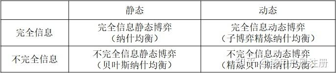
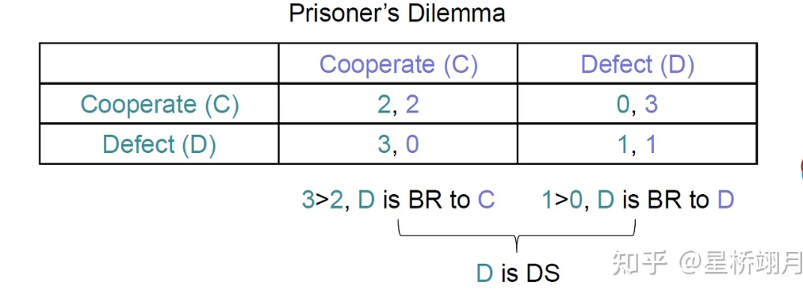

<!--
 * @version:
 * @Author:  StevenJokess（蔡舒起） https://github.com/StevenJokess
 * @Date: 2023-04-23 22:55:04
 * @LastEditors:  StevenJokess（蔡舒起） https://github.com/StevenJokess
 * @LastEditTime: 2023-05-12 23:42:08
 * @Description:
 * @Help me: make friends by a867907127@gmail.com and help me get some “foreign” things or service I need in life; 如有帮助，请赞助，失业3年了。
 * @TODO::
 * @Reference:
-->
# 博弈论基础

## 决策论

决策论（decision theory）结合了概率论和效用理论，为在不确定性下做出个体决策（经济的或其他的）提供了一个形式化完整的框架，也就是说，概率适当地描述了决策者所处的环境。这适用于“大型”经济体，在这种经济体中，每个主体都无须关注其他独立主体的行为。[2]

对“小型”经济体而言更像是一场博弈（game）：一个参与者的行为可以显著影响另一个参与者的效用（积极或消极的）。

## 博弈

博弈一一是指在一定的游戏规则约束下，基于直接相互作用的环境条件，各参与人依据所掌握的信息，选择各自的策略（行动）以实现利益最大化的过程。[7]

例如：剪刀石头布、囚徒困境、寡头垄断（产量决策根据对竞争对手的预期）、

博弈的常见特征：有规则、有结果、策略很重要、策略有相互依赖性（决策结果不仅取决于他们的选择还取决于互动的其他个体的选择）。

### 基本元素

PAPI（by Eric Rasmusen）：

- 博弈的玩家 player
每个玩家在每个决定点可以获得的信息 information
- 每个玩家在每个决定点的行动 action
- 每个结果的收益 payoffs[19]

### 博弈的分类

### 按行动有无顺序

按行动有无顺序，分静态博弈和动态博弈：

- 静态博弈（Static Game）：指参与者同时采取行动，或者尽管参与者行动的采取有先后顺序，但后行动的人不知道先采取行动的人采取的是什么行动。最简单的例子就是石头剪刀布。[19]
- 动态博弈（Dynamic Game）：指参与者的行动有先后顺序，并且后采取行动的人可以知道先采取行动的人所采取的行动。常用逆向归纳法（Backward Induction）求解。[4]

### 从博弈者对其他参与博弈者所了解的信息的完全程度来看

从博弈者对其他参与博弈者所了解的信息的完全程度来看，博弈分为完全信息博弈和不完全信息博弈。信息是博弈论中重要的内容。

- 完全信息博弈指参与者对所有参与者的策略空间及策略组合下的代价有"完全的了解"（知道存在一些随机事件，以及概率），否则是不完全信息博弈。
- 如Chess知道全局所有的信息，而德州扑克各玩家之间是不知道对方的底牌的。
- 严格地讲，完全信息博弈是指参与者的策略空间及策略组合下的支付，是博弈中所有参与者的"公共知识"的博弈。
- 对于不完全信息博弈，参与者所做的是努力使自己的期望支付或期望效用最大化。

> 按各Agent之间的历史动作是否可知，分完美信息博弈和非完美信息博弈：
>
> - 完美信息博弈是指在博弈过程中各方都知道其他Agent之前都有过哪些策略，但无法确定在这一次博弈过程中会采取哪一套策略；如Chess一直可以看到对方是怎么走棋的。完美信息博弈的例子包括井字博弈 Tic-tac-toe 、跳棋 Checkers 、无限象棋 Infinite chess 和围棋 Go 。完美信息博弈已经在组合博弈论 Combinatorial game theory 中得到研究，发展出新颖的表示法，例如超现实数字 Surreal numbers ，以及利用组合和代数（有时是非构造性的）的证明方法来解决特定类型的博弈，包括可能导致无限长移动序列的“环形”博弈。
> - 非完美信息博弈是指双方均不能完全掌握对方之前采取过哪些策略。StarCraft在开局阶段存在战争迷雾，并不知道对方在搞什么。如：扑克和桥牌[19]，西洋双陆棋 Backgammon【你必须在对方完成之前，把所有的十五个棋子送到你的领地去】

> 完美信息和完全信息的区别：
>
> - 完美信息是指了解对方在之前的博弈中都采取过哪些策略（即行为历史），但并不能确定在这一次博弈中到底会采取哪一种策略，只能综合对手之前所有采取过的策略来估测这一次博弈中采取某种策略的概率。（本身就包含了序贯的概念），但不保证你知道其他博弈者的支付矩阵和博弈的结构及其步骤。总结起来就是了解所有历史。
> - 完全信息是指双方都熟知对手在这一次博弈中将会采取什么策略，即能够根据一个State推出对手将采取的各种action（space[21]）及其概率[20]。总结起来就是了解所有当下。；而完美信息推测不出对手将采取的各种action。（info set里只有一个node）
> - 因此，完全信息不一定是完美的，不完全信息**也不一定**是完美的。
> - 非完美但完全信息的例子很普遍，如：囚徒困境。不完全但完美的信息博弈，如：扑克。

> - 在不完全信息博弈中，首先行动的是自然（Nature）。
> - 确定的博弈指的是不存在由自然做出这种行动的博弈，
> - 不确定的博弈：自然决定博弈者以多大的可能性采取某种策略，这个可能性只有本人知道。

> - 对称博弈是每方玩家都有相同的策略、目标和奖励。
> - 非对称博弈是每方玩家都有不同的策略、目标和奖励。[15]

### 综合考虑上面两个角度

综合考虑上面两个角度，可分为正则化博弈、扩展式博弈、贝叶斯博弈、演化博弈：

- 完全信息静态博弈——策略式博弈[5]/正则化博弈（Normal-form Game）：是博弈最基本的形式，多个智能体要同时做出决策的，栗如Prisoner's Dilemma问题
- 完全信息动态博弈——扩展式博弈（Extensive-form Game）：在扩展式博弈中增加了多step/多state的概念，也可以说是有了回合的形式，栗如Chess
- 不完全信息静态博弈——贝叶斯博弈（Bayesian Game）：引入了Incomplete Information（非完全信息），栗如：狼人杀游戏，开局时我们并不知道除自己外其他玩家的身份类型，但是我们知道游戏中共有几种身份，所以我们可以根据自己的先验对其他玩家的身份构建为概率分布，进而可以把问题构建为贝叶斯形式。另一个例子是Auction（拍卖）
- 不完全信息动态博弈——演化博弈（Evolutionary Game）：纳什均衡是静态的，没有对策略的动态进行描述，并且在演化博弈中玩家不是完全理性的。玩家的策略是内在的，并且不能自行选择策略。收益高的玩家有更多的机会生存及繁衍后代（reproduced）。
  - Evolutionary Stable Strategy (ESS)：如果种群中几乎每个成员都遵循一种策略，那么没有突变体(即采用新策略的个体)能够成功入侵，那么这样的种群状态就是ESS。最有名的算法是Replicator Dynamics。[1]

与上述四种博弈相对应的均衡概念为：纳什均衡、子博弈精炼纳什均衡（subgame perfect Nash equilibrium）、贝叶斯纳什均衡、精炼贝叶斯纳什均衡（perfect Bayesian Nash equilibrium）。

- 纳什均衡：纳什均衡被定义为所有参与者的联合策略（策略组合），其中没有一个参与者从该组合的偏离中受益。[22]
- 子博弈精炼纳什均衡（subgame perfect Nash equilibrium）
- 贝叶斯纳什均衡
- 精炼贝叶斯纳什均衡（perfect Bayesian Nash equilibrium）

### 从博弈者之间是否有合作关系看

#### 绝对不合作/严格竞争

- 常和博弈（Constant-Sum Game）：博弈各方的收益和总为一个常数c。
- 零和博弈（Zero-sum Game）：是最常见的“损人利己”情况，自己的收益等于对手的损失，即c为零。
  - 例如：猜硬币、剪刀石头布[13]
- 重要象征意义：胜利者的光荣后往往隐藏着失败者的辛酸和苦涩。一方物质财富的增加意味着对其他的掠夺。[17]

#### 合作不确定

- 变和博弈（Variable-Sum Game）：博弈各方的收益之和不总是一个常数。[14]

##### 正和博弈/合作博弈

- 合作博弈，亦称为正和博弈，是指博弈双方的利益都有所增加，或者至少是一方的利益增加，而另一方的利益不受损害。[16]
  - 其存在的两个基本条件：
  1. 对联盟来说，整体收益大于其每个成员单独经营时的收益之和。
  2. 对联盟内部而言，应存在具有帕累托改进性质的分配规则，即每个成员都能获得不少于不加入联盟时所获的收益。[18]
  - **注意**   合作了，也不一定是合作博弈：合作按照合作之后的收益变化可分为本质性的合作和非本质性的合作。如果合作后收益有所增加，则此合作博弈是本质性的，即存在有净增收益的联盟；如果合作后收益没有增加甚至下降，则为非本质性合作。[16]

特例：

- 收益相同的 —— 绝对合作博弈（Cooperative Game）：在所有结果中，各玩家的收益都是相等的，显然各agent之间是合作关系，所谓“他好我也好”。
- 策略要求相同的——协同博弈（Coordination Game）：存在多于一个稳定点，例如在一条没有划线的路上，对向来车都在路的中间行驶，这个时候双方要进行避让，两车均靠左或均靠右都是稳定点，呈现出的是两车的协同状态，或许是“一荣俱荣，一损俱损”。在这种情况下通常存在多个纳什均衡。

## 策略（Strategies）和收益（Payoffs）

- 策略的定义：在一个博弈中，每个博弈者根据条件做做出的决策称为“策略”。博弈者可以选择的全部策略组成的集合叫做“策略空间”（Strategies Set）
- 收益的定义：博弈中的收益（Payoffs）是博弈者能够从博弈中获得的利益。这个收益可以有很多类型，比如与收入、利润、时间或者是情绪价值等等。

- “有限的策略”（Finite Strategies）：博弈者的策略可数。该博弈的策略和收益的关系可以用收益矩阵、扩展形等方法表示出来。
- “无限的策略”（Infinite Strategies）：博弈者可以选择的策略是不可数的，比如古诺模型（Cournot）中的连续模型（Continuous），该博弈的策略和收益的关系一般用数集或者函数形式表示。

TODO: 差分博弈 Differential games：

- 使用Pontryagin极大值原理 The Pontryagin maximum principle 发现开环策略，
- 使用Bellman动态规划方法 Bellman’s Dynamic Programming 发现闭环策略。

## 博弈均衡与求解

### 博弈解决方案的推理（Game Solution Reasoning）

- 最佳对策 Best Response (BR)：在其他agent的动作都确定下来后，当前agent都在动作空间中，选出的最有利于自己的动作。
  - Given $a_{-i} \in A_1 \times \cdots \times A_{i-1} \times A_{i+1} \times \cdots \times A_n$
  - $a_i$ is best response to $a_{-i} \Leftrightarrow u_i\left(a_i, a_{-i}\right) \geq u_i\left(a_i^{\prime}, a_{-i}\right), \forall a_i{ }^{\prime} \in A_i$

- 个体最优：
  - 占优策略 Dominant Strategy (DS)：无论其他agent采取什么动作，当前agent的动作 a_{i} 都是best response，当然DS可能存在有可能不存在。(>= 号)
  - $a_i$ is dominant strategy Given any $a_{-i}$,$a_i$ is best response
  - 严格占优策略（strictly dominant strategy）：对当前agent来说，若存在一个策略，无论其他agent选择何种行为策略，该策略都是最佳选择，则这个策略就称为是A的严格占优策略。(>号)
  - 注：占优策略的概念是相对于对方所有策略而言的。

- 社会最优：
  - 定义：一组策略选择是社会最优（或社会福利最大化），若它使参与者的回报之和（总收益）最大。[26]

#### 单次发生的囚徒困境

囚徒困境（Prisoner's Dilemma），用收益矩阵（payoff matrix）[5]来表示该博弈，而两边分别表示参与者的不同策略，矩阵中左侧是罪犯1的策略，上侧是罪犯2的策略：

- 囚徒们彼此合作，互相“打掩护”[11]，坚不吐实（not confess），可为全体带来最佳利益（无罪开释），
- 但在无法沟通的情况下，导致了决策的独立性。
- 因为出卖同伙可为自己带来利益（缩短刑期），也因为同伙把自己招出来可为他带来利益，因此彼此出卖虽违反最佳共同利益，反而是自己最大利益所在。

- 更多合作还是背叛的例子：
  - 政治学的军备竞赛【增加军备（背叛）、或是达成削减武器协议（合作）】
  - 体育比赛的“兴奋剂”博弈【服用兴奋剂（背叛）、或是不服用（合作）】
  - 经济学的关税战【增加关税（背叛）、或是达成削减关税协议（合作）】
  - 商业的广告战【增加广告（背叛）、或是达成削减广告协议（合作）】
  - 商业的价格战【更多降价（背叛）、或是达成价格协议（合作）】[11]

#### 纳什均衡

- 通俗地说：给定别人的策略，自己的策略是最优。
- 在上面的囚徒困境中，有单一的纳什均衡—两人都不合作即出卖同伙。
- 纳什均衡的本质就是不后悔
- 通常一个博弈并不一定有一个纳什均衡。有时会不存在纳什均衡，而有时则又有好几个（即几组稳定且自我强化的策略）。
- 应用案例：
  - 生产同种商品的企业，会通过降低售价的价格战去相互抢市场，从而使得产品的销售价格定在成本附近。
  - 垃圾邮件可能带来销售业绩，也可能发太多带来大家的反感，打开率下降，导致收益没法覆盖成本。[27]

> 纳什均衡与占优策略均衡的区别：[23]
> 占优策略均衡是纳什均衡的一个特例，每个博弈方可以不用考虑别人的策略，就可以达到自己的最优（不论对方选什么策略） 。
> 占优策略均衡一定是纳什均衡，纳什均衡不一定是占优策略均衡

#### 多次重复的囚徒困境

在重复的囚徒困境中，博弈被反复地进行。

##### 重复博弈

重复博弈(repeated game)：同样结构的博弈重复多次，其中的每次博弈被称为“阶段博弈”(stage game).

三个特征：

- 阶段博弈之间没有物质上的联系，也就是说，前一阶段的博弈不改变后一阶段的结构；
- 所有参与人观察到博弈过去的历史；
- 参与人的总支付（报酬）是所有阶段博弈支付的贴现值之和

##### 跟单次比，结果出现差异

- 多次重复的囚徒困境和单次发生的囚徒困境的结果不会一样。
- 参与人过去行动的历史是可以观察到的，参与人就可以将自己的选择依赖于其他人之前的行动。
- 比如，每个参与者都有机会去“惩罚”另一个参与者前一回合的不合作行为。

##### 合作的可能性

- 这时，合作可能会作为均衡的结果出现。欺骗的动机这时可能被受到惩罚的威胁所克服，从而可能导向一个较好的、合作的结果。
- 可能性的原因是从背叛行为的收益和成本来考虑，在无限次重复博弈中，当前收益小于等于未来收益的现值，背叛行为是没有好处的。[8]

> 无名氏定理(Folk Theorem)：
> - 在无限次重复博弈中，如果参与人对未来足够重视（ 足够大），那么，任何程度的合作都可以通过一个特定的子博弈精炼纳什均衡得到。
> - 这里“合作程度”定义为整个博弈中合作出现的频率。
> - 50 年代就人所共知，但无人有发明权；[9]

- ##### 有限重复（次数确定）

- 在最后一次会背叛。
- 只要博弈的次数是有限的，合作就不会出现。但如果参与人的类型是不完全信息，只要博弈进行的足够长，合作仍然可能出现。
- 可以利用逆向归纳法（backward induction），即向前展望。前提是各个博弈者要获得充分的信息；或者说，如果某个博弈者所知的信息不够充分，就【无法】运用该方法。例如，[海盗分金币](../../img/Pirate_game.png)。

##### 无限重复（次数不确定）

- 当无限博弈重复没有确定的“终结之日”时，合谋作为纳什均衡就可以维持下去。
- 原因在于，在这样的博弈中，各方是秉持着一种触发策略的，即视对方上一阶段的博弈行为决定自己下一阶段的策略是选择合作还是不合作。且双方从合作开始，如果某一阶段一方采取背叛，那么另一方在下一阶段开始永远用背叛来惩罚他（冷酷策略）。
- 总体来说，双方其实都是从“以牙还牙”（Tit-for-tat）策略（Axelrod (1984)证明最佳）出发考虑的，从合作开始，在以后每天（每个阶段）里，如果对方选择合作，那你继续和他合作。如果对方在某一阶段采取背叛策略，则你在随后阶段也采取背叛策略来报复他。

这需要有四个前提：

- 有能力监督对手的行动；
- 有惩罚叛徒的能力和名声；
- 低利率；
- 在未来进行博弈的机会多。

#### 帕累托改进和帕累托最优

- 帕累托改进：通俗来说，在没有人变得不好的前提下让有些人更好。[25]
  - 假定固有的一群人和可分配的资源，从一种分配状态到另一种状态的变化中，在没有使任何人境况变坏的前提下，使得至少一个人变得更好。
  - 假设A和B两人手上各有一只橘子，A只想用橘子皮泡水喝，B只想吃它的果肉，所以对于A来说，橘子皮是有用的，果肉没用，对于B来说，果肉是有用的，橘子皮没用。于是他们商量后决定把自己没用的那部分相互交换，这样A就能得到两份橘子皮，B能得到两份果肉，两人都比之前多了一倍。

- 帕累托最优(Pareto Optimality)，也称为帕累托效率(Pareto efficiency)，是指资源分配的一种理想状态。[4]
  - 帕累托最优状态就是不可能再有更多的帕累托改进的余地；换句话说，帕累托改进是达到帕累托最优的路径和方法。[24]
  - 社会最优也一定会是帕累托最优。

> - 卡尔多-希克斯改进(Kaldor-Hicksim Provement)：在达到帕累托最优后，如果还要进一步改进，就不得不牺牲一部分人利益来换取集体更大的利益的过程[25]。
>   - 应用案例：
>     1. 国家的宏观改革——改革开放：
>     - 允许让一部分人先富起来；大力发展东部沿海城市：人为压低中西部各类资源要素价格如农产品、矿产品等，用以支持东部沿海制造业发展。
>     - 先富带动后富，共同富裕：“劫富济贫”能使社会的总福利更高，因为对富人来讲，100元九牛一毛，但是对穷人来讲就很重要，他可以饱餐一顿或者买些生活必需品，顺带还能促进一下消费。
>   - 缺点：
>     1. 凭什么去牺牲？难道为了增加集体的利益牺牲掉一部分人的利益是理所当然的？**受益者所得需要至少去补偿受损者的所失！！！**
>     1. 难度量：受益和受损如何裁定和量化，能量化的只是物质部分。精神难量化！分蛋糕，你的幸福感是提高了，但我的幸福感却越来越低，最终就会“冰火两重天”。
>     1. 实践难：在实践中会存在不少弊端，比如缺乏对人性的考量、对道德的判断，对福利的度量等。

#### 纳什均衡 VS 帕累托最优

- 纳什均衡：这是一个第一人称视角的状态。在这种状态下，首先分析我自己。因为无论使用什么策略我都不能使自己的效用更高，所以我不在意我使用各种策略时对别人的影响。因为我已经达到了我的最优，我也无意去伤害别人。如果每个人都达到了和我一样的状态，那么这种状态就叫纳什均衡。
- 帕累托最优： 这是一个第三人称视角（上帝视角）的状态。假设我是上帝，我有能力让游戏里每个玩家都听从我的安排去选择策略。我的任务是使得每个玩家个人效用在给定条件下达到最大化，于是在我给每个人安排策略的过程中，免不了会出现一种状态，这种状态即是如果我想让一个人效用更加大一些，那么至少另外一个人的效用会降低。在我不同的策略安排下，会存在不同的帕累托最优状态。对于每个玩家来说，他没法去反抗我的安排，但他可能会有去伤害别人来提高自己效用的动机。
- 作为反复接近无限的数量，纳什均衡趋向于帕雷托最优。
- 帕累托最优可以是合作博弈，而纳什均衡只能是非合作博弈。

### 博弈解决方案的重要概念：

纳什均衡（Nash Equilibrium）：

- Definition：A joint strategy (or strategy profile) $a \in A$ is a Nash Equilibrium $\Leftrightarrow a_i$ is best response to $a_{-i}$ holds for every player $i$
- 纳什均衡是一个稳定的点，在这个点上所有的玩家都没有动力去改变自己的策略。（当然纳什均衡点也可能不存在）。
- 纳什均衡只从一个玩家的角度出发，该玩家的策略发生改变时（无论何种改变）都无法使自己的收益更高（变得更好），当所有的玩家都是这样的状态时，这样的策略组合就是纳什均衡点。

纳什均衡（NE表示）：策略组合是一个集合，该集合包含每个参与人的一个已选策略，用S1* S2一直到SM表示。 NE是满足以下条件：对于任意此集合内的参与人I，她所选择的策略Si*，是其他参与人所选策略的最佳对策

理性人未必总选择纳什均衡。

纳什均衡的动机：一旦到达纳什均衡，若其他人一定不改变，自己的改变一定是不利的。

纳什均衡可以被视为自我实施的信念

有些情况下，博弈结果会不断趋近于纳什均衡（初始状态影响结果）

纳什均衡本身具有强制力，因为符合自身利益

计算纳什均衡方法：

找到两个玩家针对另一个玩家的最佳对策

剔除劣势策略和非最佳策略，重新第一步

寻找最佳策略交点

严格劣势策略无法达成纳什均衡

## 博弈的求解方法：

###

基于No regret learning in Extensive form Game有很著名的CFR和应用：

Counterfactual Regret Minimization (CFR)

DeepStack for Texas Hold’em poker

## 应用

[1]: https://zhuanlan.zhihu.com/p/427303297
[2]: https://ticket-assets.baai.ac.cn/uploads/%E3%80%8A%E4%BA%BA%E5%B7%A5%E6%99%BA%E8%83%BD%EF%BC%9A%E7%8E%B0%E4%BB%A3%E6%96%B9%E6%B3%95%EF%BC%88%E7%AC%AC4%E7%89%88%EF%BC%89%E3%80%8B%E6%A0%B7%E7%AB%A0.pdf
[3]: https://program-think.medium.com/%E5%8D%9A%E5%BC%88%E8%AE%BA%E5%85%A5%E9%97%A8%E6%95%99%E7%A8%8B-%E4%BB%8E%E5%9F%BA%E6%9C%AC%E6%A6%82%E5%BF%B5%E5%88%B0%E5%85%B7%E4%BD%93%E6%A1%88%E4%BE%8B-2d0e54294318
[4]: https://zhuanlan.zhihu.com/p/78373209
[5]: https://www.zhihu.com/column/c_1255623490327375872
[6]: https://program-think.blogspot.com/2019/04/996-Working-Hour-System.html
[7]: https://www.youtube.com/watch?v=J8fjBHJeifQ
[8]: https://wwwtest.snai.edu/xwzxVS/info_653.aspx?itemid=31098
[9]: http://jpk.pku.edu.cn/course/byysh/files/ppt/ch6.pdf
[10]: https://wwwtest.snai.edu/xwzxVS/info_653.aspx?itemid=31098
[11]: https://www.zhihu.com/column/c_1433451782463078400
[12]: https://zhuanlan.zhihu.com/p/422553441
[13]: https://zhuanlan.zhihu.com/p/422905899

[14]: https://zhuanlan.zhihu.com/p/423175693
[15]: https://blog.csdn.net/cf2SudS8x8F0v/article/details/79102339
[16]: https://baike.baidu.com/item/%E5%90%88%E4%BD%9C%E5%8D%9A%E5%BC%88/554635#:~:text=%E5%90%88%E4%BD%9C%E5%8D%9A%E5%BC%88%E6%98%AF%E6%8C%87%E4%B8%80%E4%BA%9B,%E5%88%A9%E7%9B%8A%E6%9C%89%E6%89%80%E5%A2%9E%E5%8A%A0%E7%9A%84%E3%80%82
[17]: https://baike.baidu.com/item/%E9%9B%B6%E5%92%8C%E5%8D%9A%E5%BC%88/3562463
[18]: https://baike.baidu.com/item/%E5%90%88%E4%BD%9C%E5%8D%9A%E5%BC%88/554635
[19]: https://swarma.org/?p=23962
[20]: https://www.zhihu.com/question/57529962/answer/153365291
[21]: https://www.zhihu.com/question/57529962/answer/153400564
[22]: https://www.zhihu.com/question/30163532/answer/2356671861
[23]: https://zhuanlan.zhihu.com/p/496461249
[24]: https://baike.baidu.com/item/%E5%B8%95%E7%B4%AF%E6%89%98%E6%9C%80%E4%BC%98/1768788
[25]: https://zhuanlan.zhihu.com/p/465332477
[26]: http://www.guob.org/course/comss32.pdf
[27]: https://zhuanlan.zhihu.com/p/396395706
