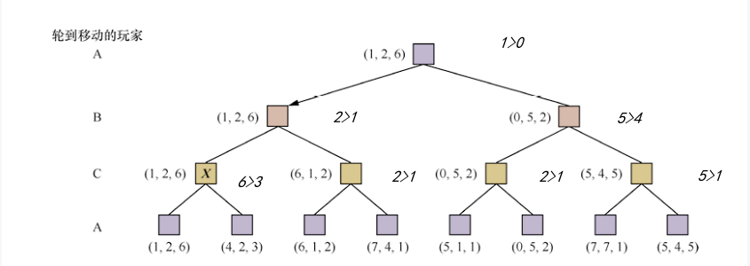

<!--
 * @version:
 * @Author:  StevenJokess（蔡舒起） https://github.com/StevenJokess
 * @Date: 2023-04-16 20:28:07
 * @LastEditors:  StevenJokess（蔡舒起） https://github.com/StevenJokess
 * @LastEditTime: 2023-04-16 20:50:18
 * @Description:
 * @Help me: make friends by a867907127@gmail.com and help me get some “foreign” things or service I need in life; 如有帮助，请赞助，失业3年了。
 * @TODO::
 * @Reference:
-->
# 博弈论进阶

## 多人博弈中的最优决策

许多流行游戏都允许多个玩家参与。让我们来看看如何将极小化极大思想推广到多人博弈中。从技术角度来看，这很自然，但是也产生了一些有趣的新的概念上的问题。

### 用向量建模

首先，我们需要将每个节点的单一值替换为值向量。例如，在玩家A、B和C参与的3人博弈中，每个节点都与一个向量 $<v_A, v_B, v_C>$ 相关联。对于终止状态，这一向量表示每个玩家各自在该状态得到的效用值。（在双人零和博弈中，二元向量可以简化为一个值，因为两个值总是互为相反数。）最简单的实现方法是让Utility函数返回效用值向量。

### 各自取Max

现在我们要考虑非终止状态。考虑图5-4的博弈树中标为X的节点。此时，轮到玩家C选择如何移动。两种选择产生了效用值向量分别为 $<v_A=1, v_B=2, v_C=6$ 和 $<v_A=4, v_B=2, v_C=3$ 的两种终止状态，因为6大于3，所以C应该选择第一种移动。这意味着，如果到达状态X，后续的博弈将产生效用值为 $<v_A=1, v_B=2, v_C=6$ 的终止状态。因此，这个向量就是X的倒推值。一般地，节点n的倒推值是对在该点进行选择的玩家来说效用值最大的后继状态的效用值向量。

### 还有联盟！

任何参与多人博弈（如Diplomacy或Settlers of Catan游戏）的参与者都会很快意识到，比起双人博弈，多人博弈要复杂得多。多人博弈通常涉及参与者之间的**正式或非正式联盟(alliance)**。联盟会随着博弈的发展建立和瓦解。我们如何理解这种行为？联盟是多人博弈中每个参与者都按照最优策略行动的自然结果吗？事实证明的确如此。

#### 联盟OR背叛？

例如，假设现在A和B处于弱势，而C处于强势。那么，对A和B来说，**最理想的做法往往是一起攻击C，而不是彼此攻击，以免C对它们逐个消灭。**这样的话，合作其实产生于纯粹的自私行为。当然，一旦C在联合攻击下被削弱，联盟就失去了价值，A或B都有可能违反协议。

在某些情况下，显式联盟只是将无论如何都会发生的事情具体化。而在其他情况下，破坏联盟会被记录为社会污点，所以参与者必须权衡破坏联盟所带来的即时优势和失去信任所造成的长期劣势。有关这些复杂问题的更多讨论，详见[2]

#### 双人也可联盟

如果博弈不是零和博弈，那么在只有两个参与者时，合作也可能发生。例如，假设存在一个效用值为 $<v_A=1000,v_B=1000$ 的终止状态，并且每个参与者最高的可能效用值也是1000。那么最优策略是双方都尽一切可能到达该状态，也就是说，参与者会自动合作以实现共同的期望目标。

[1]: https://weread.qq.com/web/reader/fc332020813ab7942g0102adk70e32fb021170efdf2eca12
[2]: https://weread.qq.com/web/reader/fc332020813ab7942g0102adk341323f021e34173cb3824c
