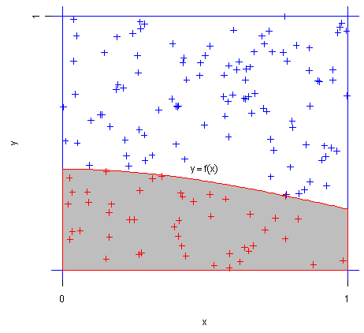
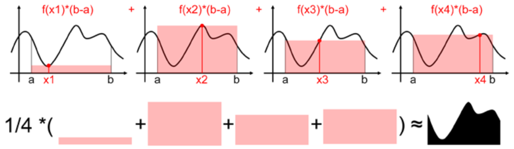

<!--
 * @version:
 * @Author:  StevenJokess（蔡舒起） https://github.com/StevenJokess
 * @Date: 2023-03-20 00:37:16
 * @LastEditors:  StevenJokess（蔡舒起） https://github.com/StevenJokess
 * @LastEditTime: 2023-04-08 22:33:29
 * @Description:
 * @Help me: 如有帮助，请赞助，失业3年了。
 * @TODO::
 * @Reference:
-->
# 数值计算

数值分析并没有在我们那张人工智能基础数学地图上，而当代计算主要不是用手算出来的，如何连接计算机和数学各大分支就变成了重要中的重要。[8]

数值计算是一种利用数学方法和计算机算法求解数学问题的方法。

数值分析的目的是设计及分析一些计算的方式，可针对一些问题得到近似但够精确的结果。

它主要涉及数学模型的离散化、数值方法的构造和计算机程序的设计等方面。数值计算广泛应用于科学计算、工程设计、金融分析等各个领域。在数值计算中，常见的问题包括求解线性和非线性方程、求解常微分方程和偏微分方程、最优化问题、插值和拟合等。为了解决这些问题，数值计算使用了各种数学和计算机科学的工具和方法，比如差分和积分、矩阵计算、梯度下降等。数值计算的发展和应用对于推动科学技术的发展和提高计算机科学的水平具有重要意义。

- 教学大纲[1]
- 基础概念[2]

## 求定积分

以 $\int_{0}^{1}x^{2}dx$ 积分为例，求定积分

```py
import numpy as np
import random
import time


def integral():   # 直接数值积分
    integral_value = 0
    for x in np.arange(0, 1, 1/10**7):
        integral_value = integral_value + x**2*(1/10**7)   # 对x^2在0和1之间积分
    return integral_value
```

## 蒙特卡洛方法

> 因为作者之一乌拉姆的叔叔经常在摩纳哥的蒙特卡罗赌场输钱得名。[9]
>
蒙特卡洛(monte carlo，简称MC)方法，也称为统计模拟方法，是1940年代中期由于科学技术的发展和电子计算机的发明，而提出的一种以概率统计理论为指导的数值计算方法。[3]

蒙特卡洛方法就是通过大量的随机样本来估算或近似真实值，比如近似估算圆的面经、近似定积分、近似期望、近似随机梯度。

下面以求定积分介绍蒙特卡洛方法。

### 蒙特卡洛求定积分：投点法



红点占所有点的比例，乘方形面积，就是函数f(x)的积分值。

$\int_a^b f(x) d x=\frac{N}{T} \times(b-a) \times c$

其中N为红点数，T为总点数。[9]

```py
def MC_1():  # 蒙特卡洛求定积分1：投点法
    n = 10**7
    x_min, x_max = 0.0, 1.0
    y_min, y_max = 0.0, 1.0
    count = 0
    for i in range(0, n):
        x = random.uniform(x_min, x_max)
        y = random.uniform(y_min, y_max)
        # x*x > y，表示该点位于曲线的下面。所求的积分值即为曲线下方的面积与正方形面积的比。
        if x * x > y:
            count += 1
    integral_value = count / n
    return integral_value
```

### 蒙特卡洛求定积分：期望法

#### 随机采样 4 个点



如上图，我们可以通过随机采样 4 个点，然后类似求矩形面积那样(底x高)，从而用 4 个面积 $f(x_i)(b-a)$ 的平均值，即四个面积之和除以四，来估算定积分 $\int_a^b f(x) d x$ 的值。

#### 随机采样 N 个点

为让对面积的估算更准确，我们可以取更多的点，比如 $N$ ，则定积分可用下面的求和公式估计:

$$
\bar{E} \approx (b-a) \frac{1}{N} \sum_{i=1}^N f\left(X_i\right)
$$

这样估算的根据来源于下面的公式，而该公式可由“强大数定律”证明（具体证明，见附录）得：

$$
P \left(\lim _{N \rightarrow \infty} \frac{1}{N} \sum_{i=1}^N g\left(X_i\right)=\int_a^b f(x) d x\right)=1
$$

其中, $g(X_i)= \begin{cases}\frac{f(X_i)}{p(X_i)} & \text { if } p(X_i) \neq 0 \\ 0 & \text { if } p(X_i)=0\end{cases}$ ，$p(x)$ 代表的是概率密度函数pdf (probability density function)。 也就是说在 $p(x)$ 的分布下, 抽取 $x$ 样本, 当 $N$ 足够大时, 可以采用 $g(x_i)$ 的均值来近似 $f(x)$ 的积分：

$$
\int_a^b f(x) d x \approx \frac{g\left(x_1\right)+g\left(x_2\right)+\ldots+g\left(x_N\right)}{N}
$$

```py
def MC_2():  # 蒙特卡洛求定积分2：期望法
    n = 10**7
    x_min, x_max = 0.0, 1.0 # x_min是a, x_max是b
    integral_value = 0
    for i in range(n):
        x = random.uniform(x_min, x_max)
        integral_value = integral_value + (1-0)*x**2
    integral_value = integral_value/n
    return integral_value
```

#### 关于图片特例 N = 4 的解释

可见，以上图片的例子就是选取了均匀分布的情况，均匀分布的概率密度分布函数 $p(x)=\left\{\begin{array}{ll}\frac{1}{b-a} & , x \in[a, b] \\ 0 &,x \notin [a, b] \end{array}\right.$

$$
\bar{E} \approx   \frac{1}{N} \sum_{i=1}^N g\left(X_i\right) = \frac{1}{N} \sum_{i=1}^N [f\left(X_i\right) * (b-a)] = (b-a) \frac{1}{N} \sum_{i=1}^N f\left(X_i\right)
$$

#### 附录：公式的证明

对于连续随机变量 $X$ ，其概率密度函数pdf (probability density function)为 $p(x)$ ，期望为 $E[X]=\int_{-\infty}^{\infty} x p(x) d x$，

设 $f(x)=g(x)p(x)$，得 $f(x)$ 在 $[a,b]$ 的定积分 $\int_a^b f(x) d x=\int_a^b g(x) p(x) d x=E_{x \sim f_X(x)}\left[g(x)\right]$，等式右侧为随机变量$g(X_i)$ 的公共均值，设为 $\mu_g$。

> 强大数定律[7]：设 $X_1, X_2, \ldots$ 为一独立同分布的随机变量序列，其公共均值 $\mu=E\left[X_i\right]$ 有限，则下式以概率1成立:
> $$
> \frac{X_1+X_2+\ldots X_n}{n} \rightarrow \mu, \quad n \rightarrow \infty
> $$
> 即强大数定律可以表达为下式:
> $$
> P\left\{\lim _{n \rightarrow \infty} \frac{X_1+X_2+\ldots+X_n}{n}=\mu\right\}=1
> $$

TODO:

$g(X_n)$ 同分布？独立？

由大数定律，

当$g(X_1), g(X_2), \ldots$ 为一独立同分布的随机变量序列，其公共均值 $\mu_g=E\left[g(X_i)\right]$ 有限，则

> $$
> P\left\{\lim _{n \rightarrow \infty} \frac{g(X_1)+g(X_2)+\ldots+g(X_n)}{n}=\mu_g\right\}=1
> $$


#### 重要性采样

一般来说用均匀分布采样，来计算的效率不会高, 需要另外选取一个合理的分布提高计算效率，例如高斯函数在峰值附近积分贡献比较多，应该 赋予更多的采样。这个技术叫做“重要性采样” (importance sampling)。均匀分布、高斯分布、Gamma分布等都属于简单分布采样（或者概率分布采样）。

如果是采用比较复杂的分布 $p\left(X_i\right)$, 即使已知该分布, 很难直接获取符合该分布的样本 $\left\{x_1, x_2, \ldots, x_N\right\}$, 这时候需要使用“接受-拒绝采样”、“马尔科夫链-蒙特卡洛 (MCMC) 采样”、“MetropolisHastings (M-H)采样”、“Gibbs采样”等方法。

## 三者方法比较：

Python代码[5]如下（）：


```py
print('【计算时间】')
start_clock = time.perf_counter()  # 或者用time.clock()
a00 = 1/3  # 理论值
end_clock = time.perf_counter()
print('理论值（解析）：', end_clock-start_clock)
start_clock = time.perf_counter()
a0 = integral()  # 直接数值积分
end_clock = time.perf_counter()
print('直接数值积分：', end_clock-start_clock)
start_clock = time.perf_counter()
a1 = MC_1()  # 用蒙特卡洛求积分投点法
end_clock = time.perf_counter()
print('用蒙特卡洛求积分_投点法：', end_clock-start_clock)
start_clock = time.perf_counter()
a2 = MC_2()
end_clock = time.perf_counter()
print('用蒙特卡洛求积分_期望法：', end_clock-start_clock, '\n')

print('【计算结果】')
print('理论值（解析）：', a00)
print('直接数值积分：', a0)
print('用蒙特卡洛求积分_投点法：', a1)
print('用蒙特卡洛求积分_期望法：', a2, '\n')

print('【计算误差】')
print('理论值（解析）：', 0)
print('直接数值积分：', abs(a0-1/3))
print('用蒙特卡洛求积分_投点法：', abs(a1-1/3))
print('用蒙特卡洛求积分_期望法：', abs(a2-1/3))
```

---

## 迭代法

迭代法是通过从一个初始估计出发寻找一系列近似解来解决问题的数学过程。和直接法不同，用迭代法求解问题时，其步骤没有固定的次数，而且只能求得问题的近似解，所找到的一系列近似解会收敛到问题的精确解。会利用审敛法来判别所得到的近似解是否会收敛。[6]

## 一般迭代法

一般迭代法是数值计算中常用的迭代求解方法之一。它适用于求解各种数学模型中的非线性方程、优化问题等。一般迭代法的基本思想是从一个初始点出发，通过不断地迭代更新逐步逼近问题的最优解或者稳定状态。在每次迭代过程中，可以根据问题的特点采用不同的迭代方式，例如简单迭代、牛顿迭代等。

TODO:https://juejin.cn/post/6844904105849126926


[1]: https://i.study.uestc.edu.cn/NumericalAnalysis/menu/teaching-programme
[2]: https://abelsu7.top/2018/10/31/math-analysis/#1-9-%E5%90%91%E9%87%8F%E8%8C%83%E6%95%B0-%E7%9F%A9%E9%98%B5%E8%8C%83%E6%95%B0
[3]: https://zh.wikipedia.org/wiki/%E8%92%99%E5%9C%B0%E5%8D%A1%E7%BE%85%E6%96%B9%E6%B3%95
[4]: https://blog.csdn.net/v_JULY_v/article/details/128965854
[5]: https://www.guanjihuan.com/archives/1145
[6]: https://baike.baidu.com/item/%E6%95%B0%E5%80%BC%E6%B3%95/5331680
[7]: https://baike.baidu.com/item/%E5%BC%BA%E5%A4%A7%E6%95%B0%E5%AE%9A%E5%BE%8B/18913315
[8]: https://face2ai.com/Math-Numerical-Analysis-0-0-Introduction/
[9]: https://www.bilibili.com/video/BV1hV4y1Q7TR/?spm_id_from=333.337.search-card.all.click&vd_source=bca0a3605754a98491958094024e5fe3


---


> https://chat.openai.com/chat ;Prompt:数值计算，简介；数值计算里【一般迭代法】
