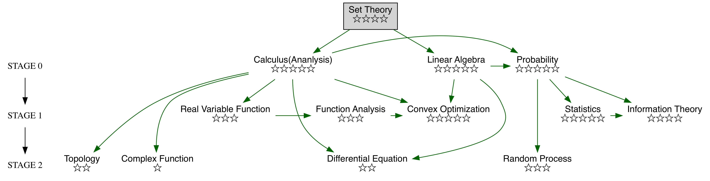

<!--
 * @version:
 * @Author:  StevenJokess（蔡舒起） https://github.com/StevenJokess
 * @Date: 2023-04-02 17:22:18
 * @LastEditors:  StevenJokess（蔡舒起） https://github.com/StevenJokess
 * @LastEditTime: 2023-05-25 00:38:19
 * @Description:
 * @Help me: make friends by a867907127@gmail.com and help me get some “foreign” things or service I need in life; 如有帮助，请赞助，失业3年了。
 * @TODO::
 * @Reference:
-->
# 介绍

在学习的过程中，需要最多的基础知识就是线性代数和概率统计。线性代数中的矩阵实际上就是一种映射，用于表示线性变换，很符合神经网络的表示，且机器学习中的特征都是以矩阵的形式输入，而矩阵的计算速度是远超循环方式的计算速度的。概率统计是优化算法的理论基石，因为机器学习中本身就有很多不确定性和随机性，需要通过概率论的理论基础来解释或者推导算法的正确性和可行性。

[1]: https://zhuanlan.zhihu.com/p/473225242
