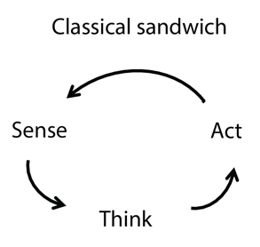

<!--
 * @version:
 * @Author:  StevenJokess（蔡舒起） https://github.com/StevenJokess
 * @Date: 2023-04-09 21:56:25
 * @LastEditors:  StevenJokess（蔡舒起） https://github.com/StevenJokess
 * @LastEditTime: 2023-04-14 02:22:13
 * @Description:
 * @Help me: make friends by a867907127@gmail.com and help me get some “foreign” things or service I need in life; 如有帮助，请赞助，失业3年了。
 * @TODO::
 * @Reference:
-->
# 认知科学

## 认知科学与人工智能的诞生

此同时的美国，计算机建模的发展导致了认知科学（cognitive science）领域的诞生。这个领域可以说是开始于1956 年9 月麻省理工学院的一次研讨会上，并且仅仅两个月后，人工智能本身就“诞生”了。

在研讨会上，乔治·米勒（George Miller）发表了“The Magic Number Seven”，诺姆·乔姆斯基（Noam Chomsky）发表了“Three Models of Language”，艾伦·纽厄尔和赫伯特·西蒙发表了“The Logic Theory Machine”。这 3 篇影响广泛的论文分别展示了如何使用计算机模型处理记忆、语言和逻辑思维的心理学问题。现在心理学家普遍认为“认知理论应该就像一个计算机程序”（Anderson, 1980），也就是说，认知理论应该从信息处理的角度来描述认知功能的运作。

为了综述目的，我们将人机交互（human-computer interaction，HCI）领域归于心理学下。人
机交互的先驱之一道格·恩格巴特（Doug Engelbart）倡导智能增强（intelligence augmentation）的
理念（IA 而非AI）。他认为，计算机应该增强人类的能力，而不是完全自动化人类的任务。1968 年，
在恩格巴特的“所有演示之母”（mother of all demos）上首次展示了计算机鼠标、窗口系统、超文本
和视频会议，所有这些都是为了展示人类知识工作者可以通过某些智能增强来共同完成工作。
今天，我们更倾向于将IA 和AI 视为同一枚硬币的两面，前者强调人类控制，而后者强调
机器的智能行为，都是机器有利于人类所必需的。

## 具身认知与强化学习

古典认知科学中的三明治模型（sandwich theory）认为，由智能驱动的认知过程可以视作一个由感知、思考、和动作（sense-think-act）这 3 个独立的元素所构成的回路[1]（图 1.3），通常人们主要关注的是其中的 Think，却有意无意的将另外两部分弱化。而具身认知（Embodied cognition）认为，人的认知过程无法脱离身体而进行，推广开来，整个环境和个体的行为同样是认知的重要组成部分，个体（agent）通过感知外部环境，产生思想并通过计算后，生成相应动作与环境交互，以此改变和影响环境，这个过程周而复始，这就是智能。

地球上的动物经历了几亿年的演化（Evolution）而表现出了显著的具身智能，这使得它们能够在复杂的环境中生存、学习，并与其他个体、其他物种和环境进行交互。在行动中，动物为了趋利避害往往会更加频繁的采取对自己有利的行为策略。经过一段时间的学习之后，这些行为被强化（reinforce），甚至变成习惯而固定下来，这种学习方式称为强化学习（Reinforcement Learning）。 在强化学习中，智能体不断与环境进行交互并得到反馈（Feedback），通过试错（trial-and-error）的方式去总结哪些行动可能会带来更好的收益（Reward），以便于更好的适应环境。如果我们把时间尺度放大，在个体的强化学习之外，自然或环境本身还会提供一种优化算法，即通过自然选择筛选种群，并通过基因突变来避免陷入局部极值点。

基于具身认知, 李飞飞团队提出了一个同时包含这两者的计算框架，称为深度进化强化学习（Deep Evolutionary Reinforcement Learning, DERL）。在该框架下，智能体可以在多个复杂环境中执行不同的任务。在这项研究中创建的具身智能体可以在平地、多变地形等不同环境中执行巡视、导航、避障、探索、逃脱、爬坡、推箱子和控球等多种不同的任务（图 1.4）。DERL 为计算机模拟实验中大规模具身智能体的创建打开了一扇门，这有助于获得有关学习和进化如何协作以在环境复杂性，形态智能以及控制的可学习性之间建立复杂关系的科学见解。此外，DERL 还减少了强化学习的样本低效性的情况。智能体的创建不仅具有所需使用的数据更少的优势，而且还可以泛化解决其他多种形式的新任务。

无独有偶，DeepMind 团队也进行了相似的研究[4]，通过自动生成大量不同的环境和游戏目标，智能体可以接受各种各样任务的训练（图 1.5），在大规模的开放（Open-Ended）环境中，智能体甚至学会了举一反三，做到了现有深度神经网络难以做到的零样本学习（Zero-Shot Learning）。强化学习和进化对于具身智能体和通用智能的重要性可见一斑。

具身智能体的一个显著特征是可以利用不同的感觉器官获取环境的信息进行整合，并执行多种不同的任务。例如，动物们可以通过视觉、听觉、触觉等不同的感官获取环境信息，并进行觅食、逃跑、迁徙等等。而当前的人工智能大多只能执行非常单一的或者少数任务，即便是 DeepMind 宣称的可以执行几百万种不同任务的智能体，仍然有具体任务相似性太高的缺陷。与之形成鲜明对比的是，生物智能体能够执行的任务种类要多得多，并且通常涵盖多种不同的认知功能。在认知科学中，我们经常通过不同的任务范式去研究人类智能的一些特征甚至缺陷。这些任务范式通常是为了特定实验目的定制的，然而其中的一些单一任务对于目前的人工智能而言仍然有一定的难度，更不用说让智能体同时完成多种任务。

[1]: https://www.ncsti.gov.cn/kcfw/kchzhsh/2021yjqyrdzs/yjqyrdzs2021_xgxx/202203/P020220323629836767560.pdf
