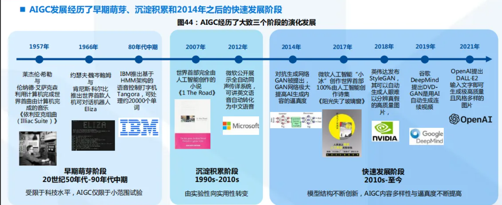

<!--
 * @version:
 * @Author:  StevenJokess（蔡舒起） https://github.com/StevenJokess
 * @Date: 2023-11-06 10:12:33
 * @LastEditors:  StevenJokess（蔡舒起） https://github.com/StevenJokess
 * @LastEditTime: 2023-11-06 10:29:52
 * @Description:
 * @Help me: make friends by a867907127@gmail.com and help me get some “foreign” things or service I need in life; 如有帮助，请资助，失业3年了。
 * @TODO::
 * @Reference:
-->
# AIGC

## 简介

AIGC全程为AI-Generated Content，人工智能生成内容，是继专业生成内容（PGC， Professional Generate Content）和用户生成内容（UGC，User Generate Content） 之后，利用AI自动生成内容的新型生产方式。传统AI大多属于分析式AI，对已有数 据进行分析并应用于相应领域。以AIGC为典型的生成式AI不在局限于分析固有数据， 而是基于训练数据和算法模型自主生成创造新的文本、3D、视频等各种形式的内容。

历经三阶段迭代，AIGC现已进入快速发展阶段：

（1）早期萌芽阶段（1950s-1990s），受限于科技水平及高昂的系统成本，AIGC 仅限于小范围实验。
（2）沉淀积累阶段（1990s-2010s），AIGC开始从实验性向实用性逐渐转变。但 由于其受限于算法瓶颈，完成创作能力有限，应用领域仍具有局限性；
（3）快速发展阶段（2010s-至今），GAN（Generative Adversarial Network,生成 式对抗网络）等深度学习算法的提出和不断迭代推动了AIGC技术的快速发展，生成 内容更加多元化。[1]

[1]: https://www.51cto.com/article/743197.html
