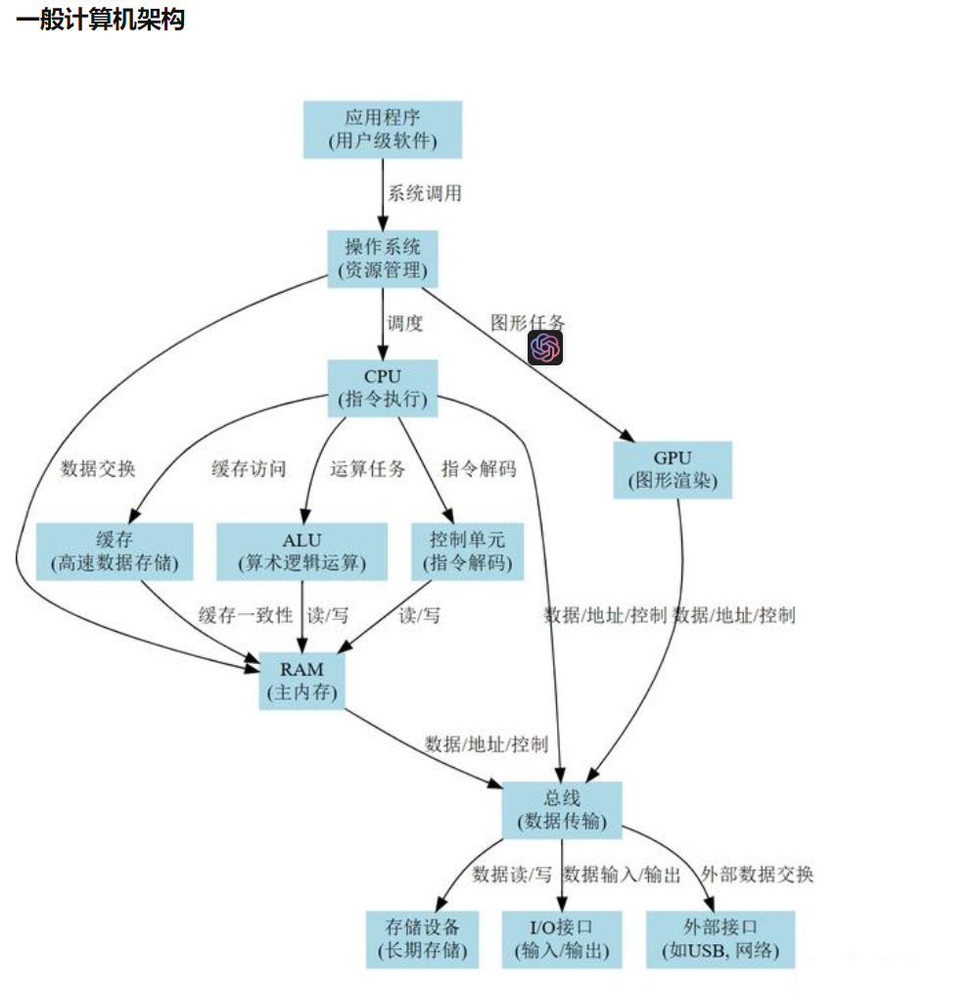
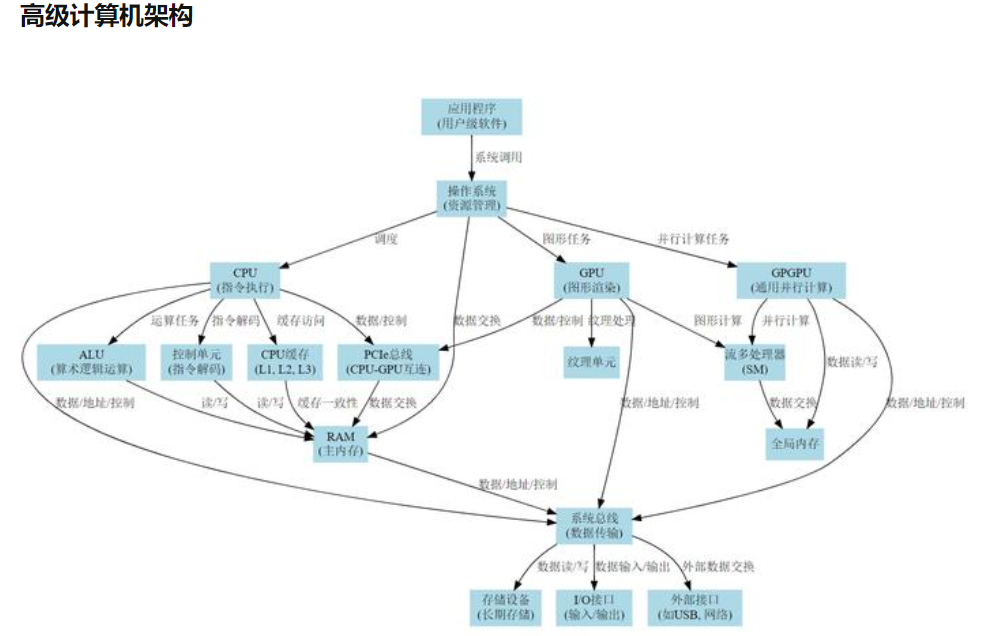
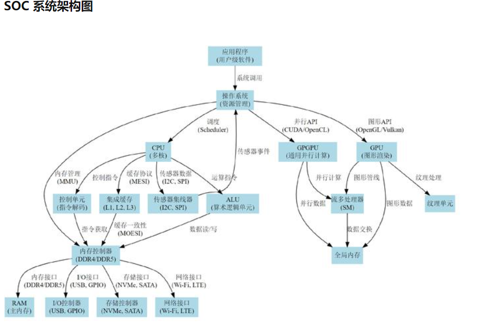

# GPU

## 在各个架构的作用





## GPU体系结构

### 原理

- 流处理器（Shader Cores）: 执行算术和逻辑运算。
- 纹理单元（Texture Units）: 负责纹理映射。
- ROPs（Render Output Units）: 负责像素输出。
- 内存控制器: 管理对显存（VRAM）的访问。
- 缓存: 用于临时存储数据，提高数据访问速度。

### 具体应用

1. 图形渲染: 游戏、3D模拟等。
1. 数据分析: 大数据处理、机器学习。
1. 科学计算: 物理模拟、生物信息学。

### 注意事项

1. 内存管理: 避免显存溢出。
1. 并行优化: 有效利用流处理器。
1. 兼容性: 注意硬件和软件的兼容性。

### 经典用例

1. NVIDIA CUDA: 用于通用并行计算。
1. AMD OpenCL: 开放计算语言，用于异构系统。
1. NVIDIA GPU架构

## NVIDIA CUDA：用于通用并行计算

### 原理

- CUDA（Compute Unified Device Architecture）: 是NVIDIA推出的一种通用并行计算框架。
- 核心概念: CUDA将GPU视为一个高性能的计算设备，而不仅仅是一个图形渲染设备。
- 并行模型: CUDA使用线程块（Thread Blocks）和网格（Grids）的概念来组织并行计算。

### 具体应用

1. 科学计算: 如流体动力学模拟。
1. 数据分析: 如深度学习模型训练。
1. 图像处理: 如图像分割、图像识别。

### 注意事项

1. 版本兼容性: CUDA版本和NVIDIA驱动版本需要匹配。
1. 资源限制: 每个线程块和网格有资源限制（如共享内存大小、线程数等）。
1. 错误处理: CUDA函数调用可能会失败，需要进行错误检查。

### 经典用例

1. 矩阵乘法: 使用CUDA进行大规模矩阵乘法。
1. 图像滤波: 使用CUDA进行图像滤波操作。

相关详细注释代码解析

```cpp
// CUDA 矩阵乘法示例
__global__ void matMul(float *A, float *B, float *C, int N) {
  // 计算当前线程应处理的矩阵C的行和列索引
  int row = blockIdx.y * blockDim.y + threadIdx.y; // 计算行索引
  int col = blockIdx.x * blockDim.x + threadIdx.x; // 计算列索引

  // 检查索引是否在矩阵的范围内
  if(row < N && col < N) {
    // 初始化累加器变量val，用于存储矩阵C的元素值
    float val = 0.0;

    // 遍历矩阵A的当前行和矩阵B的当前列
    for(int k = 0; k < N; ++k) {
      // 执行乘法和加法运算，累加到val中
      val += A[row * N + k] * B[k * N + col];
    }

    // 将计算结果存储到矩阵C的相应位置
    C[row * N + col] = val;
  }
}
```

## AMD GPU架构图

AMD OpenCL：用于通用并行计算

### 原理

- OpenCL（Open Computing Language）: 是一个开放标准，用于编写跨多种平台（包括CPU、GPU、DSP等）的并行程序。
- 核心概念: OpenCL将计算设备划分为多个计算单元（Compute Units），每个计算单元包含多个处理元素（Processing Elements）。
- 并行模型: OpenCL使用工作组（Work-Groups）和工作项（Work-Items）的概念来组织并行计算。

### 具体应用

1. 科学计算: 如量子力学模拟。
1. 数据分析: 如数据挖掘、机器学习。
1. 图像和视频处理: 如图像增强、视频编解码。

### 注意事项

1. 版本兼容性: OpenCL版本和设备支持需要匹配。
1. 资源限制: 每个工作组和工作项有资源限制（如局部内存大小、处理元素数等）。
1. 错误处理: OpenCL API调用可能会失败，需要进行错误检查。

### 经典用例

1. 向量加法: 使用OpenCL进行大规模向量加法。
1. 图像模糊: 使用OpenCL进行图像模糊处理。

相关详细注释代码解析

```cpp
// OpenCL 图像模糊处理示例

// 引入OpenCL头文件
#include <CL/cl.h>

// 主函数
int main() {
  // 初始化OpenCL环境（省略）
  // ...

  // 定义OpenCL内核代码
  const char* kernelSource = R"(
    __kernel void image_blur(__read_only image2d_t srcImage, __write_only image2d_t dstImage, const int width, const int height) {
      const int x = get_global_id(0);
      const int y = get_global_id(1);
      if (x >= width || y >= height) return;
      const sampler_t sampler = CLK_NORMALIZED_COORDS_FALSE | CLK_ADDRESS_CLAMP | CLK_FILTER_NEAREST;
      float4 pixel = (float4)(0.0f, 0.0f, 0.0f, 0.0f);
      for (int j = -1; j <= 1; j++) {
        for (int i = -1; i <= 1; i++) {
          pixel += read_imagef(srcImage, sampler, (int2)(x + i, y + j));
        }
      }
      pixel /= 9.0f;
      write_imagef(dstImage, (int2)(x, y), pixel);
    }
  )";

  // 创建程序对象
  cl_program program = clCreateProgramWithSource(context, 1, (const char **)&kernelSource, NULL, &err);
  if (err != CL_SUCCESS) {
    // 错误处理
  }

  // 编译程序
  err = clBuildProgram(program, 0, NULL, NULL, NULL, NULL);
  if (err != CL_SUCCESS) {
    size_t len;
    char buffer[2048];
    clGetProgramBuildInfo(program, device, CL_PROGRAM_BUILD_LOG, sizeof(buffer), buffer, &len);
    printf("Build error: %s\n", buffer);
    exit(1);
  }

  // 创建内核对象
  cl_kernel kernel = clCreateKernel(program, "image_blur", &err);
  if (err != CL_SUCCESS) {
    // 错误处理
  }

  // 创建图像内存对象（省略）
  // ...

  // 设置内核参数
  err = clSetKernelArg(kernel, 0, sizeof(cl_mem), &srcImage);
  err |= clSetKernelArg(kernel, 1, sizeof(cl_mem), &dstImage);
  err |= clSetKernelArg(kernel, 2, sizeof(int), &width);
  err |= clSetKernelArg(kernel, 3, sizeof(int), &height);
  if (err != CL_SUCCESS) {
    // 错误处理
  }

  // 设置工作组大小和全局工作大小
  size_t localWorkSize[2] = {16, 16};
  size_t globalWorkSize[2] = {(size_t)ceil((float)width / localWorkSize[0]) * localWorkSize[0],
                              (size_t)ceil((float)height / localWorkSize[1]) * localWorkSize[1]};

  // 执行内核
  cl_event event;
  err = clEnqueueNDRangeKernel(queue, kernel, 2, NULL, globalWorkSize, localWorkSize, 0, NULL, &event);
  if (err != CL_SUCCESS) {
    printf("Error enqueuing kernel: %d\n", err);
    exit(1);
  }

  // 等待内核执行完成
  clWaitForEvents(1, &event);

  // 释放事件对象
  clReleaseEvent(event);

  // 读取输出图像到主机内存（省略）
  // ...

  // 释放OpenCL资源
  clReleaseKernel(kernel);
  clReleaseProgram(program);
  clReleaseMemObject(srcImage);
  clReleaseMemObject(dstImage);
  clReleaseCommandQueue(queue);
  clReleaseContext(context);

  // 返回成功
  return 0;
}
```

## SM

流多处理器（Streaming Multiprocessors，简称 SM）是 NVIDIA GPU 架构中的一个核心组件，用于执行图形和通用计算任务。在 AMD GPU 架构中，与之相似的组件通常被称为 Compute Units（CU）。

### SM 的主要特点：

- 并行性：每个 SM 包含多个 ALU（算术逻辑单元），这些 ALU 可以并行执行多个线程。
- 多线程调度：SM 具有高度复杂的线程调度逻辑，能够在不同的线程间进行快速切换，以隐藏内存访问和其他延迟。
- 共享内存和寄存器：SM 内部有一定数量的共享内存和寄存器，这些资源被其上运行的所有线程共享。
- 指令集：SM 支持一系列图形和通用计算指令，包括但不限于浮点运算、整数运算、逻辑运算等。
- 多功能性：除了图形渲染，现代 GPU 的 SM 也支持通用计算（GPGPU）。
- 局部缓存：为了提高内存访问效率，SM 通常包含一定量的局部缓存。
- 流水线架构：SM 内部通常采用流水线架构，以进一步提高吞吐量。 在 CUDA 编程模型中，一个 SM 可以运行多个线程块（Thread Blocks），而每个线程块包含多个线程。这些线程共同执行某个特定的任务或一组任务。

由于 SM 是 GPU 中用于执行实际计算的核心组件，因此其性能和特性在很大程度上决定了整个 GPU 的性能和功能。

## GPU与显存（VRAM）的关系

### 基本概念

GPU（图形处理单元）: 负责执行图形渲染和通用并行计算任务。
显存（VRAM）: 专门用于GPU的高速内存，用于存储纹理、帧缓冲、顶点缓冲等。

### 关系解析

1. 数据存储: 显存是GPU用于存储图形数据（如纹理、顶点、帧缓冲等）的地方。
1. 数据传输: GPU通过内存控制器与显存进行高速数据传输。
1. 并行处理: GPU可以并行地从显存中读取数据，进行处理，并将结果写回显存。
1. 带宽: 显存通常具有很高的数据传输带宽，以满足GPU的高吞吐量需求。
1. 低延迟: 显存设计为低延迟，以减少GPU等待数据的时间。
1. 内存分层: 在某些高端GPU架构中，还可能有更多级别的缓存（L1、L2等）以优化数据访问。
1. 数据共享: 在多GPU系统中，通过特定的接口（如NVIDIA的NVLink或AMD的Infinity Fabric）可以实现显存之间的数据共享。


### 注意：

在传统的计算机体系结构中，操作系统通常不会直接与 RAM 进行数据交换，而是通过 CPU 来进行。CPU 执行操作系统的指令，这些指令负责管理内存，包括分配、释放和数据交换（如页面交换）等。

然而，在一些特定的硬件架构或配置中，可能存在直接内存访问（DMA, Direct Memory Access）机制，该机制允许某些硬件子系统（如网络卡、存储控制器等）直接与 RAM 进行数据交换，而无需 CPU 的介入。这通常用于提高性能和减少 CPU 负载。

在 SoC（System-on-Chip）或其他高度集成的架构中，也可能有专门的内存控制逻辑或硬件加速器，它们可以直接与 RAM 进行数据交换。

总体来说，操作系统通常通过 CPU 来管理和控制与 RAM 的数据交换，但在某些特定情况下，可能会有其他硬件机制来实现这一点。

## GPGPU特定架构的汇编

### 原理

GPGPU（通用图形处理单元）的汇编语言是一种低级编程语言，用于直接与GPU硬件进行通信。这种汇编语言通常是特定于某一种GPU架构的（例如，NVIDIA的PTX汇编或AMD的GCN汇编）。

### 具体应用

- 性能优化：通过直接使用汇编代码，可以绕过高级编程语言的一些限制，实现更高的性能。
- 特定硬件功能：某些硬件功能可能只能通过汇编代码来访问。
- 微调算法：可以对特定算法进行底层优化。

### 经典用例

- 矩阵乘法：使用汇编代码实现高性能的矩阵乘法。
- 图像处理：使用汇编代码进行高效的图像滤波或转换。
- 代码示例：NVIDIA PTX汇编

// PTX汇编代码示例：向量加法

```PTX
.global .align 4 .u32 d_result[];
.global .align 4 .u32 d_a[];
.global .align 4 .u32 d_b[];

.entry _Z6vectorPiii(
.param .u64 .ptr d_result,
.param .u64 .ptr d_a,
.param .u64 .ptr d_b,
.param .u32 N
)
{
  .reg .u32 %tid;
  .reg .u32 %a, %b, %c;

  // 获取线程ID
  mov.u32 %tid, %tid.x;

  // 读取输入数组
  ld.global.u32 %a, [d_a + %tid * 4];
  ld.global.u32 %b, [d_b + %tid * 4];

  // 执行加法
  add.u32 %c, %a, %b;

  // 将结果存储到输出数组
  st.global.u32 [d_result + %tid * 4], %c;

  ret;
}
```

注释解析：

- .global .align 4 .u32 d_result[];：定义一个全局的、4字节对齐的无符号整数数组d_result。
- .entry _Z6vectorPiii(：定义一个名为_Z6vectorPiii的入口点，它接受四个参数。
- mov.u32 %tid, %tid.x;：将线程ID存储在寄存器%tid中。

注意事项：

- 架构依赖性：汇编代码通常是特定于某一种GPU架构的，因此可能不具有可移植性。
- 调试困难：由于汇编代码是低级代码，因此调试通常比较困难。
- 易出错：由于没有类型检查或内存安全性，因此更容易出错。

[1]: https://zhuanlan.zhihu.com/p/664550131
