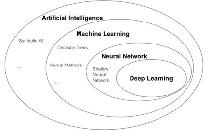

<!--
 * @version:
 * @Author:  StevenJokess（蔡舒起） https://github.com/StevenJokess
 * @Date: 2023-09-11 21:41:57
 * @LastEditors:  StevenJokess（蔡舒起） https://github.com/StevenJokess
 * @LastEditTime: 2023-10-13 01:54:56
 * @Description:
 * @Help me: make friends by a867907127@gmail.com and help me get some “foreign” things or service I need in life; 如有帮助，请资助，失业3年了。
 * @TODO::
 * @Reference:
-->
# 深度学习原理简介

## 机器学习

机器学习就是一个通过直接使用数据的方式来设计和最优化信息处理系统的方法。在现实世界中，由于训练数据有限并且不可能包含所有可能的场景，这个信息处理系统需要学着去在训练数据没有包含的那部分场景里有较好的表现。在这种情况下，过拟合（over-fitting）是机器学习领域中的一个非常普遍和棘手的问题，它的一般表现就是所训练的系统的表现可以严格符合训练集的要求，但却不能很好地在那些没有见过的输入数据中有较好的表现，即泛化性能（generalization）差。[2]

## 神经网络

神经网络是机器学习的一个分支，其中数据表示的转换是由一个系统完成的，该系统的结构松散型是受到人和动物大脑中神经元连接方式的启发。大脑中的神经元是如何相互连接的？不同物种的大脑区域都不尽相同，但神经元连接的部分通常是层组织。哺乳动物大脑的许多部分是以分层的方式组织的。例如视网膜、大脑皮层和小脑皮层。视网膜是一层薄薄的神经组织，位于眼睛后部，负责视觉处理的早期阶段。它由多层组成，在每一层中，神经元基本上是同一类型的。层与层之间，有不同类型的神经元。现代神经解剖学先驱圣地亚哥·拉蒙·卡哈尔（Santiago Ramón y Cajal）的精美显微镜图完美地说明了这些模式（图 1.5）。不同层的神经元以一种基本有序的方式连接到其他层。例如，一个层可以直接连接到它之前和之后的层，但不能连接到更远的层。也有例外，有些层确实连接到与它们不直接相邻的层。但视网膜的一般解剖结构表明，信息从一层到下一层基本上是直接流动的。[2]

#图 1.5 生物神经系统的层次结构。这些是圣地亚哥·拉蒙·卡哈尔（1852-1934）的绘画，他是现代神经解剖学的先驱。A 组：小脑皮质的层组织。B 组：视网膜神经元层。来源：https://www.sciencedirect.com/science/article/abs/pii/S0361923006002334https://nei.nih.gov/intramural/lrcmb/LRCMB_image

至少在表面上，这种模式有点类似于人工神经网络的一般组织（在当今的计算世界中，简单地称为神经网络，几乎不存在混淆的风险），在这种组织中，数据被分为多个可分离的阶段进行处理，恰当地命名为层。这些层通常堆叠在一起，只有相邻层之间才有连接。图1.6显示了一个简单的（人工）神经网络，有四层。输入数据（在本例中是图像）进入第一层（在图的左侧），然后从一层到下一层依次流动。每一层对于数据进行转换得到新的表现方式。随着数据在各层之间的流动，表示方法与原始方法越来越不同，并且越来越接近神经网络的目标，即在输入图像上标注的正确标签。最后一层（在图的右侧）得到神经网络的最终输出，这是图像分类任务的结果。

神经网络层类似于数学函数，它是从输入值到输出值的映射。然而，神经网络层不同于纯数学函数，因为它们通常是有状态的。换句话说，它们拥有内部记忆。此记忆便是权重。什么是“权重”？它们只是属于层的一组数值，并控制层如何将每个输入表示转换为输出表示的细节。例如，常用的“密集”层通过将输入数据与矩阵相乘并将向量添加到矩阵相乘的结果中来变换输入数据。矩阵和向量是稠密层的权重。当一个神经网络通过在训练数据中进行训练时，权值会有系统地改变，以称为损失函数的某个值的方式来表示，我们将在第 2 章和第 3 章中使用具体的例子详细介绍这一点。

#图 1.6 分层组织的神经网络示意图。该神经网络对手写数字图像进行分类。在层间，有原始数据暂时表现的方式。经许可，转载自 Chollet（2017）“与蟒蛇深入学习”。

即使神经网络的灵感来源于大脑，但我们应该注意不要过于人性化。神经网络的目的不是研究或模拟大脑的工作方式。其为神经科学的领域，是一门独立的学科.。神经网络是指通过从数据中学习，使机器能够执行有趣的实际任务。事实上，一些神经网络在结构和功能上都与生物大脑的某些部分相似[16]。不知这是否超出了本书的范围。无论如何，相似之处不应被忽略。重要的是，没有证据表明大脑通过任何形式的梯度下降来学习，梯度下降是神经网络训练的主要方式（下一章将介绍）。神经网络中许多重要的技术在深度学习革命中被发明并应用，并不是因为它们得到了神经科学的支持，而是因为它们帮助神经网络更好更快地解决了实际的学习任务。 既然你知道什么是神经网络，我们就可以告诉你什么是深度学习。深度学习便是深度神经网络的延伸和应用，简单来说，深度神经网络便是拥有多层（从数十层到数百层）的神经网络。在这里，“深”一词代表了大量连续表示层的概念。数据模型的层数便是模型的深度。该领域的其他适当名称可以是“layered representation learning”和“hierarchical representation learning”。如今的深度学习通常涉及数十或数百个连续的表示层，它们都是从训练数据中自动学习的。机器学习的某些方法往往只关注学习数据的一到两层；因此，它们有时被称为浅层学习。

人们**错误地认为，深度学习中的“深度”是指对数据的任何一种深度理解**，即理解“自由不是自由”等句子背后的含义，或品味 M.C.埃舍尔绘画中的矛盾和自我矛盾。对于人工智能研究人员来说，这个“深”仍然是难以捉摸。在未来，深度学习可能会使我们更接近这种深度，但这肯定比向神经网络添加层更难量化和实现。

## 神经网络的兴起、衰落和兴起及其背后的原因

神经网络的核心思想早在 20 世纪 50 年代就形成了，训练神经网络的关键技术，包括反向传播技术，都是在 80 年代发明的，但是在 1980 到 2020 很长一段时间里，神经网络几乎完全被研究界所规避。部分原因是支持向量机等方法的流行，部分原因是缺乏训练深层（多层次）神经网络的能力。但在 2010 年左右，仍在研究神经网络的一些人开始取得重要突破：多伦多大学的杰弗里·辛顿、蒙特利尔大学的约书亚·本吉奥、纽约大学的亚恩·莱肯以及瑞士 IDSIA 的研究人员。这些小组取得了重要的里程碑，包括在图形处理单元（GPU）上首次实现了深度神经网络，并在 ImageNet 计算机视觉挑战中将错误率从大约 25%降低到不到 5%。

自 2012 年以来，卷积神经网络（convnets）已成为所有计算机视觉任务的通用算法；另外，它们也可以处理所有感知任务。非计算机视觉感知任务的例子包括语音识别。在 2015 年和 2016 年的大型计算机视觉会议上，几乎不可能找到不涉及 convnets 的演讲。同时，深度学习也在许多其他类型的问题中找到了应用，比如自然语言处理。它在广泛的应用中完全取代了支持向量机和决策树。几年来，欧洲核子研究组织（CERN）使用基于决策树的方法来分析大型强子对撞机（LHC）ATLAS 探测器的粒子数据；但是 CERN 最终转向了深层神经网络，因为它们具有更高的性能，并且易于在大型数据集上进行训练。

深度学习为什么能够在多种机器学习算法中脱颖而出呢？（信息框 1.1 是一些流行的机器学习技术，但这些技术不是深度神经网络。）深度学习之所以迅速发展，主要原因是它在许多问题上提供了更好的性能。但这不是唯一的原因。深度学习也使问题的解决变得更加容易，因为它使得过去机器学习工作流中最关键和最困难的一步自动化获得：特征工程。

之前的机器学习技术—浅度学习--仅涉及将输入数据转换为一个或两个连续的表示空间，通过简单的转换，如高维非线性回归（kernel 方法）或决策树。但复杂问题所要求的精细表示一般不能用这种技术来实现。因此，工程师必须竭尽全力使最初输入的数据更易于处理，他们必须为数据设计更好的表示层。这便是特征工程。另一方面，深度学习使这一步自动化：通过深度学习，你可以一次性学习所有功能，而不必自己设计它们。这大大简化了机器学习工作流程，通常用一个简单的端到端深度学习模型取代复杂的多级管道。通过自动化的特征工程，深度学习使机器学习更省力、更健壮。

深度学习如何从数据中学习有两个基本特征：增量的、逐层的、越来越复杂的表示方式，以及遵循上一层和下一层的需求，每一层都将被更新，这些中间增量表示是共同学习的。这两个特性使得深度学习比以前的机器学习方法更为成功。

## 深度学习

为了学习一种好的表示，需要构建具有一定“深度”的模型，并通过学习算法来让模型自动学习出好的特征表示（从底层特征，到中层特征，再到高层特征），从而最终提升预测模型的准确率。

所谓“深度”是指原始数据进行非线性特征转换的次数。如果把一个表示学习系统看作是一个有向图结构，深度也可以看作是从输入节点到输出节点所经过的最长路径的长度。

这样我们就需要一种学习方法可以从数据中学习一个“深度模型”，这就是深度学习（Deep Learning，DL）。深度学习是机器学习的一个子问题，其主要目的是从数据中自动学习到有效的特征表示。

通过多层的特征转换，把原始数据变成更高层次、更抽象的表示。这些学习到的表示可以替代人工设计的特征，从而避免“特征工程”。下图为深度学习的数据处理流程。

深度学习是将原始的数据特征通过多步的特征转换得到一种特征表示，并进一步输入到预测函数得到最终结果。

和“浅层学习”不同，深度学习需要解决的关键问题是贡献度分配问题（Credit Assignment Problem，CAP）[Minsky, 1961]，即一个系统中不同的组件(component)或其参数对最终系统输出结果的贡献或影响。

以下围棋为例，每当下完一盘棋，最后的结果要么赢要么输。我们会思考哪几步棋导致了最后的胜利，或者又是哪几步棋导致了最后的败局。如何判断每一步棋的贡献就是贡献度分配问题，这是一个非常困难的问题。

从某种意义上讲，深度学习可以看作是一种强化学习（Reinforcement Learning，RL），每个内部组件并不能直接得到监督信息，需要通过整个模型的最终监督信息（奖励）得到，并且有一定的延时性。

目前，深度学习采用的模型主要是神经网络模型，其主要原因是神经网络模型可以使用误差反向传播算法，从而可以比较好地解决贡献度分配问题。只要是超过一层的神经网络都会存在贡献度分配问题，因此超过一层的神经网络都可以看作是深度学习模型。

随着深度学习的快速发展，模型深度也从早期的5 ∼ 10 层到目前的数百层。随着模型深度的不断增加，其特征表示的能力也越来越强，从而使后续的预测更加容易。深度学习原理简

寄语：本文梳理了深度学习知识体系，分为机器学习、神经网络和概率图模型，同时对机器学习算法类型、深度学习原理框架等进行了梳理，帮助大家更好地学习和入手深度学习。

深度学习是机器学习的分支，是一种以人工神经网络为架构，对数据进行表征学习的算法。深度学习在搜索技术，数据挖掘，机器学习，机器翻译，自然语言处理等多个领域都取得了卓越的成果，可见其重要性，本文将通过梳理知识体系脉络帮助大家深入浅出了解深度学习。[1]

[1]: https://zhuanlan.zhihu.com/p/140427486#%E6%9C%BA%E5%99%A8%E5%AD%A6%E4%B9%A0%E7%AE%97%E6%B3%95%E7%B1%BB%E5%9E%8B
[2]: https://cardwing.github.io/files/131270027-%E4%BE%AF%E8%B7%83%E5%8D%97-%E9%99%88%E6%98%A5%E6%9E%97.pdf

TODO:http://staff.ustc.edu.cn/~lgliu/Resources/DL/What_is_DeepLearning.html
