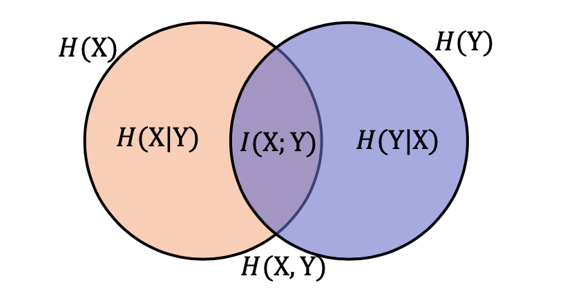

<!--
 * @version:
 * @Author:  StevenJokess（蔡舒起） https://github.com/StevenJokess
 * @Date: 2023-03-13 23:23:58
 * @LastEditors:  StevenJokess（蔡舒起） https://github.com/StevenJokess
 * @LastEditTime: 2023-06-04 22:28:13
 * @Description:
 * @Help me: 如有帮助，请赞助，失业3年了。
 * @TODO::
 * @Reference:
-->
# 信息论

信息论是应用数学的一个分支，主要研究的是对一个信号包含信息的多少进行量化。 它最初被发明是用来研究在一个含有噪声的信道上用离散的字母表来发送消息，例如通过无线电传输来通信。 在这种情况下，信息论告诉我们如何对消息设计最优编码以及计算消息的期望长度，这些消息是使用多种不同编码机制、从特定的概率分布上采样得到的。 在机器学习中，我们也可以把信息论应用于连续型变量，此时某些消息长度的解释不再适用。 信息论是电子工程和计算机科学中许多领域的基础。[4]

引入相关包：

```py
import numpy as np
import scipy.stats
```

## 信息

信息论奠基人香农(Shannon)认为，信息就是用来消除不确定性的东西。

故应有如下特性：

- 很有可能发生的事件几乎没有信息；甚至一定发生的事件没有信息。（即，当概率x等于1时，信息量为0）
- 随机事件拥有更多的信息（由上面得，f(x)应当是递减函数）；甚至一定不发生的事件充满信息。（即，当事件概率x等于0时，信息量为正无穷）
- 独立事件可以增加信息——抛两次正面的骰子的信息量大于抛一次正面骰子的信息量。[3]
- 信息量是可加的，两个独立事件同时发生的信息量应当等于它们分别发生的信息量之和。 即$f(m*n)=f(m)+f(n)$

## 自信息/信息量

为了满足上述三个性质，定义一个事件的自信息（或 信息量，信息的度量）为：

$I(x)=-\log _a(P(x))$

其中，a>1，0<x<=1

- 当a=e时，I(x)单位是奈特(nat)；
- 当a=2时，I(x)单位是比特(bit)或者香农；
- 当a=10时，I(x)单位是哈特(hart)。

换算关系：

- $1奈特=\log _2 e比特≈1.443比特$
- $1哈特=\log _2 10比特≈3.322比特$

TODO：·```py

self_info = -np.log2(p)
print(self_info)
```


## 熵(Entropy)

### 熵：

熵用于衡量信息的多少，被定义为：

$$
H(x)=\mathbb{E}_{x\sim P}(I(x))=- \mathbb{E}_{x\sim p}[\log P(x)]
$$

### 信息熵：

而在信息论中，信息与随机性是正相关的。高熵等于高随机性，需要更多的比特来编码。

为了表示系统（信源）的信息测度（平均信息量，即信息熵的定义），则把每种结果的信息量按发生的概率加权平均。

具体定义：假定当前样本集合X中第*i*类样本 $𝑥_𝑖$ 所占的比例为$P(𝑥_𝑖)(i=1,2,...,n)$，则*X*的信息熵定义为，

$$
H(X) = -\sum_{i = 1}^n P(x_i)\log_2P(x_i)
$$

H(X)代表最优编码长度，其值越小，则X的纯度越高，蕴含的不确定性越少。

例如，计算丢一枚硬币的熵：[3]

$$
H(x)=-p(正面)\log_2 p(正面)-p(反面)\log_2 p(反面)=-\log_2\frac{1}{2}=1 比特
$$

## 联合熵

两个随机变量X和Y的联合分布可以形成联合熵，度量二维随机变量XY（即随机变量X，Y同时发生）的不确定性：

$$
H(X, Y) = -\sum_{i = 1}^n \sum_{j = 1}^n P(x_i,y_j)\log_2 P(x_i,y_j)
$$

## 条件熵

定义：在一个条件下，随机变量的不确定性。

在随机变量X发生的前提下，随机变量Y发生带来的熵，定义为Y的条件熵，用H(Y|X)表示，定义为：

$$
CH(Y|X) = \sum_{i = 1}^n P(x_i)H(Y|X = x_i)
 = -\sum_{i = 1}^n P(x_i) \sum_{j = 1}^n P(y_j|x_i)\log_2
P(y_j|x_i)
= -\sum_{i = 1}^n \sum_{j = 1}^n P(x_i,y_j) \log_2
P(y_j|x_i)
$$

条件熵用来衡量在已知随机变量X的条件下，随机变量Y的不确定性。

熵、联合熵和条件熵之间的关系：$H(Y|X) = H(X,Y)-H(X)$.

## 交叉熵（Cross Entropy）

交叉熵（Cross Entropy）是按照概率分布q的最优编码对真实分布为p的信息进行编码的长度，定义为：

$$
\begin{aligned} H(P, Q) &=\mathbb{E}{P}[-\log _2 Q(x)] \ &=-\sum{x} P(x) \log _2 Q(x) \end{aligned}
$$

在给定p的情况下，如果q和p越接近，交叉熵越小；如果q和p越远，交叉熵就越大。

所以一般用来求目标与预测值之间的差距，深度学习中经常用到的一类损失函数度量，比如在对抗生成网络(GAN)中

$$
D(p||q) = \sum P(x)\log \frac{p(x)}{q(x)}
= \sum p(x)\log p(x) -  \sum p(x)\log _2 q(x)
=-H(p(x)) -\sum p(x)\log _2 q(x)
$$

```py

def cross_entropy(p, q):
    p = np.float_(p)
    q = np.float_(q)
    return -sum([p[i]*np.log2(q[i]) for i in range(len(p))])

p = np.asarray([0.65, 0.25, 0.07, 0.03])
q = np.array([0.6, 0.25, 0.1, 0.05])
print(cross_entropy(p, q))  # 1.3412204456967705
print(cross_entropy(q, p))  # 1.5094878372721525
```

## 互信息(mutual information)


$$
I(X;Y) = H(X)+H(Y)-H(X,Y)
$$




---

## 相对熵(Relative Entropy) 或 KL散度（Kullback-Leibler Divergence）

​相对熵(Relative Entropy)，也叫 KL 散度（Kullback-Leibler Divergence）或KL 距离，是用概率分布Q来近似P时所造成的信息损失量，所以可以用来描述两个概率分布P和Q差异。记做 $D_{\text{KL}}(P||Q)$ 或 $\mathrm{KL}(p, q)$ 、$\mathrm{KL}(p||q)$。

在信息论中，$D_{\text{KL}}(P||Q)$表示用概率分布Q来拟合真实分布P时，产生的信息表达的损耗，其中P表示信源的真实分布，Q表示P的近似分布。

KL散度是按照概率分布Q的最优编码对真实分布为P的信息进行编码，其平均编码长度（即交叉熵）H(p, q)和p的最优平均编码长度（即熵）H(p)之间的差异。

1. 对于离散概率分布p 和q，从q到p的KL散度定义为：

$$
\mathrm{KL}(p, q)=H(p, q)-H(p) \quad=\sum_x p(x) \log \frac{p(x)}{q(x)}\\ =\sum_i P(i) \log P(i)-\sum_i P(i) \log Q(i) =H(p,q)-H(p)  [相对熵=交叉熵-熵]
$$

2. 对于连续概率分布p 和q，从q到p的KL散度定义为：

$$
\mathrm{KL}(p, q)=H(p, q)-H(p) \quad=\int P(x)\log \frac{p(x)}{q(x)}dx
$$

其中，为了保证连续性，定义：

$$
0 \log \frac{0}{0}=0,0 \log \frac{0}{q}=0
$$

KL 散度的一个重要性质是非负性。当两个分布完全相同，对于任意x，有p(x)＝q(x)，此时log(p(x)/q(x))为0，KL散度为0。当两个分布不完全相同，根据吉布斯不等式（Gibbs' Inequality）可证明KL散度为正数。[6]

$KL(p,q)≥0$ ，可以衡量两个概率分布之间的距离。

> 从贝叶斯推论（Bayesian inference）角度，KL散度衡量了当将条件从先验概率分布Q上切换到后验概率分布P上所获得信息，也就是当用Q来近似P时的信息损失。在实践中，P一般代表了数据的真实分布，Q代表了模型，用于近似P。为了获得最接近P的Q，可以最小化KL散度。[5]

- KL散度只有当p = q时，$KL(p,q)=0$。
- 如果两个分布越接近，KL散度越小；
- 如果两个分布越远，KL散度就越大。

但KL散度并不是一个真正的度量或距离，原因是：

- KL散度不满足距离的对称性，即$D_{K L}(P \| Q) \neq D_{K L}(Q \| P)$
- KL散度不满足距离的三角不等式性质

### 正向KL散度$KL(p||q)$

$$ \hat{q}=\operatorname{argmin}_{q} \int{x} p(x) \log \frac{p(x)}{q(x)} d x $$

仔细观察(3)式，$p(x)$ 是已知的真实分布，要求使上式最小的 $q(x)$。

考虑当 $p(x)=0$ 时，这时q(x)取任何值都可以，因为 $logp(x)q(x)$ 这一项对整体的KL散度没有影响。当  $p(x)>0$ 时，这一项对 $logp(x)q(x)$ 整体的KL散度就会产生影响，为了使(3)式最小，$q(x)$ 又处于 $logp(x)q(x)$ 中分母的位置，所以 $q(x)$ 尽量大一些才好。

总体而言，对于正向 KL 散度，在 $p(x)$ 大的地方，想让 KL 散度小，就需要 $q(x)$ 的值也尽量大；在p(x)小的地方，q(x)对整体 KL 影响并不大（因为 log 项本身分子很小，又乘了一个非常小的p(x)。换一种说法，要想使正向 KL 散度最小，则要求在 p 不为 0 的地方，q 也尽量不为 0，所以正向 KL 散度被称为是 zero avoiding。此时得到的分布 q 是一个比较 “宽” 的分布。

### 反向KL散度 $KL(q||p)$

$$ \hat{q}=\operatorname{argmin}_{q} \int{x} q(x) \log \frac{q(x)}{p(x)} d x $$

仔细观察(4)式，$p(x)$ 是已知的真实分布，要求使上式最小的q(x).考虑当 p(x)=0 时，这时为了使(4)式变小，q(x)取0值才可以，否则(4)式就会变成无穷大。当p(x)>0时，为了使(4)式变小，必须在p(x)小的地方，q(x)也小。在p(x)大的地方可以适当忽略。换一种说法，要想使反向 KL 散度最小，则要求在 p 为 0 的地方，q 也尽量为 0，所以反向 KL 散度被称为是 zero forcing。此时得到分布 q 是一个比较 “窄” 的分布。

一个例子：假如p(x)是两个高斯分布的混合，q(x)是单个高斯，用q(x)去近似p(x)，两种KL散度该如何选择？

对于正向KL散度来说，q(x) 的分布图像更符合第二行，正向KL散度更在意中p(x) 的常见事件，也就是首先要保证p(x)峰值附近的x，在q(x)中的概率密度值不能为0。当 p 具有多个峰时，q 选择将这些峰模糊到一起，以便将高概率质量放到所有峰上。

对于反向KL散度来说，q(x)的分布图像更符合第一行。反向KL散度更在意中p(x)的罕见事件，也就是首先要保证p(x)低谷附件的x，在q(x)中的概率密度值也较小。当 $p$ 具有多个峰并且这些峰间隔很宽时，如该图所示，最小化 KL 散度会选择单个峰，以避免将概率密度放置在 $p$ 的多个峰之间的低概率区域中。

```py

def KL_divergence(p,q):
    return scipy.stats.entropy(p, q)

p=np.asarray([0.65,0.25,0.07,0.03])
q=np.array([0.6,0.25,0.1,0.05])
print(KL_divergence(p, q)) # 0.011735745199107783
print(KL_divergence(q, p)) # 0.013183150978050884
print(KL_divergence(p, p)) # 0
```

## JS散度

JS 散度（Jensen-Shannon Divergence）是一种对称的衡量两个分布相似度的度量方式，定义为：

$$
\mathrm{JS}(p, q)=\frac{1}{2} \mathrm{KL}(p, m)+\frac{1}{2} \mathrm{KL}(q, m)
$$

其中 $m=\frac{1}{2}(p+q)$ 。

JS 散度是 KL 散度一种改进。但两种散度都存在一个问题，即如果两个分布p, q没有重叠或者重叠非常少时，KL散度和JS散度都很难衡量两个分布的距离。

```py
import numpy as np
import scipy.stats
def JS_divergence(p,q):
    M=(p+q)/2
    return 0.5*scipy.stats.entropy(p,M)+0.5*scipy.stats.entropy(q, M)

p=np.asarray([0.65,0.25,0.07,0.03])
q=np.array([0.6,0.25,0.1,0.05])
q2=np.array([0.1,0.2,0.3,0.4])

print(JS_divergence(p, q))  # 0.003093977084273652
print(JS_divergence(p, q2)) # 0.24719159952098618
print(JS_divergence(p, p)) # 0.0
```

## Wasserstein距离

Wasserstein距离（Wasserstein Distance）也用于衡量两个分布之间的距离。

对于两个分布 $q_1, q_2$，$p_{th}−Wasserstein$ 距离定义为：

$$
W_{p}\left(q_{1}, q_{2}\right)=\left(\inf {\gamma(x, y) \in \Gamma\left(q{1}, q_{2}\right)} \mathbb{E}{(x, y) \sim \gamma(x, y)}\left[d(x, y)^{p}\right]\right)^{\frac{1}{p}}
$$

其中  $\Gamma\left(q{1}, q_{2}\right)$ 是边际分布为 $q_1$, $q_2$ 的所有可能的联合分布集合, 𝑑(𝑥, 𝑦)为x和y的距离，比如 $ℓ_p$ 距离等等

如果将两个分布看作是两个土堆，联合分布 γ(x,y)看作是从土堆 $q_1$ 的位置 x 到土堆 $q_2$ 的位置 y 的搬运土的数量，并有

$\sum_x \gamma(x, y)=q_2(y) \sum_y \gamma(x, y)=q_1(x)$

$\mathbb{E}{(x, y) \sim \gamma(x, y)}\left[d(x, y)^{p}\right]$

可以理解为在联合分布 $\gamma(x, y)$ 下把形状为 $q_1$ 的土堆搬运到形状为 $q_2$ 的土堆所需的工作量：

$$
\mathbb{E}{(x, y) \sim \gamma(x, y)}\left[d(x, y)^{p}\right]=\sum_{(x, y)} \gamma(x, y) d(x, y)^{p}
$$

其中从土堆$q_1$中的点 x 到土堆 $q_2$ 中的点 y 的移动土的数量和距离分别为 $\gamma(𝑥, 𝑦)$ 和 $d(x, y)^{p}$ 。

因此，Wasserstein 距离可以理解为搬运土堆的最小工作量，也称为推土机距离（Earth-Mover’s Distance，EMD）。

Wasserstein 距离相比 KL 散度和 JS 散度的优势在于：即使两个分布没有重叠或者重叠非常少，Wasserstein距离仍然能反映两个分布的远近。

对于 $mathbb{R}^N$ 空间中的两个高斯分布 $p = mathbb{N}(μ_1,Σ_1)$ 和 $ q = mathbb{N}(μ_2,Σ_2)$, 它们的2nd Wasserstein 距离为

$$
W_{2}(p, q)=\left|\mu_{1}-\mu_{2}\right|{2}^{2}+\operatorname{tr}\left(\Sigma{1}+\Sigma_{2}-2\left(\Sigma_{2}^{\frac{1}{2}} \Sigma_{1} \Sigma_{2}^{\frac{1}{2}}\right)^{\frac{1}{2}}\right)
$$

当两个分布的方差为 0 时，$2^{nd}-Wasserstein$ 距离等价于欧氏距离。

[1]: https://datawhalechina.github.io/unusual-deep-learning/#/%E4%BA%A4%E5%8F%89%E7%86%B5%E5%92%8C%E6%95%A3%E5%BA%A6?id=%e4%ba%a4%e5%8f%89%e7%86%b5%e5%92%8c%e6%95%a3%e5%ba%a6
[2]: https://github.com/datawhalechina/unusual-deep-learning/edit/main/docs/02.%E6%95%B0%E5%AD%A6%E5%9F%BA%E7%A1%80.md
[3]: https://zhuanlan.zhihu.com/p/165139520
[4]: https://exacity.github.io/deeplearningbook-chinese/Chapter3_probability_and_information_theory/
[5]: https://mp.weixin.qq.com/s/fg5GxW83Ui_joJKrsNQdBg
[6]: https://finance.sina.com.cn/stock/stockzmt/2020-05-09/doc-iirczymk0646869.shtml
[7]: https://zhuanlan.zhihu.com/p/143105854#5.1%20%E7%A6%BB%E6%95%A3%E5%88%86%E5%B8%83%E7%9A%84JS%E6%95%A3%E5%BA%A6python%E5%AE%9E%E7%8E%B0
[8]: https://chenjunren.gitbook.io/read-the-beauty-of-mathematics/di-6-zhang-xin-xi-de-du-liang-he-zuo-yong

TODO:https://d2l.ai/chapter_appendix-mathematics-for-deep-learning/information-theory.html#information
