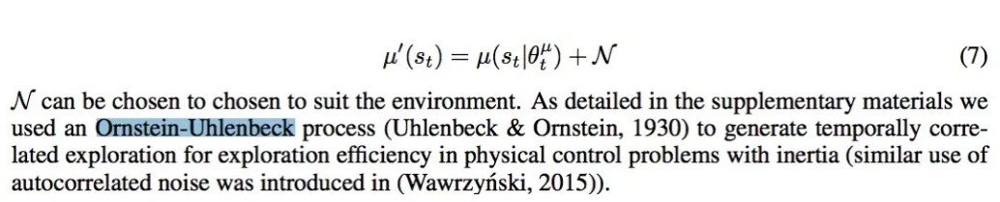

# Ornstein-Uhlenbeck Process

## 引入

论文DDPG中看到一个没见过的名词Ornstein-Uhlenbeck Process。

我们知道平衡RL的探索和利用，最经典的方法叫做 $\epsilon$-greedy 策略，但其探索并不高。而用OU过程，可以使得探索效率更高。

## 介绍

Ornstein-Uhlenbeck Process翻译为奥恩斯坦-乌伦贝克过程，简称OU过程，UO过程在时序上具备很好的相关性，可以使agent很好的探索具备动量属性的环境。

先说说这个陌生的概念，它的公式长这个样子：

dx_t = \theta(\mu-x_t)dt + \sigma dW\\

这是对于连续空间，对于离散空间可以写为：

x_t - x_{t-1} = \theta(\mu - x_{t-1}) + \sigma W \\

其中，​ x_t 就表示我们需要刻画的量， \mu 表示它的均值， W 表示维纳过程（也叫做布朗运动），是一种外界的随机噪声，​ \sigma 是随机噪声的权重。

说白了，OU过程其实就是一个存在随机噪声的均值回归。当 x_{t-1} 大于均值 \mu 时， x_t 就会变小，朝向均值靠拢；当 x_{t-1} 小于均值 \mu 时， x_t 就会变大，也朝向均值靠拢。

DDPG中给action添加一个均值为0的OU噪声，作为其exploration的方法。为什么这么搞呢？论文是这么说的：

说的很模糊，大致意思就是OU过程是一个时间相关的过程，对于有惯性的系统探索效率比较高。

说实话我也琢磨了好久，我自己有一点小小的理解不知道对不对。我理解对于惯性系统，OU过程有两点优势：一是增加训练的step，使得训练的更快；二是探索效率确实更高。

首先**惯性系统**指的是保持之前的运动状态的系统，举个简单的例子，开车就是，action有三个{方向:[-1,1]，油门:[0,1]，刹车:[0,1]}，当你选择加油门时，它的速度加速并保持高速，同样当你选择左转时，它的方向就左转并保持该方向，所以这是一个典型的惯性系统。

**增加训练的step**：假设我们在开车，某个状态，我们已知的最优选择是踩油门，这时候我们想探索一下左转怎么样，OK稍微左转一下没问题，问题就是我们不能一直左转，应该马上右转，不然就冲出车道了！OU过程正好可以满足我们的要求，我们本该踩油门加速的时候，选择探索一下左转没毛病，然后OU过程产生的下一个时刻的探索就是偏向于右转的，因为均值是0。所以这就让我们开车的时候”稳“一些，可以开的更远，也就是训练的step更长。

**探索效率更高**：这个很好理解，每次探索都是围绕一个均值附近来来回回，而不是不撞南墙不回头式的。 \epsilon-greedy​ 会出现什么问题呢？还是上面的例子，本该直行，我们选择探索左转，按照 \epsilon-greedy​ 策略，下一时刻我们还是有同样的概率选择继续探索左转，下下个时候也一样，在这种惯性场景下就显得不是那么合理，即使左转一下汽车运动方向就已经改变了，就可以一直往这个方向开了（就是在该方向上探索），而这种策略甚至可能导致我们一直左转，因为它是惯性系统所以完全没有必要一直左转，浪费啊！我们希望的是什么？我左转一下看看，右转一下再看看，这样反复的小幅探索，而不是去一直左转甚至是原地打转。所以对于惯性系统，OU过程探索效率高很多。

[1]: https://zhuanlan.zhihu.com/p/54670989
