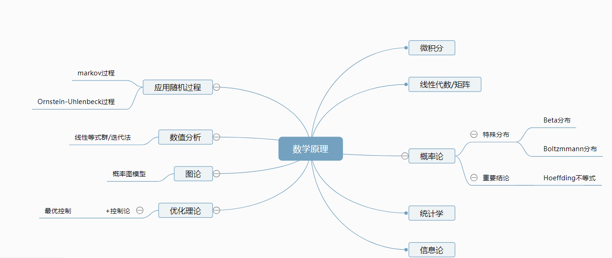

<!--
 * @version:
 * @Author:  StevenJokess（蔡舒起） https://github.com/StevenJokess
 * @Date: 2023-03-22 02:09:11
 * @LastEditors:  StevenJokess（蔡舒起） https://github.com/StevenJokess
 * @LastEditTime: 2023-09-04 17:34:06
 * @Description:
 * @Help me: 如有帮助，请赞助，失业3年了。
 * @TODO::
 * @Reference:
-->
# 深度强化学习的数学原理与Python实现



```toc
:maxdepth: 2

math_intro
calculus
linear_algebra_intro
matrix_theory
probability_theory
beta_distribution
Boltzmmann_distribution
Hoeffding’s_inequality
statistics_theory
information_theory
applied_stochastic_process
markov_process
Ornstein-Uhlenbeck_process
numerical_analysis
linear_equation_group-iteration_method
TODO:functional_analysis
TODO:functional_analysis2
graph_theory
probabilistic_graphical_model
optimization_theory
control_theory
optimal_control_theory
```
