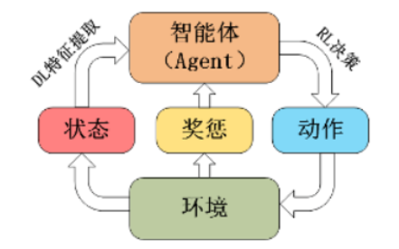

<!--
 * @version:
 * @Author:  StevenJokess（蔡舒起） https://github.com/StevenJokess
 * @Date: 2023-04-02 18:38:31
 * @LastEditors:  StevenJokess（蔡舒起） https://github.com/StevenJokess
 * @LastEditTime: 2023-04-04 18:34:04
 * @Description:
 * @Help me: 如有帮助，请赞助，失业3年了。
 * @TODO::
 * @Reference:
-->
# 深度强化学习简介

## 历史

在如今大数据和深度学习快速发展的时代下，针对传统强化学习无法解决高维数据输入的问题，2013年Mnih V等人首次将深度学习中的卷积神经网络（Convolutional Neural Networks，CNN）引入强化学习中，提出了DQN（Deep Q Learning Network）算法，至此国际上便开始了对深度强化学习（Deep Reinforcement Learning，DRL）的科研工作。除此之外，深度强化学习领域中一个里程牌事件是2016年的AlphaGo 对战李世石的围棋世纪大战，谷歌旗下的人工智能团队DeepMind 基于深度强化学习开发出的围棋程序 AlphaGo击败了世界顶级围棋大师李世石，震惊了世界，也因此拉开了深度强化学习从学术界走向大众认知的帷幕。

## 概念

深度强化学习结合了深度学习（Deep Learning，DL）的特征提取能力和强化学习（Reinforcement Learning，RL）的决策能力，可以直接根据输入的多维数据做出最优决策输出，是一种端对端（end-to-end）的决策控制系统，广泛应用于动态决策、实时预测、仿真模拟、游戏博弈等领域，其通过与环境不断地进行实时交互，将环境信息作为输入来获取失败或成功的经验来更新决策网络的参数，从而学习到最优决策。深度强化学习框架如下：

TODO:

[1]: https://zhuanlan.zhihu.com/p/556399318
