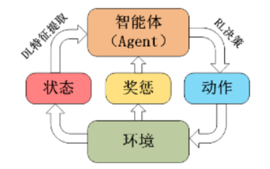
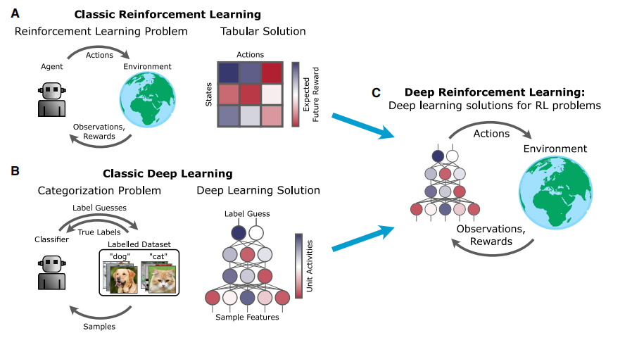
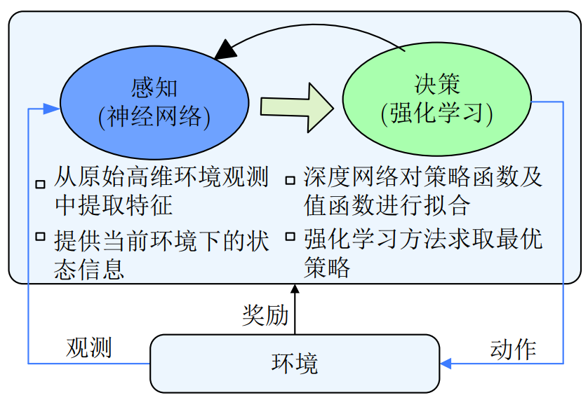

<!--
 * @version:
 * @Author:  StevenJokess（蔡舒起） https://github.com/StevenJokess
 * @Date: 2023-04-02 18:38:31
 * @LastEditors:  StevenJokess（蔡舒起） https://github.com/StevenJokess
 * @LastEditTime: 2023-09-14 03:22:43
 * @Description:
 * @Help me: 如有帮助，请赞助，失业3年了。
 * @TODO::
 * @Reference:
-->
# 深度强化学习简介

## 历史

在如今大数据和深度学习快速发展的时代下，针对传统强化学习无法解决高维数据输入的问题，2013年Mnih V等人首次将深度学习中的卷积神经网络（Convolutional Neural Networks，CNN）引入强化学习中，提出了DQN（Deep Q Learning Network）算法，至此国际上便开始了对深度强化学习（Deep Reinforcement Learning，DRL）的科研工作。除此之外，深度强化学习领域中一个里程牌事件是2016年的AlphaGo 对战李世石的围棋世纪大战，谷歌旗下的人工智能团队DeepMind 基于深度强化学习开发出的围棋程序 AlphaGo击败了世界顶级围棋大师李世石，震惊了世界，也因此拉开了深度强化学习从学术界走向大众认知的帷幕。

## 概念

强化学习由于其优秀的决策能力在人工智能领域得到了广泛应用。然而, 早期的强化学习主要依赖于人工提取特征, 难以处理复杂高维状态空间下的问题。随着深度学习的发展, 算法可以直接从原始的高维数据中提取出特征。深度学习具有较强的感知能力，可作为价值和策略的近似函数，但是缺乏一定的决策能力; 而强化学习具有较强的决策能力, 但对感知问题束手无策。 因此, 将深度学习（Deep Learning，DL）的特征提取能力和强化学习（Reinforcement Learning，RL）的决策能力结合起来, 优势互补, 能够为复杂状态下的感知决策问题提供解决思路。[2]

![深度强化学习的序列[5]](../../img/DRL_sars.png)

结合的产物就是深度强化学习，其可以直接根据输入的多维数据做出最优决策输出，是一种端对端（end-to-end）的决策控制系统。广泛应用于动态决策、实时预测、仿真模拟、游戏博弈等领域，其通过与环境不断地进行实时交互，将环境信息作为输入来获取失败或成功的经验来更新决策网络的参数，从而学习到最优决策。深度强化学习框架如下：

## 离散空间 VS 连续空间

## DRL的分类

DRL方法主要分为两大类：值函数近似方法和策略梯度方法。值函数近似方法通过神经网络梯度下降逼近动作价值函数，缺点是容易收敛到局部最优点，难以处理连续动作空间的任务；策略梯度方法是将策略参数化，通过深度神经网络逼近策略函数，再沿着策略梯度方向求解最优策略。[3]

TODO:

深度网络在强化学习中的作用：可用来表征以下三个映射：

- 策略函数（给出观测，经过神经网络，得到理想的动作）
- 值函数（Value functions）（用来衡量状态的好坏，或者状态—动作对的好坏）（可用来选择最优策略）
- 动态模型（用来预测下一状态和奖励）

## 深度强化学习与人脑的相像之处：

1. 两者都能接受不同的复杂的感知信息
1. 对于不同的感知信息的加工和反应任务都使用同一套学习算法（人类的舌头经过学习之后能“看见”物体）
1. 人类在做一些任务时会假定一个奖励函数并以此来检验行为或作为目标（大脑中的基底核似乎与奖励机制有关）
1. 而且无模型的强化学习过程和实验中的动物适应过程有一定一致性（可能会用一些探索——利用的策略之类的）等。[4]

## DRL面临的一些挑战

- 人学习的速度很快，无论是模仿还是借鉴，但deep RL却很慢？
- 借鉴的学习方式在deep RL中是一个open problem，经验该如何借鉴才能学起来更快速有效呢？
- 每个人的行为action动机背后的奖赏函数都不太一样，所以很明显reward function是可变的，那该如何表示单任务或多任务中的reward function呢？
- 观察环境，根据环境的结构信息进行某种预测（prediction），从而辅助决策，那prediction究竟是什么？如何表示？作用显著吗？[6]

Alan Turing ：Instead of trying to produce a program to simulate the adult mind, why not rather try to produce one which simulates the child’s? If this were then subjected to an appropriate course of education one would obtain the adult brain.

[1]: https://zhuanlan.zhihu.com/p/556399318
[2]: http://159.226.21.68/bitstream/173211/45043/1/%e6%b7%b1%e5%ba%a6%e5%bc%ba%e5%8c%96%e5%ad%a6%e4%b9%a0%e8%bf%9b%e5%b1%95_%e4%bb%8eAlphaGo%e5%88%b0AlphaGo_Zero_%e5%94%90%e6%8c%af%e9%9f%ac.pdf
[3]: https://www.china-simulation.com/article/2023/1004-731X/1004-731X-2023-35-4-671.shtml
[4]: https://www.zhihu.com/column/c_125238795
[5]: https://zhuanlan.zhihu.com/p/637642589
[6]: https://blog.csdn.net/weixin_40056577/article/details/104109073
